# 开发环境搭建

## 在线体验

在线演练地址: https://play.golang.org/

## 安装Go

参考官方文档: https://golang.org/doc/install

安装包下载地址:
  + https://golang.org/dl/
  + https://golang.google.cn/dl/

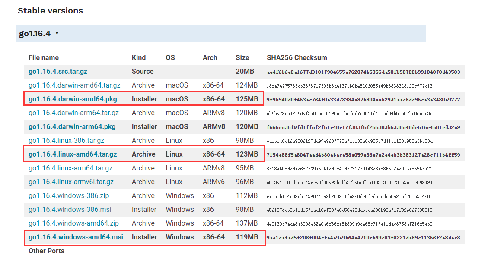

安装完成后执行命令, 能看到当前安装的go的版本，恭喜你，go安装成功:
```sh
go version
go version go1.16.4 windows/amd64
```

## 安装Git
先安装git, 准备好git shell 具体查看官方文档: https://git-scm.com/

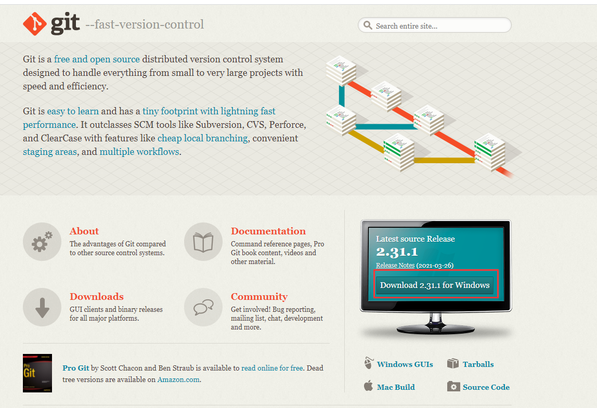

## 开发工具

+ Visual Studio code
+ Sublime Text
+ Atom
+ Eclipse+GoClipse
+ LiteIDE
+ Goland
+ Vim
+ Emacs
+ ……

## vscode 开发环境搭建

vscode官网下载最新版: https://code.visualstudio.com/

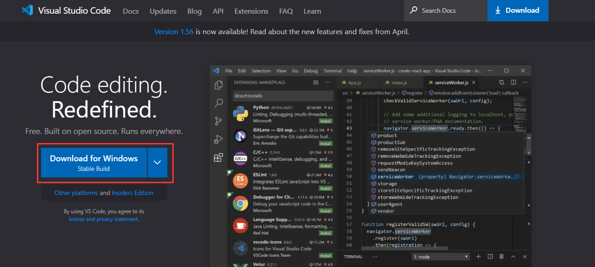

### 安装Vscode Go语言扩展

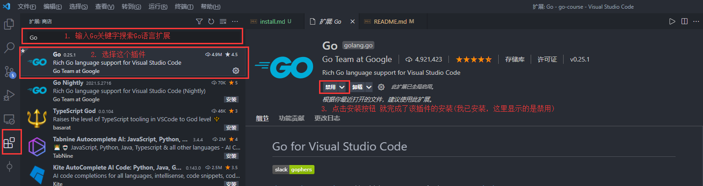


### 安装Go 语言扩展需要的工具集

这些扩展很多被墙了, 需要配置GOPROXY代理才能正常安装:
```go
go env -w GOPROXY=https://goproxy.cn
```
设置变量过后为了保证vscode能正常使用, 请重启vscode

1. 打开命令面板: Shift + Ctrl + P

2. 输入: Install/Update 搜索 Go扩展依赖工具安装命令

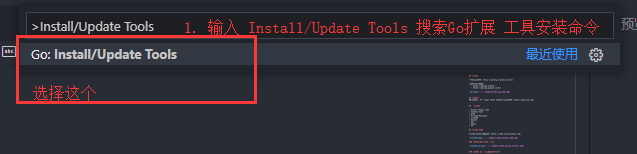

3. 勾选所有选项, 点击确认，进行安装

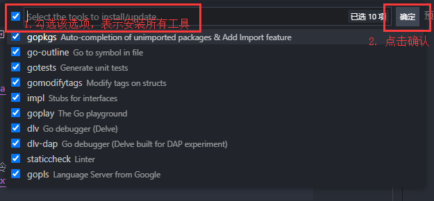

安装成功后会看到如下信息:

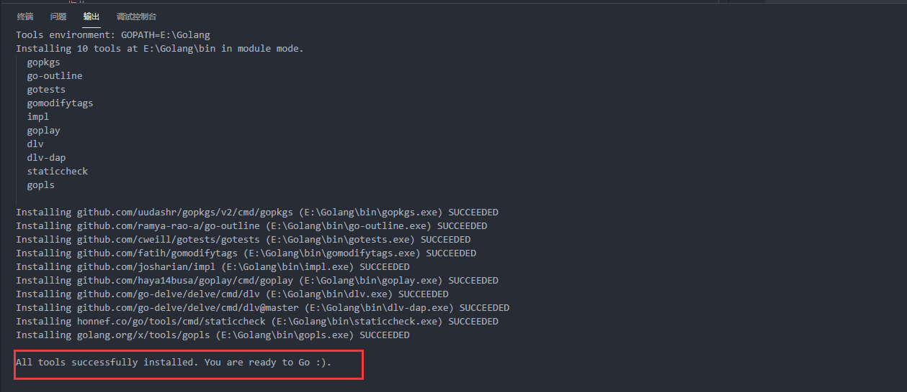

2.如果安装失败也可以尝试手动安装
```sh
go install -v golang.org/x/tools/gopls@latest
go install -v honnef.co/go/tools/cmd/staticcheck@latest
go install -v github.com/go-delve/delve/cmd/dlv@latest
go install -v github.com/haya14busa/goplay/cmd/goplay@latest
go install -v github.com/josharian/impl@latest
go install -v github.com/fatih/gomodifytags@latest
go install -v github.com/cweill/gotests/gotests@latest
go install -v github.com/ramya-rao-a/go-outline@latest
go install -v github.com/uudashr/gopkgs/v2/cmd/gopkgs@latest
```

### 设置终端使用Git Shell (Mac和Linux开发环境的同学忽略此步骤,该步骤仅针对Windows环境)

1. Shift + Ctrl + ` 打开终端

2. 打开终端的设置界面

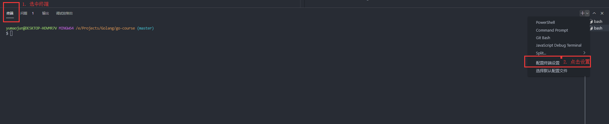

3. 修改terminal.integrated.shell.windows和terminal.integrated.defaultProfile.windows 为如下值
```json
{
    "workbench.colorTheme": "One Dark Pro",
    "terminal.integrated.shell.windows": "C:\\Program Files\\Git\\bin\\bash.exe",
    "go.useLanguageServer": true,
    "explorer.confirmDelete": false,
    "explorer.confirmDragAndDrop": false,
    "workbench.iconTheme": "vscode-icons",
    "vsicons.dontShowNewVersionMessage": true,
    "http.proxySupport": "off",
    "go.toolsManagement.autoUpdate": true,
    "terminal.integrated.tabs.enabled": true,
    "terminal.integrated.defaultProfile.windows": "Git Bash",
    "git.autofetch": true,
}
```

4. 重启vscode, 可以看到默认打开Git Bash终端、也可选择其他终端

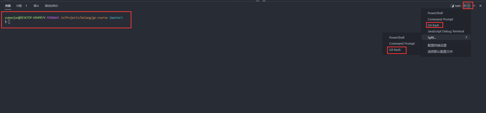


如果你还不会，可以看看我们勤奋的学员的博客: [VS Code 终端设置为Git Bash](https://www.cnblogs.com/remixnameless/p/14826532.html?tdsourcetag=s_pcqq_aiomsg)

### 插件安装


+ 单词拼写检查: Code Spell Checker


+ 快捷运行代码的插件: Code Runner

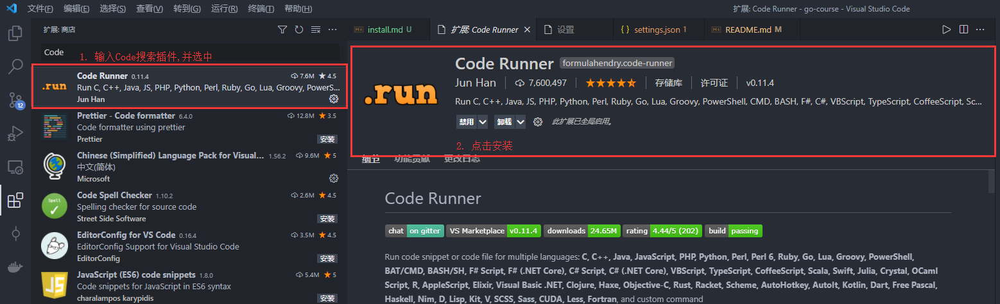

+ 最好用Git工具没有之一: Gitlens

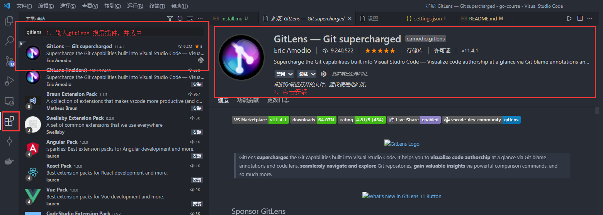

+ AI 代码生成: Tabnine AI Code 


### 配置自动保存
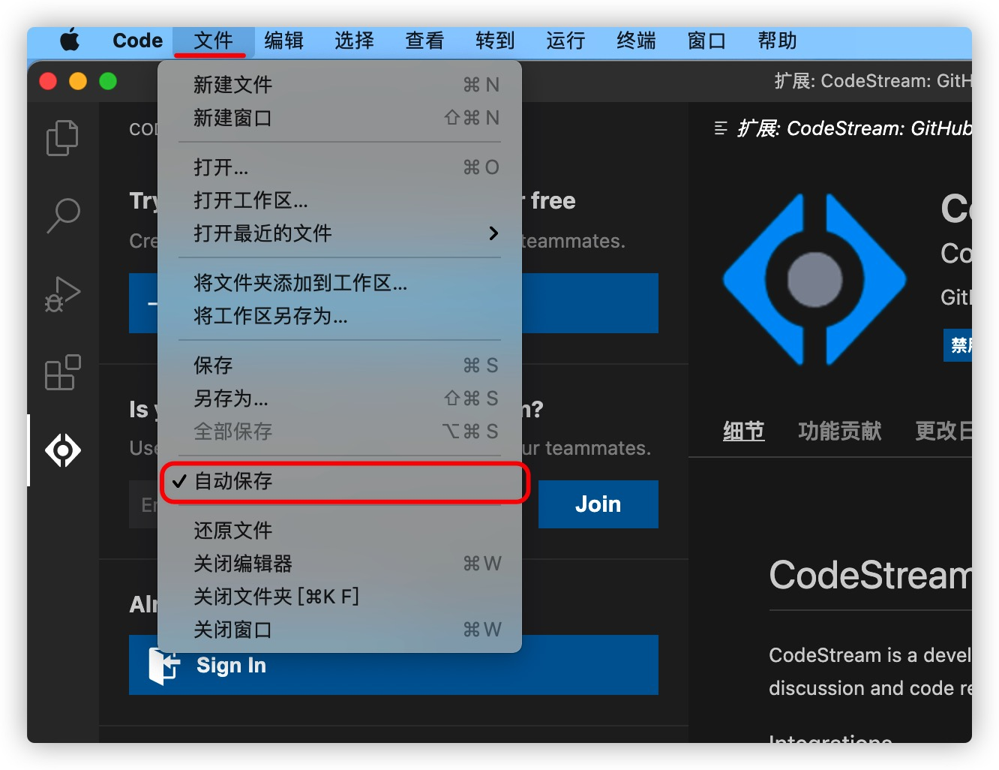

如果要配置自动保存的时间, 打开vscode的设置按钮, 搜索auto save

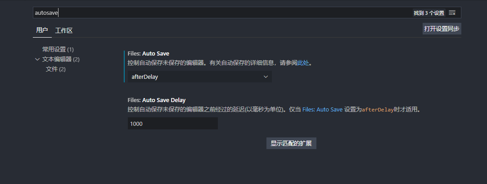

