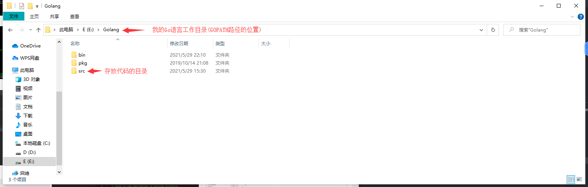
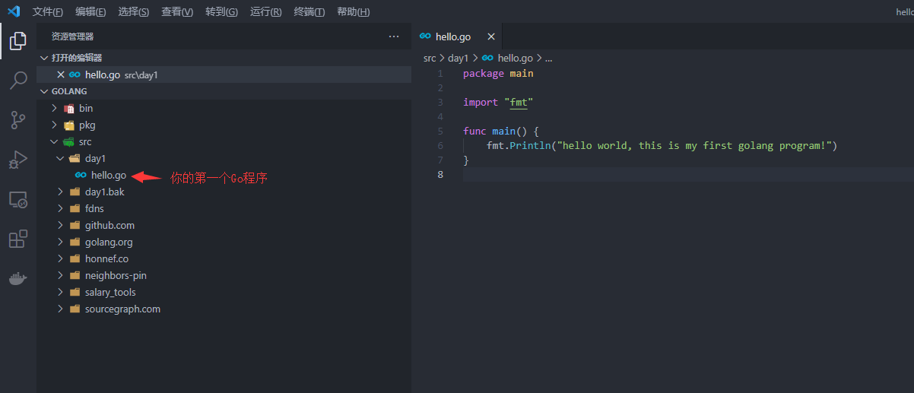
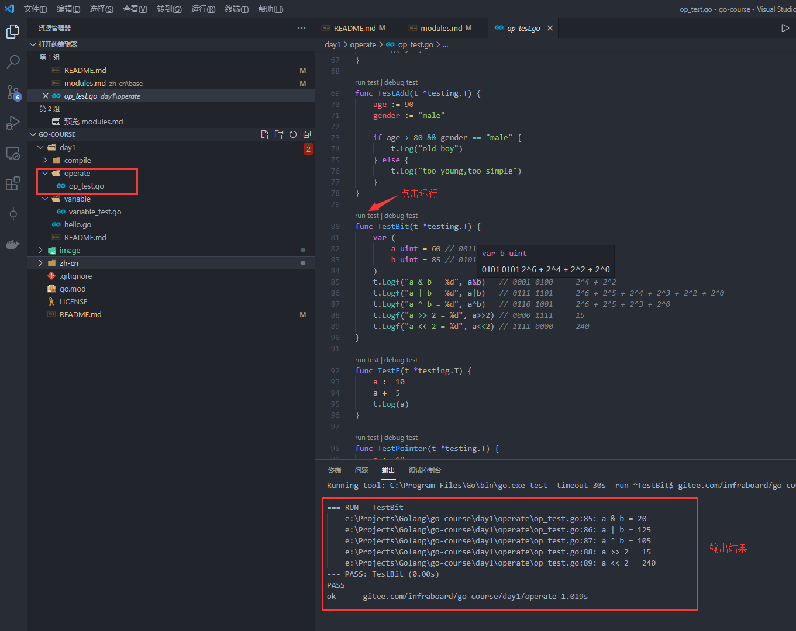
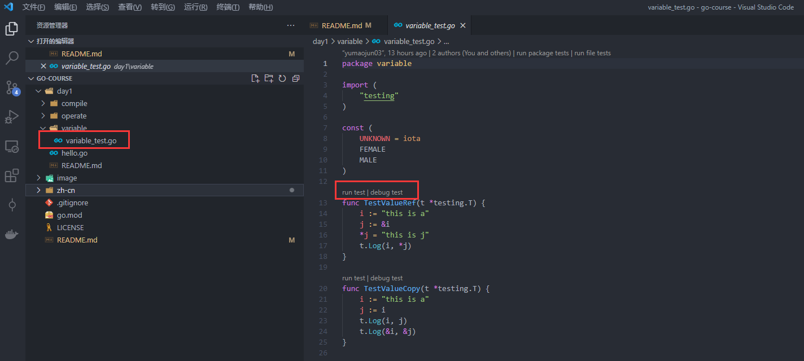

# 工作目录

在开始Go Modules工程前，我们需要介绍下GOPATH工程, 它虽然不怎么好用，但是他是你1.11版本之前的唯一选择

## GOPATH 工程

在Go 1.1 ~ 1.11 (2013/05 ~ 2018/08), 都是使用GoPATH工程结构, 直到现在依然有很多老的项目依然使用这种方式

### 特征

安装部署go环境，使用go进行开发的时候强制被要求要设置GOPATH（当然安装过程中也会默认指定$GOPATH=~/go）。 要在GOPATH路径下新建 src /bin /pkg文件夹,
因此一个GOPATH工程它的结构是这样的:


```
go env GOPATH
E:\Golang
```

```
$GOPATH
├── bin  # 存储go编译生成的二进制可执行文件，一般会把该路径配置到PATH中,PATH=$PATH:$GOPATH/bin
├── pkg  # 存储预编译的目标文件，以加快后续的编译速度 
└── src  # 存储Go的源代码，一般以$GOPATH/src/github.com/foo/bar的路径存放
```

### 编译时的依赖包查找机制

只要我们的代码里面出现了import 关键字, 就代表我们需要依赖其他的源代码，比如
```go
import "fmt"
import "github.com/jinzhu/gorm"
```

这个时候 编译器就需要搜索这些源码的存放位置, 搜索顺序为:
+ 优先使用vendor目录下面的包
+ 如果vendor下面没有搜索到，再搜索$GOPATH/src下面的包
+ 如果$GOPATH下面没有搜索到, 那么搜索$GOROOT/src下面的包

比如fmt的搜索({dir}/path):
1. vendor 无
2. $GOPATH/src 无
3. $GOROOT/src 找到, 路径为($GOROOT/src/fmt)

比如第一天我们有这样一个代码：$GOPATH/src/day1/compile/main.go
```go
$ cat  
package main

import "day1/compile/pkg"

func main() {
        pkg.Demo()
}
```

搜索顺序({dir}/path):
1. vendor 无
2. $GOPATH/src 找到，路径为($GOPATH/src/day1/compile/pkg)

### 缺陷

1. 无法控制依赖版本
$GOROOT/src 是我们安装Go时自带的, 和你Go的版本有关系, 但是比如其他的依赖, 比如`"github.com/jinzhu/gorm"`, 它会直接拉去放到我们的$GOPATH/src下面, 无版本概念, 无法控制导入包的版本

2. 污染我们工作目录
会在$GOPATH/src下面 看到我们所有的依赖, 并不是我单个项目的依赖
比如下面:



## Go Modules 工程

GOPATH工程, 受限于GOPATH目录的约束, 并且无法控制版本, 终于Go 在1.11版本开始推出Go Modules 

Go1.13开始不再推荐使用GOPATH。意思就是说你可以在任何路径下存放你的Go源码文件, 不用再像以前一样非得放到$GOPATH/src中。 每一个go项目 都是一个 Module

Go1.16版本 推荐生成环境可用

### 特征

该工程目录的根目录下有一个go.mod的文件，主要用于描述模块的名称和依赖 比如本项目:
```
module gitee.com/infraboard/go-course    // 模块名称

go 1.16
```

### 如何启用

GO111MODULE 这个环境变量是用来作为使用Go Modules 的开关。可以说这个变量是历史产物，很有肯能会在将来Go的新版本中去除掉

GO111MODULE有3个值可供设置:
```
GO111MODULE="auto" # 只要项目包含了go.mod 文件的话就启用Go modules， 在Go1.11-1.14 中是默认值
GO111MODULE="on"   # 启用Go Modules
GO111MODULE="off"  # 禁用Go Modules， 对老的项目进行兼容
```

### 编译时的依赖包查找机制

开启模块支持，项目编译时会忽略`GOPATH`和`vendor`文件夹，只根据`go.mod`下载所需要的依赖，同时该依赖会被下载到 $GOPATH/pkg/mod 目录下
如下是我go mod管理的依赖
```
$ ls /e/Golang/pkg/mod/
9fans.net             go.opencensus.io@v0.22.4                            gopkg.in                          rsc.io
cache                 go.starlark.net@v0.0.0-20190702223751-32f345186213  gotest.tools@v1.4.0               sigs.k8s.io
cloud.google.com      go.starlark.net@v0.0.0-20200821142938-949cc6f4b097  gotest.tools@v2.2.0+incompatible  sourcegraph.com
dmitri.shuralyov.com  go.uber.org                                         honnef.co                         vitess.io
github.com            golang.org                                          k8s.io
go.etcd.io            gonum.org                                           modernc.org
go.mongodb.org        google.golang.org                                   mvdan.cc
```

+ 当前目录，模块名称打头的包, 比如  "gitee.com/infraboard/go-course/day1/compile/pkg", 相对于 $workspace/day1/compile/pkg
+ 如果未找到，再去$GOPATH/pkg/mod 下搜索
+ 如果未找到, 再去$GOROOT/src 下搜索

Go Modules模式下并不兼容GOPATH模式, 之前在GOPATH下运行的包，在GOMODULE模式下无法运行，比如:
```
$ go run main.go
main.go:3:8: package day1/compile/pkg is not in GOROOT (C:\Program Files\Go\src\day1\compile\pkg)
```

因此如果你有GOPATH的项目需要维护是，建议将GO111MODULE设置为auto

```
go env -w GO111MODULE=auto
```

## 如何创建一个Go Modules工程

1. 新建一个目录(不要在GOPATH下创建)

```sh
mkdir {your_project_workspace}
```

2.使用go mod 初始化工程

你当前的目录仅仅是一个目录, 并不是一个go mod工程, 我们通过go mod init {name} 将你的目录初始化为一个go mod工程

```sh
cd {your_project_workspace}
go mod init {your_project_workspace}
```

这样 你该目录下就生产一个go.mod的文件, 现在已经是一个go mod工程了

3.打开工程

使用vscode打开你的{your_project_workspace}文件夹, 然后你就可以在该工程下面 写程序了

## 设置你的工作目录

该课件里面包含课程演示过程中的所有代码, 都放置于根目录:

```sh
day1
day2
...
```

1.拉取代码到本地(注意: 不要拉倒GOPATH目录下, 因为GOPATH本身就是一个工程, 而课件是一个Go Module工程, 二个工程要分开存放，并单独打开)

```sh
mkdir {your_gomod_workspace} // 创建一个目录用于存放你所有的go mod工程
cd {your_gomod_workspace}    // 进入到这个目录
git clone https://gitee.com/infraboard/go-course.git // 把课件的这个工程 clone到 你的{your_gomod_workspace}
```

2.使用vscode 打开课件工程, 更多关于vscode 设置打开工程的文档请参考: [vscode workspace setting](https://github.com/golang/tools/blob/master/gopls/doc/workspace.md)

注意: vscode一次只能打开一个工程, 所以你vscode需要打的目录是: {your_gomod_workspace}/go-course)

3.运行课件代码示例

运行示例:


由于直接运行时，不会打印fmt.Print的信息, 我们需要如下配置vscode 才可以

4.配置vscode打印run test详情内容

通过修改 go.testFlags 的配置值为: ["-v"], 就开启了test 打印详细日志功能

```json
{
    "workbench.colorTheme": "One Dark Pro",
    "terminal.integrated.shell.windows": "C:\\Program Files\\Git\\bin\\bash.exe",
    "go.useLanguageServer": true,
    "explorer.confirmDelete": false,
    "explorer.confirmDragAndDrop": false,
    "workbench.iconTheme": "vscode-icons",
    "vsicons.dontShowNewVersionMessage": true,
    "http.proxySupport": "off",
    "go.toolsManagement.autoUpdate": true,
    "terminal.integrated.tabs.enabled": true,
    "terminal.integrated.defaultProfile.windows": "Git Bash",
    "git.autofetch": true,
    "files.autoSave": "afterDelay",
    "go.testFlags": ["-v"]
}
```

## 扩展: 课件中的测试用例

引入Go Modules后, 最好不要在一个文件下面放2个main.go，我们讲采用go test的方式快速演示功能，比如:



关键点:

+ 文件名命名要求: {pkg_name}_test.go
+ 函数命名要求: 大写Test开头
+ 函数参数: (t *testing.T)

比如 variable/variable_test.go

```go
package variable

import (
    "testing"
)

func TestValueRef(t *testing.T) {
    i := "this is a"
    j := &i
    *j = "this is j"
    t.Log(i, *j)
}
```
