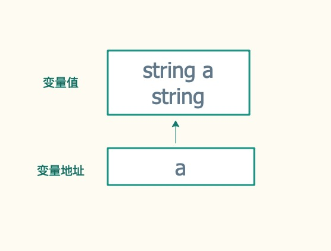
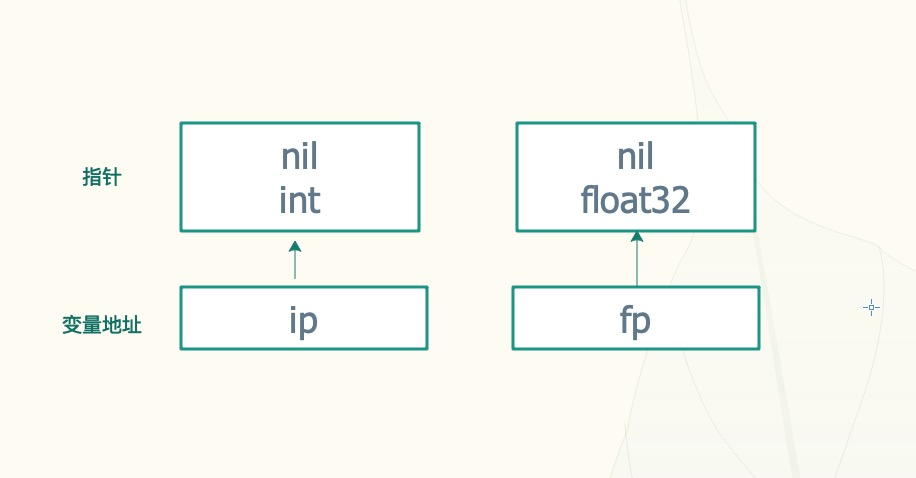
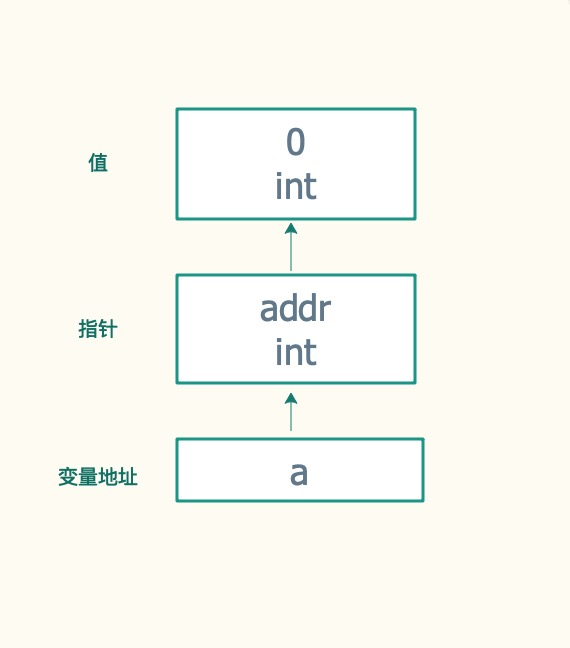
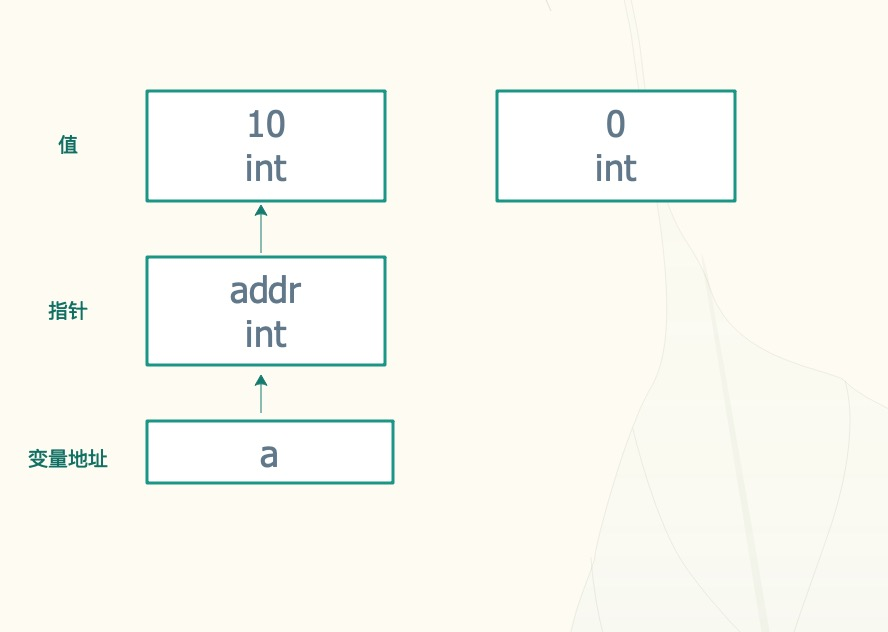
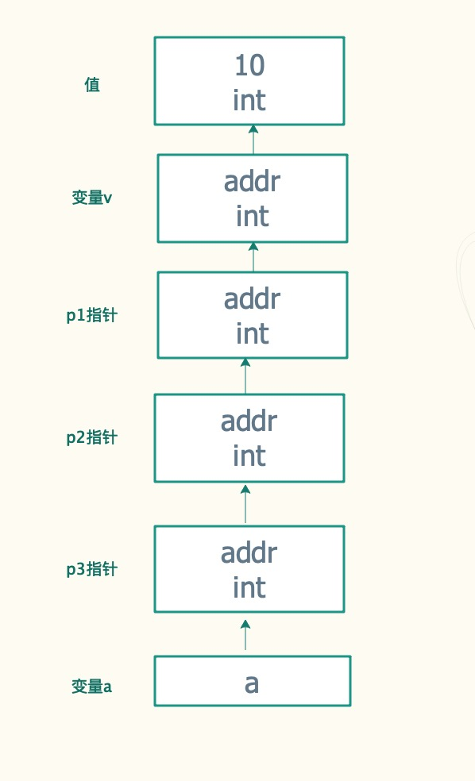

# Go指针

虽然Go吸收融合了很多其语言中的各种特性，但是Go主要被归入C语言家族。其中一个重要的原因就是Go和C一样，也支持指针。 当然Go中的指针相比C指针有很多限制。本篇将介绍指针相关的各种概念和Go指针相关的各种细节

## 指针与变量

变量是一种使用方便的占位符，用于引用计算机内存地址。可以通过&运算符获取, 指针是用来存储变量地址的变量

```go
a := "string a"
fmt.Println(&a) // 0xc000044770
```



## 声明初始化与赋值

1.指针声明需要指定存储地址中对应数据的类型，并使用*作为类型前缀。

```go
var ip *int        /* 指向整型*/
var fp *float32    /* 指向浮点型 */
```



2.指针变量声明后会被初始化为 nil，表示空指针

```go
var a *int
fmt.Println(a) // nil
```

3.使用 new 函数初始化：new 函数根据数据类型申请内存空间并使用零值填充，并返回申请空间地址

```go
var a *int = new(int)
fmt.Println(a) // 0xc000014330
fmt.Println(*a) // 0
```



4.指针赋值

```go
var a *int = new(int)
*a = 10
fmt.Println(a, *a)
```



## 指针运算

+ &: 获取变量的指针
+ *: 获取指针指向的值

```go

```

## 空指针

## 指针作为函数参数

## 多维指针

用来存储指针变量地址的变量叫做指针的指针

```go
var a ****int

v := 10
p1 := &v  // *int
p2 := &p1 // **int
p3 := &p2 // ***int
a = &p3   //  ****int
fmt.Println(v, p1, p2, p3, a)
```


