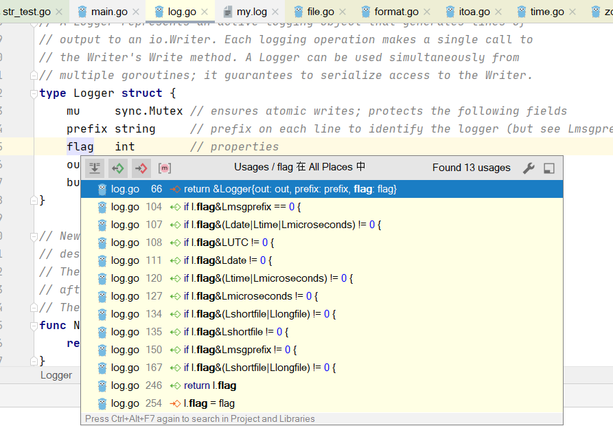

# 内置日志库
- log包提供基本的日志功能，但是没有提供日志级别（比如debug、warning、error）,
  
## 简单使用

## 输出文件
- 准确的说，只要实现接口io.Writer的类型都可以作为文件的输出。
```go
package main

import (
	"fmt"
	"log"
	"os"
	"time"
)

func logPrinta(baseStr string) {
	for i := 0; i < 10; i++ {
		msg := fmt.Sprintf("%s_%d", baseStr, i)
		log.Println(msg)
	}
}

func main() {
	// 创建文件对象
	file, err := os.OpenFile("my.log", os.O_APPEND|os.O_CREATE|os.O_WRONLY, 0666)
	if err != nil {
		log.Fatal(err)
	}
	// 设置log输出到文件
	log.SetOutput(file)
	go logPrinta("golang !!")
	go logPrinta("中文加爱我的无 ！！")
	go logPrinta("wdwdw爱的味道无多w")
	time.Sleep(1 * time.Hour)
}

```

## 自定义的logger
```go
package main

import (
	"log"
	"os"
)

var (
	WarningLogger *log.Logger
	InfoLogger    *log.Logger
	ErrorLogger   *log.Logger
)

func init() {
	file, err := os.OpenFile("c.log", os.O_APPEND|os.O_CREATE|os.O_WRONLY, 0666)
	if err != nil {
		log.Fatal(err)
	}
	InfoLogger = log.New(file, "[INFO]", log.Ldate|log.Ltime|log.Lshortfile)
	WarningLogger = log.New(file, "[WARNING]", log.LstdFlags|log.Lshortfile)
	ErrorLogger = log.New(file, "[ERROR]", log.Ldate|log.Ltime|log.Lmicroseconds|log.Lshortfile)
}

func main() {
	// 创建文件对象
	InfoLogger.Println("[常见写法]启动服务....")
	InfoLogger.Println("[日期简写]正常上报....")
	WarningLogger.Println("[文件长路径]不严重的错误，报个warining....")
	ErrorLogger.Println("[微妙时间戳]严重的错误，报个error....")
}

```

### log.flag 和iota讲解
- itoa枚举依次是 1，2，4，8，16，32
```go
const (
	Ldate         = 1 << iota     // the date in the local time zone: 2009/01/23
	Ltime                         // the time in the local time zone: 01:23:23
	Lmicroseconds                 // microsecond resolution: 01:23:23.123123.  assumes Ltime.
	Llongfile                     // full file name and line number: /a/b/c/d.go:23
	Lshortfile                    // final file name element and line number: d.go:23. overrides Llongfile
	LUTC                          // if Ldate or Ltime is set, use UTC rather than the local time zone
	Lmsgprefix                    // move the "prefix" from the beginning of the line to before the message
	LstdFlags     = Ldate | Ltime // initial values for the standard logger
)
```
- 因为可以组由组合标志位，后端进行 &判断

    - if l.flag&(Ldate|Ltime|Lmicroseconds) != 0 
    - 代表你原来的flag中有Ldate|Ltime|Lmicroseconds

- logger不能决定字段 输出顺序。 a|b =b|a

# github.com/sirupsen/logrus

## 简单使用
- WithFields 添加字段 Logrus鼓励通过日志字段进行谨慎的结构化日志记录,而不是冗长的、不可解析的错误消息
```go
package main

import (
	log "github.com/sirupsen/logrus"
	"os"
)

type s struct {
	Name string
	Age  int
}

func main() {
	a := s{
		Name: "小乙",
		Age:  10,
	}
	// 设置日志等级
	log.SetLevel(log.DebugLevel)
	// 设置日志打到那里去
	log.SetOutput(os.Stdout)
	// 设置filename
	log.SetReportCaller(true)

	// 设置format text
	//log.SetFormatter(&log.TextFormatter{
	//
	//	TimestampFormat: "2006-01-02 15:04:05",
	//})
	log.SetFormatter(&log.JSONFormatter{

		TimestampFormat: "2006-01-02 15:04:05",
	})

	log.Debug("调试信息")
	log.Info("提示信息")
	log.Warn("警告信息")
	log.Error("错误信息")
	log.Infof("[格式化打印结构体:%+v]", a)
	log.WithFields(log.Fields{
		"user_id":    123,
		"ip":         "1.1.1.1",
		"request_id": "asdwdadmaskmdlasmldkmwqlkdkmakldm",
	}).Info("用户登录成功")
}

```


## 全局的logger init函数
- 设置level
- 设置output
- 设置format	

- 新建g/log.go
```go
package g

import (
	"github.com/sirupsen/logrus"
	"os"
)

var Logger = logrus.New()

func InitLogger(level string) {
	switch level {
	case "info":
		Logger.SetLevel(logrus.InfoLevel)
	case "debug":
		Logger.SetLevel(logrus.DebugLevel)
	case "warn":
		Logger.SetLevel(logrus.WarnLevel)
	}
	Logger.SetOutput(os.Stdout)
	// 设置filename
	Logger.SetReportCaller(true)

	// 设置format text
	//log.SetFormatter(&log.TextFormatter{
	//
	//	TimestampFormat: "2006-01-02 15:04:05",
	//})
	Logger.SetFormatter(&logrus.JSONFormatter{

		TimestampFormat: "2006-01-02 15:04:05",
	})

}

```

- 使用 
```go
	g.InitLogger("info")
	g.Logger.Println("测试")
```


## hook使用
### hook字段说明
- Levels 代表在哪几个级别下应用这个hook
- Fire 代表 执行哪个函数
```go
type Hook interface {
	Levels() []Level
	Fire(*Entry) error
}
```


### 日志发送钉钉样例
> 钉钉机器人发送群消息
- https://developers.dingtalk.com/document/app/custom-robot-access/title-72m-8ag-pqw
- 第一版本代码
```go
package main

import (
	"bytes"
	"encoding/json"
	"fmt"
	logger "github.com/sirupsen/logrus"
	"net/http"
)

type dingHook struct {
	apiUrl     string //钉钉 群机器人token url
	levels     []logger.Level
	atMobiles  []string    // at谁
	appName    string      // 模块前缀
	jsonBodies chan []byte //异步发送内容队列
	closeChan  chan bool   //主进程关闭消息通道
}

//- Levels 代表在哪几个级别下应用这个hook
func (dh *dingHook) Levels() []logger.Level {
	return dh.levels
}

//- Fire 代表 执行具体什么逻辑
func (dh *dingHook) Fire(e *logger.Entry) error {
	msg, _ := e.String()
	dh.DirectSend(msg)
	return nil
}

// 同步发送钉钉的函数
func (dh *dingHook) DirectSend(msg string) {
	dm := dingMsg{
		MsgType: "text",
	}
	dm.Text.Content = fmt.Sprintf("[日志告警log]\n[app=%s]\n"+
		"[日志详情:%s]", dh.appName, msg)

	dm.At.AtMobiles = dh.atMobiles
	bs, err := json.Marshal(dm)
	if err != nil {
		logger.Errorf("[消息json.marshal失败][error:%v][msg:%v]", err, msg)
		return
	}
	res, err := http.Post(dh.apiUrl, "application/json", bytes.NewBuffer(bs))
	if err != nil {
		logger.Errorf("[消息发送失败][error:%v][msg:%v]", err, msg)
		return
	}
	if res != nil && res.StatusCode != 200 {
		logger.Errorf("[钉钉返回错误][StatusCode:%v][msg:%v]", res.StatusCode, msg)
		return
	}
}

// 定义发钉钉信息的字段
/*
{
    "at": {
        "atMobiles":[
            "180xxxxxx"
        ],
        "atUserIds":[
            "user123"
        ],
        "isAtAll": false
    },
    "text": {
        "content":"我就是我, @XXX 是不一样的烟火"
    },
    "msgtype":"text"
}
*/
type dingMsg struct {
	MsgType string `json:"msgtype"`
	Text    struct {
		Content string `json:"content"`
	} `json:"text"`
	At struct {
		AtMobiles []string `json:"atMobiles"`
	} `json:"at"`
}

func main() {
	dh := &dingHook{
		apiUrl:     "https://oapi.dingtalk.com/robot/send?access_token=xxxxx",
		levels:     []logger.Level{logger.WarnLevel, logger.InfoLevel},
		atMobiles:  []string{"xxxx"},
		appName:    "live",
		jsonBodies: make(chan []byte),
		closeChan:  make(chan bool),
	}
	//dh.DirectSend("直接发送一波看看")
	level := logger.InfoLevel
	logger.SetLevel(level)
	// 设置filename
	logger.SetReportCaller(true)

	logger.SetFormatter(&logger.JSONFormatter{
		TimestampFormat: "2006-01-02 15:04:05",
	})
	// 添加hook
	logger.AddHook(dh)
	logger.Info("这是我自己hook的logrus")
}

```

> 总结如何使用 logrus的hook功能
1. 要去实现先Fire 和Levels方法 --> 实现那个hook接口
2. 你的处理逻辑在Fire中
    - 比如发送到redis 、es 、钉钉、logstash
3. addHook,直接打印日志发送就可以了

### 原理追踪
- logrus.Info 对应D:\go_path\pkg\mod\github.com\sirupsen\logrus@v1.8.1\entry.go
```go
func (entry *Entry) Info(args ...interface{}) {
	entry.Log(InfoLevel, args...)
}
```
- D:\go_path\pkg\mod\github.com\sirupsen\logrus@v1.8.1\entry.go +241
```go
newEntry.fireHooks()
```
- D:\go_path\pkg\mod\github.com\sirupsen\logrus@v1.8.1\hooks.go 
```go
// Fire all the hooks for the passed level. Used by `entry.log` to fire
// appropriate hooks for a log entry.
func (hooks LevelHooks) Fire(level Level, entry *Entry) error {
	for _, hook := range hooks[level] {
		if err := hook.Fire(entry); err != nil {
			return err
		}
	}
	return nil
}

```

###  https://github.com/rifflock/lfshook
- 简单使用

> 结合logrotate github.com/lestrrat-go/file-rotatelogs
-  保留4个文件 rotatelogs.WithRotationCount(4)
-  切割时间 rotatelogs.WithRotationTime(1*time.Second)
-  删除时间 rotatelogs.WithMaxAge(2*time.Minute)


