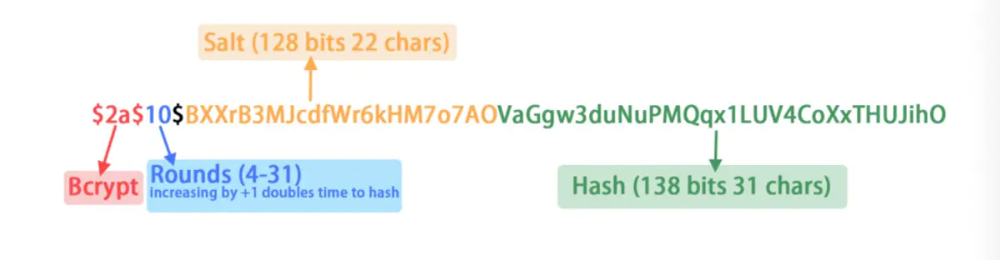

# 散列算法

散列是信息的提炼，通常其长度要比信息小得多，且为一个固定长度。加密性强的散列一定是不可逆的，这就意味着通过散列结果，无法推出任何部分的原始信息。任何输入信息的变化，哪怕仅一位，都将导致散列结果的明显变化，这称之为雪崩效应。散列还应该是防冲突的，即找不出具有相同散列结果的两条信息。具有这些特性的散列结果就可以用于验证信息是否被修改。常用于保证数据完整性

单向散列函数一般用于产生消息摘要，密钥加密等，常见的有:
+ MD5(Message Digest Algorithm 5): 是RSA数据安全公司开发的一种单向散列算法。
+ SHA(Secure Hash Algorithm): 可以对任意长度的数据运算生成一个160位的数值

## MD5
MD5即Message-Digest Algorithm 5（信息-摘要算法5），用于确保信息传输完整一致。是计算机广泛使用的杂凑算法之一（又译摘要算法、哈希算法），主流编程语言普遍已有MD5实现。将数据（如汉字）运算为另一固定长度值，是杂凑算法的基础原理，MD5的前身有MD2、MD3和MD4

由于MD5已经被破解了(中国山东大学的王小云教授破解)

```go
import (
	"crypto/md5"
	"fmt"
)

func main() {
    // 最基础的使用方式: Sum 返回数据的MD5校验和
	fmt.Printf("%x\n", md5.Sum([]byte("测试数据")))
}
```

## SHA-1
在1993年，安全散列算法（SHA）由美国国家标准和技术协会(NIST)提出，并作为联邦信息处理标准（FIPS PUB 180）公布；1995年又发布了一个修订版FIPS PUB 180-1，通常称之为SHA-1。SHA-1是基于MD4算法的，并且它的设计在很大程度上是模仿MD4的。现在已成为公认的最安全的散列算法之一，并被广泛使用。

SHA-1是一种数据加密算法，该算法的思想是接收一段明文，然后以一种不可逆的方式将它转换成一段（通常更小）密文，也可以简单的理解为取一串输入码（称为预映射或信息），并把它们转化为长度较短、位数固定的输出序列即散列值（也称为信息摘要或信息认证代码）的过程。
该算法输入报文的最大长度不超过264位，产生的输出是一个160位的报文摘要。输入是按512 位的分组进行处理的。SHA-1是不可逆的、防冲突，并具有良好的雪崩效应。

sha1是SHA家族的五个算法之一(其它四个是SHA-224、SHA-256、SHA-384，和SHA-512)

```go
package main

import (
	"crypto/sha1"
	"fmt"
	"io"
)
// sha1散列算法
func sha1Hash(msg string) (hashData []byte) {
	h := sha1.New()
	io.WriteString(h, msg)
	hashData = h.Sum(nil)
	return
}

func main() {
	msg := "This is the message to hash!"
	// sha1
	sha1Data := sha1Hash(msg)
	fmt.Printf("SHA1: %x\n", sha1Data)
}
```

SHA-1与MD5的比较:

因为二者均由MD4导出，SHA-1和MD5彼此很相似。相应的，他们的强度和其他特性也是相似，但还有以下几点不同：

+ 对强行供给的安全性：最显著和最重要的区别是SHA-1摘要比MD5摘要长32 位。使用强行技术，产生任何一个报文使其摘要等于给定报摘要的难度对MD5是2128数量级的操作，而对SHA-1则是2160数量级的操作。这样，SHA-1对强行攻击有更大的强度。
+ 对密码分析的安全性：由于MD5的设计，易受密码分析的攻击，SHA-1显得不易受这样的攻击。
+ 速度：在相同的硬件上，SHA-1的运行速度比MD5慢

## HMac

Hmac算法也是一种哈希算法，它可以利用MD5或SHA1等哈希算法。不同的是，Hmac还需要一个密钥, 只要密钥发生了变化，那么同样的输入数据也会得到不同的签名，因此，可以把Hmac理解为用随机数“增强”的哈希算法

```go
package main

import (
	"crypto/hmac"
	"fmt"
	"io"
)

// 使用sha1的Hmac散列算法
func hmacHash(msg string, key string) (hashData []byte) {
	k := []byte(key)
	mac := hmac.New(sha1.New, k)
	io.WriteString(mac, msg)
	hashData = mac.Sum(nil)
	return
}

func main() {
	msg := "This is the message to hash!"
	// hmac
	hmacData := hmacHash(msg, "The key string!")
	fmt.Printf("HMAC: %x\n", hmacData)
}
```

## 你觉得上面这些算法好吗？
如果你使用的是MD5算法来加密你的口令，你的口令长度只有小写字母再加上数字，假设口令的长度是6位，那么在目前一台比较新一点的PC机上，穷举所有的口令只需要40秒钟。几乎有90%以上的用户只用小写字母和数字来组织其口令。对于6位长度的密码只需要最多40秒就可以破解了，这可能会吓到你

因为MD5，SHA的算法速度太快了, 当用于消息摘要，还是很不错的, 但是用于password hash就不行了
，有没有适合password hash的算法喃?

## bcrypt

bcrypt是这样的一个算法，因为它很慢，对于计算机来说，其慢得有点BT了，但却慢得刚刚好！对于验证用户口令来说是不慢的，对于穷举用户口令来说，其会让那些计算机变得如同蜗牛一样

bcrypt采用了一系列各种不同的Blowfish加密算法，并引入了一个work factor，这个工作因子可以让你决定这个算法的代价有多大。因为这些，这个算法不会因为计算机CPU处理速度变快了，而导致算法的时间会缩短了。因为，你可以增加work factor来把其性能降下来

同时bcrypt也是一种加盐的Hash方法，MD5 Hash时候，同一个报文经过hash的时候生成的是同一个hash值，在大数据的情况下，有些经过md5 hash的方法将会被破解(碰撞).使用BCrypt进行加密，同一个密码每次生成的hash值都是不相同的。每次加密的时候首先会生成一个随机数就是盐，之后将这个随机数与报文进行hash，得到 一个hash值

那一个被bcrypt hash过后的结果长啥样喃:



Bcrypt有四个变量：

+ saltRounds: 正数，代表hash杂凑次数，数值越高越安全，默认10次。
+ myPassword: 明文密码字符串。
+ salt: 盐，一个128bits随机字符串，22字符
+ myHash: 经过明文密码password和盐salt进行hash，个人的理解是默认10次下 ，循环加盐hash10次，得到myHash

```go
package main

import (
    "fmt"

    "golang.org/x/crypto/bcrypt"
)

func HashPassword(password string) (string, error) {
    bytes, err := bcrypt.GenerateFromPassword([]byte(password), 14)
    return string(bytes), err
}

func CheckPasswordHash(password, hash string) bool {
    err := bcrypt.CompareHashAndPassword([]byte(hash), []byte(password))
    return err == nil
}

func main() {
    password := "secret"
    hash, _ := HashPassword(password) // ignore error for the sake of simplicity

    fmt.Println("Password:", password)
    fmt.Println("Hash:    ", hash)

    match := CheckPasswordHash(password, hash)
    fmt.Println("Match:   ", match)
}
```

## 应用

### 用户名密码校验

密码校验则是一个很常见的问题, 当我们设计用户中心时，是一个必不可少的功能, 为了安全，我们都不会保存用户的明文密码, 最好的方式就是保存为Hash, 这样即使是数据泄露了，也不会导致用户的明文密码泄露(hash的过程是不可逆的)

需求:

+ 用户可以修改密码
+ 修改密码时，禁止使用最近已经使用过的密码
+ 能校验密码


```go
// NewHashedPassword 生产hash后的密码对象
func NewHashedPassword(password string) (*Password, error) {
	bytes, err := bcrypt.GenerateFromPassword([]byte(password), 10)
	if err != nil {
		return nil, err
	}

	return &Password{
		Password: string(bytes),
		CreateAt: ftime.Now().Timestamp(),
		UpdateAt: ftime.Now().Timestamp(),
	}, nil
}

type Password struct {
	// hash过后的密码
	Password string
	// 密码创建时间
	CreateAt int64
	// 密码更新时间
	UpdateAt int64
	// 密码需要被重置
	NeedReset bool
	// 需要重置的原因
	ResetReason string
	// 历史密码
	History []string
	// 是否过期
	IsExpired bool
}
```


```go
// Update 更新密码
func (p *Password) Update(new *Password, maxHistory uint, needReset bool) {
	p.rotaryHistory(maxHistory)
	p.Password = new.Password
	p.NeedReset = needReset
	p.UpdateAt = ftime.Now().Timestamp()
	if !needReset {
		p.ResetReason = ""
	}
}

// IsHistory 检测是否是历史密码
func (p *Password) IsHistory(password string) bool {
	for _, pass := range p.History {
		err := bcrypt.CompareHashAndPassword([]byte(pass), []byte(password))
		if err == nil {
			return true
		}
	}

	return false
}

// HistoryCount 保存了几个历史密码
func (p *Password) HistoryCount() int {
	return len(p.History)
}

func (p *Password) rotaryHistory(maxHistory uint) {
	if uint(p.HistoryCount()) < maxHistory {
		p.History = append(p.History, p.Password)
	} else {
		remainHistry := p.History[:maxHistory]
		p.History = []string{p.Password}
		p.History = append(p.History, remainHistry...)
	}
}

// CheckPassword 判断password 是否正确
func (p *Password) CheckPassword(password string) error {
	err := bcrypt.CompareHashAndPassword([]byte(p.Password), []byte(password))
	if err != nil {
		return exception.NewUnauthorized("user or password not connrect")
	}
	return nil
}
```

## 总结

+ 已经被破解了的Hash
+ 速度较快的Hash，适于与内容摘要
+ 加盐Hash
+ 速度较慢的Hash，适用于密码保存