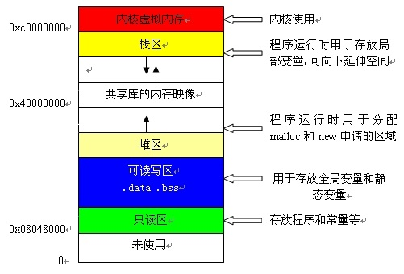
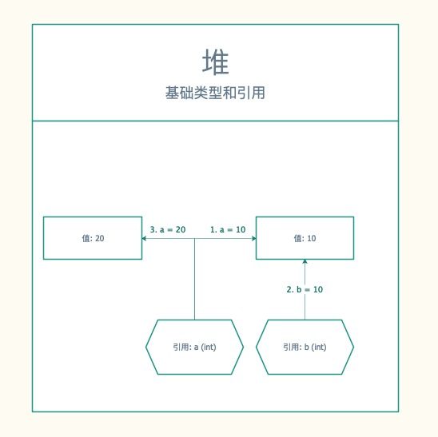
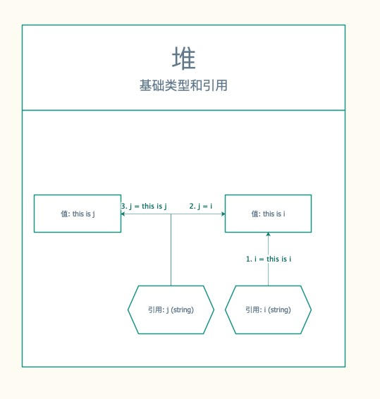
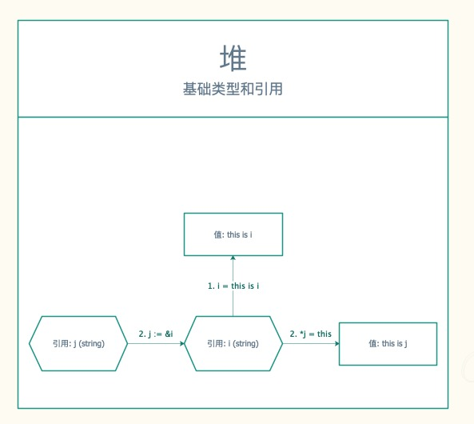

# 变量常量与值

我们经常看到这样的语句

```go
var username string = "username"
```

我们来解读一下该语句:

+ var 关键字 用于声明变量
+ username 标识符, 给变量取的名字
+ string 表示该变量只能存储字符串类型的值
+ = 赋值运算符, 表示给一个变量赋
+ "username" 字面量(值), 这个是一个username的字符串

## 字面量(值)

字面量是值的表示方法，常用与对变量/常量进行初始化，主要分为：

+ 标识基础数据类型值的字面量，例如：0, 1.1, true, 3 + 4i, 'a', "我爱中国"
+ 构造自定义的复合数据类型的类型字面量，例如：type Interval int
+ 用于表示符合数据类型值的复合字面量，用来构造 array、slice、map、struct 的值，
例如：{1, 2, 3}

## 变量

变量是指对一块存储空间定义名称，通过名称对存储空间的内容进行访问或修改

由于Go是强类型语言, 变量需要先声明后使用

### 变量声明

声明变量的一般形式是使用 var 关键字:

```go
var identifier type
```

我们也可以一次声明多个变量, 比如

```go
var identifier1, identifier2 type
```

如果我们一次声明的变量过多，比如:

```go
var identifier1 type1
var identifier2 type2
var identifier3 type3
```

我们可以使用() 进行批量申请

```go
var (
    identifier1 type1
    identifier2 type2
    identifier3 type3    
)
```

### 变量赋值

变量声明过后如果没有赋值，默认是该类型的初始值

+ 整形(int uint)： 0
+ 浮点型(float32 float64): 0
+ 布尔: false
+ 字符串: ""
+ 字符: ''

```go
package main

import (
    "fmt"
)

func main() {
    var a float64
    fmt.Println(a)
}
```

变量赋值的语法为: var1 = value1, 如下是一个声明和赋值的过程

```go
var a string  // 变量声明
a = "test"    // 变量赋值
```

如果我有多个变量需要赋值语法为: var1, var2 = value1, value2

```go
var (
    a string
    b int
)
a, b = "string", 10
```

`注意:` 由于Go是强类型语言, 因此我们在进行赋值时，只能赋变量声明类型的值，比如下面方式就是错误的:

```go
var a string
a = 10
```

### 声明变量并赋值

语法格式为: var identifier type = value

```go
var a string = "one line"
```

同样我们已适合批量声明赋值

```go
var (
    a string  = "value1"
    b int     = 10
    c float32 = 0.01
)
```

### 简短声明

变量的类型使用值类型进行推导，因此我们可以省略类型的定义, 语法格式: a := b

```go
a, b, c := "value1", 10, 0.01
```

`注意：` 简单声明只能用于函数内部, 不用用于全局声明

## 常量

常量是一个简单值的标识符，在程序运行时，不会被修改的量。用于定义不可被修改的的值，需要在编译过程中进行计算，只能为基础的数据类型布尔、
数值、字符串，使用 const 进行常量定义

### 显式类型定义

一般情况下，我们再定义常量的时候 需要制定常量的类型与值
声明语法如下: const identifier type = value

```go
const PI float32 = 3.14
```

通变量一样， 常量也支持批量定义:

```go
// 单行的批量定义 只支持同一种类型
const c1, c2 string = "c1", "c2"

// 多行的批量定义支持不同类型
const (
    PI     float32 = 3.14
    PILong float64 = 3.14159
)
```

### 隐式类型定义

得益于Golang的类型推导, 常量也是可以省略类型的
隐式类型定义语法如下: const identifier = value

```go
const PI = 3.14
```

批量语法如下:

```go
const (
    PI     = 3.141
    PILong = 3.141592
)
```

### 值不可修改

定义多个变量并进行初始化，批量复制中变量类型可省略，并且除了第一个常量值外其他常量可同时省略类型和值，表示使用前一个常量的初始化表达式

常量之间的运算，类型转换，以及对常量调用函数 len、cap、real、imag、complex、unsafe.Sizeof 得到的结果依然为常量

由于常量不能修改，像下面这个就会报错

```go
const (
    a = "sdf"
)
a = "bbb"
```

### 用作枚举

比如 我们定义一个性别的枚举

```go
const (
    UNKNOWN = 0 // 保密
    FEMALE = 1  // 女
    MALE = 2      // 男
)
```

### iota

iota是一种特殊常量，可以认为是一个可以被编译器修改的常量

iota 在 const关键字出现时将被重置为 0(const 内部的第一行之前)，const 中每新增一行常量声明将使 iota 计数一次(iota 可理解为 const 语句块中的行索引)

```go
const (
    UNKNOWN = iota   // UNKNOWN 0 
    FEMALE           // FEMALE +1
    MALE             // MALE   +1
)
```

如果你不想从0开始计数 你也可以这样写

```go
const (
    UNKNOWN = iota + 5  // UNKNOWN 5
    FEMALE              // FEMALE +1
    MALE                // MALE   +1
)
```

## 扩展

进程内存结构:



+ 栈：存放基本类型的数据和对象的引用，但对象本身不存放在栈中，而是存放在堆中（new 出来的对象）
+ 堆: 存放用new产生的数据

值类型和引用类型 是什么?

+ 值类型: 这段内存里面存储的是基本类型的数据, 比如 "a", 10, 0.01
+ 引用类型: 这段内存里面存储的是一个地址, 比如 0xc00011e370 0xc00011e380

### 修改值

比如 下面这段代码中 a, b 10 存在在哪儿? 当执行赋值操作时 都发生了什么?

```go
var a int 
a = 10

var b int 
b = 10

a = 20
```



+ 编译器先处理 `var a int`, 首先它会在栈中创建一个变量为a的引用
+ a = 10，查找栈中是否有10这个值, 没找到，就将10存放进来, 然后让a指向10
+ var b int, 创建一个变量为b的引用
+ b = 10, 查找栈中是否有10这个值, 找到10, 让b指向10
+ a = 20, 查找栈中是否有20这个值, 为找到, 将20放进去, 然后让a指向20

### 修改引用

看看下面这段代码, 修改了j的值，为啥没修改i的值

```go
i := "this is i"
j := i
j := "this is j"
```



下面我们修改了j的值, 为啥i的值也被修改了

```go
i := "this is a"
j := &i
*j = "this is j"
```


