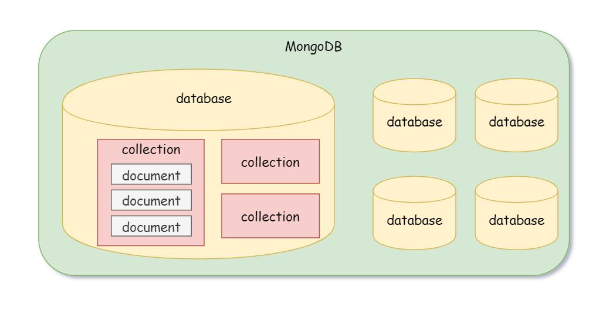
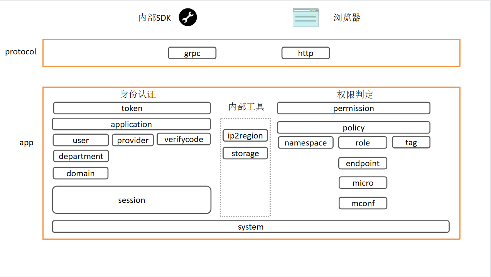

# 开发基础

## 环境搭建

在开发keyauth之前 需要先准备环境

### 安装MongoDB

下面是mongo的基础概念:



1. 采用docker安装
```
docker pull mongo
docker run -itd -p 27017:27017 mongo
```

2. 编辑 /etc/mongod.conf 开启认证访问(可选), 开启后要重启下服务
```
security:
  authorization: enabled
```

3. 创建管理员账号
```
use admin
db.createUser({user:"admin",pwd:"123456",roles:["root"]})
db.auth("admin", "123456")
```

4. 添加库用户
```
use keyauth
db.createUser({user: "keyauth", pwd: "xxx", roles: [{ role: "dbOwner", db: "keyauth" }]})
```

5. MongoDB for VS Code
```
安装vscode插件, 配置访问mongodb
```

### 安装protobuf

1. 下载protoc 版本1.39.1, 注意版本一定要对上 [protoc下载地址](https://github.com/protocolbuffers/protobuf/releases)
```
# 1.安装protoc编译器,  项目使用版本: v3.19.1
# 下载预编译包安装: https://github.com/protocolbuffers/protobuf/releases
```

2. 将需要的文件手动copy到对于地方
```sh
cp protoc-3.19.1-osx-x86_64/bin/protoc /usr/local/bin
cp protoc-3.19.1-osx-x86_64/include/*  /usr/local/include
```

3. 安装gprc相关插件
```sh
# 1.protoc-gen-go go语言查询, 项目使用版本: v1.27.1   
go install google.golang.org/protobuf/cmd/protoc-gen-go@latest

# 2.安装protoc-gen-go-grpc插件, 项目使用版本: 1.1.0
go install google.golang.org/grpc/cmd/protoc-gen-go-grpc@latest
```

4. 安装自定义Tag插件
```
# 1.安装自定义proto tag插件
go install github.com/favadi/protoc-go-inject-tag@latest
```

5. 安装项目依赖的protobuf
```
cp -r docs/include/github.com /usr/local/include
```

## 启动Keyauth

环境准备后后，我们就可以配置好keyauth启动他

### 配置Keyauth

配置下keyauth, 主要是数据库Mongodb的配置
```toml
[app]
name = "keyauth"
host = "0.0.0.0"
http_port = "8050"
grpc_prot = "18050"
key  = "this is your app key"

[mongodb]
endpoints = ["xxx:xxx"]
username = "xxx"
password = "xxxx"
database = "keyauth"

[log]
level = "debug"
path = "logs"
format = "text"
to = "stdout"
```

### 初始化项目

由于我们使用的MongoDB, 无需建表(No Schema), 因此直接初始化项目

```sh
make init
```

初始化有一组关键信息需要记录下:
+ client_id
+ client_secret

这是为我们初始化的一个web端的凭证

### 启动项目

```go
make run
```

然后我们测试下 grpc 和 http api是否可以正常使用


## MongoDB的CRUP

keyauth的所有数据 都是存储在mongodb中的, 因此先介绍下 go操作monodb的基础知识, 下面以keyauth的user模块为例进行讲解

### ORM

如何定义我们存入数据库的collection结构喃? 由于Mongo存储采用Bson, 也就是是二进制Json, 我们通过bson 标签就能定义我们struct存储结构:
+ bson: struct tag, 存入数据库的名称
+ bson: "-", 和json一样，如果我们不需要保存的字段使用"-"表示
+ bson: "_id", collection一种特殊的指端, 和mysql的主键一样, 所以我们直接通过bson:"_id"来定义主健

这样我们就完成了Object ->  Data 的映射, 是不是和ORM很像

```go
// User info
type User struct {
	state         protoimpl.MessageState
	sizeCache     protoimpl.SizeCache
	unknownFields protoimpl.UnknownFields

	// 用户所属部门
	// @gotags: bson:"department_id" json:"department_id" validate:"lte=200"
	DepartmentId string `protobuf:"bytes,1,opt,name=department_id,json=departmentId,proto3" json:"department_id" bson:"department_id" validate:"lte=200"`
	// 用户账号名称
	// @gotags: bson:"_id" json:"account" validate:"required,lte=60"
	Account string `protobuf:"bytes,2,opt,name=account,proto3" json:"account" bson:"_id" validate:"required,lte=60"`
	// 创建方式
	// @gotags: bson:"create_type" json:"create_type"
	CreateType CreateType `protobuf:"varint,3,opt,name=create_type,json=createType,proto3,enum=infraboard.keyauth.user.CreateType" json:"create_type" bson:"create_type"`
	// 用户创建的时间
	// @gotags: bson:"create_at" json:"create_at,omitempty"
	CreateAt int64 `protobuf:"varint,4,opt,name=create_at,json=createAt,proto3" json:"create_at,omitempty" bson:"create_at"`
	// 修改时间
	// @gotags: bson:"update_at" json:"update_at,omitempty"
	UpdateAt int64 `protobuf:"varint,5,opt,name=update_at,json=updateAt,proto3" json:"update_at,omitempty" bson:"update_at"`
	// 如果是子账号和服务账号 都需要继承主用户Domain
	// @gotags: bson:"domain" json:"domain,omitempty"
	Domain string `protobuf:"bytes,6,opt,name=domain,proto3" json:"domain,omitempty" bson:"domain"`
	// 是否是主账号
	// @gotags: bson:"type"  json:"type"
	Type types.UserType `protobuf:"varint,7,opt,name=type,proto3,enum=infraboard.keyauth.user.UserType" json:"type" bson:"type"`
	// 数据
	// @gotags: bson:"profile" json:"profile"
	Profile *Profile `protobuf:"bytes,8,opt,name=profile,proto3" json:"profile" bson:"profile"`
	// 用户的角色(当携带Namesapce查询时会有)
	// @gotags: bson:"-" json:"roles,omitempty"
	Roles []string `protobuf:"bytes,9,rep,name=roles,proto3" json:"roles,omitempty" bson:"-"`
	// 用户多久未登录时(天), 冻结改用户, 防止僵尸用户的账号被利用
	// @gotags: bson:"expires_days" json:"expires_days"
	ExpiresDays int32 `protobuf:"varint,10,opt,name=expires_days,json=expiresDays,proto3" json:"expires_days" bson:"expires_days"`
	// 用户描述
	// @gotags: json:"description"
	Description string `protobuf:"bytes,11,opt,name=description,proto3" json:"description"`
	// 用户是否初始化
	// @gotags: bson:"is_initialized" json:"is_initialized"
	IsInitialized bool `protobuf:"varint,12,opt,name=is_initialized,json=isInitialized,proto3" json:"is_initialized" bson:"is_initialized"`
	// 密码相关信息
	// @gotags: bson:"password" json:"password"
	HashedPassword *Password `protobuf:"bytes,13,opt,name=hashed_password,json=hashedPassword,proto3" json:"password" bson:"password"`
	// 用户状态
	// @gotags: bson:"status" json:"status"
	Status *Status `protobuf:"bytes,14,opt,name=status,proto3" json:"status" bson:"status"`
	// 部门
	// @gotags: bson:"-" json:"department,omitempty"
	Department *department.Department `protobuf:"bytes,15,opt,name=department,proto3" json:"department,omitempty" bson:"-"`
}
```

### 设置索引

为了提升collect的搜索速度，我们往往需要对 过滤条件建立缩影，防止collection全扫描, 如何为你的collection设置索引喃?

+ collection.Indexes().CreateMany() 可以用于创建索引
```go
	_, err := uc.Indexes().CreateMany(context.Background(), indexs)
	if err != nil {
		return err
	}
```

mongo.IndexModel 是创建索引的参数, 
+ keys: 使用Keys 设置需要配置缩影的key, 可以是多个key，也就是联合索引
  + key: bson里面字段的名称, 如果是多层使用"."表示, 比如ldap_config.base_dn, array没发做索引, 如果你要频繁访问，请独立为collection
  + value: 这里的value只有2个值可选: 1: 正向排序， -1: 反相排序, 比如时间索引, 我们每次都访问最近的数据，就适合反相排序
+ Options: 只介绍常见的选项
  + expireAfterSeconds: 设置TTL
  + Unique: 设置唯一键

下面是user的索引  
```go
indexs := []mongo.IndexModel{
  {
    Keys:    bsonx.Doc{{Key: "name", Value: bsonx.Int32(-1)}},
    Options: options.Index().SetUnique(true),
  },
  {
    Keys:    bsonx.Doc{{Key: "ldap_config.base_dn", Value: bsonx.Int32(-1)}},
    Options: options.Index().SetUnique(true),
  },
  {
    Keys: bsonx.Doc{{Key: "create_at", Value: bsonx.Int32(-1)}},
  },
}
```

下面是完整的代码
```go
func (s *service) Config() error {
	s.policy = app.GetGrpcApp(policy.AppName).(policy.ServiceServer)
	s.depart = app.GetGrpcApp(department.AppName).(department.ServiceServer)
	s.domain = app.GetGrpcApp(domain.AppName).(domain.ServiceServer)

	db := conf.C().Mongo.GetDB()
	uc := db.Collection("user")

	indexs := []mongo.IndexModel{
		{
			Keys: bsonx.Doc{{Key: "create_at", Value: bsonx.Int32(-1)}},
		},
		{
			Keys: bsonx.Doc{{Key: "department_id", Value: bsonx.Int32(-1)}},
		},
	}

	_, err := uc.Indexes().CreateMany(context.Background(), indexs)
	if err != nil {
		return err
	}

	s.col = uc
	s.log = zap.L().Named("User")
	return nil
}
```


索引虽好，但是有使用限制: 每个索引占据一定的存储空间, 索引也有大小限制(MySQL类似), 你应该确保该索引的大小不超过内存的限制:
+ 集合中索引不能超过64个
+ 索引名的长度不能超过128个字符
+ 一个复合索引最多可以有31个字段

### 创建

```go
func (s *service) saveAccount(u *user.User) error {
	if _, err := s.col.InsertOne(context.TODO(), u); err != nil {
		return exception.NewInternalServerError("inserted user(%s) document error, %s",
			u.Account, err)
	}

	return nil
}
```

### 查询

使用Find查找Collection:

+ FindFilter: 使用bson.M{}, 来传递参数
  + key:value, 这在就相当于Where And的语法, 比如 下面的type和domain
  + $in: 如果判断的字段是个列表, 就需要使用$in， 和MySQL中的in一样
  + $or: 如果多个条件组合OR, 设置$or: [] 组合即可
  + $regex: 用于设置正则匹配, 和LIKE很像,  比Like灵活
  + 更多的查询语法请参考: 
```go
func (r *queryUserRequest) FindFilter() bson.M {
	filter := bson.M{
		"type":   r.UserType,
		"domain": r.Domain,
	}

	if len(r.Accounts) > 0 {
		filter["_id"] = bson.M{"$in": r.Accounts}
	}
	if r.DepartmentId != "" {
		if r.WithAllSub {
			filter["$or"] = bson.A{
				bson.M{"department_id": bson.M{"$regex": r.DepartmentId, "$options": "im"}},
			}
		} else {
			filter["department_id"] = r.DepartmentId
		}
	}

	if r.Keywords != "" {
		filter["$or"] = bson.A{
			bson.M{"_id": bson.M{"$regex": r.Keywords, "$options": "im"}},
			bson.M{"profile.mobile": bson.M{"$regex": r.Keywords, "$options": "im"}},
			bson.M{"profile.email": bson.M{"$regex": r.Keywords, "$options": "im"}},
		}
	}

	return filter
}
```

+ FindOptions:
```go
func (r *queryUserRequest) FindOptions() *options.FindOptions {
	pageSize := int64(r.Page.PageSize)
	skip := int64(r.Page.PageSize) * int64(r.Page.PageNumber-1)

	opt := &options.FindOptions{
		Sort:  bson.D{{Key: "create_at", Value: -1}},
		Limit: &pageSize,
		Skip:  &skip,
	}

	return opt
}
```

+ 迭代数据
```go
		s.log.Debugf("find filter: %s", req.FindFilter())
		resp, err := s.col.Find(context.TODO(), req.FindFilter(), req.FindOptions())

    ...

		// 循环
		for resp.Next(context.TODO()) {
			u := new(user.User)
			if err := resp.Decode(u); err != nil {
				return nil, exception.NewInternalServerError("decode user error, error is %s", err)
			}

			u.Desensitize()
			userSet.Add(u)
```


### 更新

使用$set进行更新

+ 更新单个文档
```go
	_, err = s.col.UpdateOne(context.TODO(), bson.M{"_id": u.Account}, bson.M{"$set": u})
	if err != nil {
		return nil, exception.NewInternalServerError("update user(%s) error, %s", u.Account, err)
	}
```

+ 更新单个文档的部分数据
```go
s.log.Debugf("save password to db ...")
	_, err = s.col.UpdateOne(context.TODO(), bson.M{"_id": u.Account}, bson.M{"$set": bson.M{
		"password": u.HashedPassword,
	}})
```

### 删除

```go
	_, err := s.col.DeleteOne(context.TODO(), bson.M{"_id": req.Account})
	if err != nil {
		return nil, exception.NewInternalServerError("delete user(%s) error, %s", req.Account, err)
	}
```

## 概念介绍




