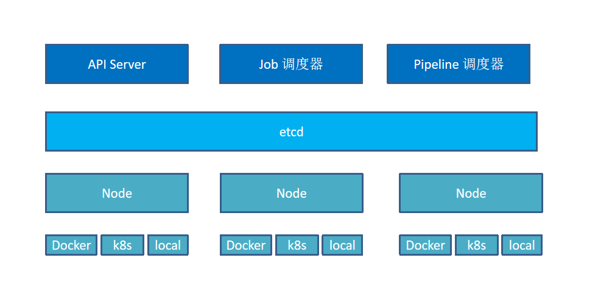
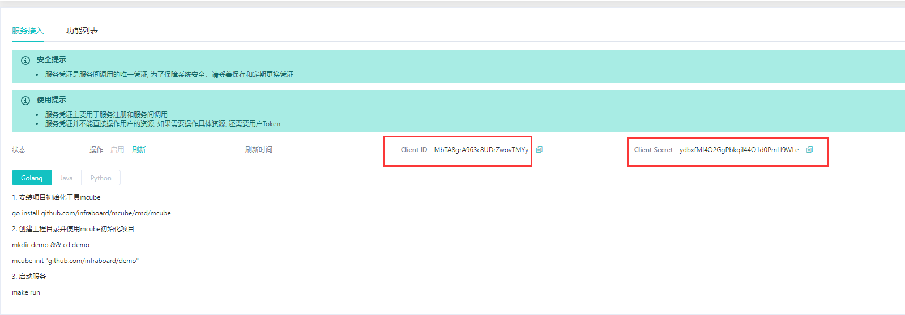
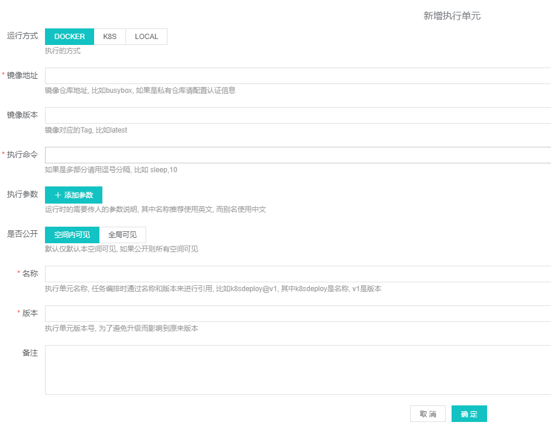
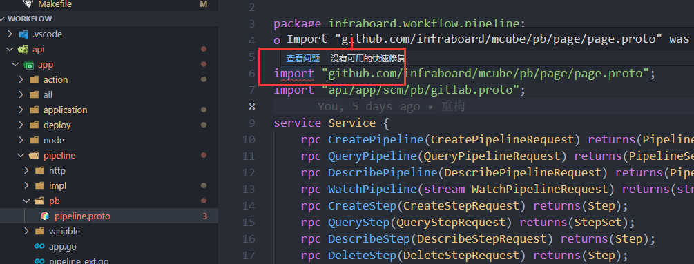
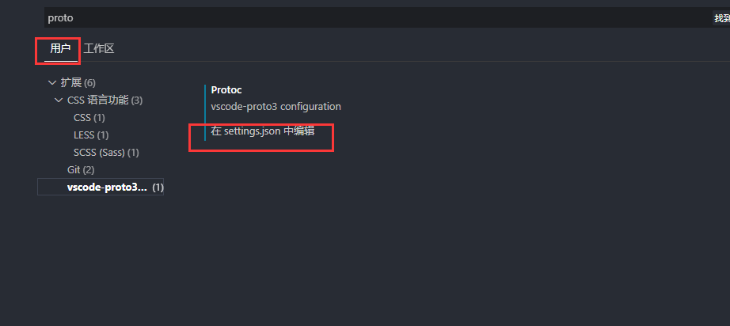
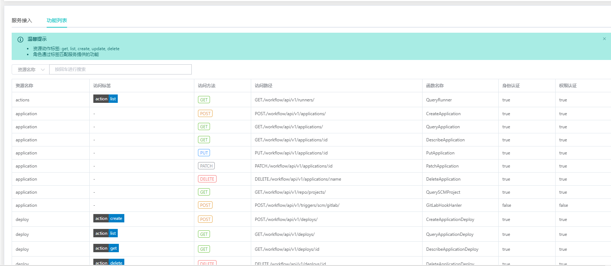
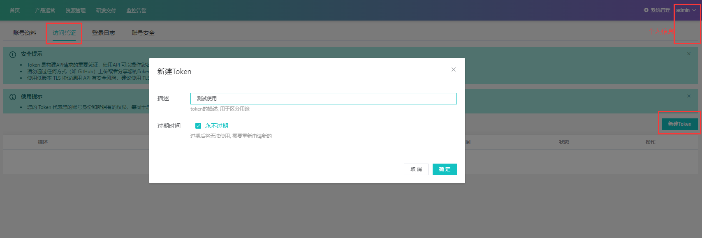

# API Server 开发



## 开发环境

+ etcd: 我们已经准备好了, 就是我们本地docker

```ps
$ docker ps 
CONTAINER ID   IMAGE                        COMMAND                  CREATED       STATUS          PORTS                              NAMES
5c2d93e2035b   quay.io/coreos/etcd:latest   "etcd --listen-clien…"   5 hours ago   Up 5 hours      0.0.0.0:2379-2380->2379-2380/tcp   etcd
7bddda5ccacf   mongo                        "docker-entrypoint.s…"   7 days ago    Up 10 minutes   0.0.0.0:27017->27017/tcp           unruffled_davinci
```

+ mongodb: workflow其他一些元数据存储在mongo里面得，比如 因为etcd并不适合做历史数据得存储.

```sh
# 启动之前得mongodb容器, 然后使用mongo shell 操作
docker exec -it 7bddda5ccacf mongo
```

为workflow项目创建 mongo账号
```
# 登录管理员
use admin
db.auth("admin", "123456")

# 创建一个workflow得账号
use workflow
db.createUser({user: "workflow", pwd: "workflow", roles: [{ role: "dbOwner", db: "workflow" }]})

# 验证账号， 1为登录成功
use workflow
db.auth("workflow", "workflow")

# 退出shell
quit()
```

+ keyauth 创建workflow服务, 用于workflow对接到权限中心

这里我们通过前端来创建:



创建成功后 配置到workflow配置文件:
```toml
[keyauth]
host = "127.0.0.1"
port = "18050"
client_id = "MbTA8grA963c8UDrZwovTMYy"
client_secret = "ydbxfMI4O2GgPbkqil44O1d0PmLl9WLe"
```

## workflow api server框架

准备好:
+ etcd
+ mongodb
+ keyauth配置

由于我们都是使用一套项目骨架, 你直接复刻一套cmdb的架子过来, 把app留空, api server开发的骨架结构就有了

由于我们比cmdb而言添加mongodb的配置和etcd的配置，因此配置对象补充着2个对象
```go
# 全局对象声明
var (
	mgoClient  *mongo.Client
	etcdClient *clientv3.Client
)

# 补充mongo的配置对象
func newDefaultMongoDB() *mongodb {
	return &mongodb{
		Database:  "",
		Endpoints: []string{"127.0.0.1:27017"},
	}
}

type mongodb struct {
	Endpoints []string `toml:"endpoints" env:"MONGO_ENDPOINTS" envSeparator:","`
	UserName  string   `toml:"username" env:"MONGO_USERNAME"`
	Password  string   `toml:"password" env:"MONGO_PASSWORD"`
	Database  string   `toml:"database" env:"MONGO_DATABASE"`
}

// Client 获取一个全局的mongodb客户端连接
func (m *mongodb) Client() *mongo.Client {
	if mgoClient == nil {
		panic("please load mongo client first")
	}

	return mgoClient
}

func (m *mongodb) GetDB() *mongo.Database {
	return m.Client().Database(m.Database)
}

func (m *mongodb) getClient() (*mongo.Client, error) {
	opts := options.Client()

	cred := options.Credential{
		AuthSource: m.Database,
	}

	if m.UserName != "" && m.Password != "" {
		cred.Username = m.UserName
		cred.Password = m.Password
		cred.PasswordSet = true
		opts.SetAuth(cred)
	}
	opts.SetHosts(m.Endpoints)
	opts.SetConnectTimeout(5 * time.Second)

	// Connect to MongoDB
	client, err := mongo.Connect(context.TODO(), opts)
	if err != nil {
		return nil, fmt.Errorf("new mongodb client error, %s", err)
	}

	if err = client.Ping(context.TODO(), nil); err != nil {
		return nil, fmt.Errorf("ping mongodb server(%s) error, %s", m.Endpoints, err)
	}

	return client, nil
}

# 补充etcd配置对象
func newDefaultEtcd() *Etcd {
	return &Etcd{
		InstanceTTL: 300,
		Prefix:      "inforboard",
	}
}

type Etcd struct {
	Endpoints   []string `toml:"endpoints" env:"ETCD_ENDPOINTS" envSeparator:","`
	UserName    string   `toml:"username" env:"ETCD_USERNAME"`
	Password    string   `toml:"password" env:"ETCD_PASSWORD"`
	Prefix      string   `toml:"prefix" env:"ETCD_Prefix"`
	InstanceTTL int64    `toml:"instance_ttl" env:"ETCD_INSTANCE_TTL"`
}

func (e *Etcd) Validate() error {
	if len(e.Endpoints) == 0 {
		return fmt.Errorf("etcd enpoints not config")
	}
	return nil
}

func (e *Etcd) GetClient() *clientv3.Client {
	if etcdClient == nil {
		panic("please load etcd client first")
	}

	return etcdClient
}

func (e *Etcd) getClient() (*clientv3.Client, error) {
	timeout := time.Duration(5) * time.Second
	client, err := clientv3.New(clientv3.Config{
		Endpoints:   e.Endpoints,
		DialTimeout: timeout,
		Username:    e.UserName,
		Password:    e.Password,
	})
	if err != nil {
		return nil, fmt.Errorf("connect etcd error, %s", err)
	}

	ctx, cancel := context.WithTimeout(context.Background(), timeout)
	defer cancel()

	ml, err := client.MemberList(ctx)
	if err != nil {
		return nil, err
	}
	zap.L().Debugf("etcd members: %s", ml.Members)

	return client, nil
}
```

然后在配置文件加载的时候，把着2个全局对象初始化
```go
// LoadConfigFromToml 从toml中添加配置文件, 并初始化全局对象
func LoadConfigFromToml(filePath string) error {
	cfg := newConfig()
	if _, err := toml.DecodeFile(filePath, cfg); err != nil {
		return err
	}

	if err := initGloabalInstance(cfg); err != nil {
		return err
	}

	// 加载全局配置单例
	global = cfg
	return nil
}

func initGloabalInstance(cfg *Config) error {
	c, err := cfg.Etcd.getClient()
	if err != nil {
		return err
	}
	etcdClient = c

	mgo, err := cfg.Mongo.getClient()
	if err != nil {
		return err
	}
	mgoClient = mgo
	return nil
}
```

我们就可以启动workflow的 API Server了
```
make run-api
$ make run-api
{"level":"warn","ts":"2021-11-27T20:15:11.148+0800","logger":"etcd-client","caller":"v3@v3.5.1/retry_interceptor.go:62","msg":"retrying of unary invoker failed","target":"etcd-endpoints://0xc000093a40/127.0.0.1:2379","attempt":0,"error":"rpc error: code = FailedPrecondition desc = etcdserver: authentication is not enabled"}
2021-11-27T20:15:11.169+0800    INFO    [INIT]  cmd/start.go:202        log level: debug
2021-11-27T20:15:11.169+0800    INFO    [Nats Bus]      nats/nats.go:83 start connect to nats server [nats://keyauth.nbtuan.vip:14922] ...
2021-11-27T20:15:11.311+0800    WARN    cmd/start.go:53 load global bus error, nats: Authorization Violation
2021-11-27T20:15:11.311+0800    INFO    [INIT]  cmd/start.go:214        use cache in local memory
2021-11-27T20:15:11.318+0800    INFO    [CLI]   cmd/start.go:113        loaded grpc app: []
2021-11-27T20:15:11.318+0800    INFO    [CLI]   cmd/start.go:114        loaded http app: []
2021-11-27T20:15:11.318+0800    INFO    [CLI]   cmd/start.go:115        loaded internal app: []
2021-11-27T20:15:11.319+0800    INFO    [GRPC Service]  protocol/grpc.go:43     GRPC 开始启动, 监听地址: 127.0.0.1:19948
2021-11-27T20:15:11.319+0800    INFO    [HTTP Service]  protocol/http.go:143    start registry endpoints ...
2021-11-27T20:15:11.496+0800    DEBUG   [HTTP Service]  protocol/http.go:150    service endpoints registry success
2021-11-27T20:15:11.496+0800    INFO    [HTTP Service]  protocol/http.go:118    HTTP服务启动成功, 监听地址: 127.0.0.1:9948
```

## Pipeline action app开发



在开发pipeline模块之前，我们需要提前开发action模块, 因为pipeline在定义step的时候, 需要指定action

开发之前我们需要定义清楚我们的接口, 老方法, action服务的protobuf文件

### protobuf定义

我们在pb目录下定义数据结构和方法, 完整文件请查看代码仓库，仓库地址在最后参考部分
```protobuf
syntax = "proto3";

package infraboard.workflow.action;
option go_package = "github.com/infraboard/workflow/api/app/action";

import "github.com/infraboard/mcube/pb/page/page.proto";
import "github.com/infraboard/mcube/pb/resource/base.proto";

service Service {
	rpc CreateAction(CreateActionRequest) returns(Action);
	rpc QueryAction(QueryActionRequest) returns(ActionSet);
	rpc DescribeAction(DescribeActionRequest) returns(Action);
	rpc UpdateAction(UpdateActionRequest) returns(Action);
	rpc DeleteAction(DeleteActionRequest) returns(Action);
}

...
```

下面是action核心数据结构定义:
```protobuf
message CreateActionRequest {
	// 执行器类型, 默认采用Node节点本地Docker执行
	// @gotags: json:"runner_type"
	RUNNER_TYPE runner_type = 7;
	// 所属域
	// @gotags: json:"domain" validate:"required"
	string domain = 9;
	// 所属空间
	// @gotags: json:"namespace" validate:"required"
	string namespace = 10;
	// 创建人
	// @gotags: json:"create_by" validate:"required"
	string create_by = 11;
	// 图片
	// @gotags: json:"logo"
	string logo = 12;
	// 名称
	// @gotags: json:"name" validate:"required"
	string name = 1;
	// Action对应的版本, 推荐默认v1
	// @gotags: json:"version" validate:"required"
	string version = 8;
	// 展示名称
	// @gotags: json:"display_name"
	string display_name = 13;
	// 可见模式
	// @gotags: json:"visiable_mode"
	mcube.resource.VisiableMode visiable_mode = 6;
	// 运行时 Runner传人参数, 创建完成后不能修改, 要修改请新建版本
	// @gotags: bson:"runner_params" json:"runner_params"
	map<string, string> runner_params = 2;
	// 运行时 用户传人的参数说明
	// @gotags: bson:"run_params" json:"run_params"
	repeated RunParamDesc run_params = 3;
	// 标签
	// @gotags: json:"tags"
	map<string, string> tags = 4;
	// 描述
	// @gotags: json:"description"
	string description = 5;
}
```

### protobuf 编译

剩下的就是生成代码了, 直接生成代码会报错
```sh
$ make gen

github.com/infraboard/mcube/pb/resource/base.proto: File not found.
api/app/action/pb/action.proto:6:1: Import "github.com/infraboard/mcube/pb/page/page.proto" was not found or had errors.
api/app/action/pb/action.proto:7:1: Import "github.com/infraboard/mcube/pb/resource/base.proto" was not found or had errors.
api/app/action/pb/action.proto:70:9: "mcube.resource.VisiableMode" is not defined.
api/app/action/pb/action.proto:151:9: "mcube.resource.VisiableMode" is not defined.
api/app/action/pb/action.proto:176:9: "mcube.resource.VisiableMode" is not defined.
api/app/action/pb/action.proto:215:5: "infraboard.mcube.page.PageRequest" is not defined.
make: *** [Makefile:78: gen] Error 1
```

### protobuf准备

除了其他的插件安装外，mcube还定义了一些公共的 protobuf文件，和共享库类似, 为了让protoc能找到这些文件，我们将他都放置在 /usr/local/include下面了

```
cd /usr/local/include
mkdir -pv github.com/infraboard/mcube/pb/
# 然后把依赖都安装过去
# 下载好mcube
cd mcube
cp -rf pb/* /usr/local/include/github.com/infraboard/mcube/pb/
```

到此mac环境应该没问题了，但是windows依然有问题

### windows路径问题

windows环境下 不知道为啥 无法找到额外的路径: /usr/local/include, mac下无这个问题, 因此单独处理下windows下的路径问题:

在Makefile中添加额外添加一个-I, 显示指定这个路径
```
@protoc -I=. -I=/usr/local/include ...
```

这样windows下 protoc也没问题了

### windows vscode 配置



vscode 编辑器的protobuf插件依然无法正常找到我们的依赖, 搜索了下官方的配置:[vscode-proto3 插件配置](https://marketplace.visualstudio.com/items?itemName=zxh404.vscode-proto3)

```json
{
    "protoc": {
        "path": "/path/to/protoc",
        "compile_on_save": false,
        "options": [
            "--proto_path=protos/v3",
            "--proto_path=protos/v2",
            "--proto_path=${workspaceRoot}/proto",
            "--proto_path=${env.GOPATH}/src",
            "--java_out=gen/java"
        ]
    }
}
```

打开vscode 配置界面




通过 --proto_path 全局添加include文件位置
```json
"protoc": {
    "compile_on_save": false,
    "options": [
        "--proto_path=C:\\Program Files\\Git\\usr\\local\\include",
    ]
}
```

### 实现服务

该服务并不会使用etcd, 应该他只是记录元数据, 供pipeline引用, 所以我们使用mongodb 来存储实现

```go
package impl

import (
	"context"

	"github.com/infraboard/mcube/app"
	"github.com/infraboard/mcube/logger"
	"github.com/infraboard/mcube/logger/zap"

	"go.mongodb.org/mongo-driver/mongo"
	"go.mongodb.org/mongo-driver/mongo/options"
	"go.mongodb.org/mongo-driver/x/bsonx"
	"google.golang.org/grpc"

	"github.com/infraboard/workflow/api/app/action"
	"github.com/infraboard/workflow/conf"
)

var (
	// Service 服务实例
	svr = &service{}
)

type service struct {
	col *mongo.Collection
	action.UnimplementedServiceServer

	log logger.Logger
}

func (s *service) Config() error {
	db := conf.C().Mongo.GetDB()
	dc := db.Collection("actions")

	indexs := []mongo.IndexModel{
		{
			Keys: bsonx.Doc{
				{Key: "name", Value: bsonx.Int32(-1)},
				{Key: "version", Value: bsonx.Int32(-1)},
			},
			Options: options.Index().SetUnique(true),
		},
		{
			Keys: bsonx.Doc{{Key: "create_at", Value: bsonx.Int32(-1)}},
		},
	}

	_, err := dc.Indexes().CreateMany(context.Background(), indexs)
	if err != nil {
		return err
	}

	s.col = dc
	s.log = zap.L().Named("Action")

	return nil
}

func (s *service) Name() string {
	return action.AppName
}

func (s *service) Registry(server *grpc.Server) {
	action.RegisterServiceServer(server, svr)
}

func init() {
	app.RegistryGrpcApp(svr)
}
```

剩下的就是使用col实现mongo的 CRUD操作了
```go
func (i *service) CreateAction(ctx context.Context, req *action.CreateActionRequest) (
	*action.Action, error) {
	a, err := action.NewAction(req)
	if err != nil {
		return nil, err
	}

	// 获取之前最新的版本

	if _, err := i.col.InsertOne(context.TODO(), a); err != nil {
		return nil, exception.NewInternalServerError("inserted a action document error, %s", err)
	}

	return a, nil
}
...
```

### HTTP API 接口编写

```go
package http

import (
	"github.com/infraboard/mcube/app"
	"github.com/infraboard/mcube/http/label"
	"github.com/infraboard/mcube/http/router"
	"github.com/infraboard/mcube/logger"
	"github.com/infraboard/mcube/logger/zap"

	"github.com/infraboard/workflow/api/app/action"
)

var (
	api = &handler{log: zap.L().Named("Action")}
)

type handler struct {
	service action.ServiceServer
	log     logger.Logger
}

// Registry 注册HTTP服务路由
func (h *handler) Registry(router router.SubRouter) {
	r := router.ResourceRouter("actions")
	r.Permission(true)
	r.BasePath("actions")
	r.Handle("POST", "/", h.CreateAction).AddLabel(label.Create)
	r.Handle("GET", "/", h.QueryAction).AddLabel(label.List)
	r.Handle("GET", "/:key", h.DescribeAction).AddLabel(label.Get)
	r.Handle("PUT", "/:key", h.UpdateAction).AddLabel()
	r.Handle("DELETE", "/:key", h.DeleteAction).AddLabel(label.Delete)

	r.BasePath("runners")
	r.Handle("GET", "/", h.QueryRunner).AddLabel(label.List)
}

func (h *handler) Config() error {
	h.service = app.GetGrpcApp(action.AppName).(action.ServiceServer)
	return nil
}

func (h *handler) Name() string {
	return action.AppName
}

func init() {
	app.RegistryHttpApp(api)
}
```

### 注册action模块

最后我们action模块开发完成，注册到 上层ioc，就是mcube提供的 app中

```go
package all

import (
	// 加载服务模块
	_ "github.com/infraboard/workflow/api/app/action/http"
    _ "github.com/infraboard/workflow/api/app/action/impl"
)
```

### 启动服务

启动成功后 可以看到当前workflow 开发完成后的接口，已经注册到了keyauth




### 测试API

我们可以测试下 action对应的http api, 但在测试之前，我们需要创建一个专门用于接口测试的凭证，该凭证不像用户名密码那种凭证，该凭证永不过期，专门用于编程使用

登录devcloud项目对应前端, 注意是你workflow当前配置的那个 devcloud的keyauth服务




## Pipeline app 开发

这个是比较核心的模块了, 这个需要和整个系统联动, 整个系统围绕他的定义 进行协调, 我们把该对象存储到etcd中, 其他服务需要watch它, 进行联动

### probuf定义

核心接口定义：
```protobuf
syntax = "proto3";

package infraboard.workflow.pipeline;
option go_package = "github.com/infraboard/workflow/api/app/pipeline";

import "github.com/infraboard/mcube/pb/page/page.proto";
import "api/app/scm/pb/gitlab.proto";

service Service {
	// pipeline管理
	rpc CreatePipeline(CreatePipelineRequest) returns(Pipeline);
	rpc QueryPipeline(QueryPipelineRequest) returns(PipelineSet);
	rpc DescribePipeline(DescribePipelineRequest) returns(Pipeline);
	rpc WatchPipeline(stream WatchPipelineRequest) returns(stream WatchPipelineResponse);
	rpc DeletePipeline(DeletePipelineRequest) returns(Pipeline);
	// step管理
	rpc CreateStep(CreateStepRequest) returns(Step);
	rpc QueryStep(QueryStepRequest) returns(StepSet);
	rpc DescribeStep(DescribeStepRequest) returns(Step);
	rpc DeleteStep(DeleteStepRequest) returns(Step);
	rpc CancelStep(CancelStepRequest) returns(Step);
	rpc AuditStep(AuditStepRequest) returns(Step);
}

...
```

核心结构定义
```protobuf
// Pipeline todo
message Pipeline {
    // 唯一ID
	// @gotags: bson:"_id" json:"id"
    string id = 1;
	// 资源版本
	// @gotags: bson:"resource_version" json:"resource_version,omitempty"
	int64 resource_version = 2;
	// 所属域
	// @gotags: bson:"domain" json:"domain"
	string domain = 3;
	// 所属空间
	// @gotags: bson:"namespace" json:"namespace"
	string namespace = 4;
	// 创建时间
	// @gotags: bson:"create_at" json:"create_at"
	int64 create_at = 5;
	// 创建人
	// @gotags: bson:"create_by" json:"create_by"
	string create_by = 6;
	// 模版id
	// @gotags: bson:"template_id" json:"template_id"
	string template_id = 16;
    // 名称
	// @gotags: bson:"name" json:"name"
    string name = 7;
	// 全局参数, step执行时合并处理
	// @gotags: bson:"with" json:"with"
	map<string, string> with = 13;
	// 需要挂载的文件
	// @gotags: bson:"mount" json:"mount"
	MountData mount = 14;
	// 标签
	// @gotags: bson:"tags" json:"tags"
	map<string, string> tags = 8;
	// 描述
	// @gotags: bson:"description" json:"description"
	string description = 9;
	// 触发条件
	// @gotags: bson:"on" json:"on"
	Trigger on = 10;
	// 触发事件
	// @gotags: bson:"hook_event" json:"hook_event"
	infraboard.workflow.pipeline.scm.WebHookEvent hook_event = 15;
	// 当前状态
	// @gotags: bson:"status" json:"status"
	PipelineStatus status = 11;
	// 具体编排阶段
	// @gotags: bson:"stages" json:"stages"
	repeated Stage stages = 12;
}

```

### probuf编译

直接编译就行了, 已经没有其他问题了

```sh
make gen
```


### 实现服务

首先我们需要设计下 etcd kv结构

+ value: value 就是pipeline对象 这个没啥问题
+ key:  {etcd_perfix}/{service_name}/pipelines/{namespace}/{pipeline_id}

比如
```
key: infraboard/workflow/pipelines/default/pp-0xxxxx
```

设计好了数据过后, 直接调用etcd client 把数据写入接口

```go
func (i *impl) CreatePipeline(ctx context.Context, req *pipeline.CreatePipelineRequest) (
	*pipeline.Pipeline, error) {
	p, err := pipeline.NewPipeline(req)
	if err != nil {
		return nil, err
	}

	if err := i.validatePipeline(ctx, p); err != nil {
		return nil, err
	}

	value, err := json.Marshal(p)
	if err != nil {
		return nil, err
	}

	objKey := p.EtcdObjectKey()
	objValue := string(value)

	if _, err := i.client.Put(context.Background(), objKey, objValue); err != nil {
		return nil, fmt.Errorf("put pipeline with key: %s, error, %s", objKey, err.Error())
	}
	i.log.Debugf("create pipeline success, key: %s", objKey)
	return p, nil
}
```


## 参考

+ [workflow github地址](https://github.com/infraboard/workflow)