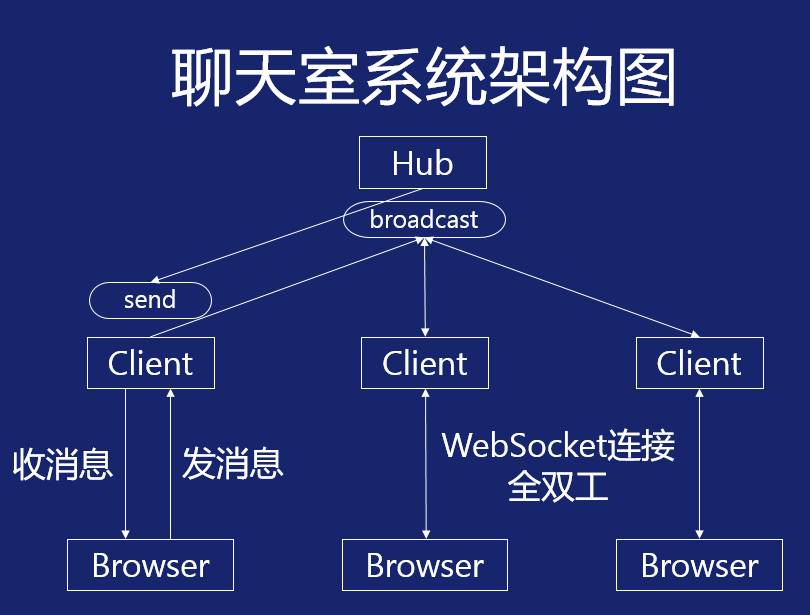

# 聊天室系统

## 聊天室系统架构图

## Hub
- Hub持有每一个Client的指针，broadcast管道里有数据时把它写入每一个Client的send管道中
- 注销Client时关闭Client的send管道

## Client
- 前端(Browser)请求建立WebSocket连接时，为这条WebSocket连接专门启一个协程，创建一个Client
- Client把前端发过来的数据写入Hub的broadcast管道
- Client把自身send管道里的数据写给前端
- Client跟前端的连接断开时请求从Hub那儿注销自己

## 前端
- 当打开浏览器页面时，前端会请求建立WebSocket连接
- 关闭浏览器页面时会主动关闭WebSocket连接

## 存活监测
- 当Hub发现Client的send管道写不进数据时，把Client注销掉
- Client给WebSocket连接设置一个读超时，并周期性地给前端发ping消息，如果没有收到pong消息则下一次的conn.read()会报出超时错误，此时Client关闭WebSocket连接
