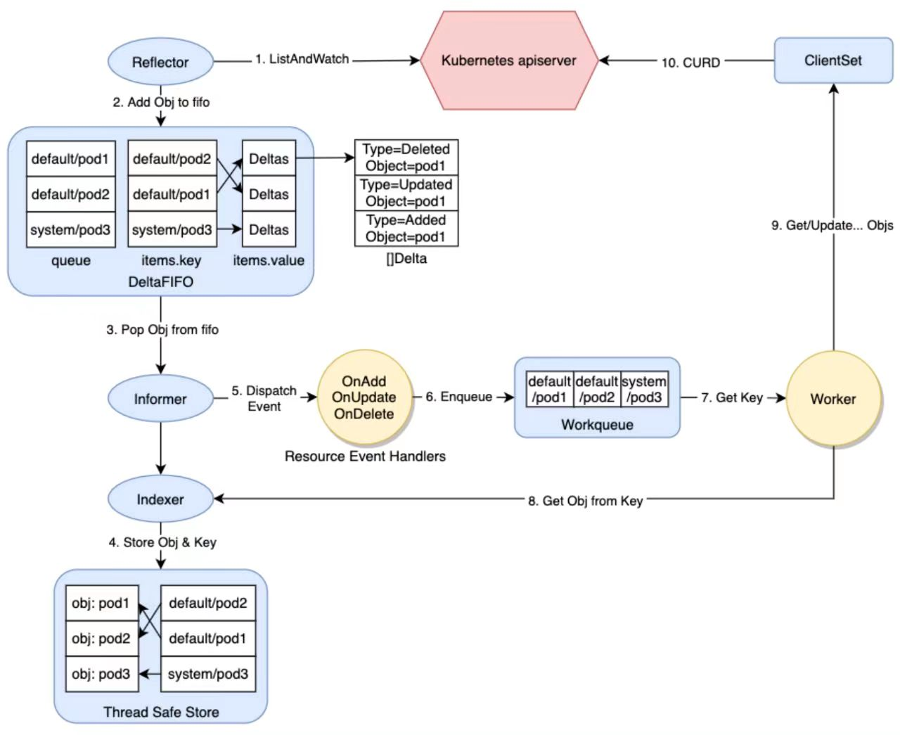

# client-go 源码分析之 workqueue

## 一、Client-go 源码分析

在深度使用Kubernetes时 难免会涉及Operator的开发，目前虽然已经有Kubebuilder/Operator SDK、controller-runtime等工具可以较好地屏蔽底层细节，但是不清楚底层原理会让我们在编码过程中心里没底。

比如自定义控制器重启时是否会重新收到所有相关Event，调谐的子资源是Deployment时相关Pod的变更是否会触发调谐逻辑等，很多细节问题会不停地跳出来。所以我们只有详细分析过client-go和Operator开发相关的各种组件的原理与源码后，才能对自己开发的自定义控制器行为知根知底，胸有成竹。

### 1. client-go 源码概览

client-go项目 是与 kube-apiserver 通信的 clients 的具体实现，其中包含很多相关工具包，例如 `kubernetes`包 就包含与 Kubernetes API 通信的各种 ClientSet，而 `tools/cache`包 则包含很多强大的编写控制器相关的组件。

所以接下来我们以自定义控制器的底层实现原理为线索，来分析client-go中相关模块的源码实现。

如图所示，我们在编写自定义控制器的过程中大致依赖于如下组件，其中圆形的是自定义控制器中需要编码的部分，其他椭圆和圆角矩形的是client-go提供的一些"工具"。



- client-go的源码入口在Kubernetes项目的 `staging/src/k8s.io/client-go` 中，先整体查看上面涉及的相关模块，然后逐个深入分析其实现。
  + Reflector：Reflector 从apiserver监听(watch)特定类型的资源，拿到变更通知后，将其丢到 DeltaFIFO队列 中。
  + Informer：Informer 从 DeltaFIFO 中弹出(pop)相应对象，然后通过 Indexer 将对象和索引丢到 本地cache中，再触发相应的事件处理函数(Resource Event Handlers)。
  + Indexer：Indexer 主要提供一个对象根据一定条件检索的能力，典型的实现是通过 namespace/name 来构造key，通过 Thread Safe Store 来存储对象。
  + WorkQueue：WorkQueue 一般使用的是延时队列实现，在Resource Event Handlers中会完成将对象的key放入WorkQueue的过程，然后在自己的逻辑代码里从WorkQueue中消费这些key。
  + ClientSet：ClientSet 提供的是资源的CURD能力，与apiserver交互。
  + Resource Event Handlers：一般在 Resource Event Handlers 中添加一些简单的过滤功能，判断哪些对象需要加到WorkQueue中进一步处理，对于需要加到WorkQueue中的对象，就提取其key，然后入队。
  + Worker：Worker指的是我们自己的业务代码处理过程，在这里可以直接收到WorkQueue中的任务，可以通过Indexer从本地缓存检索对象，通过ClientSet实现对象的增、删、改、查逻辑。

## 二、Client-go workqueue

WorkQueue一般使用延时队列来实现，在 Resource Event Handlers 中会完成将对象的key放入WorkQueue的过程，然后在自己的逻辑代码里从WorkQueue中消费这些key。

client-go 的 `util/workqueue`包 里主要有三个队列，分别是普通队列、延时队列和限速队列，后一个队列以前一个队列的实现为基础，层层添加新功能，下面按照 Queue、DelayingQueue、RateLimitingQueue 的顺序层层拨开来看各种队列是如何实现的。

- 在 `k8s.io/client-go/util/workqueue` 包下可以看到这样三个Go源文件：
  + queue.go
  + delaying_queue.go
  + rate_limiting_queue.go
  + 这三个文件分别对应三种队列实现，下面逐个对它们进行分析

### 1. 普通队列 Queue 的实现

**a. 表示Queue的接口和相应的实现结构体**

- 定义Queue的接口在queue.go中直接叫作Interface
```golang
	type Interface interface {
		Add(item interface{})                     // 添加一个元素
		Len() int                                 // 元素个数
		Get() (item interface{}, shutdown bool)   // 获取一个元素，第二个返回值和 channel 类似，标记队列是否关闭了
		Done(item interface{})                    // 标记一个元素已经处理完
		ShutDown()                                // 关闭队列
		ShutDownWithDrain()                       // 关闭队列，但是等待队列中元素处理完
		ShuttingDown() bool                       // 标记当前 channel 是否正在关闭
	}
```

- Interface的实现类型是Type，这个名字延续了用Interface表示interface的风格，里面的三个属性queue、dirty、processing都保存有元素(items)，但是含义有所不同
	+ queue：这是一个[ ]t类型，也就是一个切片，因为其有序，所以这里当作一个列表来存储元素的处理顺序。
	+ dirty：属于set类型，dirty就是一个集合，其中存储的是所有需要处理的元素，这些元素也会保存在queue中，但是集合中的元素是无序的，且集合的特性是其里面的元素具有唯一性。
	+ processing：也是一个集合，存放的是当前正在处理的元素，也就是说这个元素来自queue出队的元素，同时这个元素会被从dirty中删除。
```golang
	// Type is a work queue (see the package comment).
	type Type struct {
		// queue defines the order in which we will work on items. Every
		// element of queue should be in the dirty set and not in the
		// processing set.
		queue []t

		// dirty defines all of the items that need to be processed.
		dirty set

		// Things that are currently being processed are in the processing set.
		// These things may be simultaneously in the dirty set. When we finish
		// processing something and remove it from this set, we'll check if
		// it's in the dirty set, and if so, add it to the queue.
		processing set

		cond *sync.Cond

		shuttingDown bool
		drain        bool

		metrics queueMetrics

		unfinishedWorkUpdatePeriod time.Duration
		clock                      clock.WithTicker
	}

	// set类型的定义
	// set类型实现了has()、insert()、delete()、len()几个方法，用于支持集合类型的基本操作
	type empty struct{}
	type t interface{}
	type set map[t]empty

	func (s set) has(item t) bool {
		_, exists := s[item]
		return exists
	}

	func (s set) insert(item t) {
		s[item] = empty{}
	}

	func (s set) delete(item t) {
		delete(s, item)
	}

	func (s set) len() int {
		return len(s)
	}
```

**b.Queue.Add()方法的实现**

- Add()方法用于标记一个新的元素需要被处理
```golang
	// Add marks item as needing processing.
	func (q *Type) Add(item interface{}) {
		q.cond.L.Lock()
		defer q.cond.L.Unlock()
		if q.shuttingDown {                   // 如果queue正在被关闭，则返回
			return
		}
		if q.dirty.has(item) {                // 如果dirty set中已经有了该元素，则返回
			return
		}

		q.metrics.add(item)

		q.dirty.insert(item)                  // 添加到dirty set中
		if q.processing.has(item) {           // 如果正在被处理，则返回
			return
		}

		q.queue = append(q.queue, item)
		q.cond.Signal()                       // 通知getter有新元素到来
	}
```

**c.Queue.Get()方法的实现**

- Get()方法在获取不到元素的时候会阻塞，直到有一个元素可以被返回
```golang
	// Get blocks until it can return an item to be processed. If shutdown = true,
	// the caller should end their goroutine. You must call Done with item when you
	// have finished processing it.
	func (q *Type) Get() (item interface{}, shutdown bool) {
		q.cond.L.Lock()
		defer q.cond.L.Unlock()
		// 如果 q.queue 为空，并且没有正在关闭，则等待下一个元素的到来
		for len(q.queue) == 0 && !q.shuttingDown {
			q.cond.Wait()
		}
		// 这时如果 q.queue 长度还是为0，则说明 q.shuttingDown 为 true，所以直接返回
		if len(q.queue) == 0 { 
			// We must be shutting down.
			return nil, true
		}

		item = q.queue[0]          // 获取 q.queue 第一个元素
		// The underlying array still exists and reference this object, so the object will not be garbage collected.
		q.queue[0] = nil           // 这里的nil赋值是为了让底层数组不再引用该元素对象，从而使这个对象可以被GC
		q.queue = q.queue[1:]      // 更新 q.queue

		q.metrics.get(item)

		// 将刚才获取到的q.queue第一个元素对象，放到 processing 集合中
		q.processing.insert(item)
		q.dirty.delete(item)       // 在 dirty 集合中删除该对象

		return item, false         // 返回元素
	}
```

**d.Queue.Done()方法的实现**

- Done()方法的作用是标记一个元素已经处理完成
```golang
	// Done marks item as done processing, and if it has been marked as dirty again
	// while it was being processed, it will be re-added to the queue for
	// re-processing.
	func (q *Type) Done(item interface{}) {
		q.cond.L.Lock()
		defer q.cond.L.Unlock()

		q.metrics.done(item)

		// 从 processing集合中删除该元素
		q.processing.delete(item)
		// 如果 dirty集合中，还存在该元素，则说明还需要再次处理，重新加入 q.queue中
		if q.dirty.has(item) {
			q.queue = append(q.queue, item)
			q.cond.Signal()                     // 通知getter有新元素
		} else if q.processing.len() == 0 {
			q.cond.Signal()
		}
	}
```

### 2. 延时队列 DelayingQueue 的实现

**a.表示DelayingQueue的接口和相应的实现结构体**

- 定义 DelayingQueue 的接口在 delaying_queue.go 源文件中，名字和 Queue 所使用的 Interface 很对称，叫作 DelayingInterface
	- 可以看到 DelayingInterface接口 中嵌套了一个表示 Queue的Interface，也就是说 DelayingInterface接口 包含 Interface接口 的所有方法声明
	- 另外相比于 Queue，这里多了一个 AddAfter() 方法，即 延时添加元素
	- DelayingQueueConfig 通过指定可选配置以自定义 DelayingInterface 接口。
```golang
	// DelayingInterface is an Interface that can Add an item at a later time. This makes it easier to
	// requeue items after failures without ending up in a hot-loop.
	type DelayingInterface interface {
		Interface
		// AddAfter adds an item to the workqueue after the indicated duration has passed
		AddAfter(item interface{}, duration time.Duration)
	}

	// delayingType wraps an Interface and provides delayed re-enquing
	type delayingType struct {
		// 嵌套普通队列 Queue
		Interface

		// 计时器
		// clock tracks time for delayed firing
		clock clock.Clock

		// stopCh lets us signal a shutdown to the waiting loop
		stopCh chan struct{}
		// stopOnce guarantees we only signal shutdown a single time
		stopOnce sync.Once

		// 默认10秒的心跳，后面用在一个大循环里，避免没有新元素时一直阻塞
		// heartbeat ensures we wait no more than maxWait before firing
		heartbeat clock.Ticker

		// waitingForAddCh is a buffered channel that feeds waitingForAdd
		waitingForAddCh chan *waitFor

		// metrics counts the number of retries
		metrics retryMetrics
	}

	// DelayingQueueConfig specifies optional configurations to customize a DelayingInterface.
	type DelayingQueueConfig struct {
		// Name for the queue. If unnamed, the metrics will not be registered.
		Name string

		// MetricsProvider optionally allows specifying a metrics provider to use for the queue
		// instead of the global provider.
		MetricsProvider MetricsProvider

		// Clock optionally allows injecting a real or fake clock for testing purposes.
		Clock clock.WithTicker

		// Queue optionally allows injecting custom queue Interface instead of the default one.
		Queue Interface
	}
```

**b.waitFor对象**

- waitFor的实现
	- 保存 备添加到队列中的数据 和 应该被加入队列的时间
```golang
	// waitFor holds the data to add and the time it should be added
	type waitFor struct {
		// 准备添加到队列中的数据
		data    t
		// 应该被加入队列的时间
		readyAt time.Time
		// index in the priority queue (heap)
		index int
	}
```

- 用最小堆的方式来实现，一个waitFor的优先级队列，这个 waitForPriorityQueue 类型实现了heap.Interface接口。
```golang
	// waitForPriorityQueue implements a priority queue for waitFor items.
	//
	// waitForPriorityQueue implements heap.Interface. The item occurring next in
	// time (i.e., the item with the smallest readyAt) is at the root (index 0).
	// Peek returns this minimum item at index 0. Pop returns the minimum item after
	// it has been removed from the queue and placed at index Len()-1 by
	// container/heap. Push adds an item at index Len(), and container/heap
	// percolates it into the correct location.
	type waitForPriorityQueue []*waitFor

	func (pq waitForPriorityQueue) Len() int {
		return len(pq)
	}
	func (pq waitForPriorityQueue) Less(i, j int) bool {
		return pq[i].readyAt.Before(pq[j].readyAt)
	}
	func (pq waitForPriorityQueue) Swap(i, j int) {
		pq[i], pq[j] = pq[j], pq[i]
		pq[i].index = i
		pq[j].index = j
	}

	// Push adds an item to the queue. Push should not be called directly; instead,
	// use `heap.Push`.
	func (pq *waitForPriorityQueue) Push(x interface{}) {
		n := len(*pq)
		item := x.(*waitFor)
		item.index = n
		*pq = append(*pq, item)
	}

	// Pop removes an item from the queue. Pop should not be called directly;
	// instead, use `heap.Pop`.
	func (pq *waitForPriorityQueue) Pop() interface{} {
		n := len(*pq)
		item := (*pq)[n-1]
		item.index = -1
		*pq = (*pq)[0:(n - 1)]
		return item
	}

	// Peek returns the item at the beginning of the queue, without removing the
	// item or otherwise mutating the queue. It is safe to call directly.
	func (pq waitForPriorityQueue) Peek() interface{} {
		return pq[0]
	}
```

**c.NewDelayingQueue**

- DelayingQueue的几个New函数
	- 统一调用了 `NewDelayingQueueWithConfig()`
```golang
	// NewDelayingQueue constructs a new workqueue with delayed queuing ability.
	// NewDelayingQueue does not emit metrics. For use with a MetricsProvider, please use
	// NewDelayingQueueWithConfig instead and specify a name.
	func NewDelayingQueue() DelayingInterface {
		return NewDelayingQueueWithConfig(DelayingQueueConfig{})
	}

	// NewDelayingQueueWithCustomQueue constructs a new workqueue with ability to
	// inject custom queue Interface instead of the default one
	// Deprecated: Use NewDelayingQueueWithConfig instead.
	func NewDelayingQueueWithCustomQueue(q Interface, name string) DelayingInterface {
		return NewDelayingQueueWithConfig(DelayingQueueConfig{
			Name:  name,
			Queue: q,
		})
	}

	// NewNamedDelayingQueue constructs a new named workqueue with delayed queuing ability.
	// Deprecated: Use NewDelayingQueueWithConfig instead.
	func NewNamedDelayingQueue(name string) DelayingInterface {
		return NewDelayingQueueWithConfig(DelayingQueueConfig{Name: name})
	}

	// NewDelayingQueueWithCustomClock constructs a new named workqueue
	// with ability to inject real or fake clock for testing purposes.
	// Deprecated: Use NewDelayingQueueWithConfig instead.
	func NewDelayingQueueWithCustomClock(clock clock.WithTicker, name string) DelayingInterface {
		return NewDelayingQueueWithConfig(DelayingQueueConfig{
			Name:  name,
			Clock: clock,
		})
	}

	// NewDelayingQueueWithConfig constructs a new workqueue with options to
	// customize different properties.
	func NewDelayingQueueWithConfig(config DelayingQueueConfig) DelayingInterface {
		if config.Clock == nil {
			config.Clock = clock.RealClock{}
		}

		if config.Queue == nil {
			config.Queue = NewWithConfig(QueueConfig{
				Name:            config.Name,
				MetricsProvider: config.MetricsProvider,
				Clock:           config.Clock,
			})
		}

		return newDelayingQueue(config.Clock, config.Queue, config.Name, config.MetricsProvider)
	}

	// maxWait keeps a max bound on the wait time. It's just insurance against weird things happening.
	// Checking the queue every 10 seconds isn't expensive and we know that we'll never end up with an
	// expired item sitting for more than 10 seconds.
	const maxWait = 10 * time.Second

	func newDelayingQueue(clock clock.WithTicker, q Interface, name string, provider MetricsProvider) *delayingType {
		ret := &delayingType{
			Interface:       q,
			clock:           clock,
			heartbeat:       clock.NewTicker(maxWait),
			stopCh:          make(chan struct{}),
			waitingForAddCh: make(chan *waitFor, 1000),
			metrics:         newRetryMetrics(name, provider),
		}

		go ret.waitingLoop()
		return ret
	}
```

**d.waitingLoop()方法**

- waitingLoop()方法是延时队列实现的核心逻辑
```golang
	// waitingLoop runs until the workqueue is shutdown and keeps a check on the list of items to be added.
	func (q *delayingType) waitingLoop() {
		defer utilruntime.HandleCrash()

		// Make a placeholder channel to use when there are no items in our list
		never := make(<-chan time.Time)

		// Make a timer that expires when the item at the head of the waiting queue is ready
		var nextReadyAtTimer clock.Timer

		// 构造优先级队列
		waitingForQueue := &waitForPriorityQueue{}
		heap.Init(waitingForQueue)

		// 处理重复添加
		waitingEntryByData := map[t]*waitFor{}

		for {
			if q.Interface.ShuttingDown() {
				return
			}

			now := q.clock.Now()

			// Add ready entries
			for waitingForQueue.Len() > 0 {
				// 获取第一个元素
				entry := waitingForQueue.Peek().(*waitFor)
				// 判断是否达到应该被加入队列的时间
				if entry.readyAt.After(now) {
					break
				}

				// 满足时间要求，pop出第一个元素
				entry = heap.Pop(waitingForQueue).(*waitFor)
				// 将数据添加到延迟队列中
				q.Add(entry.data)
				// 在 map(waitingEntryByData) 中删除已经添加到延迟队列中的元素
				delete(waitingEntryByData, entry.data)
			}

			// Set up a wait for the first item's readyAt (if one exists)
			// 如果队列中有元素，就用第一个元素的等待时间初始化计时器；如果队列为空，则一直等待
			nextReadyAt := never
			if waitingForQueue.Len() > 0 {
				if nextReadyAtTimer != nil {
					nextReadyAtTimer.Stop()
				}
				entry := waitingForQueue.Peek().(*waitFor)
				nextReadyAtTimer = q.clock.NewTimer(entry.readyAt.Sub(now))
				nextReadyAt = nextReadyAtTimer.C()
			}

			select {
			case <-q.stopCh:
				return

			case <-q.heartbeat.C():
				// continue the loop, which will add ready items
				// 心跳时间(maxWait)是10s，到了就继续下一轮循环

			case <-nextReadyAt:
				// continue the loop, which will add ready items
				// 第一个元素的等待时间到了，继续下一轮循环

			// waitingForAddCh 收到新的元素
			case waitEntry := <-q.waitingForAddCh:
				// 如果时间没到，就添加进延时队列；如果时间到了，就直接添加进普通队列
				if waitEntry.readyAt.After(q.clock.Now()) {
					insert(waitingForQueue, waitingEntryByData, waitEntry)
				} else {
					q.Add(waitEntry.data)
				}

				// 继续处理 waitingForAddCh 中元素
				drained := false
				for !drained {
					select {
					case waitEntry := <-q.waitingForAddCh:
						if waitEntry.readyAt.After(q.clock.Now()) {
							insert(waitingForQueue, waitingEntryByData, waitEntry)
						} else {
							q.Add(waitEntry.data)
						}
					default:
						drained = true
					}
				}
			}
		}
	}

	// insert adds the entry to the priority queue, or updates the readyAt if it already exists in the queue
	func insert(q *waitForPriorityQueue, knownEntries map[t]*waitFor, entry *waitFor) {
		// if the entry already exists, update the time only if it would cause the item to be queued sooner
		existing, exists := knownEntries[entry.data]
		if exists {
			if existing.readyAt.After(entry.readyAt) {
				existing.readyAt = entry.readyAt
				heap.Fix(q, existing.index)
			}

			return
		}

		heap.Push(q, entry)
		knownEntries[entry.data] = entry
	}
```

**e.AddAfter()方法**

- AddAfter()方法的作用是在指定的延时时长到达之后，在work queue中添加一个元素
```golang
	// AddAfter adds the given item to the work queue after the given delay
	func (q *delayingType) AddAfter(item interface{}, duration time.Duration) {
		// don't add if we're already shutting down
		if q.ShuttingDown() {
			return
		}

		q.metrics.retry()

		// immediately add things with no delay
		if duration <= 0 {
			q.Add(item)
			return
		}

		select {
		case <-q.stopCh:
			// unblock if ShutDown() is called
		case q.waitingForAddCh <- &waitFor{data: item, readyAt: q.clock.Now().Add(duration)}:
		}
	}
```

### 3. 限速队列 RateLimitingQueue 的实现

**a.表示RateLimitingQueue的接口和相应的实现结构体**

- RateLimitingQueue 对应的接口叫作 RateLimitingInterface，源码是在 rate_limiting_queue.go 中
	- 实现RateLimitingInterface的结构体是rateLimitingType
```golang
	// RateLimitingInterface is an interface that rate limits items being added to the queue.
	type RateLimitingInterface interface {
		// 和延时队列中内嵌了普通队列一样，限速队列中内嵌了延时队列
		DelayingInterface

		// AddRateLimited adds an item to the workqueue after the rate limiter says it's ok
		AddRateLimited(item interface{})

		// Forget indicates that an item is finished being retried.  Doesn't matter whether it's for perm failing
		// or for success, we'll stop the rate limiter from tracking it.  This only clears the `rateLimiter`, you
		// still have to call `Done` on the queue.
		Forget(item interface{})

		// NumRequeues returns back how many times the item was requeued
		NumRequeues(item interface{}) int
	}

	type RateLimitingQueueConfig struct {
		// Name for the queue. If unnamed, the metrics will not be registered.
		Name string

		// MetricsProvider optionally allows specifying a metrics provider to use for the queue
		// instead of the global provider.
		MetricsProvider MetricsProvider

		// Clock optionally allows injecting a real or fake clock for testing purposes.
		Clock clock.WithTicker

		// DelayingQueue optionally allows injecting custom delaying queue DelayingInterface instead of the default one.
		DelayingQueue DelayingInterface
	}

	// rateLimitingType wraps an Interface and provides rateLimited re-enquing
	type rateLimitingType struct {
		DelayingInterface

		rateLimiter RateLimiter
	}
```

**b.RateLimitingQueue的New函数**

- RateLimitingQueue 的 New 函数 `NewRateLimitingQueue`
```golang
	// NewRateLimitingQueue constructs a new workqueue with rateLimited queuing ability
	// Remember to call Forget!  If you don't, you may end up tracking failures forever.
	// NewRateLimitingQueue does not emit metrics. For use with a MetricsProvider, please use
	// NewRateLimitingQueueWithConfig instead and specify a name.
	func NewRateLimitingQueue(rateLimiter RateLimiter) RateLimitingInterface {
		return NewRateLimitingQueueWithConfig(rateLimiter, RateLimitingQueueConfig{})
	}

	// NewNamedRateLimitingQueue constructs a new named workqueue with rateLimited queuing ability.
	// Deprecated: Use NewRateLimitingQueueWithConfig instead.
	func NewNamedRateLimitingQueue(rateLimiter RateLimiter, name string) RateLimitingInterface {
		return NewRateLimitingQueueWithConfig(rateLimiter, RateLimitingQueueConfig{
			Name: name,
		})
	}

	// NewRateLimitingQueueWithDelayingInterface constructs a new named workqueue with rateLimited queuing ability
	// with the option to inject a custom delaying queue instead of the default one.
	// Deprecated: Use NewRateLimitingQueueWithConfig instead.
	func NewRateLimitingQueueWithDelayingInterface(di DelayingInterface, rateLimiter RateLimiter) RateLimitingInterface {
		return NewRateLimitingQueueWithConfig(rateLimiter, RateLimitingQueueConfig{
			DelayingQueue: di,
		})
	}

	// NewRateLimitingQueueWithConfig constructs a new workqueue with rateLimited queuing ability
	// with options to customize different properties.
	// Remember to call Forget!  If you don't, you may end up tracking failures forever.
	func NewRateLimitingQueueWithConfig(rateLimiter RateLimiter, config RateLimitingQueueConfig) RateLimitingInterface {
		if config.Clock == nil {
			config.Clock = clock.RealClock{}
		}

		if config.DelayingQueue == nil {
			config.DelayingQueue = NewDelayingQueueWithConfig(DelayingQueueConfig{
				Name:            config.Name,
				MetricsProvider: config.MetricsProvider,
				Clock:           config.Clock,
			})
		}

		return &rateLimitingType{
			DelayingInterface: config.DelayingQueue,
			rateLimiter:       rateLimiter,
		}
	}
```

**c.RateLimiter**

- RateLimiter 表示一个限速器，定义在同一个包的 default_rate_limiters.go 源文件中
```golang
	type RateLimiter interface {
		// When gets an item and gets to decide how long that item should wait
		When(item interface{}) time.Duration
		// Forget indicates that an item is finished being retried.  Doesn't matter whether it's for failing
		// or for success, we'll stop tracking it
		Forget(item interface{})
		// NumRequeues returns back how many failures the item has had
		NumRequeues(item interface{}) int
	}
```

- `RateLimiter` 接口有5个实现，分别是
	+ `BucketRateLimiter`
	+ `ItemExponentialFailureRateLimiter`
	+ `ItemFastSlowRateLimiter`
	+ `MaxOfRateLimiter`
	+ `WithMaxWaitRateLimiter`

- `BucketRateLimiter`
	- 通过Go语言标准库的 `golang.org/x/time/rate.Limiter`包实现
	- BucketRateLimiter实例化的时候，比如传递一个`rate.NewLimiter(rate.Limit(10),100)`进去，表示令牌桶里最多有100个令牌，每秒发放10个令牌
```golang
	// DefaultControllerRateLimiter is a no-arg constructor for a default rate limiter for a workqueue.  It has
	// both overall and per-item rate limiting.  The overall is a token bucket and the per-item is exponential
	func DefaultControllerRateLimiter() RateLimiter {
		return NewMaxOfRateLimiter(
			NewItemExponentialFailureRateLimiter(5*time.Millisecond, 1000*time.Second),
			// 10 qps, 100 bucket size.  This is only for retry speed and its only the overall factor (not per item)
			&BucketRateLimiter{Limiter: rate.NewLimiter(rate.Limit(10), 100)},
		)
	}

	// BucketRateLimiter adapts a standard bucket to the workqueue ratelimiter API
	type BucketRateLimiter struct {
		// "golang.org/x/time/rate"
		*rate.Limiter
	}

	var _ RateLimiter = &BucketRateLimiter{}

	func (r *BucketRateLimiter) When(item interface{}) time.Duration {
		// 等待多久后，给当前元素发放一个令牌
		return r.Limiter.Reserve().Delay()
	}

	func (r *BucketRateLimiter) NumRequeues(item interface{}) int {
		return 0
	}

	func (r *BucketRateLimiter) Forget(item interface{}) {
	}

	// NewLimiter returns a new Limiter that allows events up to rate r and permits
	// bursts of at most b tokens.
	func NewLimiter(r Limit, b int) *Limiter {
		return &Limiter{
			limit: r,
			burst: b,
		}
	}

	type Limiter struct {
		mu     sync.Mutex
		limit  Limit
		burst  int
		tokens float64
		// last is the last time the limiter's tokens field was updated
		last time.Time
		// lastEvent is the latest time of a rate-limited event (past or future)
		lastEvent time.Time
	}
```

- `ItemExponentialFailureRateLimiter`
	- 这个限速器从名字上大概就能猜到是失败次数越多，限速越长，而且是呈指数级增长的一种限速器
```golang
	// dealing with max failures and expiration are up to the caller
	type ItemExponentialFailureRateLimiter struct {
		failuresLock sync.Mutex
		failures     map[interface{}]int

		baseDelay time.Duration
		maxDelay  time.Duration
	}

	var _ RateLimiter = &ItemExponentialFailureRateLimiter{}

	func NewItemExponentialFailureRateLimiter(baseDelay time.Duration, maxDelay time.Duration) RateLimiter {
		return &ItemExponentialFailureRateLimiter{
			failures:  map[interface{}]int{},
			baseDelay: baseDelay,
			maxDelay:  maxDelay,
		}
	}

	func DefaultItemBasedRateLimiter() RateLimiter {
		return NewItemExponentialFailureRateLimiter(time.Millisecond, 1000*time.Second)
	}

	func (r *ItemExponentialFailureRateLimiter) When(item interface{}) time.Duration {
		r.failuresLock.Lock()
		defer r.failuresLock.Unlock()

		exp := r.failures[item]
		r.failures[item] = r.failures[item] + 1  // 失败次数加1

		// The backoff is capped such that 'calculated' value never overflows.
		// 每调用一次，exp加1，对应到这里 2^n 指数爆炸
		backoff := float64(r.baseDelay.Nanoseconds()) * math.Pow(2, float64(exp))
		// 如果超过了最大整型，就返回最大延时，不然后面的时间转换会溢出
		if backoff > math.MaxInt64 {
			// 如果超过最大延时，则返回最大延时
			return r.maxDelay
		}

		calculated := time.Duration(backoff)
		if calculated > r.maxDelay {
			return r.maxDelay
		}

		return calculated
	}

	func (r *ItemExponentialFailureRateLimiter) NumRequeues(item interface{}) int {
		r.failuresLock.Lock()
		defer r.failuresLock.Unlock()

		return r.failures[item]
	}

	func (r *ItemExponentialFailureRateLimiter) Forget(item interface{}) {
		r.failuresLock.Lock()
		defer r.failuresLock.Unlock()

		delete(r.failures, item)
	}
```

- `ItemFastSlowRateLimiter` 快慢限速器
	- 快慢指的是定义一个阈值，达到阈值之前快速重试，超过了就慢慢重试
```golang
	// ItemFastSlowRateLimiter does a quick retry for a certain number of attempts, then a slow retry after that
	type ItemFastSlowRateLimiter struct {
		failuresLock sync.Mutex
		failures     map[interface{}]int

		maxFastAttempts int                  // 快速重试的次数
		fastDelay       time.Duration        // 快重试的间隔
		slowDelay       time.Duration        // 慢重试的间隔
	}

	var _ RateLimiter = &ItemFastSlowRateLimiter{}

	func NewItemFastSlowRateLimiter(fastDelay, slowDelay time.Duration, maxFastAttempts int) RateLimiter {
		return &ItemFastSlowRateLimiter{
			failures:        map[interface{}]int{},
			fastDelay:       fastDelay,
			slowDelay:       slowDelay,
			maxFastAttempts: maxFastAttempts,
		}
	}

	func (r *ItemFastSlowRateLimiter) When(item interface{}) time.Duration {
		r.failuresLock.Lock()
		defer r.failuresLock.Unlock()

		// 标识重试次数 + 1
		r.failures[item] = r.failures[item] + 1

		// 如果快重试次数没有用完，则返回fastDelay
		if r.failures[item] <= r.maxFastAttempts {
			return r.fastDelay
		}

		return r.slowDelay
	}

	func (r *ItemFastSlowRateLimiter) NumRequeues(item interface{}) int {
		r.failuresLock.Lock()
		defer r.failuresLock.Unlock()

		return r.failures[item]
	}

	func (r *ItemFastSlowRateLimiter) Forget(item interface{}) {
		r.failuresLock.Lock()
		defer r.failuresLock.Unlock()

		delete(r.failures, item)
	}
```

- `MaxOfRateLimiter` 
	- 这个限速器是通过维护多个限速器列表，然后返回其中限速最严格的一个延时
```golang
	// MaxOfRateLimiter calls every RateLimiter and returns the worst case response
	// When used with a token bucket limiter, the burst could be apparently exceeded in cases where particular items
	// were separately delayed a longer time.
	type MaxOfRateLimiter struct {
		limiters []RateLimiter
	}

	func NewMaxOfRateLimiter(limiters ...RateLimiter) RateLimiter {
		return &MaxOfRateLimiter{limiters: limiters}
	}

	func (r *MaxOfRateLimiter) When(item interface{}) time.Duration {
		ret := time.Duration(0)
		for _, limiter := range r.limiters {
			curr := limiter.When(item)
			if curr > ret {
				ret = curr
			}
		}

		return ret
	}

	func (r *MaxOfRateLimiter) NumRequeues(item interface{}) int {
		ret := 0
		for _, limiter := range r.limiters {
			curr := limiter.NumRequeues(item)
			if curr > ret {
				ret = curr
			}
		}

		return ret
	}

	func (r *MaxOfRateLimiter) Forget(item interface{}) {
		for _, limiter := range r.limiters {
			limiter.Forget(item)
		}
	}
```

- WithMaxWaitRateLimiter
	- 在其他限速器上包装一个最大延迟的属性，如果到了最大延时，则直接返回
```golang
	// WithMaxWaitRateLimiter have maxDelay which avoids waiting too long
	type WithMaxWaitRateLimiter struct {
		limiter  RateLimiter
		maxDelay time.Duration
	}

	func NewWithMaxWaitRateLimiter(limiter RateLimiter, maxDelay time.Duration) RateLimiter {
		return &WithMaxWaitRateLimiter{limiter: limiter, maxDelay: maxDelay}
	}

	func (w WithMaxWaitRateLimiter) When(item interface{}) time.Duration {
		delay := w.limiter.When(item)
		if delay > w.maxDelay {
			return w.maxDelay
		}

		return delay
	}

	func (w WithMaxWaitRateLimiter) Forget(item interface{}) {
		w.limiter.Forget(item)
	}

	func (w WithMaxWaitRateLimiter) NumRequeues(item interface{}) int {
		return w.limiter.NumRequeues(item)
	}
```

**d.RateLimitingQueue的限速实现**

- 可以看到限速队列的实现基本由内部的延时队列提供的功能和包装的限速器提供的功能组合而来
```golang
	// AddRateLimited AddAfter's the item based on the time when the rate limiter says it's ok
	func (q *rateLimitingType) AddRateLimited(item interface{}) {
		// 内部存了一个延时队列，通过限速器计算出一个等待时间，然后传给延时队列
		q.DelayingInterface.AddAfter(item, q.rateLimiter.When(item))
	}

	func (q *rateLimitingType) NumRequeues(item interface{}) int {
		return q.rateLimiter.NumRequeues(item)
	}

	func (q *rateLimitingType) Forget(item interface{}) {
		q.rateLimiter.Forget(item)
	}
```