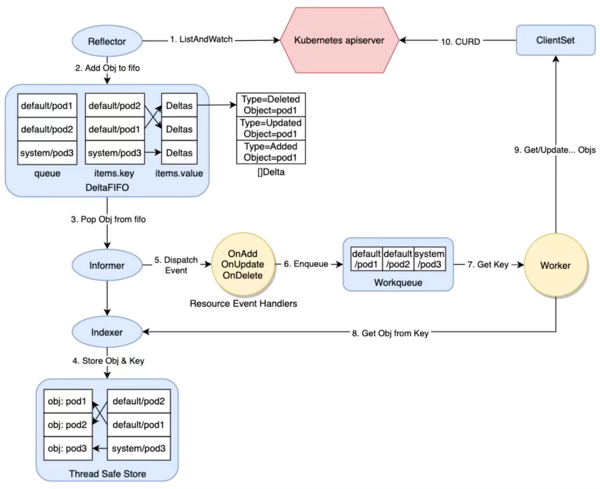

# client-go 源码分析之 DeltaFIFO

## 一、Client-go 源码分析

### 1. client-go 源码概览

client-go项目 是与 kube-apiserver 通信的 clients 的具体实现，其中包含很多相关工具包，例如 `kubernetes`包 就包含与 Kubernetes API 通信的各种 ClientSet，而 `tools/cache`包 则包含很多强大的编写控制器相关的组件。

所以接下来我们以自定义控制器的底层实现原理为线索，来分析 client-go 中相关模块的源码实现。

如图所示，在编写自定义控制器的过程中大致依赖于如下组件，其中圆形的是自定义控制器中需要编码的部分，其他椭圆和圆角矩形的是 client-go 提供的一些"工具"。



- client-go 的源码入口在 Kubernetes 项目的 `staging/src/k8s.io/client-go` 中，先整体查看上面涉及的相关模块，然后逐个深入分析其实现。
  + `Reflector` 从 apiserver 监听(watch)特定类型的资源，拿到变更通知后，将其丢到 DeltaFIFO 队列中
  + `Informer` 从 DeltaFIFO 中弹出(pop)相应对象，然后通过 Indexer 将对象和索引丢到本地 cache 中，再触发相应的事件处理函数(Resource Event Handlers)
  + `Indexer` 主要提供一个对象根据一定条件检索的能力，典型的实现是通过 namespace/name 来构造 key，通过 Thread Safe Store 来存储对象
  + `WorkQueue` 一般使用的是延时队列实现，在 Resource Event Handlers 中会完成将对象的 key 放入 WorkQueue 的过程，然后在自己的逻辑代码里从 WorkQueue 中消费这些 key
  + `ClientSet` 提供的是资源的 CURD 能力，与 apiserver 交互
  + `Resource Event Handlers` 一般在 Resource Event Handlers 中添加一些简单的过滤功能，判断哪些对象需要加到 WorkQueue 中进一步处理，对于需要加到 WorkQueue 中的对象，就提取其 key，然后入队
  + `Worker` 指的是我们自己的业务代码处理过程，在这里可以直接收到 WorkQueue 中的任务，可以通过 Indexer 从本地缓存检索对象，通过 ClientSet 实现对象的增、删、改、查逻辑


## 二、Client-go DeltaFIFO

`DeltaFIFO` 也是一个重要组件，其相关代码在 `k8s.io/client-go/tools/cache`包 中

### 1. Queue 接口与 DeltaFIFO 的实现

**a. Queue 和 Store 接口**

- 在 fifo.go 中定义了一个 `Queue` 接口，`DeltaFIFO` 就是 `Queue`接口的一个实现
```golang
	// Queue extends Store with a collection of Store keys to "process".
	// Every Add, Update, or Delete may put the object's key in that collection.
	// A Queue has a way to derive the corresponding key given an accumulator.
	// A Queue can be accessed concurrently from multiple goroutines.
	// A Queue can be "closed", after which Pop operations return an error.
	type Queue interface {
		Store

		// Pop 会阻塞，直到有一个元素可以被pop出来，或者队列关闭
		// Pop blocks until there is at least one key to process or the
		// Queue is closed.  In the latter case Pop returns with an error.
		// In the former case Pop atomically picks one key to process,
		// removes that (key, accumulator) association from the Store, and
		// processes the accumulator.  Pop returns the accumulator that
		// was processed and the result of processing.  The PopProcessFunc
		// may return an ErrRequeue{inner} and in this case Pop will (a)
		// return that (key, accumulator) association to the Queue as part
		// of the atomic processing and (b) return the inner error from
		// Pop.
		Pop(PopProcessFunc) (interface{}, error)

		// AddIfNotPresent puts the given accumulator into the Queue (in
		// association with the accumulator's key) if and only if that key
		// is not already associated with a non-empty accumulator.
		AddIfNotPresent(interface{}) error

		// HasSynced returns true if the first batch of keys have all been
		// popped.  The first batch of keys are those of the first Replace
		// operation if that happened before any Add, AddIfNotPresent,
		// Update, or Delete; otherwise the first batch is empty.
		HasSynced() bool

		// Close the queue
		Close()
	}

	// PopProcessFunc is passed to Pop() method of Queue interface.
	// It is supposed to process the accumulator popped from the queue.
	type PopProcessFunc func(obj interface{}, isInInitialList bool) error
```

- `Queue` 接口内嵌套了一个 `Store` 接口，`Store` 定义在 store.go中
```golang
	// Store is a generic object storage and processing interface.  A
	// Store holds a map from string keys to accumulators, and has
	// operations to add, update, and delete a given object to/from the
	// accumulator currently associated with a given key.  A Store also
	// knows how to extract the key from a given object, so many operations
	// are given only the object.
	//
	// In the simplest Store implementations each accumulator is simply
	// the last given object, or empty after Delete, and thus the Store's
	// behavior is simple storage.
	//
	// Reflector knows how to watch a server and update a Store.  This
	// package provides a variety of implementations of Store.
	type Store interface {

		// Add adds the given object to the accumulator associated with the given object's key
		Add(obj interface{}) error

		// Update updates the given object in the accumulator associated with the given object's key
		Update(obj interface{}) error

		// Delete deletes the given object from the accumulator associated with the given object's key
		Delete(obj interface{}) error

		// List returns a list of all the currently non-empty accumulators
		List() []interface{}

		// ListKeys returns a list of all the keys currently associated with non-empty accumulators
		ListKeys() []string

		// Get returns the accumulator associated with the given object's key
		Get(obj interface{}) (item interface{}, exists bool, err error)

		// GetByKey returns the accumulator associated with the given key
		GetByKey(key string) (item interface{}, exists bool, err error)

		// Replace will delete the contents of the store, using instead the
		// given list. Store takes ownership of the list, you should not reference
		// it after calling this function.
		Replace([]interface{}, string) error

		// Resync is meaningless in the terms appearing here but has
		// meaning in some implementations that have non-trivial
		// additional behavior (e.g., DeltaFIFO).
		Resync() error
	}

	// KeyFunc knows how to make a key from an object. Implementations should be deterministic.
	type KeyFunc func(obj interface{}) (string, error)
```

**b. DeltaFIFO 结构体**

- `DeltaFIFO` 结构体
```golang
	// DeltaFIFO is a producer-consumer queue, where a Reflector is
	// intended to be the producer, and the consumer is whatever calls
	// the Pop() method.
	//
	// DeltaFIFO solves this use case:
	//   - You want to process every object change (delta) at most once.
	//   - When you process an object, you want to see everything
	//     that's happened to it since you last processed it.
	//   - You want to process the deletion of some of the objects.
	//   - You might want to periodically reprocess objects.
	//
	// DeltaFIFO's Pop(), Get(), and GetByKey() methods return
	// interface{} to satisfy the Store/Queue interfaces, but they
	// will always return an object of type Deltas. List() returns
	// the newest object from each accumulator in the FIFO.
	//
	// A DeltaFIFO's knownObjects KeyListerGetter provides the abilities
	// to list Store keys and to get objects by Store key.  The objects in
	// question are called "known objects" and this set of objects
	// modifies the behavior of the Delete, Replace, and Resync methods
	// (each in a different way).
	type DeltaFIFO struct {
		// lock/cond protects access to 'items' and 'queue'.
		lock sync.RWMutex
		cond sync.Cond

		// `items` maps a key to a Deltas.
		// Each such Deltas has at least one Delta.
		items map[string]Deltas

		// `queue` maintains FIFO order of keys for consumption in Pop().
		// There are no duplicates in `queue`.
		// A key is in `queue` if and only if it is in `items`.
		// queue 中没有重复元素，同上面items中元素保持一致
		queue []string

		// populated is true if the first batch of items inserted by Replace() has been populated
		// or Delete/Add/Update/AddIfNotPresent was called first.
		populated bool
		// initialPopulationCount is the number of items inserted by the first call of Replace()
		initialPopulationCount int

		// keyFunc is used to make the key used for queued item
		// insertion and retrieval, and should be deterministic.
		keyFunc KeyFunc

		// knownObjects list keys that are "known" --- affecting Delete(),
		// Replace(), and Resync()
		// 用来检索所有的key
		knownObjects KeyListerGetter

		// Used to indicate a queue is closed so a control loop can exit when a queue is empty.
		// Currently, not used to gate any of CRUD operations.
		closed bool

		// emitDeltaTypeReplaced is whether to emit the Replaced or Sync
		// DeltaType when Replace() is called (to preserve backwards compat).
		emitDeltaTypeReplaced bool

		// Called with every object if non-nil.
		transformer TransformFunc
	}
```

- `DeltaFIFO` 结构体中，`items` 属性是一个 map，map 的 value 为 `Deltas` 类型
	- `Deltas` 为 `[]Delta`类型
	- `Delta` 是一个结构体
	- `Type` 属性对应的是 `DeltaType` 类型
	- `DeltaType` 是一个字符串，对应的是用 Added、Updated这种单词描述一个 `Delta`的类型
```golang
	// Deltas is a list of one or more 'Delta's to an individual object.
	// The oldest delta is at index 0, the newest delta is the last one.
	type Deltas []Delta

	// Delta is a member of Deltas (a list of Delta objects) which
	// in its turn is the type stored by a DeltaFIFO. It tells you what
	// change happened, and the object's state after* that change.
	//
	// [*] Unless the change is a deletion, and then you'll get the final
	// state of the object before it was deleted.
	type Delta struct {
		Type   DeltaType
		Object interface{}
	}

	// DeltaType is the type of a change (addition, deletion, etc)
	type DeltaType string

	// Change type definition
	const (
		Added   DeltaType = "Added"
		Updated DeltaType = "Updated"
		Deleted DeltaType = "Deleted"
		// Replaced is emitted when we encountered watch errors and had to do a
		// relist. We don't know if the replaced object has changed.
		//
		// NOTE: Previous versions of DeltaFIFO would use Sync for Replace events
		// as well. Hence, Replaced is only emitted when the option
		// EmitDeltaTypeReplaced is true.
		Replaced DeltaType = "Replaced"
		// Sync is for synthetic events during a periodic resync.
		Sync DeltaType = "Sync"
	)
```

将这些信息加在一起，可以尝试推导出 DeltaFIFO 的结构


首先 `DeltaFIFO` 结构体中有 `queue` 和 `items` 两个主要的属性，类型分别是 `[]string` 和 `map[string]Deltas` 然后 `map[string]Deltas` 的 key 也就是 default/pod1 这种格式的字符串

而`items`的 value 是类型为 `[]Delta` 的 `Deltas`，这个 `Delta` 的属性也就是`Type` 和 `Object`；`Type` 是前面提到的 Added、Updated、Deleted 这类字符串表示的 `DeltaType`，`Object` 就是这个 `Delta` 对应的对象，比如具体的某个Pod。

- `DeltaFIFO` 的New函数
	- 从这里可以看到一个 `MetaNamespaceKeyFunc`函数，这个函数中可以看到前面提到的 `map[string]Deltas` 的 key 为什么是 `<namespace>/<name>` 这种格式的 default/pod1
```golang
	// NewDeltaFIFO returns a Queue which can be used to process changes to items.
	func NewDeltaFIFO(keyFunc KeyFunc, knownObjects KeyListerGetter) *DeltaFIFO {
		return NewDeltaFIFOWithOptions(DeltaFIFOOptions{
			KeyFunction:  keyFunc,
			KnownObjects: knownObjects,
		})
	}

	// NewDeltaFIFOWithOptions returns a Queue which can be used to process changes to
	// items. See also the comment on DeltaFIFO.
	func NewDeltaFIFOWithOptions(opts DeltaFIFOOptions) *DeltaFIFO {
		if opts.KeyFunction == nil {
			opts.KeyFunction = MetaNamespaceKeyFunc
		}

		f := &DeltaFIFO{
			items:        map[string]Deltas{},
			queue:        []string{},
			keyFunc:      opts.KeyFunction,
			knownObjects: opts.KnownObjects,

			emitDeltaTypeReplaced: opts.EmitDeltaTypeReplaced,
			transformer:           opts.Transformer,
		}
		f.cond.L = &f.lock
		return f
	}

	// MetaNamespaceKeyFunc is a convenient default KeyFunc which knows how to make
	// keys for API objects which implement meta.Interface.
	// The key uses the format <namespace>/<name> unless <namespace> is empty, then
	// it's just <name>.
	//
	// Clients that want a structured alternative can use ObjectToName or MetaObjectToName.
	// Note: this would not be a client that wants a key for a Store because those are
	// necessarily strings.
	//
	// TODO maybe some day?: change Store to be keyed differently
	func MetaNamespaceKeyFunc(obj interface{}) (string, error) {
		if key, ok := obj.(ExplicitKey); ok {
			return string(key), nil
		}
		objName, err := ObjectToName(obj)
		if err != nil {
			return "", err
		}
		return objName.String(), nil
	}

	// ObjectToName returns the structured name for the given object,
	// if indeed it can be viewed as a metav1.Object.
	func ObjectToName(obj interface{}) (ObjectName, error) {
		meta, err := meta.Accessor(obj)
		if err != nil {
			return ObjectName{}, fmt.Errorf("object has no meta: %v", err)
		}
		return MetaObjectToName(meta), nil
	}

	// MetaObjectToName returns the structured name for the given object
	func MetaObjectToName(obj metav1.Object) ObjectName {
		if len(obj.GetNamespace()) > 0 {
			return ObjectName{Namespace: obj.GetNamespace(), Name: obj.GetName()}
		}
		return ObjectName{Namespace: "", Name: obj.GetName()}
	}

	// ObjectName is a reference to an object of some implicit kind
	type ObjectName struct {
		Namespace string
		Name      string
	}
```

### 2. queueActionLocked()方法的逻辑

- 在 `DeltaFIFO` 的实现中，有 `Add()`、`Update()`、`Delete()` 等方法
	- 它们的逻辑都落在了 `queueActionLocked()` 方法中，只是传递的参数不一样，将对应变化类型的 obj 添加到队列中
```golang
	// Add inserts an item, and puts it in the queue. The item is only enqueued
	// if it doesn't already exist in the set.
	func (f *DeltaFIFO) Add(obj interface{}) error {
		f.lock.Lock()
		defer f.lock.Unlock()
		f.populated = true
		return f.queueActionLocked(Added, obj)
	}

	// Update is just like Add, but makes an Updated Delta.
	func (f *DeltaFIFO) Update(obj interface{}) error {
		f.lock.Lock()
		defer f.lock.Unlock()
		f.populated = true
		return f.queueActionLocked(Updated, obj)
	}

	// Delete is just like Add, but makes a Deleted Delta. If the given
	// object does not already exist, it will be ignored. (It may have
	// already been deleted by a Replace (re-list), for example.)  In this
	// method `f.knownObjects`, if not nil, provides (via GetByKey)
	// _additional_ objects that are considered to already exist.
	func (f *DeltaFIFO) Delete(obj interface{}) error {
		id, err := f.KeyOf(obj)
		if err != nil {
			return KeyError{obj, err}
		}
		f.lock.Lock()
		defer f.lock.Unlock()
		f.populated = true
		if f.knownObjects == nil {
			if _, exists := f.items[id]; !exists {
				// Presumably, this was deleted when a relist happened.
				// Don't provide a second report of the same deletion.
				return nil
			}
		} else {
			// We only want to skip the "deletion" action if the object doesn't
			// exist in knownObjects and it doesn't have corresponding item in items.
			// Note that even if there is a "deletion" action in items, we can ignore it,
			// because it will be deduped automatically in "queueActionLocked"
			_, exists, err := f.knownObjects.GetByKey(id)
			_, itemsExist := f.items[id]
			if err == nil && !exists && !itemsExist {
				// Presumably, this was deleted when a relist happened.
				// Don't provide a second report of the same deletion.
				return nil
			}
		}

		// exist in items and/or KnownObjects
		return f.queueActionLocked(Deleted, obj)
	}

	// KeyOf exposes f's keyFunc, but also detects the key of a Deltas object or DeletedFinalStateUnknown objects.
	func (f *DeltaFIFO) KeyOf(obj interface{}) (string, error) {
		if d, ok := obj.(Deltas); ok {
			if len(d) == 0 {
				return "", KeyError{obj, ErrZeroLengthDeltasObject}
			}
			obj = d.Newest().Object
		}
		if d, ok := obj.(DeletedFinalStateUnknown); ok {
			return d.Key, nil
		}
		return f.keyFunc(obj)
	}

	// DeletedFinalStateUnknown is placed into a DeltaFIFO in the case where an object
	// was deleted but the watch deletion event was missed while disconnected from
	// apiserver. In this case we don't know the final "resting" state of the object, so
	// there's a chance the included `Obj` is stale.
	type DeletedFinalStateUnknown struct {
		Key string
		Obj interface{}
	}

	// Add()、Update()、Delete()，最后都会调用 queueActionLocked() 方法，只是传递的参数不一样，将对应变化类型的obj添加到队列中
	// queueActionLocked appends to the delta list for the object.
	// Caller must lock first.
	func (f *DeltaFIFO) queueActionLocked(actionType DeltaType, obj interface{}) error {
		// 	计算 obj对象的 key
		id, err := f.KeyOf(obj)
		if err != nil {
			return KeyError{obj, err}
		}

		// Every object comes through this code path once, so this is a good
		// place to call the transform func.  If obj is a
		// DeletedFinalStateUnknown tombstone, then the containted inner object
		// will already have gone through the transformer, but we document that
		// this can happen. In cases involving Replace(), such an object can
		// come through multiple times.
		if f.transformer != nil {
			var err error
			obj, err = f.transformer(obj)
			if err != nil {
				return err
			}
		}

		// 从 items map 中获取当前的 Deltas
		oldDeltas := f.items[id]
		// 构造一个 Delta，添加到 Deltas 中，也就是 []Delta 中
		newDeltas := append(oldDeltas, Delta{actionType, obj})
		// 如果最近一个 Delta 是重复的，则保留后一个，目前版本只处理 Deleted 的重复场景
		newDeltas = dedupDeltas(newDeltas)

		if len(newDeltas) > 0 {
			if _, exists := f.items[id]; !exists {
				// 如果 id 不存在，则在队列中添加
				f.queue = append(f.queue, id)
			}
			// 如果 id 已经存在，则只更新 items map 中对应这个 key 的 Deltas
			f.items[id] = newDeltas
			f.cond.Broadcast()
		} else {
			// This never happens, because dedupDeltas never returns an empty list
			// when given a non-empty list (as it is here).
			// If somehow it happens anyway, deal with it but complain.
			if oldDeltas == nil {
				klog.Errorf("Impossible dedupDeltas for id=%q: oldDeltas=%#+v, obj=%#+v; ignoring", id, oldDeltas, obj)
				return nil
			}
			klog.Errorf("Impossible dedupDeltas for id=%q: oldDeltas=%#+v, obj=%#+v; breaking invariant by storing empty Deltas", id, oldDeltas, obj)
			f.items[id] = newDeltas
			return fmt.Errorf("Impossible dedupDeltas for id=%q: oldDeltas=%#+v, obj=%#+v; broke DeltaFIFO invariant by storing empty Deltas", id, oldDeltas, obj)
		}
		return nil
	}

	// re-listing and watching can deliver the same update multiple times in any
	// order. This will combine the most recent two deltas if they are the same.
	func dedupDeltas(deltas Deltas) Deltas {
		n := len(deltas)
		if n < 2 {
			return deltas
		}
		a := &deltas[n-1]
		b := &deltas[n-2]
		if out := isDup(a, b); out != nil {
			deltas[n-2] = *out
			return deltas[:n-1]
		}
		return deltas
	}

	// If a & b represent the same event, returns the delta that ought to be kept.
	// Otherwise, returns nil.
	// TODO: is there anything other than deletions that need deduping?
	func isDup(a, b *Delta) *Delta {
		if out := isDeletionDup(a, b); out != nil {
			return out
		}
		// TODO: Detect other duplicate situations? Are there any?
		return nil
	}

	// keep the one with the most information if both are deletions.
	func isDeletionDup(a, b *Delta) *Delta {
		if b.Type != Deleted || a.Type != Deleted {
			return nil
		}
		// Do more sophisticated checks, or is this sufficient?
		if _, ok := b.Object.(DeletedFinalStateUnknown); ok {
			return a
		}
		return b
	}
```

### 3. Pop() 方法和 Replace() 方法的逻辑

**a. Pop() 方法的实现**

- `Pop()` 会按照元素的添加或更新顺序有序地返回一个元素 `Deltas`，在队列为空时会阻塞
	- Pop 过程会先从队列中删除一个元素后返回，所以如果处理失败了，则需要通过 `AddIfNotPresent()` 方法将这个元素加回到队列中
	- `Pop()` 的参数是 `type PopProcessFunc func(interface{}) error` 类型的 `process`
	- 在 `Pop()` 函数中，直接将队列中的第一个元素出队，然后丢给 `process` 处理，如果处理失败会重新入队，但是这个 `Deltas` 和对应的错误信息会被返回
```golang
	// Pop blocks until the queue has some items, and then returns one.  If
	// multiple items are ready, they are returned in the order in which they were
	// added/updated. The item is removed from the queue (and the store) before it
	// is returned, so if you don't successfully process it, you need to add it back
	// with AddIfNotPresent().
	// process function is called under lock, so it is safe to update data structures
	// in it that need to be in sync with the queue (e.g. knownKeys). The PopProcessFunc
	// may return an instance of ErrRequeue with a nested error to indicate the current
	// item should be requeued (equivalent to calling AddIfNotPresent under the lock).
	// process should avoid expensive I/O operation so that other queue operations, i.e.
	// Add() and Get(), won't be blocked for too long.
	//
	// Pop returns a 'Deltas', which has a complete list of all the things
	// that happened to the object (deltas) while it was sitting in the queue.
	func (f *DeltaFIFO) Pop(process PopProcessFunc) (interface{}, error) {
		f.lock.Lock()
		defer f.lock.Unlock()
		for {
			for len(f.queue) == 0 {
				// When the queue is empty, invocation of Pop() is blocked until new item is enqueued.
				// When Close() is called, the f.closed is set and the condition is broadcasted.
				// Which causes this loop to continue and return from the Pop().
				if f.closed {
					return nil, ErrFIFOClosed
				}

				f.cond.Wait()
			}
			isInInitialList := !f.hasSynced_locked()
			// 取队列中首个元素
			id := f.queue[0]
			// 队列首个元素出队列
			f.queue = f.queue[1:]
			depth := len(f.queue)
			// 首次调用 Replace() 时，插入的元素数量大于0
			if f.initialPopulationCount > 0 {
				f.initialPopulationCount--
			}
			// 从 items( map[string]Deltas )中，获取一个Deltas
			item, ok := f.items[id]
			if !ok {
				// This should never happen 理论上不会发生
				klog.Errorf("Inconceivable! %q was in f.queue but not f.items; ignoring.", id)
				continue
			}
			// 获取到该 Deltas 后，从删除 items 中删除
			delete(f.items, id)
			// Only log traces if the queue depth is greater than 10 and it takes more than
			// 100 milliseconds to process one item from the queue.
			// Queue depth never goes high because processing an item is locking the queue,
			// and new items can't be added until processing finish.
			// https://github.com/kubernetes/kubernetes/issues/103789
			// 当队列长度超过10，并且处理一个元素的时间超过0.1秒时，打印日志
			// 队列长度理论上不会变长，因为处理一个元素时，队列是阻塞的，直到处理结束之前 新元素无法添加
			if depth > 10 {
				trace := utiltrace.New("DeltaFIFO Pop Process",
					utiltrace.Field{Key: "ID", Value: id},
					utiltrace.Field{Key: "Depth", Value: depth},
					utiltrace.Field{Key: "Reason", Value: "slow event handlers blocking the queue"})
				defer trace.LogIfLong(100 * time.Millisecond)
			}
			// 交给 Pop ProcessFunc处理
			err := process(item, isInInitialList)
			// 如果需要 requeue 则加回到队列中
			if e, ok := err.(ErrRequeue); ok {
				f.addIfNotPresent(id, item)
				err = e.Err
			}
			// Don't need to copyDeltas here, because we're transferring
			// ownership to the caller.
			return item, err
		}
	}

	// AddIfNotPresent inserts an item, and puts it in the queue. If the item is already
	// present in the set, it is neither enqueued nor added to the set.
	//
	// This is useful in a single producer/consumer scenario so that the consumer can
	// safely retry items without contending with the producer and potentially enqueueing
	// stale items.
	//
	// Important: obj must be a Deltas (the output of the Pop() function). Yes, this is
	// different from the Add/Update/Delete functions.
	func (f *DeltaFIFO) AddIfNotPresent(obj interface{}) error {
		deltas, ok := obj.(Deltas)
		if !ok {
			return fmt.Errorf("object must be of type deltas, but got: %#v", obj)
		}
		id, err := f.KeyOf(deltas)
		if err != nil {
			return KeyError{obj, err}
		}
		f.lock.Lock()
		defer f.lock.Unlock()
		f.addIfNotPresent(id, deltas)
		return nil
	}

	// addIfNotPresent inserts deltas under id if it does not exist, and assumes the caller
	// already holds the fifo lock.
	func (f *DeltaFIFO) addIfNotPresent(id string, deltas Deltas) {
		f.populated = true
		if _, exists := f.items[id]; exists {
			return
		}

		f.queue = append(f.queue, id)
		f.items[id] = deltas
		f.cond.Broadcast()
	}

	// 在当前包的controller.go中，可以查看Pop()方法是如何被调用的
	// processLoop drains the work queue.
	// TODO: Consider doing the processing in parallel. This will require a little thought
	// to make sure that we don't end up processing the same object multiple times
	// concurrently.
	//
	// TODO: Plumb through the stopCh here (and down to the queue) so that this can
	// actually exit when the controller is stopped. Or just give up on this stuff
	// ever being stoppable. Converting this whole package to use Context would
	// also be helpful.
	func (c *controller) processLoop() {
		for {
			obj, err := c.config.Queue.Pop(PopProcessFunc(c.config.Process))
			if err != nil {
				if err == ErrFIFOClosed {
					return
				}
				if c.config.RetryOnError {
					// 其实 Pop() 内部已经调用了 addIfNotPresent
					// This is the safe way to re-enqueue.
					c.config.Queue.AddIfNotPresent(obj)
				}
			}
		}
	}
```

**b. Replace()方法的实现**

- `Replace()` 方法简单地做了两件事
	- 给传入的对象列表添加一个 `Sync/Replace DeltaType` 的 `Delta`
	- 执行一些与删除相关的程序逻辑

- `Replace()` 过程可以简单理解成
	- 传递一个新的 `[]Deltas` 过来
	- 如果当前 `DeltaFIFO` 中已经有这些元素，则追加一个 `Sync/Replace` 动作
	- 反之 `DeltaFIFO` 中多出来的 `Deltas` 可能与 apiserver 失联导致实际被删除掉，但是删除事件并没有被监听(watch)到，所以直接追加一个类型为 Deleted 的 `Delta`
```golang
	// Replace atomically does two things: (1) it adds the given objects
	// using the Sync or Replace DeltaType and then (2) it does some deletions.
	// In particular: for every pre-existing key K that is not the key of
	// an object in `list` there is the effect of
	// `Delete(DeletedFinalStateUnknown{K, O})` where O is the latest known
	// object of K. The pre-existing keys are those in the union set of the keys in
	// `f.items` and `f.knownObjects` (if not nil). The last known object for key K is
	// the one present in the last delta in `f.items`. If there is no delta for K
	// in `f.items`, it is the object in `f.knownObjects`
	func (f *DeltaFIFO) Replace(list []interface{}, _ string) error {
		f.lock.Lock()
		defer f.lock.Unlock()
		// 用来保存列表(list)中每个元素的key(键)
		keys := make(sets.String, len(list))

		// keep backwards compat for old clients
		action := Sync
		if f.emitDeltaTypeReplaced {
			action = Replaced
		}

		// Add Sync/Replaced action for each new item.
		for _, item := range list {
			key, err := f.KeyOf(item)
			if err != nil {
				return KeyError{item, err}
			}
			keys.Insert(key)
			if err := f.queueActionLocked(action, item); err != nil {
				return fmt.Errorf("couldn't enqueue object: %v", err)
			}
		}

		// Do deletion detection against objects in the queue
		queuedDeletions := 0
		for k, oldItem := range f.items {
			if keys.Has(k) {
				continue
			}
			// Delete pre-existing items not in the new list.
			// This could happen if watch deletion event was missed while
			// disconnected from apiserver.
			var deletedObj interface{}
			if n := oldItem.Newest(); n != nil {
				deletedObj = n.Object

				// if the previous object is a DeletedFinalStateUnknown, we have to extract the actual Object
				// 如果前面的对象是DeletedFinalStateUnknown，我们必须提取实际的对象
				if d, ok := deletedObj.(DeletedFinalStateUnknown); ok {
					deletedObj = d.Obj
				}
			}
			queuedDeletions++
			// 标记删除，因为和 apiserver 失联引起的删除状态没有及时获取到，所以这里是 DeletedFinalStateUnknown 类型
			if err := f.queueActionLocked(Deleted, DeletedFinalStateUnknown{k, deletedObj}); err != nil {
				return err
			}
		}

		if f.knownObjects != nil {
			// Detect deletions for objects not present in the queue, but present in KnownObjects
			// 检测不在队列中，但存在于 KnownObjects 中的对象的删除；key就是如 "default/pod_1" 这种字符串
			knownKeys := f.knownObjects.ListKeys()
			for _, k := range knownKeys {
				if keys.Has(k) {
					continue
				}
				if len(f.items[k]) > 0 {
					continue
				}

				// 新列表中不存在的旧元素，标记为将要删除
				deletedObj, exists, err := f.knownObjects.GetByKey(k)
				if err != nil {
					deletedObj = nil
					klog.Errorf("Unexpected error %v during lookup of key %v, placing DeleteFinalStateUnknown marker without object", err, k)
				} else if !exists {
					deletedObj = nil
					klog.Infof("Key %v does not exist in known objects store, placing DeleteFinalStateUnknown marker without object", k)
				}
				queuedDeletions++
				// 添加一个删除动作，因为与apiserver失联等场景会引起删除事件没有监听到，所以是 DeletedFinalStateUnknown
				if err := f.queueActionLocked(Deleted, DeletedFinalStateUnknown{k, deletedObj}); err != nil {
					return err
				}
			}
		}

		if !f.populated {
			f.populated = true
			f.initialPopulationCount = keys.Len() + queuedDeletions
		}

		return nil
	}
```