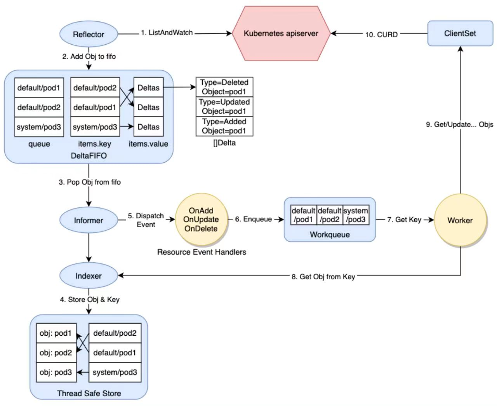
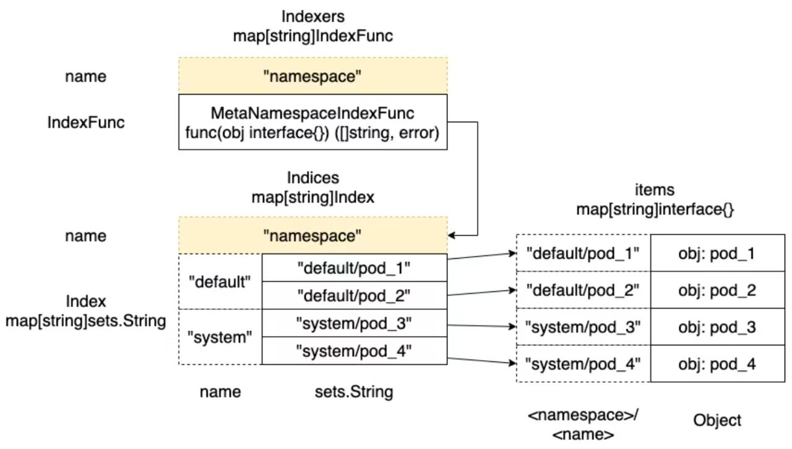

# client-go 源码分析之 Indexer 和 ThreadSafeStore

## 一、Client-go 源码分析

### 1. client-go 源码概览

client-go项目 是与 kube-apiserver 通信的 clients 的具体实现，其中包含很多相关工具包，例如 `kubernetes`包 就包含与 Kubernetes API 通信的各种 ClientSet，而 `tools/cache`包 则包含很多强大的编写控制器相关的组件。

所以接下来我们以自定义控制器的底层实现原理为线索，来分析 client-go 中相关模块的源码实现。

如图所示，在编写自定义控制器的过程中大致依赖于如下组件，其中圆形的是自定义控制器中需要编码的部分，其他椭圆和圆角矩形的是 client-go 提供的一些"工具"。



- client-go 的源码入口在 Kubernetes 项目的 `staging/src/k8s.io/client-go` 中，先整体查看上面涉及的相关模块，然后逐个深入分析其实现。
  + `Reflector` 从 apiserver 监听(watch)特定类型的资源，拿到变更通知后，将其丢到 DeltaFIFO 队列中
  + `Informer` 从 DeltaFIFO 中弹出(pop)相应对象，然后通过 Indexer 将对象和索引丢到本地 cache 中，再触发相应的事件处理函数(Resource Event Handlers)
  + `Indexer` 主要提供一个对象根据一定条件检索的能力，典型的实现是通过 namespace/name 来构造 key，通过 Thread Safe Store 来存储对象
  + `WorkQueue` 一般使用的是延时队列实现，在 Resource Event Handlers 中会完成将对象的 key 放入 WorkQueue 的过程，然后在自己的逻辑代码里从 WorkQueue 中消费这些 key
  + `ClientSet` 提供的是资源的 CURD 能力，与 apiserver 交互
  + `Resource Event Handlers` 一般在 Resource Event Handlers 中添加一些简单的过滤功能，判断哪些对象需要加到 WorkQueue 中进一步处理，对于需要加到 WorkQueue 中的对象，就提取其 key，然后入队
  + `Worker` 指的是我们自己的业务代码处理过程，在这里可以直接收到 WorkQueue 中的任务，可以通过 Indexer 从本地缓存检索对象，通过 ClientSet 实现对象的增、删、改、查逻辑


## 二、Client-go Indexer 与 ThreadSafeStore

`Indexer` 主要为对象提供根据一定条件进行检索的能力，典型的实现是通过 namespace/name 来构造 key，通过 `ThreadSafeStore` 来存储对象。换言之，`Indexer` 主要依赖于 `ThreadSafeStore` 实现，是 client-go 提供的一种缓存机制，通过检索本地缓存可以有效降低 apiserver 的压力。

### 1. Indexer 接口和 cache 的实现

- `Indexer` 接口主要是在 `Store` 接口的基础上拓展了对象的检索功能
	- 代码在 `k8s.io/client-go/tools/cache` 包下
	- `Indexer` 接口定义在 index.go 中
```golang
	// Indexer extends Store with multiple indices and restricts each
	// accumulator to simply hold the current object (and be empty after Delete).
	//
	// There are three kinds of strings here:
	//  1. a storage key, as defined in the Store interface,
	//  2. a name of an index, and
	//  3. an "indexed value", which is produced by an IndexFunc and
	//     can be a field value or any other string computed from the object.
	type Indexer interface {
		Store
		// Index returns the stored objects whose set of indexed values
		// intersects the set of indexed values of the given object, for the named index
		// 根据索引名和给定的对象，返回符合条件的所有对象
		Index(indexName string, obj interface{}) ([]interface{}, error)
		// IndexKeys returns the storage keys of the stored objects whose
		// set of indexed values for the named index includes the given indexed value
		// 根据索引名和索引值，返回符合条件的所有对象的key
		IndexKeys(indexName, indexedValue string) ([]string, error)
		// ListIndexFuncValues returns all the indexed values of the given index
		// 列出索引函数计算出来的所有索引值
		ListIndexFuncValues(indexName string) []string
		// ByIndex returns the stored objects whose set of indexed values
		// for the named index includes the given indexed value
		// 根据索引名和索引值，返回符合条件的所有对象
		ByIndex(indexName, indexedValue string) ([]interface{}, error)
		// GetIndexers return the indexers
		// 获取所有的Indexers，对应map[string]IndexFunc类型
		GetIndexers() Indexers

		// AddIndexers adds more indexers to this store.  If you call this after you already have data
		// in the store, the results are undefined.
		// AddIndexers 需要在数据加入存储前调用，添加更多的索引方法，默认只通过 namespace检索
		AddIndexers(newIndexers Indexers) error
	}

	// Indexers maps a name to an IndexFunc
	type Indexers map[string]IndexFunc

	// IndexFunc knows how to compute the set of indexed values for an object.
	type IndexFunc func(obj interface{}) ([]string, error)

	const (
		// NamespaceIndex is the lookup name for the most common index function, which is to index by the namespace field.
		NamespaceIndex string = "namespace"
	)
```

- `Indexer` 的默认实现是 `cache`，定义在 store.go中
	- 这里涉及两个类型 `keyFunc` 与 `ThreadSafeStore`
	- 从 `Indexer` 的方法的实现来看
		- 这里的逻辑就是调用 `keyFunc()` 方法获取 key，然后调用 `cacheStorage.Xxx()` 方法完成对应的增删改查过程
```golang
	// `*cache` implements Indexer in terms of a ThreadSafeStore and an associated KeyFunc.
	type cache struct {
		// cacheStorage bears the burden of thread safety for the cache
		cacheStorage ThreadSafeStore
		// keyFunc is used to make the key for objects stored in and retrieved from items, and should be deterministic.
		keyFunc KeyFunc
	}

	var _ Store = &cache{}

	// Add inserts an item into the cache.
	func (c *cache) Add(obj interface{}) error {
		key, err := c.keyFunc(obj)
		if err != nil {
			return KeyError{obj, err}
		}
		c.cacheStorage.Add(key, obj)
		return nil
	}

	// Update sets an item in the cache to its updated state.
	func (c *cache) Update(obj interface{}) error {
		key, err := c.keyFunc(obj)
		if err != nil {
			return KeyError{obj, err}
		}
		c.cacheStorage.Update(key, obj)
		return nil
	}

	// Delete removes an item from the cache.
	func (c *cache) Delete(obj interface{}) error {
		key, err := c.keyFunc(obj)
		if err != nil {
			return KeyError{obj, err}
		}
		c.cacheStorage.Delete(key)
		return nil
	}

	// List returns a list of all the items.
	// List is completely threadsafe as long as you treat all items as immutable.
	func (c *cache) List() []interface{} {
		return c.cacheStorage.List()
	}

	// ListKeys returns a list of all the keys of the objects currently
	// in the cache.
	func (c *cache) ListKeys() []string {
		return c.cacheStorage.ListKeys()
	}

	// GetIndexers returns the indexers of cache
	func (c *cache) GetIndexers() Indexers {
		return c.cacheStorage.GetIndexers()
	}

	// Index returns a list of items that match on the index function
	// Index is thread-safe so long as you treat all items as immutable
	func (c *cache) Index(indexName string, obj interface{}) ([]interface{}, error) {
		return c.cacheStorage.Index(indexName, obj)
	}

	// IndexKeys returns the storage keys of the stored objects whose set of
	// indexed values for the named index includes the given indexed value.
	// The returned keys are suitable to pass to GetByKey().
	func (c *cache) IndexKeys(indexName, indexedValue string) ([]string, error) {
		return c.cacheStorage.IndexKeys(indexName, indexedValue)
	}

	// ListIndexFuncValues returns the list of generated values of an Index func
	func (c *cache) ListIndexFuncValues(indexName string) []string {
		return c.cacheStorage.ListIndexFuncValues(indexName)
	}

	// ByIndex returns the stored objects whose set of indexed values
	// for the named index includes the given indexed value.
	func (c *cache) ByIndex(indexName, indexedValue string) ([]interface{}, error) {
		return c.cacheStorage.ByIndex(indexName, indexedValue)
	}

	func (c *cache) AddIndexers(newIndexers Indexers) error {
		return c.cacheStorage.AddIndexers(newIndexers)
	}

	// Get returns the requested item, or sets exists=false.
	// Get is completely threadsafe as long as you treat all items as immutable.
	func (c *cache) Get(obj interface{}) (item interface{}, exists bool, err error) {
		key, err := c.keyFunc(obj)
		if err != nil {
			return nil, false, KeyError{obj, err}
		}
		return c.GetByKey(key)
	}

	// GetByKey returns the request item, or exists=false.
	// GetByKey is completely threadsafe as long as you treat all items as immutable.
	func (c *cache) GetByKey(key string) (item interface{}, exists bool, err error) {
		item, exists = c.cacheStorage.Get(key)
		return item, exists, nil
	}

	// Replace will delete the contents of 'c', using instead the given list.
	// 'c' takes ownership of the list, you should not reference the list again
	// after calling this function.
	func (c *cache) Replace(list []interface{}, resourceVersion string) error {
		items := make(map[string]interface{}, len(list))
		for _, item := range list {
			key, err := c.keyFunc(item)
			if err != nil {
				return KeyError{item, err}
			}
			items[key] = item
		}
		c.cacheStorage.Replace(items, resourceVersion)
		return nil
	}

	// NewStore returns a Store implemented simply with a map and a lock.
	func NewStore(keyFunc KeyFunc) Store {
		return &cache{
			cacheStorage: NewThreadSafeStore(Indexers{}, Indices{}),
			keyFunc:      keyFunc,
		}
	}

	// NewIndexer returns an Indexer implemented simply with a map and a lock.
	func NewIndexer(keyFunc KeyFunc, indexers Indexers) Indexer {
		return &cache{
			cacheStorage: NewThreadSafeStore(indexers, Indices{}),
			keyFunc:      keyFunc,
		}
	}
```

- `KeyFunc` 类型是这样定义的 `type KeyFunc func(obj interface{}) (string, error)`，即 给一个对象返回一个字符串类型的 key
	- `KeyFunc` 的一个默认实现如下 `MetaNamespaceKeyFunc`
	- 可以看到一般情况下返回值是 `<namespace>/<name>`，如果 namespace 为空，则直接返回 name
```golang
	// ExplicitKey can be passed to MetaNamespaceKeyFunc if you have the key for
	// the object but not the object itself.
	type ExplicitKey string

	// MetaNamespaceKeyFunc is a convenient default KeyFunc which knows how to make
	// keys for API objects which implement meta.Interface.
	// The key uses the format <namespace>/<name> unless <namespace> is empty, then
	// it's just <name>.
	func MetaNamespaceKeyFunc(obj interface{}) (string, error) {
		if key, ok := obj.(ExplicitKey); ok {
			return string(key), nil
		}
		objName, err := ObjectToName(obj)
		if err != nil {
			return "", err
		}
		return objName.String(), nil
	}

	// ObjectToName returns the structured name for the given object,
	// if indeed it can be viewed as a metav1.Object.
	func ObjectToName(obj interface{}) (ObjectName, error) {
		meta, err := meta.Accessor(obj)
		if err != nil {
			return ObjectName{}, fmt.Errorf("object has no meta: %v", err)
		}
		return MetaObjectToName(meta), nil
	}

	// MetaObjectToName returns the structured name for the given object
	func MetaObjectToName(obj metav1.Object) ObjectName {
		if len(obj.GetNamespace()) > 0 {
			return ObjectName{Namespace: obj.GetNamespace(), Name: obj.GetName()}
		}
		return ObjectName{Namespace: "", Name: obj.GetName()}
	}
```

### 2. ThreadSafeStore的实现

**a. 接口与实现**

- `ThreadSafeStore` 是 `Indexer` 的核心逻辑所在
	- `Indexer` 的多数方法是直接调用内部 `cacheStorage` 属性的方法实现的
	- 接口定义在 thread_safe_store.go 中
```golang
	// ThreadSafeStore is an interface that allows concurrent indexed
	// access to a storage backend.  It is like Indexer but does not
	// (necessarily) know how to extract the Store key from a given
	// object.
	//
	// The guarantees of thread safety provided by List/Get are only valid if the caller
	// treats returned items as read-only. For example, a pointer inserted in the store
	// through `Add` will be returned as is by `Get`. Multiple clients might invoke `Get`
	// on the same key and modify the pointer in a non-thread-safe way. Also note that
	// modifying objects stored by the indexers (if any) will *not* automatically lead
	// to a re-index. So it's not a good idea to directly modify the objects returned by
	// Get/List, in general.
	type ThreadSafeStore interface {
		Add(key string, obj interface{})
		Update(key string, obj interface{})
		Delete(key string)
		Get(key string) (item interface{}, exists bool)
		List() []interface{}
		ListKeys() []string
		Replace(map[string]interface{}, string)
		Index(indexName string, obj interface{}) ([]interface{}, error)
		IndexKeys(indexName, indexedValue string) ([]string, error)
		ListIndexFuncValues(name string) []string
		ByIndex(indexName, indexedValue string) ([]interface{}, error)
		GetIndexers() Indexers

		// AddIndexers adds more indexers to this store.  If you call this after you already have data
		// in the store, the results are undefined.
		AddIndexers(newIndexers Indexers) error
		// Resync is a no-op and is deprecated
		Resync() error
	}

	// threadSafeMap implements ThreadSafeStore
	type threadSafeMap struct {
		lock  sync.RWMutex
		items map[string]interface{}

		// index implements the indexing functionality
		index *storeIndex
	}

	// storeIndex implements the indexing functionality for Store interface
	type storeIndex struct {
		// indexers maps a name to an IndexFunc
		indexers Indexers
		// indices maps a name to an Index
		indices Indices
	}

	// Indexers maps a name to an IndexFunc
	type Indexers map[string]IndexFunc

	// IndexFunc knows how to compute the set of indexed values for an object.
	type IndexFunc func(obj interface{}) ([]string, error)

	// MetaNamespaceIndexFunc is a default index function that indexes based on an object's namespace
	func MetaNamespaceIndexFunc(obj interface{}) ([]string, error) {
		meta, err := meta.Accessor(obj)
		if err != nil {
			return []string{""}, fmt.Errorf("object has no meta: %v", err)
		}
		return []string{meta.GetNamespace()}, nil
	}

	// Indices maps a name to an Index
	type Indices map[string]Index

	// Index maps the indexed value to a set of keys in the store that match on that value
	type Index map[string]sets.String

	// NewThreadSafeStore creates a new instance of ThreadSafeStore.
	func NewThreadSafeStore(indexers Indexers, indices Indices) ThreadSafeStore {
		return &threadSafeMap{
			items: map[string]interface{}{},
			index: &storeIndex{
				indexers: indexers,
				indices:  indices,
			},
		}
	}
```



`Indexers` 中保存的是 `Index` 函数 map，一个典型的实现是字符串 namespace 作为 key，`IndexFunc` 类型的实现 `MetaNamespaceIndexFunc` 函数作为 value，也就是通过 namespace 来检索时，借助 `Indexers` 可以拿到对应的计算 `Index` 的函数，接着调用这个函数把对象传进去，就可以计算出这个对象对应的 key，就是具体的 namespace 值，比如 default、kube-system 这种格式的字符串。

然后在 `Indices` 中保存的也是一个 map，key 是上面计算出来的 default 这种格式的 namespace 值，value 是一个 set，而 set 表示的是这个default namespace 下的一些具体 pod 的 `<namespace>/<name>` 这类格式字符串。最后拿着这个 key，就可以在 items 中检索到对应的对象。

**b. Add()、Update() 等方法的实现**

- `threadSafeMap` 如何实现添加元素
	- `Add()`、`Update()`、`Delete()` 方法
	- 更复杂的逻辑在 `updateIndices()` 方法
```golang
	func (c *threadSafeMap) Add(key string, obj interface{}) {
		// Add 的实现就是直接调用Update
		c.Update(key, obj)
	}

	func (c *threadSafeMap) Update(key string, obj interface{}) {
		c.lock.Lock()
		defer c.lock.Unlock()
		// c.items 是 map[string]interface{} 类型
		oldObject := c.items[key]
		// 在items map中添加这个对象
		c.items[key] = obj
		c.index.updateIndices(oldObject, obj, key)
	}

	func (c *threadSafeMap) Delete(key string) {
		c.lock.Lock()
		defer c.lock.Unlock()
		if obj, exists := c.items[key]; exists {
			c.index.updateIndices(obj, nil, key)
			delete(c.items, key)
		}
	}

	// updateIndices modifies the objects location in the managed indexes:
	// - for create you must provide only the newObj
	// - for update you must provide both the oldObj and the newObj
	// - for delete you must provide only the oldObj
	// updateIndices must be called from a function that already has a lock on the cache
	// 创建、更新、删除的入口都是这个方法，差异点在于 create 场景下的参数只传递 newObj，update 场景下的参数需要传递 oldObj 和 newObj，而 delete 场景下的参数只传递 oldObj
	func (i *storeIndex) updateIndices(oldObj interface{}, newObj interface{}, key string) {
		var oldIndexValues, indexValues []string
		var err error
		// 所有逻辑都在 for 循环中
		for name, indexFunc := range i.indexers {
			if oldObj != nil {                           // oldObj 是否存在
				oldIndexValues, err = indexFunc(oldObj)
			} else {                                     // 不存在，则置空 oldIndexValues
				oldIndexValues = oldIndexValues[:0]
			}
			if err != nil {
				panic(fmt.Errorf("unable to calculate an index entry for key %q on index %q: %v", key, name, err))
			}

			if newObj != nil {                           // oldnewObjObj 是否存在
				indexValues, err = indexFunc(newObj)
			} else {                                     // 不存在，则置空 indexValues
				indexValues = indexValues[:0]
			}
			if err != nil {
				panic(fmt.Errorf("unable to calculate an index entry for key %q on index %q: %v", key, name, err))
			}

			// 拿到一个 Index，对应类型 map[string]sets.String
			index := i.indices[name]
			if index == nil {
				// 如果 map 不存在，则初始化一个
				index = Index{}
				i.indices[name] = index
			}

			// 优化逻辑，当 oldObj 和 newObj 都只有一个值，且相等时，continue
			if len(indexValues) == 1 && len(oldIndexValues) == 1 && indexValues[0] == oldIndexValues[0] {
				// We optimize for the most common case where indexFunc returns a single value which has not been changed
				continue
			}

			// 处理 oldIndexValues，也就是需要删除的索引的值，这里保留了一个索引对应一个值的场景
			for _, value := range oldIndexValues {
				i.deleteKeyFromIndex(key, value, index)
			}
			// 处理 indexValues，也就是需要添加的索引值，这里同样保留了一个索引对应一个值的场景
			for _, value := range indexValues {
				i.addKeyToIndex(key, value, index)
			}
		}
	}

	func (i *storeIndex) deleteKeyFromIndex(key, indexValue string, index Index) {
		set := index[indexValue]
		if set == nil {
			return
		}
		set.Delete(key)
		// If we don't delete the set when zero, indices with high cardinality
		// short lived resources can cause memory to increase over time from
		// unused empty sets. See `kubernetes/kubernetes/issues/84959`.
		if len(set) == 0 {
			delete(index, indexValue)
		}
	}

	func (i *storeIndex) addKeyToIndex(key, indexValue string, index Index) {
		set := index[indexValue]
		if set == nil {
			set = sets.String{}
			index[indexValue] = set
		}
		set.Insert(key)
	}
```

### 3. 各种Index方法的实现

**a. Index()方法**

- `Index()` 方法的实现，其作用是给定一个 obj 和 indexName
	- 例如 pod1 和 namespace，然后返回 pod1 所在 namespace 下的所有 pod
```golang
	// Index returns a list of items that match the given object on the index function.
	// Index is thread-safe so long as you treat all items as immutable.
	func (c *threadSafeMap) Index(indexName string, obj interface{}) ([]interface{}, error) {
		c.lock.RLock()
		defer c.lock.RUnlock()

		storeKeySet, err := c.index.getKeysFromIndex(indexName, obj)
		if err != nil {
			return nil, err
		}

		list := make([]interface{}, 0, storeKeySet.Len())
		// storeKey 也就是 default/pod_1 这种字符串，通过其就可以到 items map 中提取需要的 obj
		for storeKey := range storeKeySet {
			list = append(list, c.items[storeKey])
		}
		return list, nil
	}

	func (i *storeIndex) getKeysFromIndex(indexName string, obj interface{}) (sets.String, error) {
		// 提取索引函数，比如通过 namespace 提取到 MetaNamespaceIndexFunc
		indexFunc := i.indexers[indexName]
		if indexFunc == nil {
			return nil, fmt.Errorf("Index with name %s does not exist", indexName)
		}

		// 对象丢进去拿到索引值，比如 default
		indexedValues, err := indexFunc(obj)
		if err != nil {
			return nil, err
		}
		index := i.indices[indexName]

		var storeKeySet sets.String
		if len(indexedValues) == 1 {  		// 多数情况对应索引值为1的场景，比如用namespace时，值就是唯一的
			// In majority of cases, there is exactly one value matching.
			// Optimize the most common path - deduping is not needed here.
			storeKeySet = index[indexedValues[0]]
		} else {                            // 对应索引值不为1的场景
			// Need to de-dupe the return list.
			// Since multiple keys are allowed, this can happen.
			storeKeySet = sets.String{}
			for _, indexedValue := range indexedValues {
				for key := range index[indexedValue] {
					storeKeySet.Insert(key)
				}
			}
		}

		return storeKeySet, nil
	}
```

**b. ByIndex()方法**

- `ByIndex()` 方法的实现，直接传递 `indexedValue` ，就不需要通过 obj 去计算 key 了
	- 例如 `indexName==namespace&indexValue==default` 就是直接检索 default 下的资源对象
```golang
	// ByIndex returns a list of the items whose indexed values in the given index include the given indexed value
	func (c *threadSafeMap) ByIndex(indexName, indexedValue string) ([]interface{}, error) {
		c.lock.RLock()
		defer c.lock.RUnlock()

		set, err := c.index.getKeysByIndex(indexName, indexedValue)
		if err != nil {
			return nil, err
		}
		list := make([]interface{}, 0, set.Len())
		for key := range set {
			list = append(list, c.items[key])
		}

		return list, nil
	}

	func (i *storeIndex) getKeysByIndex(indexName, indexedValue string) (sets.String, error) {
		indexFunc := i.indexers[indexName]
		if indexFunc == nil {
			return nil, fmt.Errorf("Index with name %s does not exist", indexName)
		}

		index := i.indices[indexName]
		return index[indexedValue], nil
	}
```

**c. IndexKeys()方法**

- `IndexKeys()` 方法的实现，和上面的方法返回obj列表的方式不同，这里只返回key列表，即 `[]string{"default/pod_1"}` 这种格式的数据
```golang
	// IndexKeys returns a list of the Store keys of the objects whose indexed values in the given index include the given indexed value.
	// IndexKeys is thread-safe so long as you treat all items as immutable.
	func (c *threadSafeMap) IndexKeys(indexName, indexedValue string) ([]string, error) {
		c.lock.RLock()
		defer c.lock.RUnlock()

		set, err := c.index.getKeysByIndex(indexName, indexedValue)
		if err != nil {
			return nil, err
		}
		return set.List(), nil
	}
```

**d. 其他方法**

- `ListIndexFuncValues`、`GetIndexers`、`AddIndexers`方法
```golang
	// ListIndexFuncValues 
	func (c *threadSafeMap) ListIndexFuncValues(indexName string) []string {
		c.lock.RLock()
		defer c.lock.RUnlock()

		return c.index.getIndexValues(indexName)
	}

	func (i *storeIndex) getIndexValues(indexName string) []string {
		index := i.indices[indexName]
		names := make([]string, 0, len(index))
		for key := range index {
			names = append(names, key)
		}
		return names
	}

	// GetIndexers
	func (c *threadSafeMap) GetIndexers() Indexers {
		return c.index.indexers
	}

	// AddIndexers
	func (c *threadSafeMap) AddIndexers(newIndexers Indexers) error {
		c.lock.Lock()
		defer c.lock.Unlock()

		if len(c.items) > 0 {
			return fmt.Errorf("cannot add indexers to running index")
		}

		return c.index.addIndexers(newIndexers)
	}

	func (i *storeIndex) addIndexers(newIndexers Indexers) error {
		oldKeys := sets.StringKeySet(i.indexers)
		newKeys := sets.StringKeySet(newIndexers)

		// 判断 newIndexers 是否存在
		if oldKeys.HasAny(newKeys.List()...) {
			return fmt.Errorf("indexer conflict: %v", oldKeys.Intersection(newKeys))
		}

		for k, v := range newIndexers {
			i.indexers[k] = v
		}
		return nil
	}
```