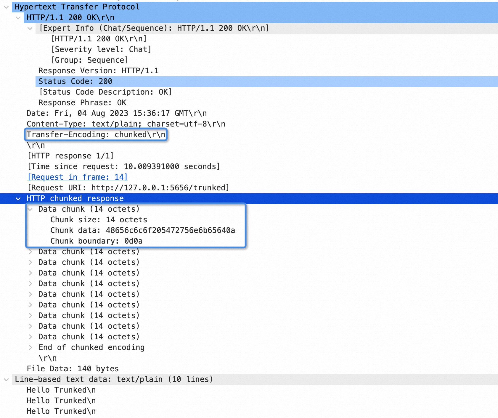
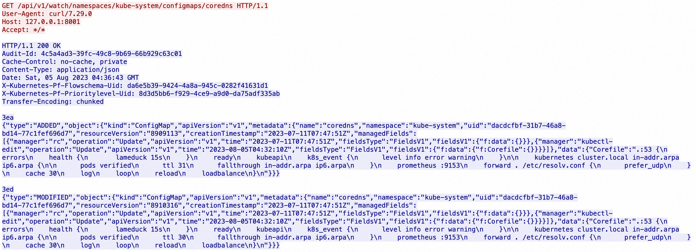

# client-go 源码分析之 ListerWatcher

## 一、Client-go 源码分析

### 1. client-go 源码概览

client-go项目 是与 kube-apiserver 通信的 clients 的具体实现，其中包含很多相关工具包，例如 `kubernetes`包 就包含与 Kubernetes API 通信的各种 ClientSet，而 `tools/cache`包 则包含很多强大的编写控制器相关的组件。

所以接下来我们以自定义控制器的底层实现原理为线索，来分析 client-go 中相关模块的源码实现。

如图所示，在编写自定义控制器的过程中大致依赖于如下组件，其中圆形的是自定义控制器中需要编码的部分，其他椭圆和圆角矩形的是 client-go 提供的一些"工具"。


- client-go 的源码入口在 Kubernetes 项目的 `staging/src/k8s.io/client-go` 中，先整体查看上面涉及的相关模块，然后逐个深入分析其实现。
  + `Reflector` 从 apiserver 监听(watch)特定类型的资源，拿到变更通知后，将其丢到 DeltaFIFO 队列中
  + `Informer` 从 DeltaFIFO 中弹出(pop)相应对象，然后通过 Indexer 将对象和索引丢到本地 cache 中，再触发相应的事件处理函数(Resource Event Handlers)
  + `Indexer` 主要提供一个对象根据一定条件检索的能力，典型的实现是通过 namespace/name 来构造 key，通过 Thread Safe Store 来存储对象
  + `WorkQueue` 一般使用的是延时队列实现，在 Resource Event Handlers 中会完成将对象的 key 放入 WorkQueue 的过程，然后在自己的逻辑代码里从 WorkQueue 中消费这些 key
  + `ClientSet` 提供的是资源的 CURD 能力，与 apiserver 交互
  + `Resource Event Handlers` 一般在 Resource Event Handlers 中添加一些简单的过滤功能，判断哪些对象需要加到 WorkQueue 中进一步处理，对于需要加到 WorkQueue 中的对象，就提取其 key，然后入队
  + `Worker` 指的是我们自己的业务代码处理过程，在这里可以直接收到 WorkQueue 中的任务，可以通过 Indexer 从本地缓存检索对象，通过 ClientSet 实现对象的增、删、改、查逻辑


## 二、Client-go ListerWatcher

`ListerWatcher` 是 `Reflector` 的一个主要能力提供者，本节展示一下 `ListerWatcher` 是如何实现 `List()` 和 `Watch()` 过程的，`ListerWatcher` 的代码还是在 `k8s.io/client-go/tools/cache` 包中

### 1. ListWatch对象的初始化

- `ListWatch` 对象和其创建过程都在 listwatch.go 中，先看一下 `ListWatch` 对象的定义
	- 这个结构体属性很简单，主要是 `ListFunc` 和 `WatchFunc`
	- 主要逻辑在 `NewFilteredListWatchFromClient()` 函数中，list 和 watch 能力都是通过 RESTClient 提供的
	- 涉及一个 `Getter` 接口
```golang
	// ListFunc knows how to list resources
	type ListFunc func(options metav1.ListOptions) (runtime.Object, error)

	// WatchFunc knows how to watch resources
	type WatchFunc func(options metav1.ListOptions) (watch.Interface, error)

	// ListWatch knows how to list and watch a set of apiserver resources.  It satisfies the ListerWatcher interface.
	// It is a convenience function for users of NewReflector, etc.
	// ListFunc and WatchFunc must not be nil
	type ListWatch struct {
		ListFunc  ListFunc
		WatchFunc WatchFunc
		// DisableChunking requests no chunking for this list watcher.
		DisableChunking bool
	}

	// NewListWatchFromClient creates a new ListWatch from the specified client, resource, namespace and field selector.
	func NewListWatchFromClient(c Getter, resource string, namespace string, fieldSelector fields.Selector) *ListWatch {
		optionsModifier := func(options *metav1.ListOptions) {
			options.FieldSelector = fieldSelector.String()
		}
		return NewFilteredListWatchFromClient(c, resource, namespace, optionsModifier)
	}

	// NewFilteredListWatchFromClient creates a new ListWatch from the specified client, resource, namespace, and option modifier.
	// Option modifier is a function takes a ListOptions and modifies the consumed ListOptions. Provide customized modifier function
	// to apply modification to ListOptions with a field selector, a label selector, or any other desired options.
	func NewFilteredListWatchFromClient(c Getter, resource string, namespace string, optionsModifier func(options *metav1.ListOptions)) *ListWatch {
		// list某个namespace下的某个resource
		listFunc := func(options metav1.ListOptions) (runtime.Object, error) {
			optionsModifier(&options)
			return c.Get().
				Namespace(namespace).
				Resource(resource).
				VersionedParams(&options, metav1.ParameterCodec).
				Do(context.TODO()).
				Get()
		}
		// 监听某个namespace(命名空间)下的资源
		watchFunc := func(options metav1.ListOptions) (watch.Interface, error) {
			options.Watch = true
			optionsModifier(&options)
			return c.Get().
				Namespace(namespace).
				Resource(resource).
				VersionedParams(&options, metav1.ParameterCodec).
				Watch(context.TODO())
		}
		return &ListWatch{ListFunc: listFunc, WatchFunc: watchFunc}
	}
```

- 上面涉及一个Getter接口，下面是 `Getter` 的定义，以及关联资源
```golang
	// Getter interface knows how to access Get method from RESTClient.
	type Getter interface {
		Get() *restclient.Request
	}

	// Request allows for building up a request to a server in a chained fashion.
	// Any errors are stored until the end of your call, so you only have to check once.
	type Request struct {
		c *RESTClient

		warningHandler WarningHandler

		rateLimiter flowcontrol.RateLimiter
		backoff     BackoffManager
		timeout     time.Duration
		maxRetries  int

		// generic components accessible via method setters
		verb       string
		pathPrefix string
		subpath    string
		params     url.Values
		headers    http.Header

		// structural elements of the request that are part of the Kubernetes API conventions
		namespace    string
		namespaceSet bool
		resource     string
		resourceName string
		subresource  string

		// output
		err error

		// only one of body / bodyBytes may be set. requests using body are not retriable.
		body      io.Reader
		bodyBytes []byte

		retryFn requestRetryFunc
	}

	// 这里需要一个能够获得 *restclient.Request 的方式，我们实际使用时会用 rest.Interface 接口类型的实例
	// 这是一个相对底层的工具，封装的是 Kubernetes REST APIS 相应的动作，可以在 client-go 的 rest 包内的 client.go 源文件中看到
	// Interface captures the set of operations for generically interacting with Kubernetes REST apis.
	type Interface interface {
		GetRateLimiter() flowcontrol.RateLimiter
		Verb(verb string) *Request
		Post() *Request
		Put() *Request
		Patch(pt types.PatchType) *Request
		Get() *Request
		Delete() *Request
		APIVersion() schema.GroupVersion
	}

	// 上面 Interface 接口对应的实现，也可以在 client.go 文件中看到
	// RESTClient imposes common Kubernetes API conventions on a set of resource paths.
	// The baseURL is expected to point to an HTTP or HTTPS path that is the parent
	// of one or more resources.  The server should return a decodable API resource
	// object, or an api.Status object which contains information about the reason for
	// any failure.
	//
	// Most consumers should use client.New() to get a Kubernetes API client.
	type RESTClient struct {
		// base is the root URL for all invocations of the client
		base *url.URL
		// versionedAPIPath is a path segment connecting the base URL to the resource root
		versionedAPIPath string

		// content describes how a RESTClient encodes and decodes responses.
		content ClientContentConfig

		// creates BackoffManager that is passed to requests.
		createBackoffMgr func() BackoffManager

		// rateLimiter is shared among all requests created by this client unless specifically overridden.
		rateLimiter flowcontrol.RateLimiter

		// warningHandler is shared among all requests created by this client.
		// If not set, defaultWarningHandler is used.
		warningHandler WarningHandler

		// Set specific behavior of the client.  If not set http.DefaultClient will be used.
		Client *http.Client
	}
```

- 上面的 `RESTClient` 和平时 Operator 代码中常用的 ClientSet 的关系，可以通过这个简单的例子了解一下
```golang
	// 在用 ClientSet 去 Get 一个指定名字的 DaemonSet 的时候，调用过程类似这样
	c.AppsV1().DaemonSets("default").Get(ctx, "demo-ds", metav1.GetOptions{})

	// 这里的Get其实就是利用了RESTClient提供的能力
	func (c *daemonSets) Get(ctx context.Context, name string, options v1.GetOptions) (result *v1beta1.DaemonSet, err error) {
		// 即 RESTClient.Get()，返回的是 *rest.Request 对象
		err = c.client.Get().
		       Namespace(c.ns).
			   Resource("daemonsets").
			   Name(name).
			   VersionedParams(&options, scheme.ParameterCodec).
			   Do(ctx).
			   Into(result)
		return
	}
```

### 2. ListWatch对象的初始化

- 上面提到的 `ListWatch` 对象实现的是 `ListerWatcher` 接口，这个接口也在 listwatch.go 中定义
	- 这里内嵌了两个接口，分别是 `Lister` 和 `Watcher`
```golang
	// Lister is any object that knows how to perform an initial list.
	type Lister interface {
		// List should return a list type object; the Items field will be extracted, and the
		// ResourceVersion field will be used to start the watch in the right place.
		// List 的返回值是一个 list类型对象，也就是其中有 Items 字段，里面的 ResourceVersion 可以用来监听(watch)
		List(options metav1.ListOptions) (runtime.Object, error)
	}

	// Watcher is any object that knows how to start a watch on a resource.
	type Watcher interface {
		// Watch should begin a watch at the specified version.
		// 从指定的资源版本开始 watch
		Watch(options metav1.ListOptions) (watch.Interface, error)
	}

	// ListerWatcher is any object that knows how to perform an initial list and start a watch on a resource.
	type ListerWatcher interface {
		Lister
		Watcher
	}
```

- `ListWatch` 对象的 `List()` 和 `Watch()` 的实现
```golang
	// List a set of apiserver resources
	func (lw *ListWatch) List(options metav1.ListOptions) (runtime.Object, error) {
		// ListWatch is used in Reflector, which already supports pagination.
		// Don't paginate here to avoid duplication.
		return lw.ListFunc(options)
	}

	// Watch a set of apiserver resources
	func (lw *ListWatch) Watch(options metav1.ListOptions) (watch.Interface, error) {
		return lw.WatchFunc(options)
	}
```

### 3. List-Watch 与 HTTP chunked

**a. HTTP中的chunked**

Kubernetes 中主要通过 List-Watch 机制实现组件间的异步消息通信，下面继续从 HTTP 层面来分析 watch 的实现机制，后面抓包试一下调用 watch 接口时数据包流向是怎样的。

Kubernetes 中的监听(watch)长链接是通过 HTTP 的 chunked 机制实现的，在响应头中加一个 `Transfer-Encoding: chunked` 就可以实现分段响应。

		分块传输编码 (Chunked transfer encoding) 是超⽂本传输协议 (HTTP) 中的⼀种数据传输机制，它允许 HTTP 由⽹⻚服务器发送给客户端应⽤的数据可以分成多个部分。

		使⽤限制：分块传输编码只在 HTTP协议1.1版本(HTTP/1.1) 中提供。

		分块传输编码的使⽤场景：
		当客户端向服务器请求⼀个静态⻚⾯或者⼀张图⽚时，服务器可以很清楚的知道内容⼤⼩，然后通过 Content-Length 消息⾸部字段告诉客户端需要接收多少数据。但是如果是动态⻚⾯等时，服务器是不可能预先知道内容⼤⼩，这时就可以使⽤ Transfer-Encoding：chunk 模式来传输数据了。即如果要⼀边产⽣数据，⼀边发给客户端，服务器就需要使⽤ "Transfer-Encoding: chunked" 这样的⽅式来代替 Content-Length。

		在进⾏ chunked 编码传输时，在回复消息的头部有 Transfer-Encoding: chunked

		分块传输编码的编码格式：
		编码使⽤若⼲个 chunk 组成，由⼀个标明⻓度为 0 的 chunk 结束。每个 chunk 有两部分组成，第⼀部分是该 chunk 的⻓度，第⼆部分就是指定⻓度的内容，每个部分⽤ CRLF 隔开。在最后⼀个⻓度为 0 的 chunk 中的内容是称为 footer 的内容，是⼀些没有写的头部内容。

		chunk 编码格式如下：
		[chunk size][\r\n][chunk data][\r\n][chunk size][\r\n][chunk data][\r\n][chunk size = 0][\r\n][\r\n]

		chunk size 是以⼗六进制的 ASCII 码表示，⽐如：头部是 3134 这两个字节，表示的是1和4这两个 ascii 字符，被http协议解释为⼗六进制数14，也就是⼗进制的20，后⾯紧跟 [\r\n](0d 0a)，再接着是连续的20个字节的 chunk 正⽂。chunk 数据以0⻓度的chunk块结束，也就是(30 0d 0a 0d 0a)。

用 Go 语言来模拟一下这个过程，从而理解 chunked 是什么。这里的逻辑是当客户端请求 `127.0.0.1:5656/trunked` 的时候，服务器端响应三行："This is Trunked"。
```golang
	// TrunkedHandler 模拟http trunked过程
	func TrunkedHandler(w http.ResponseWriter, r *http.Request) {
		flusher := w.(http.Flusher)
		// 两段消息，会自动触发 http trunked
		for i := 0; i < 2; i++ {
			fmt.Fprint(w, "This is Trunked\n")
			flusher.Flush()
			<-time.Tick(1 * time.Second)
		}
	}

	http.HandleFunc("/trunked", TrunkedHandler)
	if err := http.ListenAndServe(":5656", nil); err != nil {
		panic(err)
	}

	// TruckedClient 接收http trunked数据
	func TruckedClient() {
		resp, err := http.Get("http://127.0.0.1:5656/trunked")
		if err != nil {
			log.Fatal(err)
		}
		defer resp.Body.Close()

		fmt.Println(resp.TransferEncoding)

		reader := bufio.NewReader(resp.Body)
		for {
			line, err := reader.ReadString('\n')
			if len(line) > 0 {
				fmt.Println(line)
			}
			if err == io.EOF {
				break
			}
			if err != nil {
				log.Fatal(err)
			}
		}
	}
	// Output:
	// [chunked]
	// Hello Trunked
	// Hello Trunked
```

运行程序后，再用一个工具进行访问，比如 `curl 127.0.0.1:5656/trunked`，接着抓包可以看到如下图所示的响应体。



chunked 类型的 response 由一个个 chunk(块) 组成，每个 chunk 的格式都 `Chunk size+Chunk data+Chunk boundary`，也就是 块大小+数据+边界标识。chunk 的结尾是一个大小为0的块，也就是"0\r\n"。

串在一起整体格式类似这样：`[Chunk size][Chunk data][Chunk boundary][Chunk size][Chunk data][Chunk boundary][Chunk size = 0][Chunk boundary]]`

上面的例子中，服务器端响应的内容是两个相同的字符串 "Hello Trunked\n"，客户端拿到的响应也就是 "10Hello Trunked\n\r\n10Hello Trunked\n\r\n0\r\n"。

**b. watch API中的chunked**

现在多数 Kubernetes 集群都是以 HTTPS 方式暴露 API，而且开启了双向 TLS，下面通过 kubectl 代理 kube-apiserver 提供 HTTP 的 API，进行调用和抓包
```shell
# 打开连接 kube-apiserver 的 proxy
$ kubectl proxy
Starting to serve on 127.0.0.1:8001

# 开始watch一个资源，比如这里选择coredns的configmap，这时可以马上拿到一个响应
$ curl 127.0.0.1:8001/api/v1/watch/namespaces/kube-system/configmaps/coredns
"{"type":"ADDED","object":{"kind":"ConfigMap","apiVersion":"v1","metadata":{"name":"coredns","namespace":"kube-system","uid":"dacdcfbf-31b7-46a8-bd14-77c1fef696d7","resourceVersion":"478","creationTimestamp":"2023-07-11T07:47:51Z","managedFields":[{"manager":"rc","operation":"Update","apiVersion":"v1","time":"2023-07-11T07:47:51Z","fieldsType":"FieldsV1","fieldsV1":{"f:data":{".":{},"f:Corefile":{}}}}]},"data":{"Corefile":".:53 {\n    errors\n    health {\n       lameduck 15s\n    }\n    ready\n    kubeapi\n    k8s_event {\n      level info error warning\n    }\n\n    kubernetes cluster.local in-addr.arpa ip6.arpa {\n\n      pods verified\n      ttl 30\n      fallthrough in-addr.arpa ip6.arpa\n    }\n    prometheus :9153\n    forward . /etc/resolv.conf {\n      prefer_udp\n    }\n    cache 30\n    log\n    loop\n    reload\n    loadbalance\n}\n"}}}"

# 通过kubectl命令去编辑一下这个 configmap
$ kubectl -n kube-system edit configmap coredns
configmap/coredns edited

# 可以看到监听端继续收到一条消息，所以apiserver就是通过这样的方式将资源变更通知到各个watcher(监听器)的
"{"type":"MODIFIED","object":{"kind":"ConfigMap","apiVersion":"v1","metadata":{"name":"coredns","namespace":"kube-system","uid":"dacdcfbf-31b7-46a8-bd14-77c1fef696d7","resourceVersion":"8909113","creationTimestamp":"2023-07-11T07:47:51Z","managedFields":[{"manager":"rc","operation":"Update","apiVersion":"v1","time":"2023-07-11T07:47:51Z","fieldsType":"FieldsV1","fieldsV1":{"f:data":{}}},{"manager":"kubectl-edit","operation":"Update","apiVersion":"v1","time":"2023-08-05T04:32:10Z","fieldsType":"FieldsV1","fieldsV1":{"f:data":{"f:Corefile":{}}}}]},"data":{"Corefile":".:53 {\n    errors\n    health {\n       lameduck 15s\n    }\n    ready\n    kubeapi\n    k8s_event {\n      level info error warning\n    }\n\n    kubernetes cluster.local in-addr.arpa ip6.arpa {\n\n      pods verified\n      ttl 31\n      fallthrough in-addr.arpa ip6.arpa\n    }\n    prometheus :9153\n    forward . /etc/resolv.conf {\n      prefer_udp\n    }\n    cache 30\n    log\n    loop\n    reload\n    loadbalance\n}\n"}}}"
```

这时去抓包，依旧可以看到这两个响应信息的具体数据包格式，可以看到这里的 HTTP 头有一个 `Transfer-Encoding:chunked`

