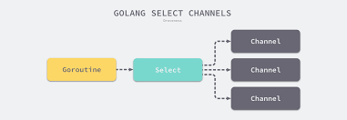
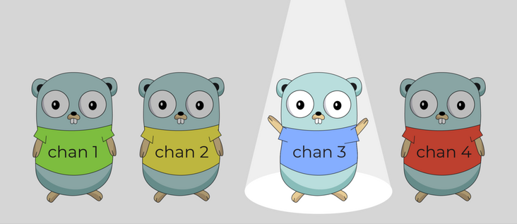

# Channel 与 Select

上一节我们讲到的都是单个channel的使用场景, 如果我们想要同时操作多个channel，比如从ch1、ch2读数据, 我们应该如何处理?


## 基础用法

Go提供了一个select语句块，它像switch一样工作，里面放一些case语句块，用来轮询每个case语句块的send或recv情况



用法格式示例:
```go
select {
	// ch1有数据时，读取到v1变量中
	case v1 := <-ch1:
		...
	// ch2有数据时，读取到v2变量中
	case v2 := <-ch2:
		...
	// 所有case都不满足条件时，执行default
	default:
		...
}
```

defalut语句是可选的，不允许fall through行为，但允许case语句块为空块。select会被return、break关键字中断：return是退出整个函数，break是退出当前select

select的行为模式主要是对channel是否可读进行轮询, 它的行为如下：
+ 如果所有的case语句块评估时都被阻塞，则阻塞直到某个语句块可以被处理
+ 如果多个case同时满足条件，则随机选择一个进行处理，对于这一次的选择，其它的case都不会被阻塞，而是处理完被选中的case后进入下一轮select(如果select在循环中)或者结束select(如果select不在循环中或循环次数结束)
+ 如果存在default且其它case都不满足条件，则执行default。所以default必须要可执行而不能阻塞


比如 我们在 ch1,ch2,ch3中放入1，2，3, 然后我们select:

```go
func Basic1() {
	ch1, ch2, ch3 := make(chan int, 1), make(chan int, 1), make(chan int, 1)
	ch1 <- 1
	ch2 <- 2
	ch3 <- 3

	select {
	case v := <-ch1:
		fmt.Println(v)
	case v := <-ch2:
		fmt.Println(v)
	case v := <-ch3:
		fmt.Println(v)
	default:
		fmt.Println("default")
	}
}
```

大家猜猜这次select的结果是啥?


我们select一次，只能从Ready的channel中随机挑选一个获取一个数据, 如果我们获取完所有的数据，就需要使用 for 进行轮询，比如

```go
func Basic2() {
	ch1, ch2 := make(chan int), make(chan int)
	go pump1(ch1)
	go pump2(ch2)
	go suck(ch1, ch2)
	time.Sleep(1 * time.Second)
}

// 偶数channel
func pump1(ch chan int) {
	for i := 0; i <= 30; i++ {
		if i%2 == 0 {
			ch <- i
		}
	}
}

// 奇数channel
func pump2(ch chan int) {
	for i := 0; i <= 30; i++ {
		if i%2 == 1 {
			ch <- i
		}
	}
}

// 处理ch1和ch2中的数据
func suck(ch1 chan int, ch2 chan int) {
	for {
		select {
		case v := <-ch1:
			fmt.Printf("recv on ch1: %d\n", v)
		case v := <-ch2:
			fmt.Printf("recv on ch2: %d\n", v)
		}
	}
}
```


## Select的顺序

select 在挑选就绪case分支的时候是随机化的， 这是他和swich的case不同的地方:


我们结合for循环来看一个样列:

我有3个带缓冲的channel: a, b ,c 依然往他们里面放入 A, B, C 然后我们通过select打印出所有收到的数据

```go
package selectio

import "fmt"

func SelectOrder() {
	// 我们只在一个执行体(Goroutine)中完成
	// 所以需要channel是带缓冲的
	a := make(chan string, 100)
	b := make(chan string, 100)
	c := make(chan string, 100)

	// 依次往a, b, c 中放入数据
	for i := 0; i < 10; i++ {
		a <- "A"
		b <- "B"
		c <- "C"
	}

	for i := 0; i < 10; i++ {
		select {
		case v := <-a:
			fmt.Println(v)
		case v := <-b:
			fmt.Println(v)
		case v := <-c:
			fmt.Println(v)
		default:
			fmt.Println("Default")
		}
	}
}
```

## 为select设置超时时间

谁也无法保证某些情况下的select是否会永久阻塞。很多时候都需要设置一下select的超时时间，可以借助time包的After()实现

```go
func After(d Duration) <-chan Time
```

After()函数接受一个时长d，然后它After()等待d时长，等待时间到后，将等待完成时所处时间点写入到channel中并返回这个只读channel

下面是一个例子, 1s后会收到一个事件
```go
func TestTimeAfter(t *testing.T) {
	fmt.Println(time.Now())

	a := time.After(1 * time.Second)
	fmt.Println(<-a)
}
```

比如我们ch1等待 结果的返回, 如果超时我们就退出不等待了

```go
func SelectTimeout() {
	ch1 := make(chan string)

	// 激活一个goroutine，但5秒之后才发送数据
	go func() {
		time.Sleep(5 * time.Second)
		ch1 <- "put value into ch1"
	}()

	select {
	case val := <-ch1:
		fmt.Println("recv value from ch1:", val)
		return

	// 只等待3秒，然后就结束
	case <-time.After(3 * time.Second):
		fmt.Println("3 second over, timeover")
	}
}
```

## for select的性能

我们先聊下，channel的性能:

channel本质上就是一个 mutex 锁加上一个环状缓存、 一个发送方队列和一个接收方队列

```go
// src/runtime/chan.go
type hchan struct {
	qcount   uint           // 队列中的所有数据数
	dataqsiz uint           // 环形队列的大小
	buf      unsafe.Pointer // 指向大小为 dataqsiz 的数组
	elemsize uint16         // 元素大小
	closed   uint32         // 是否关闭
	elemtype *_type         // 元素类型
	sendx    uint           // 发送索引
	recvx    uint           // 接收索引
	recvq    waitq          // recv 等待列表，即（ <-ch ）
	sendq    waitq          // send 等待列表，即（ ch<- ）
	lock mutex
}
type waitq struct { // 等待队列 sudog 双向队列
	first *sudog
	last  *sudog
}
```


由于channel是一种线性结构, 多个Goroutine同时操作它时为了保证顺序, 所以操作过程必须加锁:

发送过程包含三个步骤：

+ 持有锁
+ 入队，拷贝要发送的数据
    + 找到是否有正在阻塞的接收方，是则直接发送
    + 找到是否有空余的缓存，是则存入
    + 阻塞直到被唤醒
+ 释放锁


接收过程也包含三个步骤:
+ 上锁
+ 从缓存中出队，拷贝要接收的数据
    + 如果 Channel 已被关闭，且 Channel 没有数据，立刻返回
    + 如果存在正在阻塞的发送方，说明缓存已满，从缓存队头取一个数据，再复始一个阻塞的发送方
    + 否则，检查缓存，如果缓存中仍有数据，则从缓存中读取，读取过程会将队列中的数据拷贝一份到接收方的执行栈中
    + 没有能接受的数据，阻塞当前的接收方 Goroutine
+ 解锁

考虑到整个 Channel 操作带锁的成本较高，官方也曾考虑过使用无锁 Channel 的设计, 但由于年代久远(2014)，该改进仍处于搁置状态 [runtime: lock-free channels](https://github.com/golang/go/issues/8899)


那 for select性能如何喃?

我们通过 for轮询 加上 select 随机挑选, 实现了多个channel数据的接收, 从这个过程中可以得知 for select的时间复杂度是O(n)的


综上所述, for select 的channel模型, 并不适合 核心高性能 的地方, 为了绕开该坑，还是得从应用设计出发, 比如直接实现调度管理

如何绕开？, 资源竞争的时候如何高效加锁或者无锁？, 这将是下一小结的内容

## 参考

+ [Channel 与 Select](https://golang.design/under-the-hood/zh-cn/part2runtime/ch09lang/chan/)

