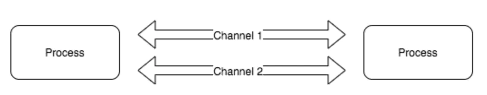
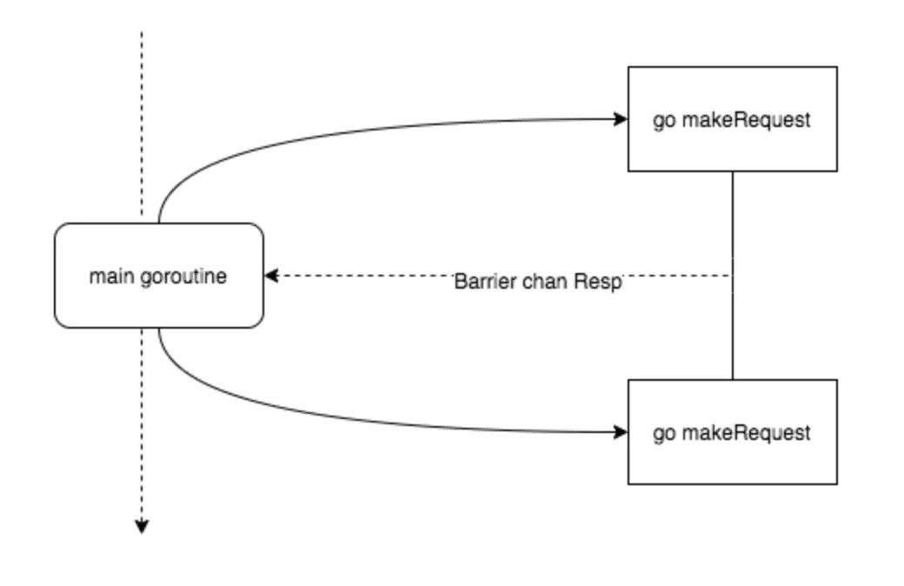
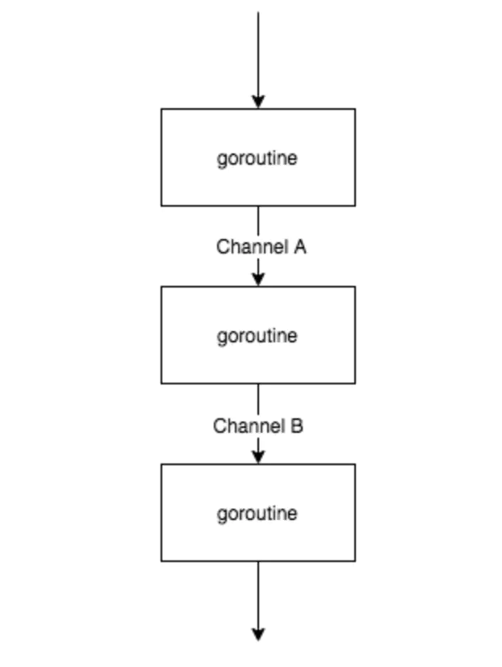

# CSP并发设计模式

Go 是采用CSP编程思想的典范，它将CSP发挥到了极致, 因为Goroutine和Channel 就是这种思想的体现，Go 的设计者 Rob Pike有一句经典的名言
```
Do not communicate by sharing memory; instead, share memory by communicating.
```



这句话是说“不要使用共享内存通信，而是应该使用通信去共享内存”，Go 语言推荐我们使用通信来进行进程间同步消息,这样做有二点好处

+ 使用发送消息来同步信息相比于直接使用共享内存和互斥锁是一种更高级的抽象，使用更高级的抽象能够为我们在程序设计上提供更好的封装，让程序的逻辑更加清晰
+ 消息发送在解耦方面与共享内存相比也有一定优势，我们可以将线程的职责分成生产者和消费者，并通过消息传递的方式将它们解耦，不需要再依赖共享内存

下面我们接收基于CSP的几种常见设计模式


## Barrier 模式

barrier 屏障模式故名思义就是一种屏障，用来阻塞直到聚合所有 goroutine 返回结果。 可以使用 channel 来实现

使用场景
+ 多个网络请求并发，聚合结果
+ 粗粒度任务拆分并发执行，聚合结果



比如我们并行爬取网页:

```go
endpoints := []string{
    "https://www.baidu.com", 
    "https://segmentfault.com/", 
    "https://blog.csdn.net/", 
    "https://www.jd.com/",
    }
```

示例如下:
```go
import (
	"fmt"
	"io/ioutil"
	"net/http"
	"time"
)

var (
	client = http.Client{
		Timeout: time.Duration(1 * time.Second),
	}
)

type SiteResp struct {
	Err    error
	Resp   string
	Status int
	Cost   int64
}

func BatchSiteReqeust() {
	endpoints := []string{
		"https://www.baidu.com",
		"https://segmentfault.com/",
		"https://blog.csdn.net/",
		"https://www.jd.com/",
	}

	// 一个endpoints返回一个结果, 缓冲可以确定
	respChan := make(chan SiteResp, len(endpoints))
	defer close(respChan)

	// 并行爬取
	for _, endpoints := range endpoints {
		go doSiteRequest(respChan, endpoints)
	}

	// 聚合结果, 返回结束事件, 避免轮询
	down := make(chan struct{})
	ret := make([]SiteResp, 0, len(endpoints))
	go mergeResponse(respChan, &ret, down)

	// 等待结束
	<-down

	for _, v := range ret {
		fmt.Println(v)
	}
}

func mergeResponse(resp <-chan SiteResp, ret *[]SiteResp, down chan struct{}) {
	defer func() {
		down <- struct{}{}
	}()

	count := 0
	for v := range resp {
		*ret = append(*ret, v)
		count++

		// 填充完成,  返回
		if count == cap(*ret) {
			return
		}
	}

}

// 构造请求
func doSiteRequest(out chan<- SiteResp, url string) {
	res := SiteResp{}
	startAt := time.Now()
	defer func() {
		res.Cost = time.Since(startAt).Milliseconds()
		out <- res
	}()

	resp, err := client.Get(url)
	if resp != nil {
		res.Status = resp.StatusCode
	}
	if err != nil {
		res.Err = err
		return
	}

	// 站不处理结果
	_, err = ioutil.ReadAll(resp.Body)
	defer resp.Body.Close()
	if err != nil {
		res.Err = err
		return
	}

	// res.Resp = string(byt)
}
```

## Pipeline 模式

可以利用多核的优势把一段粗粒度逻辑分解成多个 goroutine 执行



这个图不是很能表达并行的概念，其实三个 goroutine 是同时执行的，通过 buffer channel 将三者串起来，只要前序 goroutine 处理完一部分数据，就往下传递，达到并行的目的

以下是一个示例，第一个函数getRandNum()用于生成随机整数，并将生成的整数放进第一个channel ch1中，第二个函数addRandNum()用于接收ch1中的数据(来自第一个函数)，将其输出，然后对接收的值加1后放进第二个channel ch2中，第三个函数printRes接收ch2中的数据并将其输出

如果将函数认为是Linux的命令，则类似于下面的命令行：ch1相当于第一个管道，ch2相当于第二个管道

```
getRandNum | addRandNum | printRes
```

代码如下:
```go
import (
	"fmt"
	"math/rand"
	"sync"
)

var wg sync.WaitGroup

func PipelineMode() {
	wg.Add(3)
	// 创建两个channel
	ch1 := make(chan int)
	ch2 := make(chan int)

	// 3个goroutine并行
	go getRandNum(ch1)
	go addRandNum(ch1, ch2)
	go printRes(ch2)

	wg.Wait()
}

func getRandNum(out chan<- int) {
	// defer the wg.Done()
	defer wg.Done()

	var random int
	// 总共生成10个随机数
	for i := 0; i < 10; i++ {
		// 生成[0,30)之间的随机整数并放进channel out
		random = rand.Intn(30)
		out <- random
	}
	close(out)
}

func addRandNum(in <-chan int, out chan<- int) {
	defer wg.Done()
	for v := range in {
		// 输出从第一个channel中读取到的数据
		// 并将值+1后放进第二个channel中
		fmt.Println("before +1:", v)
		out <- (v + 1)
	}
	close(out)
}

func printRes(in <-chan int) {
	defer wg.Done()
	for v := range in {
		fmt.Println("after +1:", v)
	}
}
```

其实写锁 就是独占锁


## Producer/Consumer 模式

Producer/Consumer 模式, 也就是我们常见的生产者消费者模型, 该模式主要通过平衡生产线程和消费线程的工作能力来提高程序的整体处理数据的速度

简单地说，就是生产者生产一些数据，然后放到成果队列中，同时消费者从成果队列中来取这些数据。这样就让生产消费变成了异步的两个过程

```go
func ProducerConsumerMode() {
	ch := make(chan int, 64) // 成果队列

	go Producer(3, ch) // 生成 3 的倍数的序列
	go Producer(5, ch) // 生成 5 的倍数的序列
	go Consumer(ch)    // 消费 生成的队列

	// 运行一定时间后退出
	time.Sleep(5 * time.Second)
}

// 生产者: 生成 factor 整数倍的序列
func Producer(factor int, out chan<- int) {
	maxCount := 0

	for i := 0; ; i++ {
		out <- i * factor

		// 最多生成10个
		maxCount++
		if maxCount > 10 {
			break
		}
	}
}

// 消费者
func Consumer(in <-chan int) {
	for v := range in {
		fmt.Println(v)
	}
}
```


## Pub/Sub 模式


pub/sub 也就是发布订阅模型, 在这个模型中，消息生产者成为发布者（publisher），而消息消费者则成为订阅者（subscriber），生产者和消费者是M:N的关系。在传统生产者和消费者模型中，是将消息发送到一个队列中，而发布订阅模型则是将消息发布给一个主题

我们先定义Publisher, publisher的核心是维护一个订阅者队列, 好方便通过这个管道通知订阅者
```go
type (
	subscriber chan interface{}         // 订阅者为一个管道
	handleFunc func(v interface{}) bool // 订阅者处理消息的函数, bool是方便判断是否处理成功, 这里不作retry实现
)

// 发布者对象
type Publisher struct {
	m           sync.RWMutex              // 读写锁, 因为publisher允许被并发使用
	buffer      int                       // 订阅队列的缓存大小
	timeout     time.Duration             // 发布超时时间
	subscribers map[subscriber]handleFunc // 订阅者信息
}
```

publisher的核心是 发布数据,  这里是实现Publish方法
```go
// 发布一个主题, 往每个订阅者的管道中发送信息
func (p *Publisher) Publish(v interface{}) {
	p.m.RLock()
	defer p.m.RUnlock()

	var wg sync.WaitGroup
	for sub, topic := range p.subscribers {
		wg.Add(1)
		go p.sendTopic(sub, topic, v, &wg)
	}
	wg.Wait()
}

// 发送主题，可以容忍一定的超时
func (p *Publisher) sendTopic(
	sub subscriber, topic topicFunc, v interface{}, wg *sync.WaitGroup,
) {
	defer wg.Done()
	if topic != nil && !topic(v) {
		return
	}

	select {
	case sub <- v:
	case <-time.After(p.timeout):
	}
}
```


然后我们实现 添加订阅者的方法, 订阅者的核心逻辑 就是为该订阅者生成管道, 供他订阅消息
 ```go
 // 添加一个新的订阅者，订阅过滤器筛选后的主题
func (p *Publisher) SubscribeTopic(topic handleFunc) chan interface{} {
	ch := make(chan interface{}, p.buffer)
	p.m.Lock()
	p.subscribers[ch] = topic
	p.m.Unlock()
	return ch
}

// 退出订阅
func (p *Publisher) Evict(sub chan interface{}) {
	p.m.Lock()
	defer p.m.Unlock()

	delete(p.subscribers, sub)
	close(sub)
}
 ```

 最后我们实现一个关闭方法, 通知定制者，该频道(topic)已经关闭
 ```go
 // 关闭发布者对象，同时关闭所有的订阅者管道。
func (p *Publisher) Close() {
	p.m.Lock()
	defer p.m.Unlock()

	for sub := range p.subscribers {
		delete(p.subscribers, sub)
		close(sub)
	}
}
 ```

这样我们就利用channel实现了一个简单的发布订阅模式, 测试下:

```go
func TestPubSubMode(t *testing.T) {
	p := NewPublisher(100*time.Millisecond, 10)
	defer p.Close()

	// 订阅所有
	all := p.Subscribe()

	// 通过过滤订阅一部分信息
	golang := p.SubscribeTopic(func(v interface{}) bool {
		if s, ok := v.(string); ok {
			return strings.Contains(s, "golang")
		}
		return false
	})

	// 发布者 发布信息
	p.Publish("hello,   python!")
	p.Publish("godbybe, python!")
	p.Publish("hello,   golang!")

	// 订阅者查看消息
	go func() {
		for msg := range all {
			fmt.Println("all:", msg)
		}
	}()

	// 订阅者查看消息
	go func() {
		for msg := range golang {
			fmt.Println("golang:", msg)
		}
	}()

	// 运行一定时间后退出
	time.Sleep(3 * time.Second)
}
```


## Workers Pool 模式

在 Go 中 goroutine 已经足够轻量，甚至 net/http server 的处理方式也是 goroutine-per-connection 的，所以比起其他语言来说可能场景稍微少一些。每个 goroutine 的初始内存消耗在 2~8kb，当我们有大批量任务的时候，需要起很多 goroutine 来处理，这会给系统代理很大的内存开销和 GC 压力，这个时候就可以考虑一下协程池

这个部分基础部分已经介绍过:

```go
import (
	"fmt"
	"math/rand"
	"sync"
	"time"
)

type Task struct {
	ID         int
	JobID      int
	Status     string
	CreateTime time.Time
}

func (t *Task) Run() {
	sleep := rand.Intn(1000)
	time.Sleep(time.Duration(sleep) * time.Millisecond)
	t.Status = "Completed"
}

var wg sync.WaitGroup

// worker的数量，即使用多少goroutine执行任务
const workerNum = 3

func RunTaskWithPool() {
	wg.Add(workerNum)

	// 创建容量为10的buffered channel
	taskQueue := make(chan *Task, 10)

	// 激活goroutine，执行任务
	for workID := 1; workID <= workerNum; workID++ {
		go worker(taskQueue, workID)
	}

	produceTask(taskQueue)

	wg.Wait()

	//记得关闭channel
	close(taskQueue)
}

func produceTask(out chan<- *Task) {
	// 将待执行任务放进buffered channel，共15个任务
	for i := 1; i <= 15; i++ {
		out <- &Task{
			ID:         i,
			JobID:      100 + i,
			CreateTime: time.Now(),
		}
	}
}

// 从buffered channel中读取任务，并执行任务
func worker(in <-chan *Task, workID int) {
	defer wg.Done()
	for v := range in {
		fmt.Printf("Worker%d: recv a request: TaskID:%d, JobID:%d\n", workID, v.ID, v.JobID)
		v.Run()
		fmt.Printf("Worker%d: Completed for TaskID:%d, JobID:%d\n", workID, v.ID, v.JobID)
	}
}
```

+ [CSP并发模型与Goroutine的基本使用](https://zhuanlan.zhihu.com/p/191038432)

