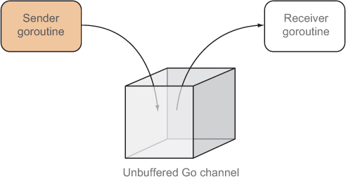
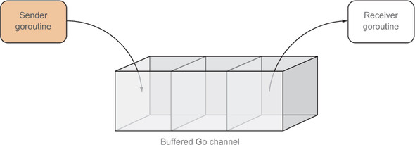
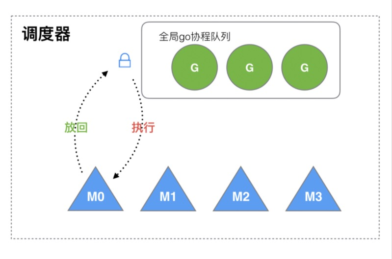

# Chnanel的使用

我们除了可以通过共享内存进行goroutine之间的通信, Go还提供一个特殊的数据类型也可以用于多个goroutine之间通信: chan

虽然我们在 Go 语言中也能使用共享内存加互斥锁进行通信，但是 Go 语言提供了一种不同的并发模型，即通信顺序进程（Communicating sequential processes，CSP）。

Goroutine 和 Channel 分别对应 CSP 中的实体和传递信息的媒介，Goroutine 之间会通过 Channel 传递数据


Channel遵循了先进先出的设计(FIFO)，具体规则如下：
+ 先从 Channel 读取数据的 Goroutine 会先接收到数据；
+ 先向 Channel 发送数据的 Goroutine 会得到先发送数据的权利

因此我们可以把channel当作队列来使用, 这也是Goroutine的通信方式，理解比较直观。

## 发送与接收消息

channel是指针类型的数据类型，使用 chan表示, 通过make来分配内存。例如

```go
ch := make(chan int)
```

这表示创建一个channel，这个channel中只能保存int类型的数据。也就是说一端只能向此channel中放进int类型的值，另一端只能从此channel中读出int类型的值。

需要注意，chan TYPE才表示channel的类型。所以其作为参数或返回值时，需指定为xxx chan int类似的格式

1.往channel中发送消息
```go
ch <- VALUE
```

2.从channel中获取消息
```go
<-ch               // 取出消息，直接扔掉
value := <-ch      // 从ch中读取一个值并保存到value变量中
value,ok = <-ch    // 从ch读取一个值，判断是否读取成功，如果成功则保存到value变量中
for v := range ch  // 通过for range语法来取值, 知道ch关闭时退出循环
```

简单总结为:
+ send: 当ch出现在<-的左边
+ recv: 当ch出现在<-的右边

比如: alice -> bob 发送一个消息(hello, this is alice)
```go
package main

import (
	"fmt"
	"time"
)

// sender 不停的想chann里面发送数据
func sender(ch chan string) {
	ch <- "hello"
	ch <- "this"
	ch <- "is"
	ch <- "alice"
}

// recver 循环读取chan里面的数据，直到channel关闭
func recver(ch chan string) {
	for v := range ch {
		fmt.Println(v)
	}
}

func main() {
	ch := make(chan string)
	go sender(ch) // sender goroutine
	go recver(ch) // recver goroutine

	// 这个可以使用同步组 waitGroup来进行同步等待
	time.Sleep(1 * time.Second)
}
```

## 关闭channel

上面是最基础的一套逻辑, 那我们如何来处理 通话结束喃?(sender退出)

我们可以在消费发送完了过后，发送一条特别的消息用于说明此次通信结束，比如EOF
```go
// sender 不停的想chann里面发送数据
func sender(ch chan string) {
	ch <- "hello"
	ch <- "this"
	ch <- "is"
	ch <- "alice"

	// 发送通话结束
	ch <- "EOF"
	close(ch)
}

// recver 循环读取chan里面的数据，直到channel关闭
func recver(ch chan string) {
	for v := range ch {
		// 处理通话结束
		if v == "EOF" {
			return
		}
		fmt.Println(v)
	}
}

func main() {
	ch := make(chan string)
	go sender(ch) // sender goroutine
	go recver(ch) // recver goroutine

	// 这个可以使用同步组 waitGroup来进行同步等待
	time.Sleep(1 * time.Second)
}
```

这样的话, 是不是就完整了？ 我们似乎忘了挂电话这个逻辑, 对比与channel 就是我们忘记关闭channel了, 如果我们只申请，不关闭的话，会造成内存泄露(chan 没有被释放)

我们使用close这个内置函数来关闭channel:
```go
close(ch)
```

结合我们上面的逻辑, 就是需要sender方来关闭channel(sender 挂电话)

```go
// sender 不停的想chann里面发送数据
func sender(ch chan string) {
	ch <- "hello"
	ch <- "this"
	ch <- "is"
	ch <- "alice"
	// 发送通话结束
	ch <- "EOF"
	close(ch)
}
```

如果由recver提前把通道关闭了，会发生什么?
```go
// recver 循环读取chan里面的数据，直到channel关闭
func recver(ch chan string) {
	for v := range ch {
		// 处理通话结束
		if v == "hello" {
			close(ch)
			return
		}
		fmt.Println(v)
	}
}
```

send方会panic, 导致sender方崩溃掉:
```
panic: send on closed channel

goroutine 18 [running]:
main.sender(0xc00008c060)
	/Users/g7/Workspace/go-course/day10/channel/basic/basic.go:10 +0x55
created by main.main
	/Users/g7/Workspace/go-course/day10/channel/basic/basic.go:32 +0x5c
exit status 2
```

因此我们在关闭channel时 有如下注意事项:
+ 关闭channel后，send操作将导致painc
+ 关闭channel后，recv操作将返回对应类型的0值以及一个状态码false
+ 如果使用close()，建议条件允许的情况下加上defer, 只在sender端上显式使用close()关闭channel。因为关闭通道意味着没有数据再需要发送

## 无缓冲管道(unbuffered channel)



```go
ch := make(chan int)
```
像上面这种 直接创建出来, 没有指定容量的channel 我们就叫做无缓冲管道,

无缓冲管道特点: 
+ sender端向channel中send一个数据，然后阻塞，直到receiver端将此数据receive
+ receiver端一直阻塞，直到sender端向channel发送了一个数据

我们可以看出来无缓冲管道是 阻塞的, 常用于同步通信模式, 比如 我们利用这个特性来编写一个同步等待

```go
// recver 循环读取chan里面的数据，直到channel关闭
func recver(ch chan string, down chan struct{}) {
	defer func() {
		down <- struct{}{}
	}()

	for v := range ch {
		// 处理通话结束
		if v == "EOF" {
			return
		}
		fmt.Println(v)
	}
}

func main() {
	ch := make(chan string)

	down := make(chan struct{})
	go sender(ch)       // sender goroutine
	go recver(ch, down) // recver goroutine

	<-down
}
```

> 同步编程案例: 利用unbuffered同步的特性，我们可以完成多个协程间的同步协作, 比如之前讲的: 协程A和B交替打印内容

```go
func A() {
    fmt.Print("1")
    fmt.Print("2")
    fmt.Print("3")
}

func B() {
    fmt.Print("A")
    fmt.Print("B")
    fmt.Print("C")
}
```


具体过程:
```go
package main

import (
	"fmt"
	"time"
)

func A(startA, startB chan struct{}) {
	a := []string{"1", "2", "3"}
	index := 0
	for range startA {
		if index > 2 {
			return
		}
		fmt.Println(a[index])
		index++
		startB <- struct{}{}
	}
}

func B(startA, startB chan struct{}) {
	b := []string{"x", "y", "z"}
	index := 0
	for range startB {
		fmt.Println(b[index])
		index++
		startA <- struct{}{}
	}
}

func main() {
	startA, startB := make(chan struct{}), make(chan struct{})
	go A(startA, startB)
	go B(startA, startB)

	startA <- struct{}{}
	time.Sleep(1 * time.Second)
}
```

## 同步的噩梦

我们在一个协程里面 使用同步管道发送信息如下:

```go
func TestDeadLock(t *testing.T) {
	ch := make(chan string)
	// send
	{
		ch <- "hello"
	}

	// receive
	{
		fmt.Println(<-ch)
	}
}
```

当channel的某一端(sender/receiver)期待另一端的(receiver/sender)操作，另一端正好在期待本端的操作时，也就是说两端都因为对方而使得自己当前处于阻塞状态，这时将会出现死锁问题。

更通俗地说，只要所有goroutine都被阻塞，就会出现死锁

要修复这个问题 我们有2种办法:

1. 将其中一方变成一个协程, 这样就是A->B, 就不是死循环了

```go
func TestDeadLockV1(t *testing.T) {
	ch := make(chan string)
	// send
	go func() {
		ch <- "hello"
	}()

	// receive
	{
		fmt.Println(<-ch)
	}
}
```

当然还有一种方式 使用带缓冲管道

```go
func TestDeadLockV2(t *testing.T) {
	ch := make(chan string, 1)
	// send
	{
		ch <- "hello"
	}

	// receive
	{
		fmt.Println(<-ch)
	}
}
```

## 带缓冲管道(buffered channel )



buffered channel有两个属性：容量和长度：和slice的capacity和length的概念是一样的
+ capacity：表示bufffered channel最多可以缓冲多少个数据
+ length：表示buffered channel当前已缓冲多少个数据

创建buffered channel的方式为make(chan TYPE,CAP), 比如我们创建一个容量为5的 int chan:
```go
ch := make(chan int, 5)
len(ch)  // 通过len 获取channel当前已缓冲的数据个数
```

sender端可以向channel中send多个数据(只要channel容量未满)，容量满之前不会阻塞
receiver端按照队列的方式(FIFO,先进先出)从buffered channel中按序receive其中数据

总结下buffered channel的特性:
+ 为满之前是 非阻塞、异步模式
+ 满了之后是 阻塞的, 是同步模式

对比我们之前的例子, 现在就不是打电话了， 现在就是短信, 或者留言:
```go
// 沿用之前同步模式的例子, 现在我们把信道改成 带缓冲的
func BufferedChan() {
	ch := make(chan string, 5)

	down := make(chan struct{})
	go sender(ch)       // sender goroutine
	go recver(ch, down) // recver goroutine

	<-down
}
```

猜猜recver能获取到消息吗?

由于是异步的, 我们需要等到recver把消息处理完成后 才能关闭，如果我们提前关闭，而recver还没有取出消息，就会导致消息丢失，因此我们需要怎么办?

我们处理完成后给sender发送一条消息，告诉他 已经处理完成:
```go
package basic

import "fmt"

func senderV2(ch chan string, down chan struct{}) {
	ch <- "hello"
	ch <- "this"
	ch <- "is"
	ch <- "alice"
	// 发送通话结束
	ch <- "EOF"

	// 同步模式等待recver 处理完成
	<-down
	// 处理完成后关闭channel
	close(ch)
}

// recver 循环读取chan里面的数据，直到channel关闭
func recverV2(ch chan string, down chan struct{}) {
	defer func() {
		down <- struct{}{}
	}()

	for v := range ch {
		// 处理通话结束
		if v == "EOF" {
			return
		}
		fmt.Println(v)
	}
}

func BufferedChan() {
	ch := make(chan string, 5)

	down := make(chan struct{})
	go senderV2(ch, down) // sender goroutine
	go recverV2(ch, down) // recver goroutine

	<-down
}
```

> buffered channel异步队列请求示例

我们参考Go的老版调度实现一个任务工作队列



我们实现的功能大致如下:
+ 有(最多)4个worker，每个worker是一个goroutine，它们有worker ID。
+ 每个worker都从一个队列中取出待执行的任务(Task)，进行执行。
+ 队列容量为10, 也就是最多只允许10个任务进行排队
+ 任务的执行方式很简单：随机睡眠0-1秒钟，并将任务标记为完成。

```go
package chnanel

import (
	"fmt"
	"math/rand"
	"sync"
	"time"
)

type Task struct {
	ID         int
	JobID      int
	Status     string
	CreateTime time.Time
}

func (t *Task) Run() {
	sleep := rand.Intn(1000)
	time.Sleep(time.Duration(sleep) * time.Millisecond)
	t.Status = "Completed"
}

var wg sync.WaitGroup

// worker的数量，即使用多少goroutine执行任务
const workerNum = 3

func RunTaskWithPool() {
	wg.Add(workerNum)

	// 创建容量为10的buffered channel
	taskQueue := make(chan *Task, 10)

	// 激活goroutine，执行任务
	for workID := 0; workID <= workerNum; workID++ {
		go worker(taskQueue, workID)
	}

	// 将待执行任务放进buffered channel，共15个任务
	for i := 1; i <= 15; i++ {
		taskQueue <- &Task{
			ID:         i,
			JobID:      100 + i,
			CreateTime: time.Now(),
		}
	}

	wg.Wait()

	//记得关闭channel
	close(taskQueue)
}

// 从buffered channel中读取任务，并执行任务
func worker(in chan *Task, workID int) {
	defer wg.Done()
	for v := range in {
		fmt.Printf("Worker%d: recv a request: TaskID:%d, JobID:%d\n", workID, v.ID, v.JobID)
		v.Run()
		fmt.Printf("Worker%d: Completed for TaskID:%d, JobID:%d\n", workID, v.ID, v.JobID)
	}
}
```

## channel的方向

准确来说，channel是有方向的(数据流向), 如果我们错误的使用了, 比如本来是要从channel中读取数据的，但是我们去错误的进行了写操作，这很容易造成死锁.

因此我们把channel作为参数传达的时候，可以指定方向(读-out或者写-in)
+ in <-chan int：表示channel in通道只用于接收数据
+ out chan<- int：表示channel out通道只用于发送数据


我们优化下我们之前的worker, 因为之前的worker, 如果是可以执行写的
```go
func produceTask(out chan<- *Task) {
	// 将待执行任务放进buffered channel，共15个任务
	for i := 1; i <= 15; i++ {
		out <- &Task{
			ID:         i,
			JobID:      100 + i,
			CreateTime: time.Now(),
		}
	}
}

// 从buffered channel中读取任务，并执行任务
func worker(in <-chan *Task, workID int) {
	defer wg.Done()
	for v := range in {
		fmt.Printf("Worker%d: recv a request: TaskID:%d, JobID:%d\n", workID, v.ID, v.JobID)
		v.Run()
		fmt.Printf("Worker%d: Completed for TaskID:%d, JobID:%d\n", workID, v.ID, v.JobID)
	}
}
```

## 思考？ 如何参考最新版的调度器实现一个新版本


+ 本地队列 / 全局队列
+ 调度(添加任务的时候，直接调度)

为了获得更好的性能, 我们可能选择的队列实现方式有:
+ 使用链表实现 FIFO 
+ 使用heap实现优先级队列
+ 无锁队列...


## 总结

+ channel基本用法（读/写/关闭)
+ 无缓冲chnannel与同步通信
+ 缓冲channel与异步通信
+ channel的方向