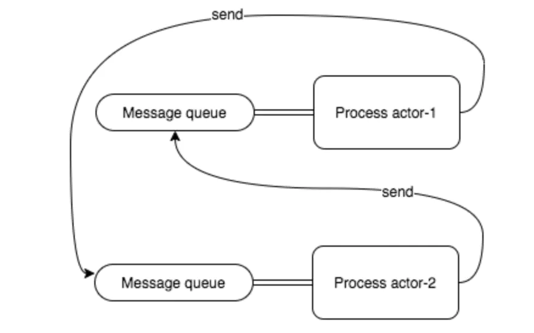

# 并发注意事项

## 控制并发数

在Go语言中启动一个Goroutine不仅和调用函数一样简单，而且Goroutine之间调度代价也很低，这些因素极大地促进了并发编程的流行和发展。

很多用户在适应了Go语言强大的并发特性之后，都倾向于编写最大并发的程序，因为这样似乎可以提供最大的性能

遇事不决go一下:
```go
go func()
```

一个Goroutine会以一个很小的栈启动（可能是2KB或4KB）, 但是你的系统和调度器的能力总是有上限的, 在面对大规模的并发请求时(千万或者亿)我们是要考虑goroutine的销毁成本的。

一个是使用goroutine pool控制gotourine数量, 另一个就是做好系统的限流与上限控制

当然还有 更重要的一点, 管理好goroutine的退出, 不让goroutine泄露是很容量的。

## 并发的安全退出

有时候我们需要通知goroutine停止它正在干的事情，特别是当它工作在错误的方向上的时候。

Go语言并没有提供在一个直接终止Goroutine的方法，由于这样会导致goroutine之间的共享变量处在未定义的状态上。但是如果我们想要退出两个或者任意多个Goroutine怎么办呢？

我们可以 通过channel 发送退出信号

比如:
```go
func worker(cannel chan struct{}) {
	for {
		select {
		default:
			fmt.Println("hello")
			time.Sleep(100 * time.Millisecond)
		case <-cannel:
			// 退出
		}
	}
}

func CancelWithChannel() {
	cannel := make(chan struct{})
	go worker(cannel)

	time.Sleep(time.Second)
	cannel <- struct{}{}
}
```

当Goroutine收到退出指令, 退出时一般会进行一定的清理工作，但是退出的清理工作并不能保证被完成，
因为main线程并没有等待各个工作Goroutine退出工作完成的机制，我们可以结合sync.WaitGroup来改进

```go
func workerv2(wg *sync.WaitGroup, cancel chan bool) {
	defer wg.Done()

	for {
		select {
		default:
			fmt.Println("hello")
			time.Sleep(100 * time.Millisecond)
		case <-cancel:
			return
		}
	}
}

func CancelWithDown() {
	cancel := make(chan bool)

	var wg sync.WaitGroup
	for i := 0; i < 10; i++ {
		wg.Add(1)
		go workerv2(&wg, cancel)
	}

	time.Sleep(time.Second)

	// 发送退出信号
	close(cancel)

	// 等待goroutine 安全退出
	wg.Wait()
}

```

## 使用context管理goroutine的退出

在Go1.7发布时，标准库增加了一个context包，用来简化对于处理单个请求的多个Goroutine之间与请求域的数据、超时和退出等操作，官方有博文对此做了专门介绍。我们可以用context包来重新实现前面的线程安全退出或超时的控制

```go
func workerV3(ctx context.Context, wg *sync.WaitGroup) error {
	defer wg.Done()

	for {
		select {
		default:
			fmt.Println("hello")
			time.Sleep(100 * time.Millisecond)
		case <-ctx.Done():
			return ctx.Err()
		}
	}
}
func CancelWithCtx() {
	// 控制超时
	ctx, cancel := context.WithTimeout(context.Background(), 10*time.Second)

	var wg sync.WaitGroup
	for i := 0; i < 10; i++ {
		wg.Add(1)
		go workerV3(ctx, &wg)
	}

	time.Sleep(time.Second)

	// 取出任务
	cancel()

	// 等待安全退出
	wg.Wait()
}
```

## 并发中的Pannic

我们可以通过recover捕获异常避免程序崩溃，比如:
```go
func DealPanic() {
	defer func() {
		if err := recover(); err != nil {
			fmt.Println(err)
		}
	}()

	arr := []int{0}
	_ = arr[2]
}

// 输出: runtime error: index out of range [2] with length 1
```

但是如果我们的错误是发生在Goroutine中喃?

```go
func DealPanicInG() {
	defer func() {
		if err := recover(); err != nil {
			fmt.Println(err)
		}
	}()

	wg.Add(1)
	go work()

	wg.Wait()
}

func work() {
	arr := []int{0}
	_ = arr[2]
	wg.Done()
}
```

结果没用, 程序还是panic了, 因为go的recover是针对 但goroutine的, 因此我们在写启动gorouite的适合,
不能 无脑 go func, 这样可能由于goroutine的异常 而让 整个程序崩溃掉


go 的http库，是为每个请求启动一个Goroutine进行处理，我们看看他如何处理的:
```go
// Serve a new connection.
func (c *conn) serve(ctx context.Context) {
	c.remoteAddr = c.rwc.RemoteAddr().String()
	ctx = context.WithValue(ctx, LocalAddrContextKey, c.rwc.LocalAddr())
	defer func() {
		if err := recover(); err != nil && err != ErrAbortHandler {
			const size = 64 << 10
			buf := make([]byte, size)
			buf = buf[:runtime.Stack(buf, false)]
			c.server.logf("http: panic serving %v: %v\n%s", c.remoteAddr, err, buf)
		}
		if !c.hijacked() {
			c.close()
			c.setState(c.rwc, StateClosed, runHooks)
		}
	}()
```

他在goroutine的启动函数里面 专门做了recover, 用于捕获当前goroutine的异常, 那我们修改下我们的代码

```go
func DealPanicInGV2() {
	// 处理主Goroutine的异常
	defer func() {
		if err := recover(); err != nil {
			fmt.Println(err)
		}
	}()

	wg.Add(1)
	go workV2()

	wg.Wait()
}

func workV2() {
	// 处理协程的异常
	defer func() {
		wg.Done()

		if err := recover(); err != nil {
			fmt.Println(err)
		}
	}()

	arr := []int{0}
	_ = arr[2]
}
```


## 克制的使用Goroutine, 回调也不错哦

我们再讲CSP的时候, 有个[并行爬取网页的示例](./cspmodel/barrier.go), 使用的是channel来获取传递数据的, 我们现在使用回调来改写

我们通过回调函数返回参数
```go
type SiteRespCallBack func(SiteResp)

// 构造请求
func doSiteRequest(cb SiteRespCallBack, url string) {
	res := SiteResp{}
	startAt := time.Now()
	defer func() {
		res.Cost = time.Since(startAt).Milliseconds()
		cb(res)
		wg.Done()
	}()

	resp, err := client.Get(url)
	if resp != nil {
		res.Status = resp.StatusCode
	}
	if err != nil {
		res.Err = err
		return
	}

	// 站不处理结果
	_, err = ioutil.ReadAll(resp.Body)
	defer resp.Body.Close()
	if err != nil {
		res.Err = err
		return
	}

	// res.Resp = string(byt)
}
```

主函数编写回调处理逻辑
```go
func CallBackMode() {
	endpoints := []string{
		"https://www.baidu.com",
		"https://segmentfault.com/",
		"https://blog.csdn.net/",
		"https://www.jd.com/",
	}

	// 一个endpoints返回一个结果, 缓冲可以确定
	respChan := make(chan SiteResp, len(endpoints))
	defer close(respChan)

	ret := make([]SiteResp, 0, len(endpoints))
	cb := func(resp SiteResp) {
		ret = append(ret, resp)
	}

	// 并行爬取
	for _, endpoints := range endpoints {
		wg.Add(1)
		go doSiteRequest(cb, endpoints)
	}

	// 等待结束
	wg.Wait()

	for _, v := range ret {
		fmt.Println(v)
	}
}
```

我们看看之前函数式编程的map
```go
func TestMap(t *testing.T) {
	list := []string{"abc", "def", "fqp"}
	out := MapStrToUpper(list, func(item string) string {
		return strings.ToUpper(item)
	})
	fmt.Println(out)
}

func MapStrToUpper(data []string, fn func(string) string) []string {
	newData := make([]string, 0, len(data))
	for _, v := range data {
		newData = append(newData, fn(v))
	}

	return newData
}
```

如果fn 是一个耗时的操作, 可以使用goroutine把它异步化, 函数式编程 + goroutine 也是很不错的一个方向(函数式并发) 


## CSP不是全部

比如大名鼎鼎的actor模型:




更多的可以看看七周七并发模型

## 还有很多

+ [高性能Go并发建议](https://www.jianshu.com/p/b627ad47ecdd)