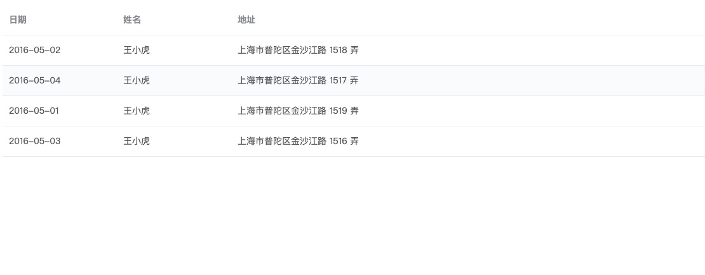
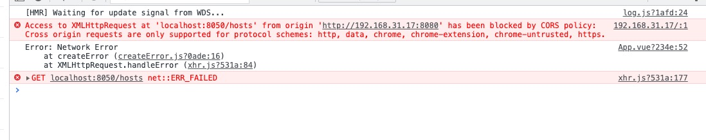
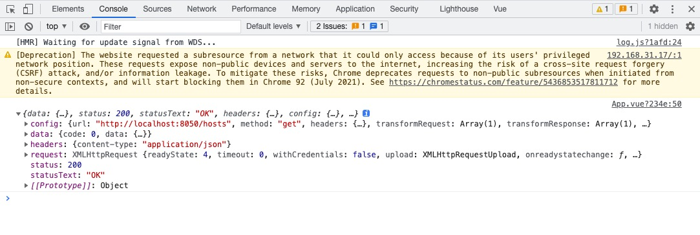
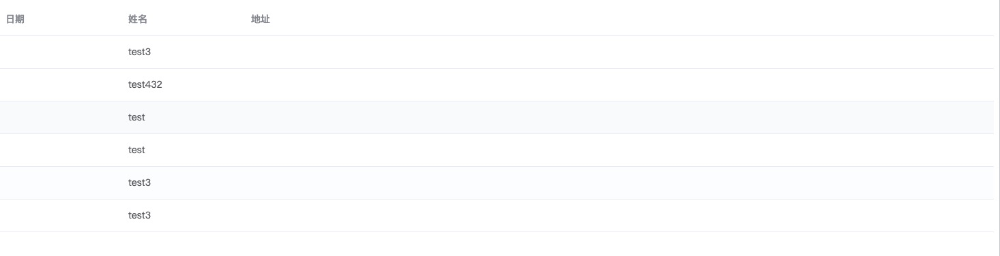
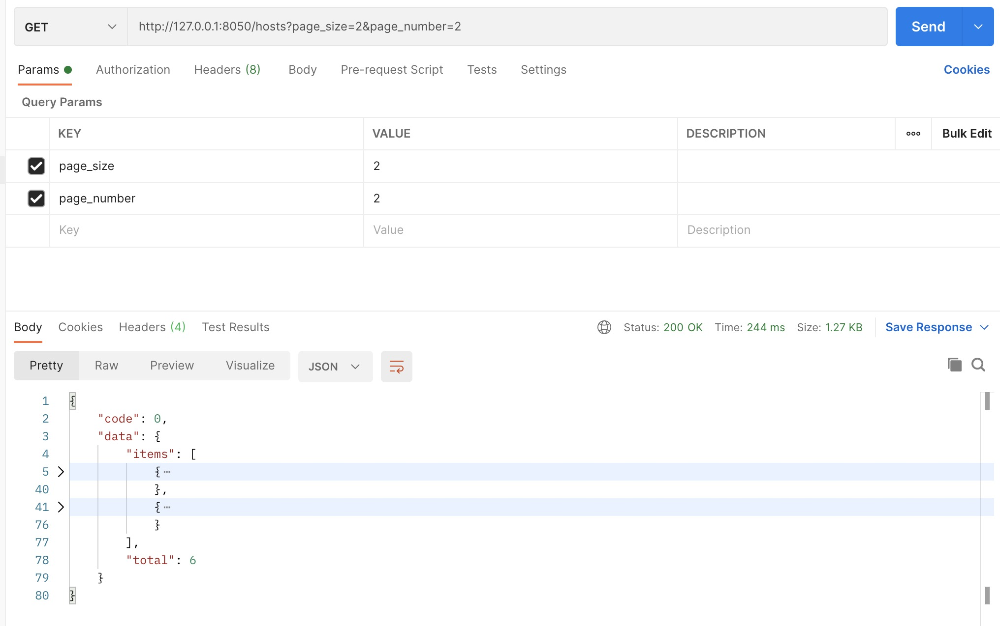
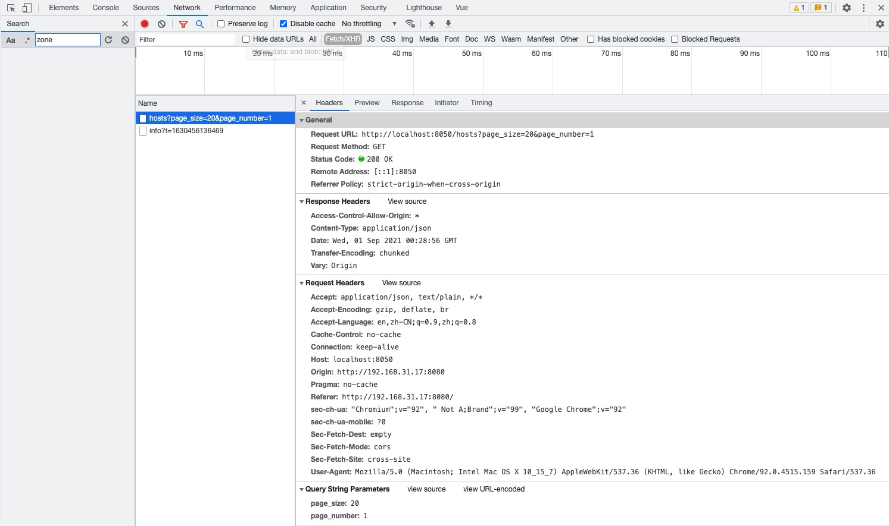
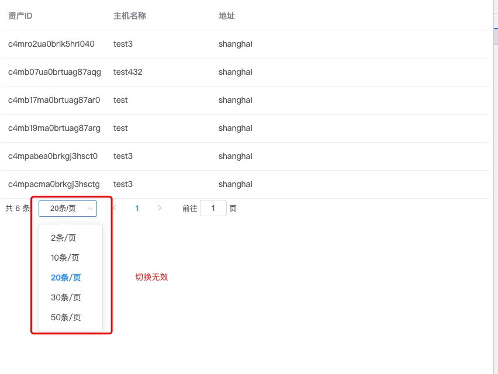
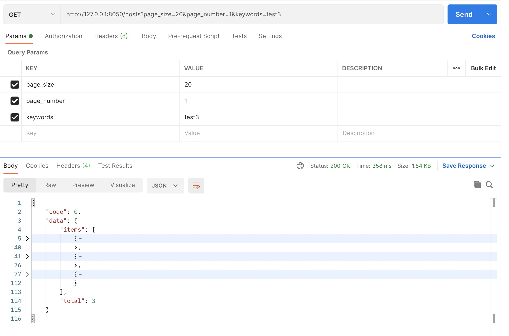
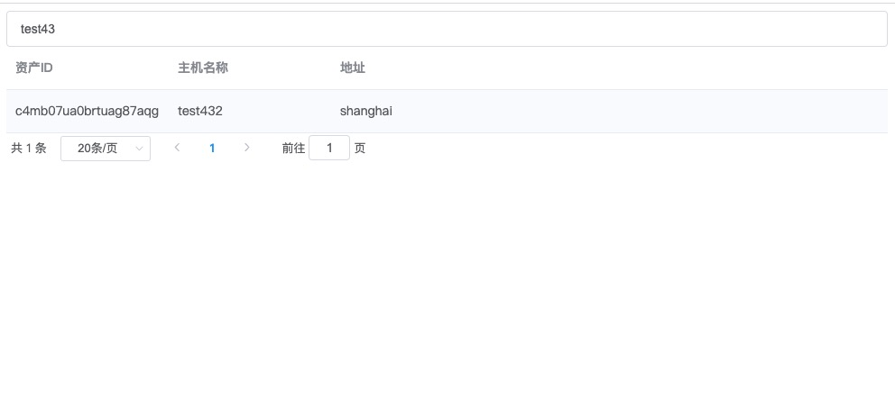

# Demo前端

我们采用vue简单做个展示页面

## 安装node

NodeJS[下载地址](https://nodejs.org/zh-cn/), 安装最新的版本

下面是我当前环境:
```sh
$ node -v
v14.17.1
$ npm -v
6.14.13
```

## 使用国内源

我们可以通过 `npm config get registry` 查看当前配置的源是那个
```sh
$ npm config get registry
https://registry.npmjs.org/
```

npm官方源下载依赖的速度很慢, 所以往往我们都需要更新成国内的源, 下面是使用淘宝的源

```sh
$ npm config set registry http://registry.npm.taobao.org/
$ npm config get registry
http://registry.npm.taobao.org/
```

到处我们就更换成了国内源的地址

## 安装vue2

```sh
# 最新稳定版
$ npm install -g vue
```

官方同时提供了1个cli工具, 用于快速初始化一个vue工程, 官方文档: [vue-cli](https://cli.vuejs.org/)

安装项目脚手架工具:
```
sudo npm install -g @vue/cli
```

## 初始化一个vue工程

到我们的demo工程下面, 使用脚手架初始化vue 前端工程ui
```sh
$ vue create ui
```

然后运行项目
```sh
$ npm run serve
```

## 引入UI组件

安装element ui: [官方安装文档](https://element.eleme.cn/#/zh-CN/component/installation)

```sh
$ npm i element-ui -S
```


将element ui组件库和样式库 引入到我们的vue项目中, 入口文件:main.js:
```js
import ElementUI from "element-ui"
import "element-ui/lib/theme-chalk/index.css"

Vue.use(ElementUI)
```

然后我们到[element官网](https://element.eleme.cn/), 找个样式验证下

```js
<template>
  <div id="app">
    
    <HelloWorld msg="Welcome to Your Vue.js App"/>
    <el-row>
      <el-button>默认按钮</el-button>
      <el-button type="primary">主要按钮</el-button>
      <el-button type="success">成功按钮</el-button>
      <el-button type="info">信息按钮</el-button>
      <el-button type="warning">警告按钮</el-button>
      <el-button type="danger">危险按钮</el-button>
    </el-row>
  </div>
</template>
```

效果如下:


## 使用Table展示数据

我们使用table来展示我们的主机列表, 因此我们直接复制官方的table样咧过来
```js
  <template>
    <el-table
      :data="tableData"
      style="width: 100%">
      <el-table-column
        prop="date"
        label="日期"
        width="180">
      </el-table-column>
      <el-table-column
        prop="name"
        label="姓名"
        width="180">
      </el-table-column>
      <el-table-column
        prop="address"
        label="地址">
      </el-table-column>
    </el-table>
  </template>

  <script>
    export default {
      data() {
        return {
          tableData: [{
            date: '2016-05-02',
            name: '王小虎',
            address: '上海市普陀区金沙江路 1518 弄'
          }, {
            date: '2016-05-04',
            name: '王小虎',
            address: '上海市普陀区金沙江路 1517 弄'
          }, {
            date: '2016-05-01',
            name: '王小虎',
            address: '上海市普陀区金沙江路 1519 弄'
          }, {
            date: '2016-05-03',
            name: '王小虎',
            address: '上海市普陀区金沙江路 1516 弄'
          }]
        }
      }
    }
  </script>
```

样式有点丑, 但不要在意这些，这才是开始



## 对接后端接口数据

这里需要一个http客户端来访问我们的API, 而 axios 就是其中最流行的一种, 当然首先我们需要安装它

```sh
npm install axios
```

关于axios的使用, 可以参考这个[Vue.js Ajax(axios)](https://www.runoob.com/vue2/vuejs-ajax-axios.html) 提前摸索下

启动我们后端服务, 并测试接口可用性(api目录下)
```sh
$ go run main.go -f etc/demo-api.toml start
2021-08-31T21:27:44.391+0800    INFO    [INIT]  cmd/start.go:138        log level: debug
2021-08-31T21:27:44.650+0800    INFO    [API]   protocol/http.go:86     HTTP服务启动成功, 监听地址: 0.0.0.0:8050
2021-08-31T21:33:45.582+0800    DEBUG   [Host]  impl/host.go:59 sql: SELECT * FROM resource as r LEFT JOIN host h ON r.id=h.resource_id ORDER BY sync_at DESC LIMIT ?,? ;
```

测试接口
```sh
$ curl localhost:8050/hosts
```

下面我们导入axios库, 然后使用它请求我们测试ok的接口

```js
  <template>
    <el-table
      :data="tableData"
      style="width: 100%">
      <el-table-column
        prop="date"
        label="日期"
        width="180">
      </el-table-column>
      <el-table-column
        prop="name"
        label="姓名"
        width="180">
      </el-table-column>
      <el-table-column
        prop="address"
        label="地址">
      </el-table-column>
    </el-table>
  </template>

<script>
import axios from 'axios';

export default {
  data() {
    return {
      tableData: [{
        date: '2016-05-02',
        name: '王小虎',
        address: '上海市普陀区金沙江路 1518 弄'
      }, {
        date: '2016-05-04',
        name: '王小虎',
        address: '上海市普陀区金沙江路 1517 弄'
      }, {
        date: '2016-05-01',
        name: '王小虎',
        address: '上海市普陀区金沙江路 1519 弄'
      }, {
        date: '2016-05-03',
        name: '王小虎',
        address: '上海市普陀区金沙江路 1516 弄'
      }]
    }
  },
  mounted() {
    axios
      .get('http://localhost:8050/hosts')
      .then(response => {
        console.log(response)
      })
      .catch(function (error) { // 请求失败处理
        console.log(error);
      });
  }
}
</script>
```

然后我们刷下页面查看, 按F12 打开chrome的调试模式，看看控制台有没有如期打印出API调用后的返回



## 解决跨域问题

关于CORS, 可以参考[跨域资源共享 CORS 详解](https://www.ruanyifeng.com/blog/2016/04/cors.html)

解决方式有2种:
+ 前端使用代理
+ 后端开发允许

这里采用后端的解决方式:

这里使用中间件来解决 [cros中间件](https://github.com/rs/cors/blob/master/examples/httprouter/server.go)
```go
server := &http.Server{
    ReadHeaderTimeout: 60 * time.Second,
    ReadTimeout:       60 * time.Second,
    WriteTimeout:      60 * time.Second,
    IdleTimeout:       60 * time.Second,
    MaxHeaderBytes:    1 << 20,
    Addr:              conf.C().App.Addr(),
    Handler:           cors.AllowAll().Handler(r),
}
```




## 数据绑定视图

```js
mounted() {
axios
    .get('http://localhost:8050/hosts')
    .then(response => {
    this.tableData = response.data.data.items
    console.log(this.tableData)
    })
    .catch(function (error) { // 请求失败处理
    console.log(error);
    });
}
```

我们将请求回来的数据保存到tableData, table这个视图绑定了变量tableData, 这样视图会跟随数据的变化而变化



最后我们调整需要展示的字段


## 添加分页

我们先验证后端API接口的分页功能




参照官方文档: [Pagination 分页](https://element.eleme.cn/#/zh-CN/component/pagination)

调整后的模版:

```js
  <template>
  <div>
    <el-table
      :data="tableData"
      style="width: 100%">
      <el-table-column
        prop="id"
        label="资产ID"
        width="180">
      </el-table-column>
      <el-table-column
        prop="name"
        label="主机名称"
        width="180">
      </el-table-column>
      <el-table-column
        prop="region"
        label="地址">
      </el-table-column>
    </el-table>
    <el-pagination
      @size-change="handleSizeChange"
      @current-change="handleCurrentChange"
      :current-page="query.page_number"
      :page-sizes="[2, 10, 20, 30, 50]"
      :page-size="query.page_size"
      layout="total, sizes, prev, pager, next, jumper"
      :total="total">
    </el-pagination>
  </div>

  </template>

<script>
import axios from 'axios';

export default {
  data() {
    return {
      query: {
        page_size: 20,
        page_number: 1,
      },
      total: 0,
      tableData: []
    }
  },
  mounted() {
    this.getHosts()
  },
  methods: {
    getHosts() {
      axios
        .get('http://localhost:8050/hosts', {params: this.query})
        .then(response => {
          this.tableData = response.data.data.items
          this.total = response.data.data.total
          console.log(this.tableData)
        })
        .catch(function (error) { // 请求失败处理
          console.log(error);
        });
    },
    handleSizeChange(val) {
      this.getHosts()
    },
    handleCurrentChange(val) {
      this.getHosts()
    }
  },
}
</script>
```

打开控制台，我们的请求已经携带参数了:



现在分页效果基本已经出来, 但是切换缺没有效果



我们需要切换时修改参数并再次向服务端 请求数据

```js
  methods: {
    getHosts() {
      axios
        .get('http://localhost:8050/hosts', {params: this.query})
        .then(response => {
          this.tableData = response.data.data.items
          this.total = response.data.data.total
          console.log(this.tableData)
        })
        .catch(function (error) { // 请求失败处理
          console.log(error);
        });
    },
    handleSizeChange(val) {
      this.query.page_size = val
      this.getHosts()
    },
    handleCurrentChange(val) {
      this.query.page_number = val
      this.getHosts()
    }
  },
```

## 后端添加关键字搜索

后端支持关键字搜索, 添加keyworkds查询参数:

```go
type QueryHostRequest struct {
	PageSize   uint64 `json:"page_size,omitempty"`
	PageNumber uint64 `json:"page_number,omitempty"`
	Keywords   string `json:"keywords"`
}
```

添加过滤逻辑
```go
func (s *service) QueryHost(ctx context.Context, req *host.QueryHostRequest) (*host.HostSet, error) {
	query := sqlbuilder.NewQuery(queryHostSQL)
	if req.Keywords != "" {
		query.Where("r.name LIKE ?", "%"+req.Keywords+"%")
	}
  ...
}
```

http 协议处理处, 接收该参数
```go
func NewQueryHostRequestFromHTTP(r *http.Request) *QueryHostRequest {
	qs := r.URL.Query()

  ...

	return &QueryHostRequest{
		PageSize:   psUint64,
		PageNumber: pnUint64,
		Keywords:   qs.Get("keywords"),
	}
}
```



## 前端添加关键字搜索框

我们使用输入框接收用户输入的关键字参数: [Input 输入框](https://element.eleme.cn/#/zh-CN/component/input)

```js
  <template>
  <div>
    <el-input v-model="query.keywords" placeholder="请输入内容"></el-input>
    ...
  </div>
</template>

export default {
  data() {
    return {
      query: {
        keywords: '',
        page_size: 20,
        page_number: 1,
      },
      ...
    }
  },
```

然后我们绑定下 键盘回车键(enter), 当用户输入完成 回车时触发搜索

```js
<el-input v-model="query.keywords" @keyup.enter.native="getHosts" placeholder="请输入内容"></el-input>
```

最好验证界面效果:


