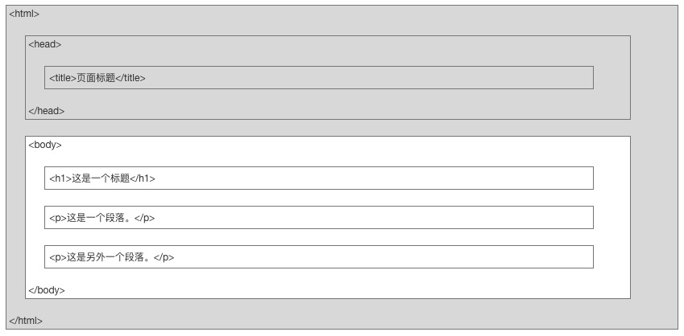

# Web入门基础-HTLM

## HTML 网页结构



## 标签与元素

像上图中的:
+ html
+ head
+ title
+ body
+ h1
+ p

这些都是标签, 像这样的标签有很多: [HTML 参考手册- (HTML5 标准)](https://www.runoob.com/tags/ref-byfunc.html)


而HTML元素是指一个具体的标签实例, 比如下面有2个HTML元素，都是h标签
```html
<h1>这是一个标题</h1>
<h1>这是另一个标题</h1>
```

而整个网页也就是是由这些标签组成的HTML元素嵌套组成

## 元素语法

```html
<tag att1=v1 attr2=v2>内容</tag>
```

每种标签都有自己的一组属性, 属性分为2类:
+ 全局属性: 所有标签都有的属性
    + id	定义元素的唯一id
    + class	为html元素定义一个或多个类名（classname）(类名从样式文件引入)
    + style	规定元素的行内样式（inline style）
    + title	描述了元素的额外信息 (作为工具条使用)
    + 更多属性请参考: [HTML 全局属性](https://www.runoob.com/tags/ref-standardattributes.html)
+ 标签属性: 每种标签肯能还有一些该标签才特有的一些属性
    + href 需要有引用的属性的标签才有这个属性, 比如 链接(a标签) 和 图片(img标签)

## 常用标签

基础标签:
```
<h1> to <h6>  定义 HTML 标题
<p>	          定义一个段落
<br>	      定义简单的折行。
<hr>	      定义水平线。
<!--...-->	  定义一个注释
```

文本标签:
```
del 定义被删除文本。
i   定义斜体文本
ins 定义被插入文本
sub 下标文字
sup 上标文字
u   下划线文本
```

表单标签:
```
form
input
...
```

常见元素:
```
iframe 嵌套外部网页
img    展示图像
area   标签定义图像映射内部的区域: https://www.runoob.com/try/try.php?filename=tryhtml_areamap
a      链接标签

ul     定义一个无序列表
ol     定义一个有序列表
li   定义一个列表项
```

表格:
```
table  标签定义 HTML 表格, 一个 HTML 表格包括 <table> 元素，一个或多个 <tr>、<th> 以及 <td> 元素。
tr     元素定义表格行，
th     元素定义表头，
td     元素定义表格单元
```

容器元素
```
div    标签定义 HTML 文档中的一个分隔区块或者一个区域部分, 标签常用于组合块级元素，以便通过 CSS 来对这些元素进行格式化
span   用于对文档中的行内元素进行组合 标签提供了一种将文本的一部分或者文档的一部分独立出来的方式
```

## 元素id
标识该元素的唯一身份, 并且可以在其他地方引用

比如，通过a标题跳转到指定的位置:
```html
<p>
<a href="#C4">查看章节 4</a>
</p>

<h2>章节 1</h2>
<p>这边显示该章节的内容……</p>

<h2>章节 2</h2>
<p>这边显示该章节的内容……</p>

<h2>章节 3</h2>
<p>这边显示该章节的内容……</p>

<h2><a id="C4">章节 4</a></h2>
<p>这边显示该章节的内容……</p>
```

id 也是js操作元素的重要依据之一:

```js
document.getElementById('C4')
<a id=​"C4">​章节 4​</a>​
```

## 元素的样式

通过元素的style属性可以控制该元素的样式

比如我们可以把p元素里面的这段话的字体加大, 演示改为红色
```html
<p style="color:red;font-size:20px;">这边显示该章节的内容……</p>
```

语法的格式:  key: value; 分号分开的就是一个样式条目, 我们可以为一个元素添加很多样式

再比如控制元素的宽和高
```html
<iframe src="//www.runoob.com" sytle="height: 200px;width: 400px;">
    <p>您的浏览器不支持  iframe 标签。</p>
</iframe>
```

一个元素的样式属性是有很多的 我们到css时再讲解

## 脚本

有了元素和样式，我们的页面还是一个静态页面, 比如页面加载完成后，我要动态修改里面的元素这么办?,  这就需要用到我们前面学的js脚本了

```
<script> 标签用于定义客户端脚本，比如 JavaScript
<script> 元素既可包含脚本语句，也可通过 src 属性指向外部脚本文件
```

比如下面:
```js
// 通过src 网络引入
<script src="https://cdn.jsdelivr.net/npm/vue@2.6.14"></script>

// 通过本地文件引入
<script>
  import axios from 'axios';
</script>
```


JavaScript 最常用于图片操作、表单验证以及内容动态更新

```html
<script>
c4 = document.getElementById('C4')
// <a id=​"C4">​章节 4​</a>​
c4.innerText
// '章节 4'
c4.innerText = '章节 5'
// '章节 5'
</script>
```

