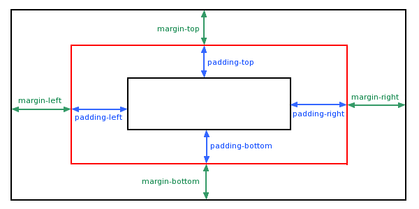

# Web入门基础-CSS

前面部分我们知道可以通过直接指定style属性来配置 DOM元素的样式, 比如:
```html
<p style="color:red;font-size:20px;">这边显示该章节的内容……</p>
```

如果一个页面上 有多个元素都是用了这个样式, 那我们该怎么办? 

这种时候我们就需要将样式独立出来, 单独写到一个保存在外部的 .css 文件中, 这就形成了css

## CSS语法

我们来看一个简单的例子: 对所有的p标签 使用下面定义的样式

```css
/* 这是个注释 */
p {
  color: red;
}
```

我们可以看到css的语法由2个部分组成:
+ 选择器, 对应p, 用于选择样式生效的范围，也就是对那些元素生效
+ 样式属性（style attribute), 也就是具体需要添加的样式是啥, 属性有key和value组成, 多个属性用`;`分开


注释是用来解释你的代码，并且可以随意编辑它，浏览器会忽略它。

CSS注释以 /* 开始, 以 */ 结束, 比如上面

## CSS选择器

详情请参考: [CSS 选择器](https://www.runoob.com/cssref/css-selectors.html)


### 基础选择器

基础选择器有3种:
+ 标签, 标签名称, 比如  h1
+ 类,   类名称,  比如   .className
+ ID,  元素id,  比如  #id

#### 标签选择器

以标签名开头，选择所有div元素, 比如前面的p标签选择器就是这种

比如下面是所有h1标签 都显示为红色
```css
h1 {
  color: red;
}
```

#### 类选择器

给标签取class名，以点（.）加class名开头，选择所有该class名的元素

```html
<h1 class="f12">基础标签</h1>

<style scoped>

.f12 {
  font-size: 12px;
}

</style>
```

这是最常用的一种选择器

#### id选择器

给标签取id名，以#加id名开头，具有唯一性

```html
<h2><a id="C4">章节 4</a></h2>

<style scoped>

#C4 {
  color: blue;
}

</style>
```

#### 群选择器

我们也可以组合使用, 一次选择多个元素，比如 h1, .f12,#C4 都选中, 语法: 以，分隔多个选中的元素

```html
<style scoped>

h1,.f12,#C4 {
  color: blue;
}

</style>
```

#### 全局选择器

既然有多选，那就有全选, 语法: *

```html
<style scoped>

* {
  color: blue;
}

</style>
```

### 层级选择器

如果我们直接选择元素的话，可能会很多，并不能精确选中我们需要的元素, 因此我们就可以引入层级关系来选择, 比如 div元素下的p标签，而不是顶层p标签

总共有4种层级关系选择器:
+ 子选择器:   父元素>子元素
+ 包含选择器: 父元素 包含的元素
+ 兄弟选择器: 当前元素～兄弟元素
+ 相邻选择器: 当前元素+相邻元素

#### 子选择器

用于已知父元素, 选择子元素, 具体语法: 以>隔开父子级元素，(模块名>模块名，修饰>前模块内的子模块)

比如列表下面的所有元素，我都把字体加粗

```html
<ul id="list_menu" class="ul_class">
    <li id="coffee">Coffee</li>
    <li>Tea</li>
    <li>Milk</li>
</ul>

<style scoped>

ul>li {
  font-weight: 600;
}

</style>
```

子选择其，只能选择其当前层的七子元素, 如果 不是就无法选中, 比如

```html
<ul id="list_menu" class="ul_class">
    <li id="coffee">Coffee</li>
    <li>Tea</li>
    <li>Milk</li>
    <div>
    <li>In Div</li>
    </div>
</ul>
```

那如果才能选择该元素下的所有li元素喃? 答案是: 包含选择器

#### 包含选择器

包含选择器 可以选择父元素下的 包含该标签的所有元素, 语法是: 父元素  子元素

```html
<ul id="list_menu" class="ul_class">
    <li id="coffee">Coffee</li>
    <li>Tea</li>
    <li>Milk</li>
    <div>
    <li>In Div</li>
    </div>
</ul>

<style scoped>

ul li {
  font-weight: 600;
}

</style>
```

#### 兄弟选择器

如果你需要选择从一层级的兄弟元素, 比如 #coffee同层的li元素, 语法: 同层元素～需要选中的同层元素

```html
<ul id="list_menu" class="ul_class">
    <li id="coffee">Coffee</li>
    <li>Tea</li>
    <li>Milk</li>
    <div>
    <li>In Div</li>
    </div>
</ul>

<style scoped>

#coffee~li {
  font-weight: 600;
}

</style>
```

#### 相邻选择器

同理, 只选择相邻的，而不是同层所有的

```html
<ul id="list_menu" class="ul_class">
    <li id="coffee">Coffee</li>
    <li>Tea</li>
    <li>Milk</li>
    <div>
    <li>In Div</li>
    </div>
</ul>

<style scoped>

#coffee+li {
  font-weight: 600;
}

</style>
```

### 其他常用选择器

#### 属性选择器

元素会有多属性, 我们可以根据元素的属性来选择元素, 比如下面的input框

```html
<form action="demo_form.php">
    <input type="submit" value="提交">
</form>

<style scoped>

[type=submit] {
  font-size: 22px;
}

</style>
```

#### 伪类选择器

当我们选中一堆元素后, 如果我们对其中部分元素 进行选择 就可以使用伪类选择器

语法如下:
```
选择的元素:函数方法
```

+ first-child: 第一个
+ last-child: 最后一个
+ nth-child(n): 第n个元素
+ not(): not函数， 不包含

```html
<ul id="list_menu" class="ul_class">
    <li id="coffee">Coffee</li>
    <li>Tea</li>
    <li>Milk</li>
</ul>

<style scoped>

ul>li:first-child {
  font-weight: 600;
}

</style>
```

所有CSS伪类/元素请参考: [CSS伪类](https://www.runoob.com/css/css-pseudo-classes.html)

## CSS引入方式

### 内联

这种是在标签内直接写的，style="attr:value;..."

```html
<el-table
    :data="tableData"
    style="width: 100%">
    ...
</el-table>
```

### 内嵌

通过style标签定义的样式

```html
<style scoped>

ul>li:first-child {
  font-weight: 600;
}

</style>
```

### 外联

当样式需要被应用到很多页面的时候，外部样式表将是理想的选择。使用外部样式表，你就可以通过更改一个文件来改变整个站点的外观

```html
<head>
<link rel="stylesheet" type="text/css" href="mystyle.css">
</head>
```

## 样式基础


### CSS单位

我们在布局或者设置字体大小的时候经常看到: 22px;, px其实是css里面长度单位

绝对长度
+ px *	像素 (1px = 1/96th of 1in)
+ cm	厘米
+ mm	毫米	
+ in	英寸 (1in = 96px = 2.54cm)	


相对长度
+ em	它是描述相对于应用在当前元素的字体尺寸，所以它也是相对长度单位。一般浏览器字体大小默认为16px，则2em == 32px
+ ex	依赖于英文字母小 x 的高度	
+ ch	数字 0 的宽度	
+ rem	rem 是根 em（root em）的缩写，rem作用于非根元素时，相对于根元素字体大小；rem作用于根元素字体大小时，相对于其出初始字体大小
+ vw	viewpoint width，视窗宽度，1vw=视窗宽度的1%	
+ vh	viewpoint height，视窗高度，1vh=视窗高度的1%	
+ vmin	vw和vh中较小的那个。	
+ vmax	vw和vh中较大的那个。


### CSS颜色

请参考: [CSS 颜色](https://www.w3school.com.cn/cssref/css_colors.asp)


## 常用属性

这里主要介绍下用于布局的常用属性


### 元素尺寸控制

+ height	设置元素的高度。
+ width	设置元素的宽度。
+ line-height	设置行高。
+ min-width	设置元素的最小宽度。
+ min-height	设置元素的最小高度。
+ max-height	设置元素的最大高度。
+ max-width	设置元素的最大宽度。

```html
<div style="height: 220px;width:440px">
    <p>我们的内容</p>
</div>
```

### 盒子模型


+ Margin(外边距)  清除边框外的区域，外边距是透明的。
+ Border(边框)  围绕在内边距和内容外的边框。
+ Padding(内边距) 清除内容周围的区域，内边距是透明的。
+ Content(内容) 盒子的内容，显示文本和图像。



```html
<div style="height: 220px;width:440px">
    <p style="margin-top:22px;">我们的内容</p>
</div>
```

### Display

+ inline: 现在在一行
+ block:  块元素是一个元素，占用了全部宽度，在前后都是换行符
+ flex: flex布局, 见后面参考

```html
<div>
    <li style="display: inline;">Tea</li>
    <li style="display: inline;">Milk</li>
</div>

<div>
    <span style="display: block;">span1</span>
    <span style="display: block;">span2</span>
</div>
```

### Overflow

overflow 属性可以控制内容溢出元素框时在对应的元素区间内添加滚动条

+ visible	默认值。内容不会被修剪，会呈现在元素框之外。
+ hidden	内容会被修剪，并且其余内容是不可见的。
+ scroll	内容会被修剪，但是浏览器会显示滚动条以便查看其余的内容。
+ auto	如果内容被修剪，则浏览器会显示滚动条以便查看其余的内容。
+ inherit	规定应该从父元素继承 overflow 属性的值

```html
<div id="overflowTest">
    <p>这里的文本内容是可以滚动的，滚动条方向是垂直方向。</p>
    <p>这里的文本内容是可以滚动的，滚动条方向是垂直方向。</p>
    <p>这里的文本内容是可以滚动的，滚动条方向是垂直方向。</p>
    <p>这里的文本内容是可以滚动的，滚动条方向是垂直方向。</p>
    <p>这里的文本内容是可以滚动的，滚动条方向是垂直方向。</p>
    <p>这里的文本内容是可以滚动的，滚动条方向是垂直方向。</p>
</div>

<style scoped>
#overflowTest {
    background: #4CAF50;
    color: white;
    padding: 15px;
    width: 80%;
    height: 100px;
    overflow: scroll;
    border: 1px solid rgb(150, 18, 18);
}
</style>
```

### 浮动

控制元素左移还是右移

+ left
+ right

元素浮动之后，周围的元素会重新排列，为了避免这种情况，使用 clear 属性

```html
<div>
    <span style="display: block;">span1</span>
    <span style="display: block;">span2</span>
</div>

<div id="overflowTest" style="clear:both">
</div>
```

### 对齐

我们以常见的剧中为例:

```html
<div >
    <p>我是垂直居中的。</p>
</div>
```

如果仅仅是为了文本在元素内居中对齐，可以使用 text-align: center

设置行高到div 就整体剧中了


## 常用网站

相信我, 你CSS是写不出好看的样式的, 看看下面这些工具吧

+ [CSS布局教学](https://zh.learnlayout.com) 
+ [Flex布局教学游戏](http://flexboxfroggy.com)
+ [在线CSS代码可视工具](https://enjoycss.com)
+ [新拟态模拟工具](https://neumorphism.io)
+ [渐变色方案](https://uigradients.com/#Copper)