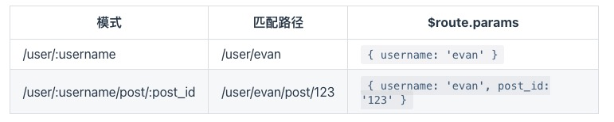
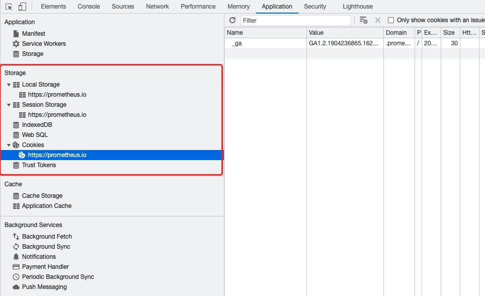

# Vue路由与状态管理

## 页面路由

我们看看当前的vue配置
```js
// Root Vue实例
new Vue({
  render: h => h(App),
}).$mount('#app')
```

你会发现无论我们访问的url path怎么变化 访问到的都是这个页面, 因为我们在渲染的时候并没有 按照path 来进行不同视图进行渲染的路由逻辑

### 简单路由

我们可以通过window.location.pathname 获取到当前浏览器的URL path
```js
location.pathname
'/mypath'
```

我们为每个path, 定义一个组件 就实现了一个简单的路由, 那我们重新定义渲染的逻辑
```js
// Root Vue实例
// 添加currentRoute数据 和 浏览器的path绑定
// 根据path 返回对应组件
new Vue({
  data: {
    currentRoute: window.location.pathname
  },
  render(h) {
    if (this.currentRoute === '/index') {
      return h(App2)
    }
    return h(App)
  },
}).$mount('#app')
```

> 验证我们的路由是否生效了

这个路由太过简单, 我们连一个菜单页都没有,直接硬跳, 如果想看稍我复杂点的可以看看官方的例子[自己处理路由](https://cn.vuejs.org/v2/guide/routing.html)

### vue-router

当我们还在手动鲁路由的时候，别人页面都出几个了，这就是vue-router的威力, 相比我们自己的工具，他更能发挥规模化的力量。

Vue Router 是 Vue.js (opens new window)官方的路由管理器。它和 Vue.js 的核心深度集成，让构建单页面应用变得易如反掌。包含的功能有：

+ 嵌套的路由/视图表
+ 模块化的、基于组件的路由配置
+ 路由参数、查询、通配符
+ 基于 Vue.js 过渡系统的视图过渡效果
+ 细粒度的导航控制
+ 带有自动激活的 CSS class 的链接
+ HTML5 历史模式或 hash 模式，在 IE9 中自动降级
+ 自定义的滚动条行为

#### 安装

第一个我们需要安装依赖, 当前项目下
```js
npm install vue-router
// vue-router@3.5.2
```

vue-router是vue的插件, 我们按照插件的方式引入到vue中
```js
import Vue from 'vue'
import VueRouter from 'vue-router'

Vue.use(VueRouter)
```

我们也可以使用cli一步到位, 案例一起提供

```js
vue add router
```

这样我们就可以在实例中使用vue-router插件提供的各种功能了

#### 起步

我们看看vue add router为我们生成的代码
```js
...
import router from './router'
...
// Root Vue实例
new Vue({
  el:'#app',
  router,
  render: h => h(App)
})
```

可以看到router的定义都在一个模块里面
```js
import Vue from 'vue'
import VueRouter from 'vue-router'
import Home from '../views/Home.vue'

Vue.use(VueRouter)

const routes = [
  {
    path: '/',
    name: 'Home',
    component: Home
  },
  {
    path: '/about',
    name: 'About',
    // route level code-splitting
    // this generates a separate chunk (about.[hash].js) for this route
    // which is lazy-loaded when the route is visited.
    component: () => import(/* webpackChunkName: "about" */ '../views/About.vue')
  }
]

const router = new VueRouter({
  mode: 'history',
  base: process.env.BASE_URL,
  routes
})

export default router
```

比如我们在添加一个页面: Test.vue
```html
<template>
  <div class="about">
    <h1>This is an test page</h1>
  </div>
</template>
```

然后我们补充到路由里面
```js
const routes = [
  {
    path: '/',
    name: 'Home',
    component: Home
  },
  {
    path: '/about',
    name: 'About',
    // route level code-splitting
    // this generates a separate chunk (about.[hash].js) for this route
    // which is lazy-loaded when the route is visited.
    component: () => import(/* webpackChunkName: "about" */ '../views/About.vue')
  },
  {
    path: '/test',
    name: 'Test',
    // route level code-splitting
    // this generates a separate chunk (about.[hash].js) for this route
    // which is lazy-loaded when the route is visited.
    component: () => import(/* webpackChunkName: "about" */ '../views/Test.vue')
  }
]
```

然后我们在界面上添加一个跳转
```html
<div id="nav">
  <router-link to="/">Home</router-link> |
  <router-link to="/about">About</router-link> |
  <router-link to="/test">Test</router-link>
</div>
```

> 测试下, 是不是很舒爽了


#### 编程式的导航

router-link这种组件是需要用户点击才能生效的, 如果 需要动态加载，或者跳转前检查用户的权限，这个时候再使用router-link就不合适了

在之前的学习中，我们知道 window.history 和 location 可以模拟我们操作浏览器
+ location.assign('/')
+ location.reload()
+ history.back()
+ history.forward()

vue-router为我们提供了一个函数用于js来控制路由那就是 push 功能和location.assign类似
```js
router.push(location, onComplete?, onAbort?)
// location    location参数 等价于 <router-link :to="...">, 比如<router-link :to="/home">  等价于 router.push('/home')
// onComplete  完成后的回调
// onAbort     取消后的回调
```

> console中 尝试下吧? 注意 console router在vm的实例上面哦: $vm.$router


我们调整下我们App.vue, 使用a标签
```html
<div id="nav">
  <a @click="jumpToHome">Home</a> |
  <a @click="jumpToAbout">About</a> |
  <a @click="jumpToTest">Test</a>
</div>
<script>
export default {
  name: 'App',
  data() {
    return {
    }
  },
  methods: {
    jumpToHome() {
      this.$router.push('/')
    },
    jumpToAbout() {
      this.$router.push('/about')
    },
    jumpToTest() {
      this.$router.push('/test')
    }
  },
}
</script>
```

#### 动态路由匹配

现在我们的遇到的路由都是静态的, 我们看看前后端路由的区别

```
后端:  path --->   handler
前端:  path --->   view
```

我们看看之前demo里面的http router路由
```go
r.GET("/hosts", api.QueryHost)
r.POST("/hosts", api.CreateHost)
r.GET("/hosts/:id", api.DescribeHost)
r.DELETE("/hosts/:id", api.DeleteHost)
r.PUT("/hosts/:id", api.PutHost)
r.PATCH("/hosts/:id", api.PatchHost)
```

vue-router的路由也支持像上面httprouter那样的路由匹配



我们修改测试页面, 改为动态匹配

```js
{
  path: '/test/:id',
  name: 'Test',
  // route level code-splitting
  // this generates a separate chunk (about.[hash].js) for this route
  // which is lazy-loaded when the route is visited.
  component: () => import(/* webpackChunkName: "about" */ '../views/Test.vue')
}
```

然后修改我们的视图, 显示这个id
```html
<template>
  <div class="about">
    <h1>This is an test page</h1>   
    <span>{{ $route.params }}</span>
  </div>
</template>
```

我们还漏了一个404的处理, 如果我们找不页面, 也需要返回一个视图, 告诉用户也没不存在

vue-router在处理404的方式和后端不同, 路由依次匹配, 如果都匹配不上 写一个特殊的*路由作为 404路由
```
... 业务路由
{
  // 会匹配所有路径
  path: '*'
}
```

那我们补充一个404路由
```js
const routes = [
  {
    path: '/',
    name: 'Home',
    component: Home
  },
  {
    path: '/about',
    name: 'About',
    // route level code-splitting
    // this generates a separate chunk (about.[hash].js) for this route
    // which is lazy-loaded when the route is visited.
    component: () => import(/* webpackChunkName: "about" */ '../views/About.vue')
  },
  {
    path: '/test/:id',
    name: 'Test',
    // route level code-splitting
    // this generates a separate chunk (about.[hash].js) for this route
    // which is lazy-loaded when the route is visited.
    component: () => import(/* webpackChunkName: "about" */ '../views/Test.vue')
  },
  {
    path: '*',
    name: '404',
    // route level code-splitting
    // this generates a separate chunk (about.[hash].js) for this route
    // which is lazy-loaded when the route is visited.
    component: () => import(/* webpackChunkName: "about" */ '../views/404.vue')
  }
]
```

#### 加载数据

你也许会问: 这有什么卵用? 就为了打印下id吗? 那我们做一个完整详情页面

我们可以使用这个来做详情页面, 根据不同的id 完后端获取不同的对象, 用于显示

如何请求id对应的后端数据, 通过axios, 因此提前按照下他
```js
// axios@0.21.4
npm install --save axios
```

我们之前是这样使用axios的:

```js
getHosts() {
  // loading
    axios
      .get('http://localhost:8050/hosts', {params: this.query})
      .then(response => {
        console.log(response)
        this.tableData = response.data.data.items
        this.total = response.data.data.total
        console.log(this.tableData)
      })
      .catch(function (error) { // 请求失败处理
        console.log(error);
      });
  },
```

这种方式短平快, 但是上了规模后就会有问题:
+ 后期接口有变更怎么办? 一个一个找来更新吗?
+ 我有一些通用的中间件需要加载, 每次请求时，添加token头

首先我们需要将ajax封装下, 因为需要添加一些通用逻辑, 模块位于 utils/request.js
```js
import axios from 'axios'

// create an axios instance
const service = axios.create({
    baseURL: 'http://localhost:8050', // url = base url + request url
    // withCredentials: true, // send cookies when cross-domain requests
    timeout: 5000 // request timeout
  })


// request interceptor
service.interceptors.request.use(
    config => {
      return config
    },
    error => {
      // do something with request error
      console.log(error) // for debug
      return Promise.reject(error)
    }
)


// response interceptor
service.interceptors.response.use(
    /**
     * If you want to get http information such as headers or status
     * Please return  response => response
    */
  
    /**
     * Determine the request status by custom code
     * Here is just an example
     * You can also judge the status by HTTP Status Code
     */
    response => {
      const res = response.data
      // if the custom code is not 20000, it is judged as an error.
      if (res.code !== 0) {
        // 比如 token过期
      } else {
        // 正常
        return res
      }
    },
    error => {
      console.log('err' + error) // for debug
      // 传递出去
      return Promise.reject(error)
    }
)
  
export default service
```

紧接着我们新增一个api目录用于存放我们所有的API请求, 在里面新建一个模块: test.js
```js
import request from '../utils/request'

export function GET_TEST_DATA(id, query) {
  return request({
    url: `/hosts/${id}`,
    method: 'get',
    params: query
  })
}
```

最后在我们的视图中使用: Test.vue

选择在什么时候加载数据是个问题，通常有2种方案:
+ 导航完成之后获取：先完成导航，然后在接下来的组件生命周期钩子中获取数据。在数据获取期间显示“加载中”之类的指示。
+ 导航完成之前获取：导航完成前，在路由进入的守卫中获取数据，在数据获取成功后执行导航。

下面选择第一种, 因为通常详情页面 都是先跳转过去, 显示加载中:
```js
<script>
import { GET_TEST_DATA } from '../api/test'

export default {
  name: 'Test',
  data () {
    return {
      loading: false,
      post: null,
      error: null
    }
  },
  created () {
    // 组件创建完后获取数据，
    // 此时 data 已经被 observed 了
    this.fetchData()
  },
  watch: {
    // 如果路由有变化，会再次执行该方法
    '$route': 'fetchData'
  },
  methods: {
      async fetchData () {
        this.error = this.post = null
        this.loading = true
        // replace GET_TEST_DATA with your data fetching util / API wrapper
        try {
          this.loading = true
          let resp = await GET_TEST_DATA(this.$route.params.id)
          this.post = resp.data
        } catch (err) {
          this.error = err.toString()
        } finally {
          this.loading = false
        }
      }
    }
}
</script>
```

第二种方式 主要是在router的钩子中获取数据:
+ beforeRouteEnter: 进入路由前
+ beforeRouteUpdate: 路由update前

具体请参考: [在导航完成前获取数据](https://router.vuejs.org/zh/guide/advanced/data-fetching.html#%E5%9C%A8%E5%AF%BC%E8%88%AA%E5%AE%8C%E6%88%90%E5%89%8D%E8%8E%B7%E5%8F%96%E6%95%B0%E6%8D%AE)


#### Router对象

讲了那么就的router, router到底有写啥，我们可以看看Router的定义:

```ts
export declare class VueRouter {
  constructor(options?: RouterOptions)

  app: Vue
  options: RouterOptions
  mode: RouterMode
  currentRoute: Route

  beforeEach(guard: NavigationGuard): Function
  beforeResolve(guard: NavigationGuard): Function
  afterEach(hook: (to: Route, from: Route) => any): Function
  push(location: RawLocation): Promise<Route>
  replace(location: RawLocation): Promise<Route>
  push(
    location: RawLocation,
    onComplete?: Function,
    onAbort?: ErrorHandler
  ): void
  replace(
    location: RawLocation,
    onComplete?: Function,
    onAbort?: ErrorHandler
  ): void
  go(n: number): void
  back(): void
  forward(): void
  match (raw: RawLocation, current?: Route, redirectedFrom?: Location): Route
  getMatchedComponents(to?: RawLocation | Route): Component[]
  onReady(cb: Function, errorCb?: ErrorHandler): void
  onError(cb: ErrorHandler): void
  addRoutes(routes: RouteConfig[]): void

  addRoute(parent: string, route: RouteConfig): void
  addRoute(route: RouteConfig): void
  getRoutes(): RouteRecordPublic[]

  resolve(
    to: RawLocation,
    current?: Route,
    append?: boolean
  ): {
    location: Location
    route: Route
    href: string
    // backwards compat
    normalizedTo: Location
    resolved: Route
  }
```


#### Router钩子

如果需要在路由前后做一些额外的处理, 这就需要路由为我们留钩子, 最常见的使用钩子的地方是认证, 在访问页面的时候, 判断用户是否有权限访问

router为我们提供了如下钩子
+ beforeEach: 路由前处理
+ beforeEnter
+ beforeRouteEnter
+ beforeRouteUpdate
+ beforeRouteLeave
+ afterEach: 路由后出来

我们为router设置钩子函数验证下:
```js
router.beforeEach((to, from, next) => {
  console.log(to, from, next)
  next()
})

router.afterEach((to, from) => {
  console.log(to, from)
})

```

广泛使用的就beforeEach和afterEach, 我们以此为例, 做一个简单的页面加载progress bar

这里我们选用nprogress这个库来实现: [NPM NProgress](https://www.npmjs.com/package/nprogress)

```js
// nprogress@0.2.0
npm install --save nprogress
```

这玩意使用也简单
```js
NProgress.start();
NProgress.done();

NProgress.set(0.0);     // Sorta same as .start()
NProgress.set(0.4);
NProgress.set(1.0);     // Sorta same as .done()
```

我们先引入库和样式
```js
import NProgress from 'nprogress' // progress bar
import 'nprogress/nprogress.css' // progress bar style

// 路由开始时: NProgress.start();
// 路由结束时: NProgress.done();
```

按照这个逻辑修改我们的router
```js
router.beforeEach((to, from, next) => {
  // start progress bar
  NProgress.start()
  
  console.log(to, from, next)
  next()
})

router.afterEach(() => {
  // finish progress bar
  NProgress.done()
})
```

这个颜色好像不行? 我们怎么调整下喃?

找到样式，调整好 写入一个文件中: styles/index.css, 等下全局加载
```css
#nprogress .bar {
    background:#13C2C2;
  }
```

在main.js加载全局样式
```js
// 加载全局样式
import './styles/index.css'
```

## 页面状态

举个简单的例子, 我们每个页面在访问后端数据的时候 都需要token, 那么所有组件都依赖token这个数据, 我们就需要找个地方存起来，让其他组件都能访问到它

通俗的讲，就是存储一些公用的东西，提供给各个组件使用，和服务器端的session功能也很类似

那我们如何来实现这个共享存储喃?

### 共享内存

第一种方式最直接: 共享内存, 直接开辟一个变量，全局都能访问到就可以了, 你和定义一个全局map一样简单

比如我在root 实例上 添加一个data, 其他子实例 通过$root.$data来访问数据

```js
// Root Vue实例
new Vue({
  render: h => h(App),
  data: {a: 1},
}).$mount('#app')
```

我们在父节点添加一个b属性

```html
<script>
import HelloWorld from './components/HelloWorld.vue'

export default {
  name: 'App',
  created() {
    this.$root.$data.b = 2
  },
}
</script>
```

然后在子节点上读取

```html
<script>
export default {
  name: 'HelloWorld',
  mounted() {
    console.log(this.$root.$data.b)
  },
}
</script>
```

这种其实就是一个简单粗暴的 通过共享内存进行通信的方式, 好在其简单易懂，也许你会喜欢

因为这种方式使用的是内存, 所以页面关闭或者刷新就都没有, 想要就状态持久化 还需要存储

### 本地存储

这种方式就需要使用到浏览器的存储功能了, 它可供我们存储客户端临时信息 简称 Web Storage



+ cookie
+ sessionStorage
+ localStorage

#### cookie

cookie是有可以设置过期时间的, 同一个域下的页面都可以访问

cookie在没有设置过期时间时，系统默认浏览器关闭时失效，只有设置了没到期的保存日期时，浏览器才会把cookie作为文件保存在本地上。当expire到期时，cookie不会自动删除，仅在下次启动浏览器或者刷新浏览器时，浏览器会检测cookie过期时间，如已过期浏览器则会删除过期cookie

注意:
  + 数据存放大小: 4k, 因为每次http请求都会携带cookie
  + 浏览器关闭时， cookie会失效
  + 注意cookie可以支持httpOnly, 这个时候前端js是修改不了的(也看不到)

```js
// 读取cookie, 注意读取出来的cookie是个字符串
document.cookie
'language=zh; Sub-System=develop; sidebarStatus=1; Current-Namespace=c16mhsddrei91m4ri0jg; Refresh-Token=paBuyTIfsX3BeKrXrCmD8khUla6x8y1g'
// 需要自己处理
document.cookie.split('; ')

// 直接赋值就添加了一个key-value
document.cookie = 'cookieKey=cookieValue'
'language=zh; Sub-System=develop; sidebarStatus=1; Current-Namespace=c16mhsddrei91m4ri0jg; Refresh-Token=paBuyTIfsX3BeKrXrCmD8khUla6x8y1g; cookieKey=cookieValue'

// 当然cookie还有很多选项可以设置, 通过;隔开比如
document.cookie="username=John Doe; expires=Thu, 18 Dec 2043 12:00:00 GMT; path=/";

// 修改cookie和设置cookie一样, 保证key相同就可以
document.cookie = 'cookieKey=cookieValue2'
document.cookie
'language=zh; Sub-System=develop; sidebarStatus=1; Current-Namespace=c16mhsddrei91m4ri0jg; Refresh-Token=paBuyTIfsX3BeKrXrCmD8khUla6x8y1g; cookieKey=cookieValue2'

// 删除cookie时，把expires 设置到过期的时间即可, 比如设置个2019年的时间
document.cookie = `cookieKey=;expires=Mon, 26 Aug 2019 12:00:00 UTC`
document.cookie
'language=zh; Sub-System=develop; sidebarStatus=1; Current-Namespace=c16mhsddrei91m4ri0jg; Refresh-Token=paBuyTIfsX3BeKrXrCmD8khUla6x8y1g'
```

#### sessionStorage

存储的数据只有在同一个会话中的页面才能访问并且当会话结束后数据也随之销毁, 因此sessionStorage不是一种持久化的本地存储，仅仅是会话级别的存储

那么，到底什么是一个会话？多个标签页之间的数据是否会共享呢？

> 我们可以验证下: 开启2个窗口, 直接通过浏览器修改sessionStorage 进行验证

通过验证我们可以知道 一个标签页 就表示一个回话, 当标签页关闭, 回话就清除,  不通标签页之间不共享数据

```js
// 通过setItem设置key-value
sessionStorage.setItem('key1', 'value1')
sessionStorage['key2']= 'value2'
sessionStorage.key2= 'value2'

// 查询sessionStorage对象
sessionStorage
Storage {key2: 'value2', key1: 'value1', length: 2}

// 通过getItem获取key的值
sessionStorage.getItem('key1')
sessionStorage['key1']
sessionStorage.key1

// 修改
sessionStorage.key1 = 'value11'
sessionStorage['key1'] = 'value11'

// 删除key
sessionStorage.removeItem('key1')

// 清空storage
sessionStorage.clear()
```


#### localStorage

localStorage生命周期是永久, 除非主动删除数据，否则数据是永远不会过期的

相同浏览器的不同页面间可以共享相同的 localStorage（页面属于相同域名和端口）

> 我们可以验证下: 开启2个窗口, 直接通过浏览器修改localStorage 进行验证

localStorage的操作方法和sessionStorage完全一样:

```js
// 通过setItem设置key-value
localStorage.setItem('key1', 'value1')
localStorage['key2']= 'value2'
localStorage.key2 = 'value2'

// 查询sessionStorage对象
localStorage
Storage {key2: 'value2', key1: 'value1', length: 2}

// 通过getItem获取key的值
localStorage.getItem('key1')
localStorage['key1']
localStorage.key1

// 修改
localStorage.key1 = 'value11'
localStorage['key1'] = 'value11'

// 删除key
localStorage.removeItem('key1')

// 清空storage
localStorage.clear()
```

### vuex

vuex是一种更高级的抽象, 所以使用上需要先理解他的理念，不像我们直接使用store那么简单

+ state，驱动应用的数据源；
+ actions，响应在 view 上的用户输入导致的状态变化
+ mutation, 用于直接修改数据的方法

读取数据: 组件通过store的getter方法 从中取数据
修改数据: 组件通过store提供的dispatch方法触发一个action, 有action提交mutation来修改数据


#### 安装

当然你也可以选择手动安装:
```sh
npm install vuex --save
```

然后在项目中引入
```js
import Vue from 'vue'
import Vuex from 'vuex'

Vue.use(Vuex)
```

当然更加简单的方法是 使用 cli安装, 还能给我们生成实例
```sh
vue add vuex
```

### 起步

我们看看cli生成的样例, 是入口main.js
```js
import Vue from 'vue'
import App from './App.vue'
import store from './store'

Vue.config.productionTip = false

new Vue({
  store,
  render: h => h(App)
}).$mount('#app')
```

看到store模块提供了store实例, 直接看store如何实例化的: store/index.js
```js
import Vue from 'vue'
import Vuex from 'vuex'

Vue.use(Vuex)

export default new Vuex.Store({
  state: {
  },
  mutations: {
  },
  actions: {
  },
  modules: {
  }
})
```

我们举个简单的例子: 用户设置了分页大小, 我希望每个页面都能生效, 我们定义一个状态: pageSize
```js
export default new Vuex.Store({
  state: {
    /* 添加pageSize状态变量 */
    pageSize: 20
  },
  getters: {
    /* 设置获取方法 */
    pageSize: state => {
      return state.pageSize
    } 
  },
  mutations: {
    /* 定义修改pageSize的函数 */
    setPageSize(state, ps) {
      state.pageSize = ps
    }
  },
  actions: {
    /* 一个动作可以由可以提交多个mutation */
    /* { commit, state } 这个是一个解构赋值, 正在的参数是context, 我们从中解出我们需要的变量*/
    setPageSize({ commit }, ps) {
      /* 使用commit 提交修改操作 */
      commit('setPageSize', ps)
    }
  },
  modules: {
  }
})

```

现在我们的store定义完成了, 在一个足迹中使用, 然后尝试在另一个组件中读取

子组建中修改状态, 我们采用store提供的dispatch方法来进行修改
```js
<input v-model="pageSize" type="text">

computed: {
  pageSize: {
    get() {
      return this.$store.getters.pageSize
    },
    set(value) {
      this.$store.dispatch('setPageSize', value)
    }
  }
},
```

### vuex-persist

Vuex的状态存储并不能持久化，存储在 Vuex 中的 store 里的数据，只要一刷新页面，数据就丢失了

具体使用说明请参考[vuex-persist Github](https://github.com/championswimmer/vuex-persist)


## 参考

+ [Vue Router文档](https://next.router.vuejs.org/zh/introduction.html)
+ [Vuex 文档](https://vuex.vuejs.org/zh/)
+ [cookies、sessionStorage和localStorage解释及区别](https://www.cnblogs.com/pengc/p/8714475.html)
+ [JavaScript Cookie](https://www.runoob.com/js/js-cookies.html)
+ [JavaScript创建、读取和删除cookie](https://www.jb51.net/article/169117.htm)