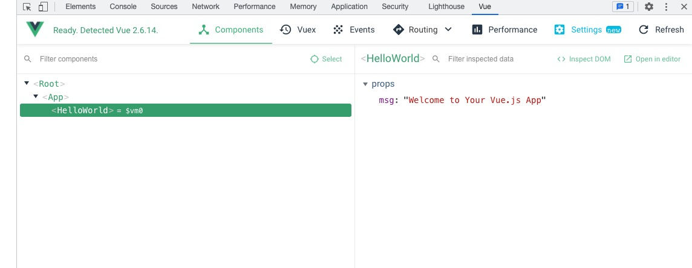
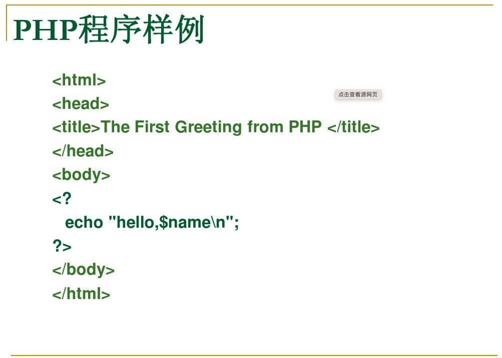
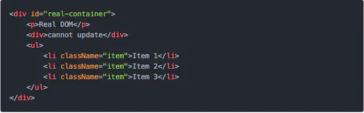
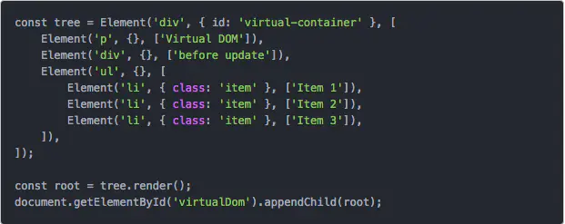
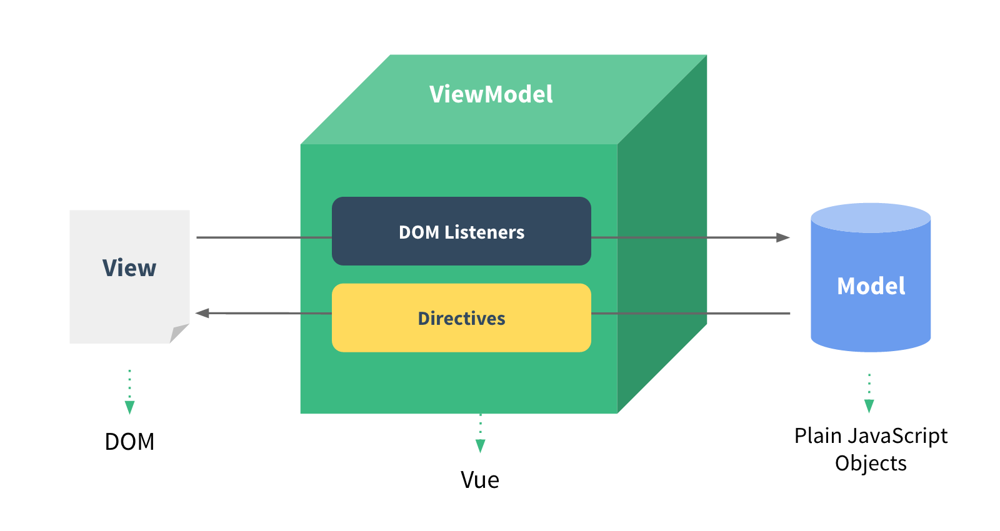
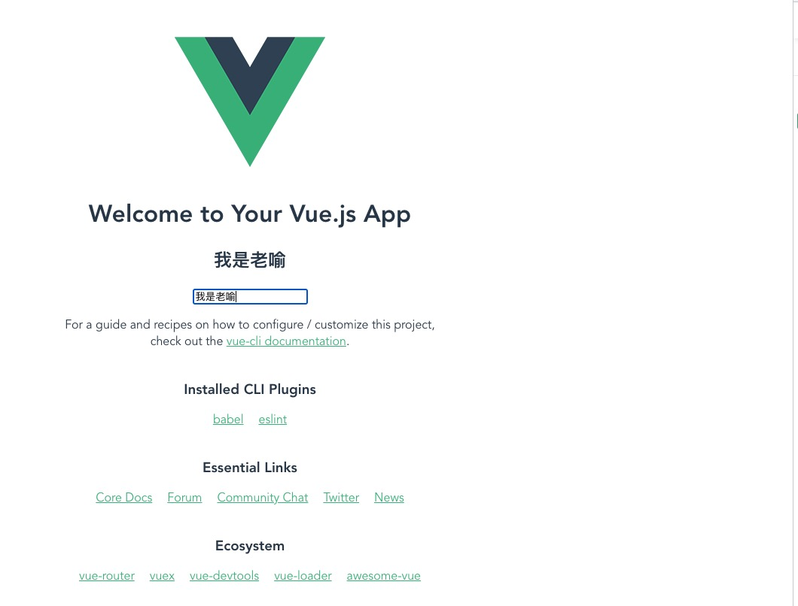
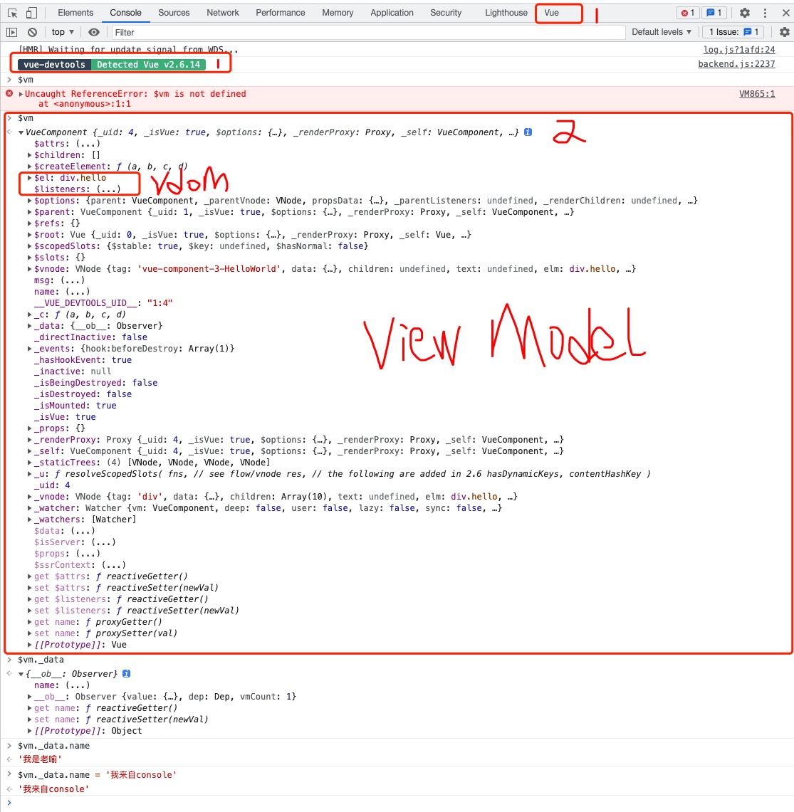
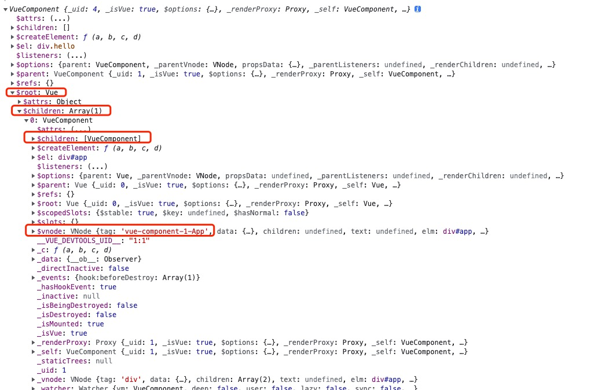
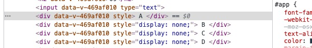
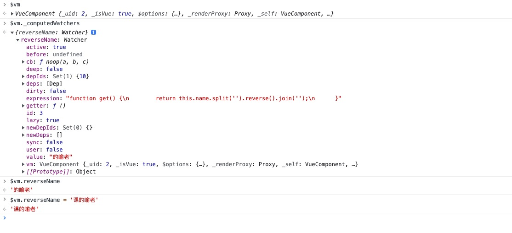

# Vue入门基础

Vue 是一套用于构建用户界面的渐进式框架。与其它大型框架不同的是，Vue 被设计为可以自底向上逐层应用

Vue 的核心库只关注视图层，不仅易于上手，还便于与第三方库或既有项目整合, 比如实现拖拽: vue + sortable.js

vue借鉴了很有框架优秀的部分进行了整合:
+ 借鉴 angular 的模板和数据绑定技术
+ 借鉴 react 的组件化和虚拟 DOM 技术

所有框架的逻辑 都是通过js封装，上层概念比如MVVM, 方便快速开发，因此学习任何框架前都比较具体Web基础:
+ HTML
+ CSS
+ Javascript

## 安装

我们需要安装的清单如下:
+ node
+ vue
+ vue/cli
+ Vue Devtools, 
+ Vetur

### 安装node

NodeJS[下载地址](https://nodejs.org/zh-cn/), 安装最新的版本

下面是我当前环境:
```sh
$ node -v
v14.17.1
$ npm -v
6.14.13
```

配置使用国内源

我们可以通过 `npm config get registry` 查看当前配置的源是那个
```sh
$ npm config get registry
https://registry.npmjs.org/
```

npm官方源下载依赖的速度很慢, 所以往往我们都需要更新成国内的源, 下面是使用淘宝的源

```sh
$ npm config set registry http://registry.npm.taobao.org/
$ npm config get registry
http://registry.npm.taobao.org/
```

到处我们就更换成了国内源的地址

### 安装Vue和脚手架工具

直接使用node进行全局安装

```sh
# 最新稳定版
$ npm install -g vue
```

官方同时提供了1个cli工具, 用于快速初始化一个vue工程, 官方文档: [vue-cli](https://cli.vuejs.org/)

安装项目脚手架工具:
```
sudo npm install -g @vue/cli
```

本教程版本要求:
+ vue: 2.6.x
+ vue-cli: 4.5.x

安装完成后使用 npm list -g 查看当前node环境下 该模块是否安装成功, 版本是否正确
```sh
$ npm list -g | grep vue
├─┬ @vue/cli@4.5.13 ## vue cli安装成功, 版本4.5.13
│ ├─┬ @vue/cli-shared-utils@4.5.13
│ ├─┬ @vue/cli-ui@4.5.13
│ │ ├── @vue/cli-shared-utils@4.5.13 deduped
│ ├── @vue/cli-ui-addon-webpack@4.5.13
│ ├── @vue/cli-ui-addon-widgets@4.5.13
│ ├── vue@2.6.14  ## vue 安装成功, 版本2.6.14
│ ├─┬ vue-codemod@0.0.5
│ │ ├─┬ @vue/compiler-core@3.2.6
│ │ │ ├── @vue/shared@3.2.6
│ │ ├─┬ @vue/compiler-dom@3.2.6
│ │ │ ├── @vue/compiler-core@3.2.6 deduped
│ │ │ └── @vue/shared@3.2.6 deduped
```

### Vue Devtools

在使用 Vue 时，我们推荐在你的浏览器上安装 Vue Devtools。它允许你在一个更友好的界面中审查和调试 Vue 应用

#### chrome商店安装

vue-devtools可以从chrome商店直接下载安装，非常简单， 具体请参考: [Chrome Setting](https://devtools.vuejs.org/guide/installation.html#settings) 这里就不过多介绍了。不过要注意的一点就是，需要翻墙才能下载


#### 离线安装

请参考 [vue-devtools离线安装](https://www.jianshu.com/p/63f09651724c)

### vscode 插件

+ Beautify: js, css, html 语法高亮差距
+ ESLint: js eslint语法风格检查
+ Auto Rename Tag: tag rename
+ Veter: vue语法高亮插架


## Hello World

到我们的demo工程下面, 使用脚手架初始化vue 前端工程ui
```sh
$ vue create demo
```

通过vue-cli搭建一个vue项目，会自动生成一系列文件，而这些文件具体是怎样的结构、文件对应起什么作用，可以看看下面的解释
```
├── dist/                      # 项目构建后的产物
├── node_module/               #项目中安装的依赖模块
├── public/                    # 纯静态资源, 入口文件也在里面
|── src/
│   ├── main.js                 # 程序入口文件
│   ├── App.vue                 # 程序入口vue组件, 大写字母开头,后缀.vue
│   ├── components/             # 组件
│   │   └── ...
│   └── assets/                 # 资源文件夹，一般放一些静态资源文件, 比如CSS/字体/图片
│       └── ...
├── babel.config.js             # babel 配置文件, es6语法转换
├── .gitignore                  # 用来过滤一些版本控制的文件，比如node_modules文件夹 
└── package.json                # 项目文件，记载着一些命令和依赖还有简要的项目描述信息 
└── README.md                   #介绍自己这个项目的，可参照github上star多的项目。
```

然后运行项目
```sh
$ cd demo 
$ npm run serve
```

我们可以通过dev-tools查看当前页面组建构成



如何部署:
```sh
$ npm run build ## 会在项目的dist目录下生成html文件, 使用这个静态文件部署即可

## 比如我们使用python快速搭建一个http静态站点, 如果是nginx copy到 对应的Doc Root位置
$ cd dist
$ python3 -m http.server
```

## MVVM如何诞生

现在主流的前端框架都是MVVM模型, MVVM分为三个部分：
+ M（Model，模型层 ）: 模型层，主要负责业务数据相关, 对应vue中的 data部分
+ V（View，视图层）: 视图层，顾名思义，负责视图相关，细分下来就是html+css层, 对应于vue中的模版部分
+ VM（ViewModel, 控制器）: V与M沟通的桥梁，负责监听M或者V的修改，是实现MVVM双向绑定的要点, 对应vue中双向绑定

Vue就是这种思想下的产物, 但是要讲清楚这个东西，我们不妨来看看web技术的进化史

### CGI时代

最早的HTML页面是完全静态的网页，它们是预先编写好的存放在Web服务器上的html文件, 浏览器请求某个URL时，Web服务器把对应的html文件扔给浏览器，就可以显示html文件的内容了

如果要针对不同的用户显示不同的页面，显然不可能给成千上万的用户准备好成千上万的不同的html文件，所以，服务器就需要针对不同的用户，动态生成不同的html文件。一个最直接的想法就是利用C、C++这些编程语言，直接向浏览器输出拼接后的字符串。这种技术被称为CGI：Common Gateway Interface

下面是一个python的cgi样例:


### 后端模版时代

很显然，像新浪首页这样的复杂的HTML是不可能通过拼字符串得到的, 于是，人们又发现，其实拼字符串的时候，大多数字符串都是HTML片段，是不变的，变化的只有少数和用户相关的数据, 所以我们做一个模版出来，把不变的部分写死, 变化的部分动态生成, 其实就是一套模版渲染系统, 其中最典型的就是:
+ ASP: 微软, C#体系
+ JSP: SUN, Java体系
+ PHP: 开源社区

下面是一段PHP样例:



但是，一旦浏览器显示了一个HTML页面，要更新页面内容，唯一的方法就是重新向服务器获取一份新的HTML内容。如果浏览器想要自己修改HTML页面的内容，怎么办？那就需要等到1995年年底，JavaScript被引入到浏览器

有了JavaScript后，浏览器就可以运行JavaScript，然后，对页面进行一些修改。JavaScript还可以通过修改HTML的DOM结构和CSS来实现一些动画效果，而这些功能没法通过服务器完成，必须在浏览器实现

### JavaScript原生时代

```html
<p id="userInfo">
姓名:<span id="name">Gloria</span>
性别:<span id="sex">男</span>
职业:<span id="job">前端工程师</span>
</p>
```

有以上html片段，想将其中个人信息替换为alice的，我们的做法
```js
// 通过ajax向后端请求, 然后利用js动态修改展示页面
document.getElementById('name').innerHTML = alice.name;
document.getElementById('sex').innerHTML = alice.sex;
document.getElementById('job').innerHTML = alice.job;
```

jQuery在这个时代脱颖而出

```html
<div id="name" style="color:#fff">前端你别闹</div> <div id="age">3</div>
<script>
$('#name').text('好帅').css('color', '#000000'); $('#age').text('666').css('color', '#fff');
/* 最终页面被修改为 <div id="name" style="color:#fff">好帅</div> <div id="age">666</div> */
</script>
```

在此情况下可以下 前后端算是分开了, 后端提供数据, 前端负责展示, 只是现在 前端里面的数据和展示并有分开，不易于维护


### 前端模版时代

在架构上前端终于走上后端的老路: 模版系统, 有引擎就是ViewModel动态完成渲染

```html
<script id="userInfoTemplate">
姓名:<span>{name}</span>
性别:<span>{sex}</span>
职业:<span>{job}</span>
</script>
```

```js
var userInfo = document.getElementById('userInfo');
var userInfoTemplate = document.getElementById('userInfoTemplate').innerHTML;
userInfo.innerHTML = templateEngine.render(userInfoTemplate, users.alice);
```

### 虚拟DOM技术

用我们传统的开发模式，原生JS或JQ操作DOM时，浏览器会从构建DOM树开始从头到尾执行一遍流程, 操作DOM的代价仍旧是昂贵的，频繁操作还是会出现页面卡顿，影响用户体验

如何才能对Dom树做局部更新，而不是全局更新喃? 答案就是由js动态来生产这个树, 修改时动态更新, 这就是虚拟Dom

这是一个真实dom



这是动态生成的Dom是不是和CGI很像



### 组件化时代

MVVM最早由微软提出来，它借鉴了桌面应用程序的MVC思想，在前端页面中，把Model用纯JavaScript对象表示，View负责显示，两者做到了最大限度的分离。



结合虚拟Dom技术, 我们就可以动态生成view, 在集合mvvm的思想, 前端终于迎来了组件化时代

+ 页面由多个组建构成
+ 每个组件都有自己的 MVVM


## Vue与MVVM

+ Model: vue中用于标识model的数据是 data对象, data 对象中的所有的 property 加入到 Vue 的响应式系统中, 有vue监听变化
+ View: vue使用模版来实现展示, 但是渲染时要结合 vdom技术
+ ViewModle: vue的核心, 负责视图的响应, 也就是数据双向绑定
    + 监听view中的数据,  如果数据有变化, 动态同步到 data中
    + 监听data中的数据,  如果数据有变化, 通过vdom动态渲视图


比如在我们的demo中, 修改HelloWorld, 在model中添加一个name属性
```js
<script>
export default {
  name: 'HelloWorld',
  data() {
    return {
      name: '老喻'
    }
  },
  props: {
    msg: String
  }
}
</script>
```

然后在模版中添加个输入框来修改他, 给他h2展示name属性

默认情况下vue是单向绑定: 数据 --> 视图

如果要双向绑定, 需要使用v-model: 视图 --> 数据

```html
<h2>{{ name }}</h2>
<input v-model="name" type="text">
```



在安装了Vue Devtools的时候，我们可以在console里看到我们的虚拟dom




## Vue实例

```ts
export interface Vue {
  // 生产的HTML元素
  readonly $el: Element; 
  // 实例的一些配置, 比如components, directives, filters ...
  readonly $options: ComponentOptions<Vue>;
  // 父Vue实例 
  readonly $parent: Vue;
  // Root Vue实例
  readonly $root: Vue;
  // 该vue实例的子vue实例，一般为 子组建
  readonly $children: Vue[];
  // 元素refs, 当元素有refs属性时才能获取
  readonly $refs: { [key: string]: Vue | Element | (Vue | Element)[] | undefined };
  // 插槽, 模版插槽
  readonly $slots: { [key: string]: VNode[] | undefined };
  readonly $scopedSlots: { [key: string]: NormalizedScopedSlot | undefined };
  readonly $isServer: boolean;
  // Model对应的数据
  readonly $data: Record<string, any>;
  // 实例props, 用于组件见消息传递
  readonly $props: Record<string, any>;
  readonly $ssrContext: any;
  // 虚拟node
  readonly $vnode: VNode;
  readonly $attrs: Record<string, string>;
  readonly $listeners: Record<string, Function | Function[]>;

  // 实例挂在到具体的HTML上
  $mount(elementOrSelector?: Element | string, hydrating?: boolean): this;
  // 强制刷新渲染, 收到刷新界面, 当有些情况下 界面没响应时
  $forceUpdate(): void;
  // 销毁实例
  $destroy(): void;
  $set: typeof Vue.set;
  $delete: typeof Vue.delete;
  // watch对象变化
  $watch(
    expOrFn: string,
    callback: (this: this, n: any, o: any) => void,
    options?: WatchOptions
  ): (() => void);
  $watch<T>(
    expOrFn: (this: this) => T,
    callback: (this: this, n: T, o: T) => void,
    options?: WatchOptions
  ): (() => void);
  $on(event: string | string[], callback: Function): this;
  $once(event: string | string[], callback: Function): this;
  $off(event?: string | string[], callback?: Function): this;
  // 触发事件
  $emit(event: string, ...args: any[]): this;
  // Dom更新完成后调用
  $nextTick(callback: (this: this) => void): void;
  $nextTick(): Promise<void>;
  $createElement: CreateElement;
}
```

那我们如何实例化一个vue实例, 下面是 Vue实例的构造函数
+ Data: Model
+ Methods: 方法
+ Computed: 计算属性
+ Props: 类似于一个自定义 attribute

```js
new <Data = object, Methods = object, Computed = object, Props = object>(options?: ThisTypedComponentOptionsWithRecordProps<V, Data, Methods, Computed, Props>): CombinedVueInstance<V, Data, Methods, Computed, Record<keyof Props, any>>;

```

我们看看我们main.js

```js
import Vue from 'vue'
import App from './App.vue'

// vue实例的配置
Vue.config.productionTip = false


// Root Vue实例, 挂载到id是app的元素上
new Vue({
  render: h => h(App),
}).$mount('#app')
```

```html
<template>
  <div id="app">
    
    <HelloWorld msg="Welcome to Your Vue.js App"/>
  </div>
</template>
```

还有我们的Helloworld组件

```html
<template>
  ...
</template>
<script>
export default {
  name: 'HelloWorld',
  data() {
    return {
      name: '老喻'
    }
  },
  props: {
    msg: String
  }
}
</script>
```

这里可以通过devTools查看到vm上的关系




## Vue实例生命周期


然后我们扩展我们的demo为我们的vue实力添加上这些钩子

```js
<script>
export default {
  name: 'HelloWorld',
  data() {
    return {
      name: '老喻'
    }
  },
  beforeCreate() {
    console.log('beforeCreate')
  },
  created() {
    console.log('created')
  },
  beforeMount() {
    console.log('beforeMount')
  },
  mounted() {
    console.log('mounted')
  },
  beforeUpdate() {
    console.log('beforeUpdate')
  },
  updated() {
    console.log('updated')
  },
  beforeDestroy() {
    console.log('beforeDestroy')
  },
  destroyed() {
    console.log('destroyed')
  },
  props: {
    msg: String
  }
}
</script>
```

测试加载和修改数据

## 模板语法

通过template标签定义的部分都是vue的模版, 模版会被vue-template-compiler编译后渲染
```html
<template>
  ...
</template>
```

### 文本值

当我们需要访问我们的Model时，就是data 这个Object时, 我们直接使用 {{ attr }} 就可以访问, vue会根据属性是否变化, 而动态渲染模版

比如 data中的 name属性
```html
<template>
  <div>{{ name }}</div>
</template>
<script>
export default {
  name: 'HelloWorld',
  data() {
    return {
      name: '老喻'
    }
  }
}
</script>
```

### 元素属性

变量不能作用在 HTML attribute 上, 比如下面的语法就是错误的
```html
<template>
  <div id={{ name }}>{{ name }}</div>
</template>
```

比如buttom有个disabled属性, 用于控制当前按钮是否可以点击
```html
<template>
<button disabled="true">Button</button>
</template>
```

针对HTML元素的属性 vue专门提供一个 v-bind指令, 这个指令就是模版引擎里面的一个函数, 他专门帮你完成HTML属性变量替换, 语法如下:
```
v-bind:disabled="attr"   ==>  disabled="data.attr"
```

那我们修改下
```html
<template>
<button v-bind:disabled="isButtomDisabled">Button</button>
</template>
<script>
export default {
  name: 'HelloWorld',
  data() {
    return {
      name: '老喻',
      isButtomDisabled: false,
    }
  }
}
</script>
```

v-binding 有个缩写:  `:`

```html
<template>
<button :disabled="isButtomDisabled">Button</button>
</template>
```

### 元素事件

如果我要要给buttom这个元素绑定一个事件应该如何写

参考: [HTML 事件属性](https://www.runoob.com/tags/ref-eventattributes.html)

原生的写法:
```html
<button onclick="copyText()">复制文本</button>
```

对于vue的模版系统来说, copyText这个函数如何渲染, 他不是一个文本，而是一个函数

vue针对事件专门定义了一个指令: v-on, 语法如下:
```
v-on:eventName="eventHandler"

eventName: 事件的名称
eventHandler: 处理这个事件的函数
```

data是我们定义Model的地方, vue专门给一个属性用于定义方法: methods


```html
<template>
    <button :disabled="isButtomDisabled" v-on:click="clickButtom" >Button</button>
</template>
<script>
export default {
  name: 'HelloWorld',
  data() {
    return {
      name: '老喻',
      isButtomDisabled: false,
    }
  },
  methods: {
    clickButtom() {
      alert("别点我")  
    }
  }
}
</script>
```

当然v-on这个指令也可以缩写成 `@`
```html
<template>
    <button :disabled="isButtomDisabled" @click="clickButtom" >Button</button>
</template>
```

### 骚包的指令

vue遇到不好解决的问题，就定义一个指令, 官方内置了一些指令:

+ v-model: 双向绑定的数据
+ v-bind: html元素属性绑定
+ v-on: html元素事件绑定
+ v-if: if 渲染
+ v-show: 控制是否显示
+ v-for: for 循环

上面的例子 只是指令的简单用法, 指令的完整语法如下:
```
v-directive:argument.modifier.modifier...

v-directive: 表示指令名称, 如v-on
argument： 表示指令的参数, 比如click
modifier:  修饰符,用于指出一个指令应该以特殊方式绑定
```

比如当用户按下回车时, 表示用户输入完成, 触发搜索

```
v-directive: 需要使用绑定事件的指令: v-on
argument:    监听键盘事件: keyup, 按键弹起时
modifier:    监听Enter建弹起时

因此完整写发:  v-on:keyup.enter
```

```html
<template>
    <input v-model="name" type="text" @keyup.enter="pressEnter">
</template>
<script>
export default {
  name: 'HelloWorld',
  data() {
    return {
      name: '老喻',
      isButtomDisabled: false,
    }
  },
  methods: {
    clickButtom() {
      alert("别点我")  
    },
    pressEnter() {
      alert("点击了回车键")
    }
  },
}
</script>
```

最后需要注意事件的指令的函数是可以接受参数的

```html
<template>
    <input v-model="name" type="text" @keyup.enter="pressEnter(name)">
    <button v-on:click="say('hi')">Say hi</button>
</template>
```

函数是直接读到model数据的, 因此别用{{ }}， 如果要传字符串 使用''


修饰符可以玩出花, 具体的请看官方文档
```html
<!-- 即使 Alt 或 Shift 被一同按下时也会触发 -->
<button v-on:click.ctrl="onClick">A</button>

<!-- 有且只有 Ctrl 被按下的时候才触发 -->
<button v-on:click.ctrl.exact="onCtrlClick">A</button>

<!-- 没有任何系统修饰符被按下的时候才触发 -->
<button v-on:click.exact="onClick">A</button>
```

### JavaScript 表达式

模版支持JavaScript的表达式, 可以在显示的动态的做一些处理

```html
<template>
  <div>{{ name.split('').reverse().join('') }}</div>
</template>
<script>
export default {
  name: 'HelloWorld',
  data() {
    return {
      name: '老喻'
    }
  }
}
</script>
```

### 条件渲染

有2个指令用于在模版中控制条件渲染:

+ v-if: 控制元素是否创建, 创建开销较大
+ v-show: 控制元素是否显示, 对象无效销毁，开销较小

v-if 完整语法:
```html
<t v-if="" /> 
<t v-else-if="" /> 
<t v-else="" /> 
```

v-show完整语法:
```html
<t v-show="" />
```

比如更加用户输入, 判断当前分数的等级

```html
<input v-model="name" type="text" @keyup.enter="pressEnter(name)">
<div v-if="name >= 90">
  A
</div>
<div v-else-if="name >= 80">
  B
</div>
<div v-else-if="name >= 60">
  C
</div>
<div v-else-if="name >= 0">
  D
</div>
<div v-else>
  请输入正确的分数
</div>
```

这些HTML元素都需要动态创建,  我们换成v-show看看

```html
<input v-model="name" type="text" @keyup.enter="pressEnter(name)">
<div v-show="name >= 90">
  A
</div>
<div v-show="name >= 80 && name < 90">
  B
</div>
<div v-show="name >= 60 && name < 80">
  C
</div>
<div v-show="name >= 0 && name < 60">
  D
</div>
```

我们可以看到只是简单地基于 CSS 进行切换



一般来说，v-if 有更高的切换开销，而 v-show 有更高的初始渲染开销。因此，如果需要非常频繁地切换，则使用 v-show 较好；如果在运行时条件很少改变，则使用 v-if 较好


### 列表渲染

v-for元素的列表渲染, 语法如下:

```html
<t v-for="(item, index) in items" :key="item.message">
  {{ item.message }}
</t>

<!-- items: [
  { message: 'Foo' },
  { message: 'Bar' }
] -->
```

 
 如果你不使用index, 也可以省略, 比如:

```html
<ul>
  <li v-for="item in items" :key="item.message">
    {{ item.message }}
  </li>
</ul>

<script>
export default {
  name: 'HelloWorld',
  data() {
    return {
      items: [
        { message: 'Foo' },
        { message: 'Bar' }
      ]
    }
  },
}
</script>
```

v-for 除了可以遍历列表，可以遍历对象, 比如我们套2层循环, 先遍历列表，再遍历对象
```html
<ul>
  <li v-for="(item, index) in items" :key="item.message">
    {{ item.message }} - {{ index}}
    <br>
    <span v-for="(value, key) in item" :key="key"> {{ value }} {{ key }} <br></span>
  </li>
</ul>
<script>
export default {
  name: 'HelloWorld',
  data() {
    return {
      items: [
        { message: 'Foo', level: 'info' },
        { message: 'Bar', level: 'error'}
      ]
    }
  }
}
</script>
```

我们也可以在console界面里进行数据修改测试
```js
$vm._data.items.push({message: "num4", level: "pannic"})
$vm._data.items.pop()
```

注意事项:
+ 不推荐在同一元素上使用 v-if 和 v-for, 请另外单独再起一个元素进行条件判断

比如
```html
<li v-for="todo in todos" v-if="!todo.isComplete">
  {{ todo }}
</li>

请改写成下面方式:

<ul v-if="todos.length">
  <li v-for="todo in todos">
    {{ todo }}
  </li>
</ul>
<p v-else>No todos left!</p>
```

## 计算属性

如果model的数据并不是你要直接渲染的，需要处理再展示, 简单的方法是使用表达式，比如
```html
<h2>{{ name.split('').reverse().join('') }}</h2>
```

这种把数据处理逻辑嵌入的视图中，并不合适,  不易于维护, 我们可以把改成一个方法
```html
<h2>{{ reverseData(name) }}</h2>

<script>
  methods: {
    reverseData(data) {
      return data.split('').reverse().join('')
    }
  }
</script>
```

除了函数, vue还是为我们提供了一个计算属性, 这样我们的视图可以看起来更干净, 计算属性的语法如下:

```js
computed: {
  attrName: {
    get() {
      return value
    },
    set(value) {
      // set value
    }
  }
}
```

我们修改为计算属性:

```html
<h2>{{ reverseName }}</h2>
<script>
export default {
  computed: {
    reverseName: {
      get() {
        return this.name.split('').reverse().join('')
      },
      set(value) {
        this.name = this.name = value.split('').reverse().join('')
      }
    }
  },
}
</script>
```

我们可以看到reverseName这个属性已经存在再我们实例上了， 修改也能正常生效:



## 侦听器

一个简单的需求:
我们一个页面有多个参数, 用户可能把url copy给别人, 我们需要不同的url看到页面内容不同, 不然用户每次到这个页面都是第一个页面


这个就需要我们监听url参数的变化, 然后视图做调整, vue-router会有个全局属性: $route, 我们可以监听它的变化


由于没引入vue-router,那我们如何监听URL的变化 window提供一个事件回调:
```js
window.onhashchange = function () {
  console.log('URL发生变化了', window.location.hash);
  this.urlHash = window.location.hash
};
```

我们再也没挂在完成后, 把它记录成一个本地hash 来模拟这个过程, 这个有点多余，直接通过这个回调就可以完成页面变化处理, 这里是演示watch

vue 提供的属性watch语法如下:
```
  watch: {
    // 如果 `urlHash` 发生改变，这个函数就会运行
    urlHash: function (newData, oldData) {
      this.debouncedGetAnswer()
    }
  },
```

我们先监听变化， 挂载后修改vue对象, 然后watch做
```html
<script>
export default {
  name: 'HelloWorld',
  data() {
    return {
      urlHash: '',
    }
  },
  mounted() {
    /* 来个骚操作 */
    let that = this
    window.onhashchange = function () {
      that.urlHash = window.location.hash
    };
  },
  watch: {
    urlHash: function(newURL, oldURL) {
      console.log(newURL, oldURL)
    }
  }
}
</script>
```

更多watch用于请参考: [Vue Watch API](https://cn.vuejs.org/v2/api/#vm-watch)


## 过滤器

Vue.js 允许你自定义过滤器，可被用于一些常见的文本格式化, 最常见就是 时间的格式化

过滤器语法:
```js
<!-- 在双花括号中 -->
{{ message | capitalize }}
```

你可以把他等价于一个函数: capitalize(message)

我们可以在当前组件的vue实例上定义一个过滤器:

```js
filters: {
  capitalize: function (value) {
    /*过滤逻辑*/
  }
}
```

我们先定义我们的parseTime过滤器:
```js
{{ ts | parseTime }}

<script>
export default {
  name: 'HelloWorld',
  data() {
    return {
      ts: Date.now()
    }
  },
  filters: {
    parseTime: function (value) {
      let date = new Date(value)
      return `${date.getFullYear()}-${date.getMonth() + 1}-${date.getDate()} ${date.getHours()}:${date.getMinutes()}`
    }
  }
}
</script>
```

如果每个地方都要用这个过滤器, 我们中不至于每个组件里面抄一遍吧!

vue提供全局过滤器, 再初始化vue实例的时候可以配置, 找到main.js添加

```js
// 添加全局过滤器
Vue.filter('parseTime', function (value) {
  let date = new Date(value)
  return `${date.getFullYear()}-${date.getMonth() + 1}-${date.getDate()} ${date.getHours()}:${date.getMinutes()}`
})

```

这样我们就可以删除我们在局部里面定义的过滤器了

## 自定义指令

除了核心功能默认内置的指令 (v-model 和 v-show)，Vue 也允许注册自定义指令, 别问， 问就是你需要

比如用户进入页面让输入框自动聚焦, 方便快速输入, 比如登陆页面, 快速聚焦到 username输入框

如果是HTML元素聚焦, 我们找到元素, 调用focus就可以了, 如下:
```js
let inputE = document.getElementsByTagName('input')
inputE[0].focus()
```

添加到mounted中进行测试:
```js
mounted() {
  let inputE = document.getElementsByTagName('input')
  inputE[0].focus()
  }
```

如何将这个功能做成一个vue的指令喃? 比如 v-focus

我们先注册一个局部指令, 在本组件中使用
```js
export default {
  name: 'HelloWorld',
  directives: {
    focus: {
      // 指令的定义
      inserted: function (el) {
        el.focus()
      }
    }
  },
}
</script>
```

这里我们注册的指令名字叫focus, 所有的指令在模版要加一个v前缀, 因此我们的指令就是v-focus

注释掉之前的测试代码, 然后使用我们注册的指令来实现:
```html
<input v-focus v-model="name" type="text" @keyup.enter="pressEnter(name)">
```

怎么好用的功能，怎么可能局部使用，当然要全局注册, 找到main.js 配置自定义指令

```js
// 注册一个全局自定义指令 `v-focus`
Vue.directive('focus', {
  // 当被绑定的元素插入到 DOM 中时……
  inserted: function (el) {
    // 聚焦元素
    el.focus()
  }
})
```

删除局部指令测试

## 组件

我们的demo 就是一个组件的例子, 终于开始到vue的核心了 组件

如下是我们的App.vue, 这个Vue 根实例中引入了一个HelloWorld的组件:
```html
<template>
  <div id="app">
    
    <HelloWorld msg="Welcome to Your Vue.js App"/>
  </div>
</template>

<script>
import HelloWorld from './components/HelloWorld.vue'

export default {
  name: 'App',
  components: {
    HelloWorld
  }
}
</script>
```

组件是可复用的 Vue 实例，所以它们与 new Vue 接收相同的选项，例如 data、computed、watch、methods 以及生命周期钩子等,仅有的例外是像 el 这样根实例特有的选项

注意这里的export default语法，这是ES6的模块语法, 请参考之前的js课程

这里需要注意:
+ 每个vue组件, 只能有1个根元素, 所以你不能在模版里面写2个并排的div
+ 组件的命名风格是首字母大写, 导出名字最好和文件名称相同，方便阅读
+ 局部组件必须放到实例的components属性里面, 代表这个组件注册到了该实例,  只有注册后的组件才能使用
+ 组件的使用方式和HTML标签一样, 可以认为是自定义的HTML标签, 因此最好小写使用, 比如hello-world

我们调整下demo的组件使用名字
```html
<template>
  <div id="app">
    
    <hello-world msg="Welcome to Your Vue.js App"/>
  </div>
</template>
```

当然我们也可以再添加一个这样的组件
```html
<template>
  <div id="app">
    
    <hello-world msg="Welcome to Your Vue.js App"/>
    <hello-world msg="component2"/>
  </div>
</template>
```

是不是开始有味道了:


到这里 应该知道为啥我们引入了element-ui后, el-table, 这些是啥了吧

下面我们讲组件之间的通讯问题

### 向子组件传递数据

我们在组件里面定义的props, 到现在还没有用到
```html
<script>
export default {
  name: 'HelloWorld',
  props: {
    msg: String
  }
}
</script>
```

这里props就是用于传递数据的变量, Prop 是你可以在组件上注册的一些自定义 attribute, 父组件通过绑定数据来传递消息给子组件

```html
<template>
  <div id="app">
    
    <hello-world msg="Welcome to Your Vue.js App"/>
  </div>
</template>

<script>
import HelloWorld from './components/HelloWorld.vue'

export default {
  name: 'App',
  components: {
    HelloWorld
  }
}
</script>
```

> 问题: 如果我想动态传递props怎么办?


```html
<template>
  <div id="app">
    
    <hello-world :msg="msg1"/>
  </div>
</template>

<script>
import HelloWorld from './components/HelloWorld.vue'

export default {
  name: 'App',
  data() {
    return {
      msg1: 'Welcome to Your Vue.js App'
    }
  },
  components: {
    HelloWorld
  }
}
</script>
```

那如果我在子组件中修改了props的值，父组件会更新吗?

我们在页面上添加显示父组件的msg
```html
<template>
  <div id="app">
    <span>父组件的msg: {{ msg1 }}</span>
    
    <hello-world :msg="msg1"/>
  </div>
</template>
```

接着我们在子组件中加入一个输入框修改msg属性
```html
<input v-model="msg" type="text" @keyup.enter="pressEnter(msg)">
```

不仅没生效，并且console还有个报错
```js
[Vue warn]: Avoid mutating a prop directly since the value will be overwritten whenever the parent component re-renders. Instead, use a data or computed property based on the prop's value. Prop being mutated: "msg"

found in

---> <HelloWorld>
       <App> at src/App.vue
         <Root>
```

意思就是不要直接修改子组件的props, 因为v-bind的原因, 父组件会有变覆盖当前值


那我们可以通知父组建, 让父组建修改就可以了

### 向父组件传递数据

如何向父组件传递事件, 这里需要:
+ 子组件使用$emit发送事件, 事件名称: changeMsg
+ 父组件使用v-on 订阅子组件的事件

首先修改子组建, 重新绑定一个属性: tmpMsg, 等点击回车时发生事件给父组件

```html
<input v-model="tmpMsg" type="text" @keyup.enter="changeProps(tmpMsg)">

<script>
export default {
  name: 'HelloWorld',
  data() {
    return {
      tmpMsg: '',
    }
  },
  methods: {
    changeProps(msg) {
      this.$emit('changeMsg', msg)
    }
  },
  props: {
    msg: String
  }
}
</script>
```

父组件修改
```html
<hello-world :msg="msg1" @changeMsg="msgChanged" />

<script>
import HelloWorld from './components/HelloWorld.vue'

export default {
  name: 'App',
  methods: {
    msgChanged(event) {
      this.msg1 = event
    }
  }
}
</script>
```

### 使用 v-model

如此费力的使用 v-bind 和 v-on 完成了数据的双向绑定, 你有啥感想?

这不就是v-model吗?
```
v-model <==>  v-bind:value + v-on:input
```

将其 value attribute 绑定到一个名叫 value 的 prop 上
在其 input 事件被触发时，将新的值通过自定义的 input 事件抛出

因此我们修改我们属性, 让遵循v-model的绑定和订阅规范

父组件使用 v-model进行值的双向传递:
```html
<hello-world v-model="msg1" />
```

子组件绑定value属性和抛出input事件
```html
<input :value="value" type="text" @input="$emit('input', $event.target.value)">
<script>
export default {
  name: 'HelloWorld',
  props: {
    value: String,
  }
}
</script>
```

这样就实现了数据的双向传递了， 是不是舒服了

## 插件

插件通常用来为 Vue 添加全局功能。插件的功能范围没有严格的限制——一般有下面几种：

+ 添加全局方法或者 property。如：vue-custom-element
+ 添加全局资源：指令/过滤器/过渡等。如 vue-touch
+ 通过全局混入来添加一些组件选项。如 vue-router
+ 添加 Vue 实例方法，通过把它们添加到 Vue.prototype 上实现。
+ 一个库，提供自己的 API，同时提供上面提到的一个或多个功能。如 vue-router

我们可以看看element-ui的插件:

```js
import ElementUI from "element-ui"
import "element-ui/lib/theme-chalk/index.css"
Vue.use(ElementUI)
```

可以看到有很多组件
```js
import Vue, { PluginObject } from 'vue'
import { ElementUIComponent, ElementUIComponentSize, ElementUIHorizontalAlignment } from './component'

import { ElAlert } from './alert'
import { ElAside } from './aside'
import { ElAutocomplete } from './autocomplete'
import { ElBadge } from './badge'
import { ElBreadcrumb } from './breadcrumb'
import { ElBreadcrumbItem } from './breadcrumb-item'
import { ElButton } from './button'
```

可以看到这些element的组件都被注册到vue里面去了
```js
import Vue from 'vue'

/** ElementUI component common definition */
export declare class ElementUIComponent extends Vue {
  /** Install component into Vue */
  static install (vue: typeof Vue): void
}

```

## 参考

+ [VUE2官方文档](https://cn.vuejs.org/v2/guide)
+ [那些前端MVVM框架是如何诞生的](https://zhuanlan.zhihu.com/p/36453279)
+ [MVVM设计模式](https://zhuanlan.zhihu.com/p/36141662)
+ [vue核心之虚拟DOM(vdom)](https://www.jianshu.com/p/af0b398602bc)