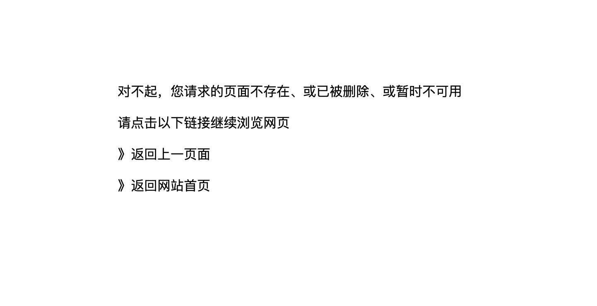
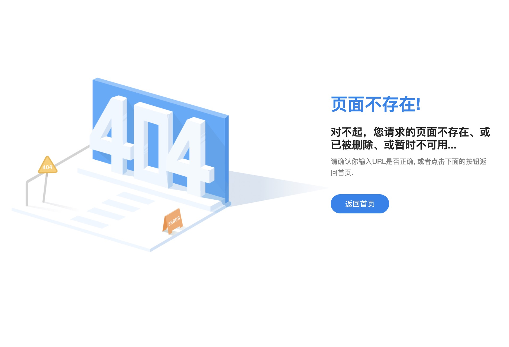

# 项目404页面

我们在src/views 下面创建一个common目录, 用于存放一些全局通用的页面

## 简陋404页面

我们在common下再创建一个目录, 用于存放错误处理的页面: src/views/error-page/404.vue

```html
<template>
  <div class="wscn-http404-container">
    <p>对不起，您请求的页面不存在、或已被删除、或暂时不可用</p>
    <p>请点击以下链接继续浏览网页</p>
    <p> 》<a style="cursor:pointer" @click="$router.go(-1)">返回上一页面</a></p>
    <p> 》<a style="cursor:pointer" @click="$router.push({path: '/'})">返回网站首页</a></p>
  </div>
</template>
```

如何以编程的方式使用router 可以参考之前看课程: [vue全家桶](../day16/vue-all.md)

## 添加路由

修改 router/index.js, 添加404页面路由逻辑:
```js
const routes = [
  ...
  {
    path: '/404',
    component: () => import('@/views/common/error-page/404'),
    hidden: true
  },
  // 如果前面所有路径都没有匹配到页面 就跳转到404页面
  { path: '*', redirect: '/404', hidden: true }
];
```

## 测试一下

实在有点丑，简单排下版:
```html
<style lang="scss" scoped>
.wscn-http404-container {
    height: 120px;
    width: 420px;
    margin: 0 auto;
    padding-top: 220px;
}
</style>
```



没办法拯救，实在有点丑, 土味404， 但是好歹功能正常, 还是去其他地方操一个404页面过来吧

## 正常404页面

我们操: [vue-element-admin 404页面](https://github.com/PanJiaChen/vue-element-admin/blob/master/src/views/error-page/404.vue)

先把素材copy过来放到本地: assets/404_pic
+ 404_cloud.png
+ 404.png

操过来, 修复下跳转, 修改下文案:
```html
<template>
  <div class="wscn-http404-container">
    <div class="wscn-http404">
      <div class="pic-404">
        
        
        
        
      </div>
      <div class="bullshit">
        <div class="bullshit__oops">页面不存在!</div>
        <div class="bullshit__headline">{{ message }}</div>
        <div class="bullshit__info">请确认你输入URL是否正确, 或者点击下面的按钮返回首页.</div>
        <a style="cursor:pointer" @click="$router.push({path: '/'})" class="bullshit__return-home">返回首页</a>
      </div>
    </div>
  </div>
</template>

<script>
export default {
  name: 'Page404',
  computed: {
    message() {
      return '对不起，您请求的页面不存在、或已被删除、或暂时不可用...'
    }
  }
}
</script>

<style lang="scss" scoped>
.wscn-http404-container{
  transform: translate(-50%,-50%);
  position: absolute;
  top: 40%;
  left: 50%;
}
.wscn-http404 {
  position: relative;
  width: 1200px;
  padding: 0 50px;
  overflow: hidden;
  .pic-404 {
    position: relative;
    float: left;
    width: 600px;
    overflow: hidden;
    &__parent {
      width: 100%;
    }
    &__child {
      position: absolute;
      &.left {
        width: 80px;
        top: 17px;
        left: 220px;
        opacity: 0;
        animation-name: cloudLeft;
        animation-duration: 2s;
        animation-timing-function: linear;
        animation-fill-mode: forwards;
        animation-delay: 1s;
      }
      &.mid {
        width: 46px;
        top: 10px;
        left: 420px;
        opacity: 0;
        animation-name: cloudMid;
        animation-duration: 2s;
        animation-timing-function: linear;
        animation-fill-mode: forwards;
        animation-delay: 1.2s;
      }
      &.right {
        width: 62px;
        top: 100px;
        left: 500px;
        opacity: 0;
        animation-name: cloudRight;
        animation-duration: 2s;
        animation-timing-function: linear;
        animation-fill-mode: forwards;
        animation-delay: 1s;
      }
      @keyframes cloudLeft {
        0% {
          top: 17px;
          left: 220px;
          opacity: 0;
        }
        20% {
          top: 33px;
          left: 188px;
          opacity: 1;
        }
        80% {
          top: 81px;
          left: 92px;
          opacity: 1;
        }
        100% {
          top: 97px;
          left: 60px;
          opacity: 0;
        }
      }
      @keyframes cloudMid {
        0% {
          top: 10px;
          left: 420px;
          opacity: 0;
        }
        20% {
          top: 40px;
          left: 360px;
          opacity: 1;
        }
        70% {
          top: 130px;
          left: 180px;
          opacity: 1;
        }
        100% {
          top: 160px;
          left: 120px;
          opacity: 0;
        }
      }
      @keyframes cloudRight {
        0% {
          top: 100px;
          left: 500px;
          opacity: 0;
        }
        20% {
          top: 120px;
          left: 460px;
          opacity: 1;
        }
        80% {
          top: 180px;
          left: 340px;
          opacity: 1;
        }
        100% {
          top: 200px;
          left: 300px;
          opacity: 0;
        }
      }
    }
  }
  .bullshit {
    position: relative;
    float: left;
    width: 300px;
    padding: 30px 0;
    overflow: hidden;
    &__oops {
      font-size: 32px;
      font-weight: bold;
      line-height: 40px;
      color: #1482f0;
      opacity: 0;
      margin-bottom: 20px;
      animation-name: slideUp;
      animation-duration: 0.5s;
      animation-fill-mode: forwards;
    }
    &__headline {
      font-size: 20px;
      line-height: 24px;
      color: #222;
      font-weight: bold;
      opacity: 0;
      margin-bottom: 10px;
      animation-name: slideUp;
      animation-duration: 0.5s;
      animation-delay: 0.1s;
      animation-fill-mode: forwards;
    }
    &__info {
      font-size: 13px;
      line-height: 21px;
      color: grey;
      opacity: 0;
      margin-bottom: 30px;
      animation-name: slideUp;
      animation-duration: 0.5s;
      animation-delay: 0.2s;
      animation-fill-mode: forwards;
    }
    &__return-home {
      display: block;
      float: left;
      width: 110px;
      height: 36px;
      background: #1482f0;
      border-radius: 100px;
      text-align: center;
      color: #ffffff;
      opacity: 0;
      font-size: 14px;
      line-height: 36px;
      cursor: pointer;
      animation-name: slideUp;
      animation-duration: 0.5s;
      animation-delay: 0.3s;
      animation-fill-mode: forwards;
    }
    @keyframes slideUp {
      0% {
        transform: translateY(60px);
        opacity: 0;
      }
      100% {
        transform: translateY(0);
        opacity: 1;
      }
    }
  }
}
</style>
```



## 总结

404页面不是核心, 就这样就ok了, 如果你觉得还是有点丑, 可以自己找个其他的404图片换掉, 不要太过于纠结这里的样式, 因为接下来才是我们核心: 主页面