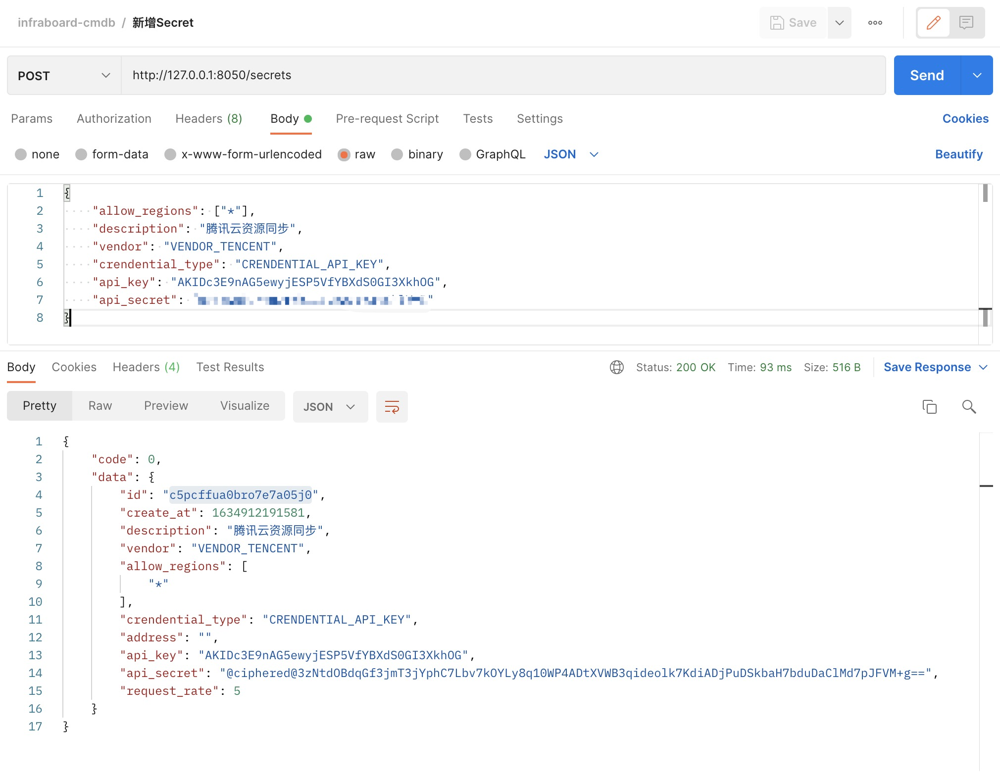
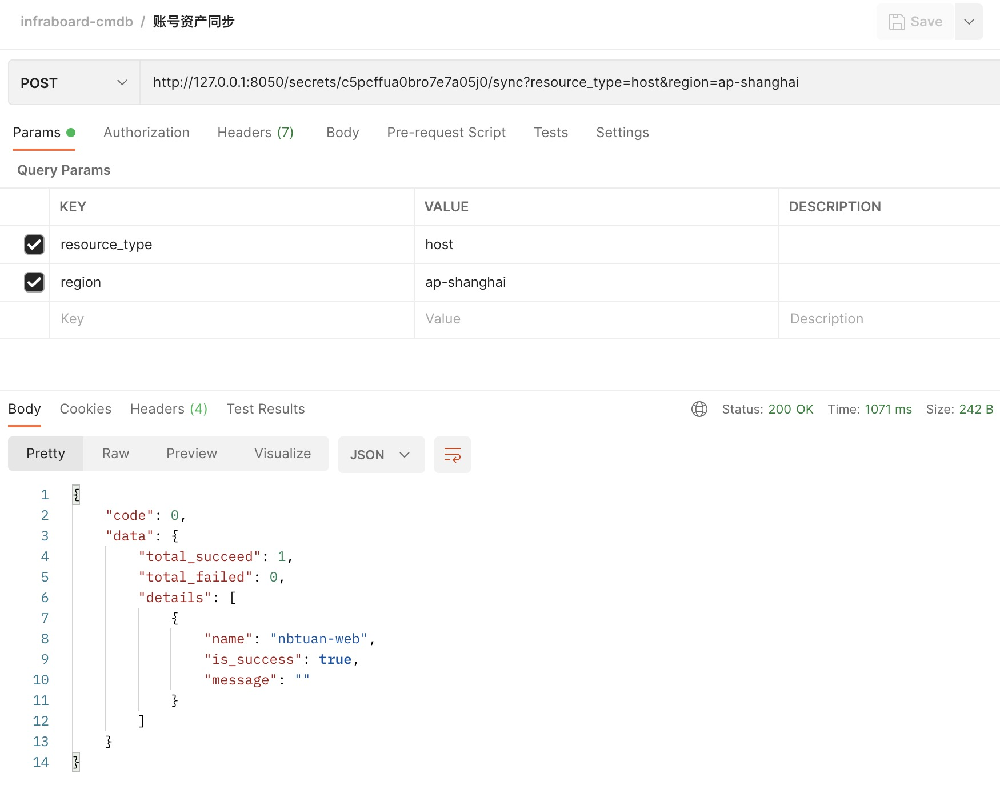
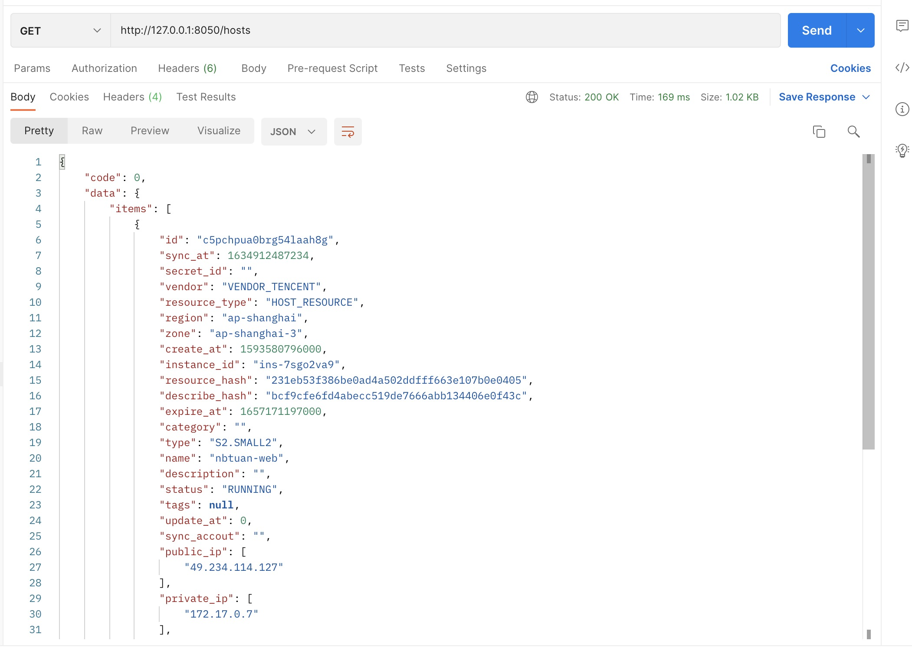

# 云资源Provider

设计注意事项:
  + 为了让cmdb服务无状态, 因此cmdb服务自己并不做定时任务配置, 只提供同步API

我们的目标: 可以通过云商账号同步不同区域的资产

项目所有源码:  [CMDB项目源码](https://github.com/infraboard/cmdb)


## 效果演示

1. 创建secret



2. 使用改secret同步腾讯云cvm



3. 查看刚才同步的主机




## 脚本可以吗

如果以解决问题的思路来做, 一个脚本应该就可以了

+ 看下官方SDK: [阿里云官方SDK](https://github.com/aliyun/alibaba-cloud-sdk-go)
+ 建一个表, 把查询出来的数据 写进去
+ 写个API 提供一个接口

下面是伪代码:
```go

func syncHandler() {
	// new client
	client, err := sdk.NewClientWithAccessKey("REGION_ID", "ACCESS_KEY_ID", "ACCESS_KEY_SECRET")
	if err != nil {
		// Handle exceptions
		panic(err)
	}

	// query instances
	resp, err := client.DescribeInstances(req)
	if err != nil {
		return nil, err
	}

	// save hosts
	db.save(transfer(resp))
}

func main() {
	ht := http.HandlerFunc(syncHandler)
	if ht != nil {
		http.Handle("/sync", ht)
	}
	err := http.ListenAndServe(":8090", nil)
	if err != nil {
		log.Fatal("ListenAndServe: ", err.Error())
	}
}
```

这样写是不是很容易理解?

但是如果后面还有这些需求:
+ rds, redis, 域名, slb, oss, 账单 都需要同步怎么办
+ 需要支持 其他云厂商: 腾讯云/华为云/Vshpere/AWS/...
+ 云商有接口有速率限制怎么办
+ 需要对接云商的事件, 通过云商创建了资源，需要立马同步
+ 资产状态管理, 云商资源释放了，需要标准归档
+ 有很多个云账号都需要同步怎么办?


## 云资产提供商

我们需要提前为4个云商准备API Key


### 环境变量配置

为了方便调试，我们的key通过环境变量传人, 然后通过vscode的test 进行测试:


但是这个测试用例是读取不掉对应的key的, 怎么办?

vscode提供的项目配置里面可以配置从文件中读取环境变量: .vscode/settings.json
```json
{
    "go.testEnvFile": "${workspaceFolder}/etc/cmdb-api.env"
}
```

这样我们执行go test的时候, vscode读取改配置文件里面的环境变量

下面是本项目测试用例使用到的环境变量设置: etc/cmdb-api.env
```
TX_CLOUD_SECRET_ID=xxx
TX_CLOUD_SECRET_KEY=xxx
AL_CLOUD_ACCESS_KEY=xx
AL_CLOUD_ACCESS_SECRET=xxx
HW_CLOUD_ACCESS_KEY=xxx
HW_CLOUD_ACCESS_SECRET=xxx
VS_HOST=xxx
VS_USERNAME=xxxx
VS_PASSWORD=xxx
```

最后测试下 我们可以写个用例测试下


### 阿里云

我们使用[阿里云官方SDK](github.com/aliyun/alibaba-cloud-sdk-go), 来操作我们在云上的资源

#### 创建客户端

如何创建一个Client:
```go
package main

import "github.com/aliyun/alibaba-cloud-sdk-go/sdk"

func main() {

	client, err := sdk.NewClientWithAccessKey("REGION_ID", "ACCESS_KEY_ID", "ACCESS_KEY_SECRET")
	if err != nil {
		// Handle exceptions
		panic(err)
	}
}
```

#### 请求云商资源

然后我们利用client 查询云上资产
```go
resp, err := client.DescribeInstances(req)
if err != nil {
  return nil, err
}
```


#### 写个测试用例验证

```go
func TestClient(t *testing.T) {
	var secretID, secretKey string
	if secretID = os.Getenv("AL_CLOUD_ACCESS_KEY"); secretID == "" {
		t.Fatal("empty AL_CLOUD_ACCESS_KEY")
	}

	if secretKey = os.Getenv("AL_CLOUD_ACCESS_SECRET"); secretKey == "" {
		t.Fatal("empty AL_CLOUD_ACCESS_SECRET")
	}

  client, err := sdk.NewClientWithAccessKey("cn-hangzhou", secretID, secretKey)

  resp, err := client.DescribeInstances(req)
  if err != nil {
    t.Fatal(err)
  }
```

#### 工程化实现

封装2个模块, 方便后期可以扩展更多的资源操作模块:
+ connectivity
+ ecs


##### connectivity 客户端链接管理

1. 测试用例:
```go
func TestClient(t *testing.T) {
	var secretID, secretKey string
	if secretID = os.Getenv("AL_CLOUD_ACCESS_KEY"); secretID == "" {
		t.Fatal("empty AL_CLOUD_ACCESS_KEY")
	}

	if secretKey = os.Getenv("AL_CLOUD_ACCESS_SECRET"); secretKey == "" {
		t.Fatal("empty AL_CLOUD_ACCESS_SECRET")
	}

	client := connectivity.NewAliCloudClient(secretID, secretKey, "cn-hangzhou")
	client.EcsClient()
}
```


2. 封装 client对象: 
```go
type AliCloudClient struct {
	Region       string
	AccessKey    string
	AccessSecret string
	accountId    string
	ecsConn      *ecs.Client
	rdsConn      *rds.Client
}
```

3. 封装 ecs client对象:
```go
// EcsClient 客户端
func (c *AliCloudClient) EcsClient() (*ecs.Client, error) {
	if c.ecsConn != nil {
		return c.ecsConn, nil
	}

	client, err := ecs.NewClientWithAccessKey(c.Region, c.AccessKey, c.AccessSecret)
	if err != nil {
		return nil, err
	}

	c.ecsConn = client

	return client, nil
}
```

##### ecs Operater
通过封装一个Operater模块来与云商具体的资源进行交互

1. 测试用例
```go
var (
	operater *op.EcsOperater
)

func TestQuery(t *testing.T) {
	resp := operater.Query()
  fmt.Println(resp)
}

func init() {
	var secretID, secretKey string
	if secretID = os.Getenv("AL_CLOUD_ACCESS_KEY"); secretID == "" {
		panic("empty AL_CLOUD_ACCESS_KEY")
	}

	if secretKey = os.Getenv("AL_CLOUD_ACCESS_SECRET"); secretKey == "" {
		panic("empty AL_CLOUD_ACCESS_SECRET")
	}

	client := connectivity.NewAliCloudClient(secretID, secretKey, "cn-hangzhou")

	ec, err := client.EcsClient()
	if err != nil {
		panic(err)
	}
	operater = op.NewEcsOperater(ec)
}
```

2. 定义Operater:
```go
type EcsOperater struct {
	client *ecs.Client
	log    logger.Logger
}
```

3. 定义查询方法
```go
func (o *EcsOperater) Query(req *ecs.DescribeInstancesRequest) (*host.HostSet, error) {
	set := host.NewHostSet()

	resp, err := o.client.DescribeInstances(req)
	if err != nil {
		return nil, err
	}
	set.Total = int64(resp.TotalCount)
	set.Items = o.transferSet(resp.Instances.Instance).Items

	return set, nil
}
```

4. 数据转换

这里我们需要先了解云商返回的字段的含义, 然后合理转化成我们的Host对象

```go
func (o *EcsOperater) transferSet(items []ecs.Instance) *host.HostSet {
	set := host.NewHostSet()
	for i := range items {
		set.Add(o.transferOne(items[i]))
	}
	return set
}

func (o *EcsOperater) transferOne(ins ecs.Instance) *host.Host {
	h := host.NewDefaultHost()
	h.Base.Vendor = resource.VendorAliYun
	h.Base.Region = ins.RegionId
	h.Base.Zone = ins.ZoneId

	h.Base.CreateAt = o.parseTime(ins.CreationTime)
	h.Base.InstanceId = ins.InstanceId

	h.Information.ExpireAt = o.parseTime(ins.ExpiredTime)
	h.Information.Type = ins.InstanceType
	h.Information.Name = ins.InstanceName
	h.Information.Description = ins.Description
	h.Information.Status = ins.Status
	h.Information.Tags = o.transferTags(ins.Tags.Tag)
	h.Information.PublicIP = ins.PublicIpAddress.IpAddress
	h.Information.PrivateIP = ins.InnerIpAddress.IpAddress
	h.Information.PayType = ins.InstanceChargeType

	h.Describe.CPU = int64(ins.CPU)
	h.Describe.Memory = int64(ins.Memory)
	h.Describe.GPUAmount = ins.GPUAmount
	h.Describe.GPUSpec = ins.GPUSpec
	h.Describe.OSType = ins.OsType
	h.Describe.OSName = ins.OSName
	h.Describe.SerialNumber = ins.SerialNumber
	h.Describe.ImageID = ins.ImageId
	h.Describe.InternetMaxBandwidthOut = int64(ins.InternetMaxBandwidthOut)
	h.Describe.InternetMaxBandwidthIn = int64(ins.InternetMaxBandwidthIn)
	h.Describe.KeyPairName = []string{ins.KeyPairName}
	h.Describe.SecurityGroups = ins.SecurityGroupIds.SecurityGroupId
	return h
}

func (o *EcsOperater) transferTags(tags []ecs.Tag) map[string]string {
	return nil
}

func (o *EcsOperater) parseTime(t string) int64 {
	ts, err := time.Parse("2006-01-02T15:04Z", t)
	if err != nil {
		o.log.Errorf("parse time %s error, %s", t, err)
		return 0
	}

	return ts.UnixNano() / 1000000
}
```

#### 如何处理分页请求

云商的资源, 对于分页的Pagesize都是有限制的, 可以读写我们请求的参数: DescribeInstancesRequest
```
	PageNumber              requests.Integer        `position:"Query" name:"PageNumber"`
	PageSize                requests.Integer        `position:"Query" name:"PageSize"`
```

1. 测试云商分页请求是否正常

```go
req.PageSize = requests.NewInteger(pageSize)
```

2. 定义Host Pager 接口
```go
type PagerResult struct {
	Data    *HostSet
	Err     error
	HasNext bool
}

// 分页迭代器
type Pager interface {
	Next() *PagerResult
}

```

3. 定义Host Pager的具体实现
```go
type pager struct {
	size     int
	number   int
	total    int64
	operater *EcsOperater
	req      *ecs.DescribeInstancesRequest
	log      logger.Logger
}
```

4. 定义Next方法
```go
func (p *pager) Next() *host.PagerResult {
	result := host.NewPagerResult()

	resp, err := p.operater.Query(p.nextReq())
	if err != nil {
		result.Err = err
		return result
	}

	p.total = int64(resp.Total)

	result.Data = resp
	result.HasNext = p.hasNext()

	p.number++
	return result
}

func (p *pager) WithLogger(log logger.Logger) {
	p.log = log
}

func (p *pager) nextReq() *ecs.DescribeInstancesRequest {
	p.log.Debugf("请求第%d页数据", p.number)
	p.req.PageNumber = requests.NewInteger(p.number)
	return p.req
}

func (p *pager) hasNext() bool {
	return int64(p.number*p.size) < p.total
}
```

5. 构造函数
```go
func newPager(pageSize int, operater *EcsOperater) *pager {
	req := ecs.CreateDescribeInstancesRequest()
	req.PageSize = requests.NewInteger(pageSize)

	return &pager{
		size:     pageSize,
		number:   1,
		operater: operater,
		req:      req,
		log:      zap.L().Named("Pagger"),
		tb:       tokenbucket.NewBucket(time.Duration(1)*time.Second, 3),
	}
}
```

6. Operater补充PageQuery
```go
func (o *EcsOperater) PageQuery() host.Pager {
	return newPager(20, o)
}
```

#### 请求速率限制


算法描述：

+ 假如用户配置的平均发送速率为r，则每隔1/r秒一个令牌被加入到桶中（每秒会有r个令牌放入桶中）；
+ 假设桶中最多可以存放b个令牌。如果令牌到达时令牌桶已经满了，那么这个令牌会被丢弃；
+ 服务请求时，尝试从桶里面获取一个token, 可以里面返回失败，或者直到有可用token放入

我们使用之前的一个实现: [tokenbucket](https://github.com/infraboard/mcube/blob/master/flowcontrol/tokenbucket/limter.go)

创建一个令牌桶:
```go
// NewBucket returns a new token bucket that fills at the
// rate of one token every fillInterval, up to the given
// maximum capacity. Both arguments must be
// positive. The bucket is initially full.
func NewBucket(fillInterval time.Duration, capacity int64) *Bucket {
	return NewBucketWithClock(fillInterval, capacity, nil)
}
```

等待一个可用token的方法:
```go
// Wait takes count tokens from the bucket, waiting until they are
// available.
func (tb *Bucket) Wait(count int64) {
	if d := tb.Take(count); d > 0 {
		tb.clock.Sleep(d)
	}
}
```

为Pager添加速率限制:
```go
func newPager(pageSize int, operater *EcsOperater) *pager {
	req := ecs.CreateDescribeInstancesRequest()
	req.PageSize = requests.NewInteger(pageSize)

	return &pager{
    ...
		tb:       tokenbucket.NewBucket(time.Duration(1)*time.Second, 3),
	}
}

type pager struct {
  ...
	tb       *tokenbucket.Bucket
}
```

next请求时 先获取token
```go
func (p *pager) nextReq() *ecs.DescribeInstancesRequest {
	// 等待一个可用token
	p.tb.Wait(1)

	p.log.Debugf("请求第%d页数据", p.number)
	p.req.PageNumber = requests.NewInteger(p.number)
	return p.req
}
```

最后验证是否生效


#### Pager添加Rate参数

1. 为Pager补充 rate参数
```go
func newPager(pageSize int, operater *EcsOperater, rate int) *pager {
	req := ecs.CreateDescribeInstancesRequest()
	req.PageSize = requests.NewInteger(pageSize)

	return &pager{
		size:     pageSize,
		number:   1,
		operater: operater,
		req:      req,
		log:      zap.L().Named("Pagger"),
		tb:       tokenbucket.NewBucket(time.Duration(rate)*time.Second, 1),
	}
}
```

2. operater 支持rate参数
```go
func NewPageQueryRequest() *PageQueryRequest {
	return &PageQueryRequest{
		Rate: 1,
	}
}

type PageQueryRequest struct {
	Rate int
}

func (o *EcsOperater) PageQuery(req *PageQueryRequest) host.Pager {
	return newPager(20, o, req.Rate)
}

```

3. 调整测试用例再次测试:
```go
func TestQuery(t *testing.T) {
	pager := operater.PageQuery(op.NewPageQueryRequest())

	hasNext := true
	for hasNext {
		p := pager.Next()
		hasNext = p.HasNext
		fmt.Println(p.Data)
	}
}
```


### 腾讯云/华为云/Vshpere

过程和阿里云一样 主要是要关注下数据转换


## Host CURD

host表除了os_name采用utf8mb4字符集之外和demo比起来没有调整:
```sql
CREATE TABLE `host` (
  `resource_id` varchar(64) NOT NULL,
  `cpu` tinyint(4) NOT NULL,
  `memory` int(13) NOT NULL,
  `gpu_amount` tinyint(4) DEFAULT NULL,
  `gpu_spec` varchar(255) DEFAULT NULL,
  `os_type` varchar(255) DEFAULT NULL,
  `os_name` varchar(255) CHARACTER SET utf8mb4 DEFAULT NULL,
  `serial_number` varchar(120) DEFAULT NULL,
  `image_id` char(64) DEFAULT NULL,
  `internet_max_bandwidth_out` int(10) DEFAULT NULL,
  `internet_max_bandwidth_in` int(10) DEFAULT NULL,
  `key_pair_name` varchar(255) DEFAULT NULL,
  `security_groups` varchar(255) DEFAULT NULL,
  PRIMARY KEY (`resource_id`) USING BTREE
) ENGINE=InnoDB DEFAULT CHARSET=latin1
```

resource表和demo一样没有调整:
```sql
CREATE TABLE `resource` (
  `id` char(64) CHARACTER SET latin1 NOT NULL,
  `vendor` tinyint(1) NOT NULL,
  `region` varchar(64) CHARACTER SET latin1 NOT NULL,
  `zone` varchar(64) CHARACTER SET latin1 NOT NULL,
  `create_at` bigint(13) NOT NULL,
  `expire_at` bigint(13) DEFAULT NULL,
  `category` varchar(64) CHARACTER SET latin1 NOT NULL,
  `type` varchar(120) CHARACTER SET latin1 NOT NULL,
  `instance_id` varchar(120) CHARACTER SET latin1 NOT NULL,
  `name` varchar(255) NOT NULL,
  `description` varchar(255) DEFAULT NULL,
  `status` varchar(255) CHARACTER SET latin1 NOT NULL,
  `update_at` bigint(13) DEFAULT NULL,
  `sync_at` bigint(13) DEFAULT NULL,
  `sync_accout` varchar(255) CHARACTER SET latin1 DEFAULT NULL,
  `public_ip` varchar(64) CHARACTER SET latin1 DEFAULT NULL,
  `private_ip` varchar(64) CHARACTER SET latin1 DEFAULT NULL,
  `pay_type` varchar(255) CHARACTER SET latin1 DEFAULT NULL,
  `describe_hash` varchar(255) NOT NULL,
  `resource_hash` varchar(255) NOT NULL,
  PRIMARY KEY (`id`) USING BTREE,
  KEY `name` (`name`) USING BTREE,
  KEY `status` (`status`) USING BTREE,
  KEY `private_ip` (`public_ip`) USING BTREE,
  KEY `public_ip` (`public_ip`) USING BTREE,
  KEY `instance_id` (`instance_id`) USING BTREE
) ENGINE=InnoDB DEFAULT CHARSET=utf8mb4
```

### resource模块

我们cmdb有一个核心功能叫做: 全局资源解索:


因此我们需要把基础数据独立出来, 专门准备一个Resource模块, 迁移之前host里面的关于resource的定义到:

1. 定义resource数据结构

```go
const (
	Unsuport Type = iota
	HostResource
	RdsResource
)

type Type int

const (
	VendorAliYun Vendor = iota
	VendorTencent
	VendorHuaWei
	VendorVsphere
)

type Vendor int

type Resource struct {
	*Base
	*Information
}

type Base struct {
	Id           string `json:"id"`            // 全局唯一Id
	SyncAt       int64  `json:"sync_at"`       // 同步时间
	SecretID     string `json:"secret_id"`     // 用于同步的凭证ID
	Vendor       Vendor `json:"vendor"`        // 厂商
	ResourceType Type   `json:"resource_type"` // 资源类型
	Region       string `json:"region"`        // 地域
	Zone         string `json:"zone"`          // 区域
	CreateAt     int64  `json:"create_at"`     // 创建时间
	InstanceId   string `json:"instance_id"`   // 实例ID
	ResourceHash string `json:"resource_hash"` // 基础数据Hash
	DescribeHash string `json:"describe_hash"` // 描述数据Hash
}

type Information struct {
	ExpireAt    int64             `json:"expire_at"`   // 过期时间
	Category    string            `json:"category"`    // 种类
	Type        string            `json:"type"`        // 规格
	Name        string            `json:"name"`        // 名称
	Description string            `json:"description"` // 描述
	Status      string            `json:"status"`      // 服务商中的状态
	Tags        map[string]string `json:"tags"`        // 标签
	UpdateAt    int64             `json:"update_at"`   // 更新时间
	SyncAccount string            `json:"sync_accout"` // 同步的账号
	PublicIP    []string          `json:"public_ip"`   // 公网IP
	PrivateIP   []string          `json:"private_ip"`  // 内网IP
	PayType     string            `json:"pay_type"`    // 实例付费方式
}
```


定义 resource service接口
```go
type Service interface {
	Search(context.Context, *SearchRequest) (*ResourceSet, error)
}

type SearchRequest struct {
	Vendor       Vendor
	ResourceType Type
}

type ResourceSet struct {
	Items []*Resource `json:"items"`
	Total int64       `json:"total"`
}
```

### 数据库如何存储Slice

我们数据库直接使用字符串来存储, 这是反模式的, 你也可以设计独立的表来存储。

这里在入库和出库时，单独处理那些无法直接存储到数据库的数据结构:

```go
func (i *Information) PrivateIPToString() string {
	return strings.Join(i.PrivateIP, ",")
}

func (i *Information) PublicIPToString() string {
	return strings.Join(i.PublicIP, ",")
}

func (i *Information) LoadPrivateIPString(s string) {
	if s != "" {
		i.PrivateIP = strings.Split(s, ",")
	}
}

func (i *Information) LoadPublicIPString(s string) {
	if s != "" {
		i.PublicIP = strings.Split(s, ",")
	}
}
```

存入:
```go
// vendor  h.Version.String()
_, err = stmt.Exec(
	h.Id, h.Vendor, h.Region, h.Zone, h.CreateAt, h.ExpireAt, h.Category, h.Type, h.InstanceId,
	h.Name, h.Description, h.Status, h.UpdateAt, h.SyncAt, h.SyncAccount, h.PublicIPToString(),
	h.PrivateIPToString(), h.PayType, h.DescribeHash, h.ResourceHash,
)
```

读取
```go
set := host.NewHostSet()
var (
	publicIPList, privateIPList, keyPairNameList, securityGroupsList string
)
for rows.Next() {
	ins := host.NewDefaultHost()
	err := rows.Scan(
		&ins.Id, &ins.Vendor, &ins.Region, &ins.Zone, &ins.CreateAt, &ins.ExpireAt,
		&ins.Category, &ins.Type, &ins.InstanceId, &ins.Name, &ins.Description,
		&ins.Status, &ins.UpdateAt, &ins.SyncAt, &ins.SyncAccount,
		&publicIPList, &privateIPList, &ins.PayType, &ins.DescribeHash, &ins.ResourceHash, &ins.ResourceId,
		&ins.CPU, &ins.Memory, &ins.GPUAmount, &ins.GPUSpec, &ins.OSType, &ins.OSName,
		&ins.SerialNumber, &ins.ImageID, &ins.InternetMaxBandwidthOut, &ins.InternetMaxBandwidthIn,
		&keyPairNameList, &securityGroupsList,
	)
	if err != nil {
		return nil, exception.NewInternalServerError("query host error, %s", err.Error())
	}
	ins.LoadPrivateIPString(privateIPList)
	ins.LoadPublicIPString(publicIPList)
	ins.LoadKeyPairNameString(keyPairNameList)
	ins.LoadSecurityGroupsString(securityGroupsList)
	set.Add(ins)
}
```

### 重构后的测试

通过Postman 测试我们重构后的Host模块, 确保其依然可以正常工作


## 思考
到现在我们准备好了:
+ Provider模块: 云资源查询
+ Host模块: 入库逻辑

最直接的方法: 
```
|----------|      |-------|
| Provider | ---> | Host  |
|----------|      |-------|
```

那Provider的配置我们怎么读取?

配置文件？有多个账号怎么办？


## 参考

+ [CMDB项目源码](https://github.com/infraboard/cmdb)
