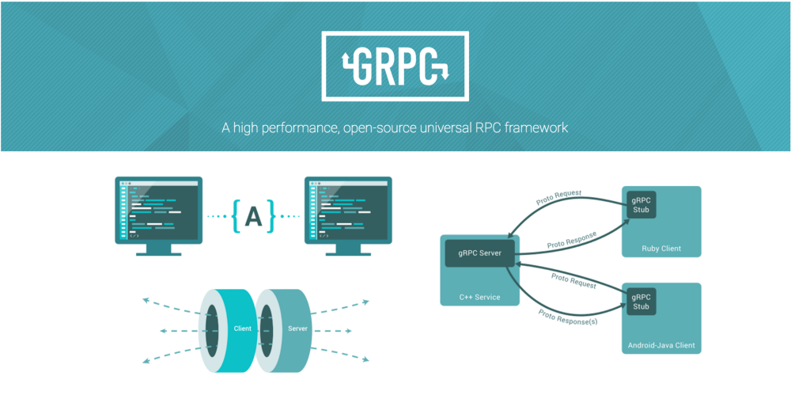

# GRPC 入门



gRPC是Google公司基于Protobuf开发的跨语言的开源RPC框架。gRPC基于HTTP/2协议设计，可以基于一个HTTP/2链接提供多个服务，对于移动设备更加友好。本节将讲述gRPC的简单用法

这个是我们之前定义的接口
```go
package service

const HelloServiceName = "HelloService"

type HelloService interface {
	Hello(*Request, *Response) error
}
```

其中数据结构: Request和Response 已经使用protobuf定义了数据的交换格式,  如果我们的接口也能通过 protobuf定义是不是 就完美了, 这也是GRPC真正的威力


## GRPC技术栈


+ 数据交互格式: protobuf
+ 通信方式: 最底层为TCP或Unix Socket协议，在此之上是HTTP/2协议的实现
+ 核心库: 在HTTP/2协议之上又构建了针对Go语言的gRPC核心库
+ Stub: 应用程序通过gRPC插件生产的Stub代码和gRPC核心库通信，也可以直接和gRPC核心库通信

gRPC采用protobuf描述 接口和数据, 我们可以把他理解为: protobuf ON HTTP2 的一种RPC


## Hello gRPC

下面我们讲演示一个基础的gRPC服务.

### protobuf grpc插件

protobuf 不仅可以定义交互的数据结构(message), 还可以定义交互的接口:

```protobuf
service HelloService {
    rpc Hello (String) returns (String);
}
```

从Protobuf的角度看，gRPC只不过是一个针对service接口生成代码的生成器。因此我们需要提前安装grpc的代码生成插件

```sh
# protoc-gen-go 插件之前已经安装
# go install google.golang.org/protobuf/cmd/protoc-gen-go@latest

# 安装protoc-gen-go-grpc插件
go install google.golang.org/grpc/cmd/protoc-gen-go-grpc@latest
```

我们看一看到当前插件的版本
```sh
protoc-gen-go-grpc --version                                   
protoc-gen-go-grpc 1.1.0
```

### 生成代码

然后基于protoc-gen-go-grpc来生产我们的grpc代码, 我们把之前的rpc 修改为GRPC

我们看看protobuf 定义接口的语法:
```protobuf
service <service_name> {
    rpc <function_name> (<request>) returns (<response>);
}
```
+ service: 用于申明这是个服务的接口
+ service_name: 服务的名称,接口名称
+ function_name: 函数的名称
+ request: 函数参数， 必须的
+ response: 函数返回， 必须的, 不能没有

```protobuf
syntax = "proto3";

package hello;
option go_package="gitee.com/infraboard/go-course/day21/pbrpc/service";

// The HelloService service definition.
service HelloService {
    rpc Hello (Request) returns (Response);
}

message Request {
    string value = 1;
}

message Response {
    string value = 1;
}
```

然后我们生产代码, 同时制定gprc插件对应参数:
```sh
protoc -I=. --go_out=./grpc/service --go_opt=module="gitee.com/infraboard/go-course/day21/grpc/service" \
--go-grpc_out=./grpc/service --go-grpc_opt=module="gitee.com/infraboard/go-course/day21/grpc/service" \
grpc/service/service.proto
```

生成代码: 
```go
// 客户端
// HelloServiceClient is the client API for HelloService service.
//
// For semantics around ctx use and closing/ending streaming RPCs, please refer to https://pkg.go.dev/google.golang.org/grpc/?tab=doc#ClientConn.NewStream.
type HelloServiceClient interface {
	Hello(ctx context.Context, in *Request, opts ...grpc.CallOption) (*Response, error)
}

// 服务端
// HelloServiceServer is the server API for HelloService service.
// All implementations must embed UnimplementedHelloServiceServer
// for forward compatibility
type HelloServiceServer interface {
	Hello(context.Context, *Request) (*Response, error)
	mustEmbedUnimplementedHelloServiceServer()
}
```

### gRPC服务端

基于服务端的HelloServiceServer接口可以重新实现HelloService服务

首先我们构建一个服务实体，实现GRPC定义的接口
```go
package main

import (
	"context"
	"log"
	"net"

	"gitee.com/infraboard/go-course/day21/grpc/service"
	"google.golang.org/grpc"
)

var _ service.HelloServiceServer = (*HelloService)(nil)

type HelloService struct {
	service.UnimplementedHelloServiceServer
}

func (p *HelloService) Hello(ctx context.Context, req *service.Request) (*service.Response, error) {
	resp := &service.Response{}
	resp.Value = "hello:" + req.Value
	return resp, nil
}
```

最后依赖grpc API 启动gRPC服务端:
```go
func main() {
	// 首先是通过grpc.NewServer()构造一个gRPC服务对象
	grpcServer := grpc.NewServer()
	// 然后通过gRPC插件生成的RegisterHelloServiceServer函数注册我们实现的HelloServiceImpl服务
	service.RegisterHelloServiceServer(grpcServer, new(HelloService))

	lis, err := net.Listen("tcp", ":1234")
	if err != nil {
		log.Fatal(err)
	}

	// 然后通过grpcServer.Serve(lis)在一个监听端口上提供gRPC服务
	grpcServer.Serve(lis)
}
```

### gRPC客户端

```go
package main

import (
	"context"
	"fmt"
	"log"

	"gitee.com/infraboard/go-course/day21/grpc/service"
	"google.golang.org/grpc"
)

func main() {
    // grpc.Dial负责和gRPC服务建立链接
	conn, err := grpc.Dial("localhost:1234", grpc.WithInsecure())
	if err != nil {
		log.Fatal(err)
	}
	defer conn.Close()

    // NewHelloServiceClient函数基于已经建立的链接构造HelloServiceClient对象,
    // 返回的client其实是一个HelloServiceClient接口对象
	client := service.NewHelloServiceClient(conn)


    // 通过接口定义的方法就可以调用服务端对应的gRPC服务提供的方法
	req := &service.Request{Value: "hello"}
	reply, err := client.Hello(context.Background(), req)
	if err != nil {
		log.Fatal(err)
	}
	fmt.Println(reply.GetValue())
}
```

##  gRPC流

RPC是远程函数调用，因此每次调用的函数参数和返回值不能太大，否则将严重影响每次调用的响应时间。因此传统的RPC方法调用对于上传和下载较大数据量场景并不适合。为此，gRPC框架针对服务器端和客户端分别提供了流特性

服务端或客户端的单向流是双向流的特例，我们在HelloService增加一个支持双向流的Channel方法
```protobuf
// The HelloService service definition.
service HelloService {
    rpc Hello (Request) returns (Response) {}

	rpc Channel (stream Request) returns (stream Response) {}
}
```

关键字stream指定启用流特性，参数部分是接收客户端参数的流，返回值是返回给客户端的流。

所以 定义streaming RPC 的语法如下:
```
rpc <function_name> (stream <type>) returns (stream <type>) {}
```


### 生成Streaming RPC

然后我们重新生成RPC代码
```sh
protoc -I=. --go_out=./grpc/service --go_opt=module="gitee.com/infraboard/go-course/day21/grpc/service" --go-grpc_out=./grpc/service --go-grraboard/go-course/day21/grpc/service" \
grpc/service/service.proto
```

我们看看接口的变化: 
```go
// 客户端的Channel方法返回一个HelloService_ChannelClient类型的返回值，可以用于和服务端进行双向通信
// HelloServiceClient is the client API for HelloService service.
//
// For semantics around ctx use and closing/ending streaming RPCs, please refer to https://pkg.go.dev/google.golang.org/grpc/?tab=doc#ClientConn.NewStream.
type HelloServiceClient interface {
	Hello(ctx context.Context, in *Request, opts ...grpc.CallOption) (*Response, error)
	Channel(ctx context.Context, opts ...grpc.CallOption) (HelloService_ChannelClient, error)
}


// 在服务端的Channel方法参数是一个新的HelloService_ChannelServer类型的参数，可以用于和客户端双向通信
// HelloServiceServer is the server API for HelloService service.
// All implementations must embed UnimplementedHelloServiceServer
// for forward compatibility
type HelloServiceServer interface {
	Hello(context.Context, *Request) (*Response, error)
	Channel(HelloService_ChannelServer) error
	mustEmbedUnimplementedHelloServiceServer()
}
```

HelloService_ChannelClient 和 HelloService_ChannelServer 接口定义:
```go
// Request  -----> 
// Response <----
type HelloService_ChannelClient interface {
	Send(*Request) error
	Recv() (*Response, error)
	grpc.ClientStream
}

// Request <----
// Reponse ---->
type HelloService_ChannelServer interface {
	Send(*Response) error
	Recv() (*Request, error)
	grpc.ServerStream
}
```

可以发现服务端和客户端的流辅助接口均定义了Send和Recv方法用于流数据的双向通信

### 服务端

server端逻辑:
+ 接收一个Request
+ 响应一个Response

```go
func (p *HelloService) Channel(stream service.HelloService_ChannelServer) error {
	// 服务端在循环中接收客户端发来的数据
	for {
		// 接收一个请求
		args, err := stream.Recv()
		if err != nil {
			// 如果遇到io.EOF表示客户端流被关闭
			if err == io.EOF {
				return nil
			}
			return err
		}

		// 响应一个请求
		// 生成返回的数据通过流发送给客户端
		resp := &service.Response{Value: "hello:" + args.GetValue()}
		err = stream.Send(resp)
		if err != nil {
			// 服务端发送异常, 函数退出, 服务端流关闭
			return err
		}
	}
}
```

双向流数据的发送和接收都是完全独立的行为。

需要注意的是，发送和接收的操作并不需要一一对应，用户可以根据真实场景进行组织代码

### 客户端

```go
package main

import (
	"context"
	"fmt"
	"io"
	"log"
	"time"

	"gitee.com/infraboard/go-course/day21/grpc/service"
	"google.golang.org/grpc"
)

func main() {
	conn, err := grpc.Dial("localhost:1234", grpc.WithInsecure())
	if err != nil {
		log.Fatal(err)
	}
	defer conn.Close()

	client := service.NewHelloServiceClient(conn)

	// 客户端需要先调用Channel方法获取返回的流对象
	stream, err := client.Channel(context.Background())
	if err != nil {
		log.Fatal(err)
	}

	// 在客户端我们将发送和接收操作放到两个独立的Goroutine。

	// 首先是向服务端发送数据
	go func() {
		for {
			if err := stream.Send(&service.Request{Value: "hi"}); err != nil {
				log.Fatal(err)
			}
			time.Sleep(time.Second)
		}
	}()

	// 然后在循环中接收服务端返回的数据
	for {
		reply, err := stream.Recv()
		if err != nil {
			if err == io.EOF {
				break
			}
			log.Fatal(err)
		}
		fmt.Println(reply.GetValue())
	}
}
```

## 参考

+ [GRPC Quick Start](https://grpc.io/docs/languages/go/quickstart/)
+ [GRPC Examples](https://github.com/grpc/grpc-go/tree/master/examples)