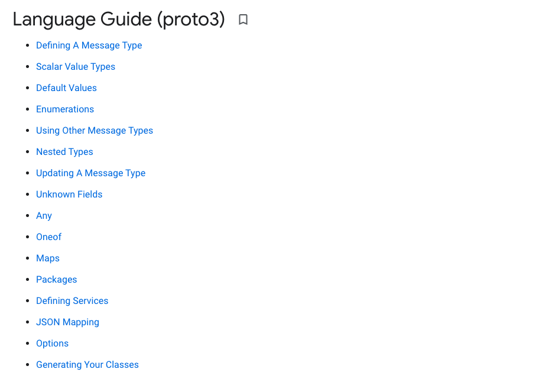
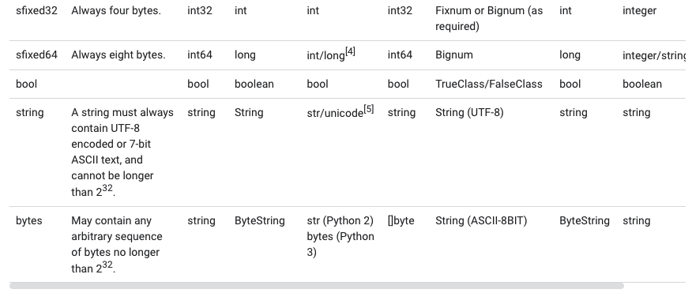

# proto3语法入门



[Language Guide (proto3) ](https://developers.google.com/protocol-buffers/docs/proto3)


## 定义消息类型

```protobuf
syntax = "proto3";

/* SearchRequest represents a search query, with pagination options to
 * indicate which results to include in the response. */

message SearchRequest {
  string query = 1;
  int32 page_number = 2; // Which page number do we want?
  int32 result_per_page = 3;
}
```

第一行是protobuf的版本, 我们主要讲下 message 的定义语法:
```
<comment>

message  <message_name> {
  <filed_rule>  <filed_type> <filed_name> = <field_number> 
        类型         名称             编号  
}
```

+ comment: 注射 /* */或者 //
+ message_name: 同一个pkg内，必须唯一
+ filed_rule: 可以没有, 常用的有repeated, oneof
+ filed_type: 数据类型, protobuf定义的数据类型, 生产代码的会映射成对应语言的数据类型
+ filed_name: 字段名称, 同一个message 内必须唯一
+ field_number: 字段的编号, 序列化成二进制数据时的字段编号, 同一个message 内必须唯一, 1 ~ 15 使用1个Byte表示, 16 ～ 2047 使用2个Byte表示


如果你想保留一个编号，以备后来使用可以使用 reserved 关键字声明

```protobuf
message Foo {
  reserved 2, 15, 9 to 11;
  reserved "foo", "bar";
}
```


## Value(Filed) Types

```protobuf
message String {
    string value = 1;
}
```

protobuf 定义了很多Value Types, 他和其他语言的映射关系如下:




上面就是所有的protobuf基础类型, 光有这些基础类型是不够的, 下面是protobuf为我们提供的一些复合类型

## 枚举类型

使用enum来声明枚举类型: 
```protobuf
enum Corpus {
    UNIVERSAL = 0;
    WEB = 1;
    IMAGES = 2;
    LOCAL = 3;
    NEWS = 4;
    PRODUCTS = 5;
    VIDEO = 6;
}
```

枚举声明语法:
```
enum <enum_name> {
    <element_name> = <element_number>
}
```

+ enum_name: 枚举名称
+ element_name: pkg内全局唯一,  很重要
+ element_name: 必须从0开始, 0表示类型的默认值, 32-bit integer

### 别名

如果你的确有2个同名的枚举需求: 比如 TaskStatus 和 PipelineStatus 都需要Running，就可以添加一个: option allow_alias = true;
```protobuf
message MyMessage1 {
  enum EnumAllowingAlias {
    option allow_alias = true;
    UNKNOWN = 0;
    STARTED = 1;
    RUNNING = 1;
  }
}
message MyMessage2 {
  enum EnumNotAllowingAlias {
    UNKNOWN = 0;
    STARTED = 1;
    // RUNNING = 1;  // Uncommenting this line will cause a compile error inside Google and a warning message outside.
  }
}
```


### 预留值

同理枚举也支持预留值
```protobuf
enum Foo {
  reserved 2, 15, 9 to 11, 40 to max;
  reserved "FOO", "BAR";
}
```


## 数组类型

如果我们想声明: []string, []Item 这在数组类型怎么办? filed_rule: repeated 可以胜任


```protobuf
message SearchResponse {
  repeated Result results = 1;
}

// 会编译为:
// type SearchResponse SearchResponse {
//    results []*Result
// }
```


## Map

如果我们想声明一个map, 可以如下进行:

```protobuf
map<string, Project> projects = 3;
// projects map[string, Project]
```

protobuf 声明map的语法:
```
map<key_type, value_type> map_field = N;
```


## Oneof

很像范型 比如 test_oneof 字段的类型 必须是 string name 和 SubMessage sub_message 其中之一:

```protobuf
message Sub1 {
    string name = 1;
}

message Sub2 {
    string name = 1;
}

message SampleMessage {
    oneof test_oneof {
        Sub1 sub1 = 1;
        Sub2 sub2 = 2;
    }
}
```

```sh
protoc -I=. --go_out=./pb --go_opt=module="gitee.com/infraboard/go-course/day21/pb" pb/oneof.proto
```

编译过后结构体
```go
type SampleMessage struct {
	state         protoimpl.MessageState
	sizeCache     protoimpl.SizeCache
	unknownFields protoimpl.UnknownFields

	// Types that are assignable to TestOneof:
	//	*SampleMessage_Sub1
	//	*SampleMessage_Sub2
	TestOneof isSampleMessage_TestOneof `protobuf_oneof:"test_oneof"`
}

```

那我们如何使用喃:

```go
of := &pb.SampleMessage{}
of.GetSub1()
of.GetSub2()
```

## Any

当我们无法明确定义数据类型的时候， 可以使用Any表示: 

```protobuf
// 这里是应用其他的proto文件, 后面会讲 ipmort用法
import "google/protobuf/any.proto";

message ErrorStatus {
  string message = 1;
  repeated google.protobuf.Any details = 2;
}
```

any本质上就是一个bytes数据结构

```go
type ErrorStatus struct {
	state         protoimpl.MessageState
	sizeCache     protoimpl.SizeCache
	unknownFields protoimpl.UnknownFields

	Message string       `protobuf:"bytes,1,opt,name=message,proto3" json:"message,omitempty"`
	Details []*anypb.Any `protobuf:"bytes,2,rep,name=details,proto3" json:"details,omitempty"`
}
```

下面是 any的定义
```go
// `Any` contains an arbitrary serialized protocol buffer message along with a
// URL that describes the type of the serialized message.
//
// Protobuf library provides support to pack/unpack Any values in the form
// of utility functions or additional generated methods of the Any type.
//  Example 4: Pack and unpack a message in Go
//
//      foo := &pb.Foo{...}
//      any, err := anypb.New(foo)
//      if err != nil {
//        ...
//      }
//      ...
//      foo := &pb.Foo{}
//      if err := any.UnmarshalTo(foo); err != nil {
//        ...
//      }
//
// The pack methods provided by protobuf library will by default use
// 'type.googleapis.com/full.type.name' as the type URL and the unpack
// methods only use the fully qualified type name after the last '/'
// in the type URL, for example "foo.bar.com/x/y.z" will yield type
// name "y.z".
//
//
// JSON
// ====
// The JSON representation of an `Any` value uses the regular
// representation of the deserialized, embedded message, with an
// additional field `@type` which contains the type URL. Example:
//
//     package google.profile;
//     message Person {
//       string first_name = 1;
//       string last_name = 2;
//     }
//
//     {
//       "@type": "type.googleapis.com/google.profile.Person",
//       "firstName": <string>,
//       "lastName": <string>
//     }
//
// If the embedded message type is well-known and has a custom JSON
// representation, that representation will be embedded adding a field
// `value` which holds the custom JSON in addition to the `@type`
// field. Example (for message [google.protobuf.Duration][]):
//
//     {
//       "@type": "type.googleapis.com/google.protobuf.Duration",
//       "value": "1.212s"
//     }
//
type Any struct {
	state         protoimpl.MessageState
	sizeCache     protoimpl.SizeCache
	unknownFields protoimpl.UnknownFields

  ...
	// Note: this functionality is not currently available in the official
	// protobuf release, and it is not used for type URLs beginning with
	// type.googleapis.com.
	//
	// Schemes other than `http`, `https` (or the empty scheme) might be
	// used with implementation specific semantics.
	//
	TypeUrl string `protobuf:"bytes,1,opt,name=type_url,json=typeUrl,proto3" json:"type_url,omitempty"`
	// Must be a valid serialized protocol buffer of the above specified type.
	Value []byte `protobuf:"bytes,2,opt,name=value,proto3" json:"value,omitempty"`
}
```

## 类型嵌套

我们可以再message里面嵌套message

```protobuf
message Outer {                  // Level 0
  message MiddleAA {  // Level 1
    message Inner {   // Level 2
      int64 ival = 1;
      bool  booly = 2;
    }
  }
  message MiddleBB {  // Level 1
    message Inner {   // Level 2
      int32 ival = 1;
      bool  booly = 2;
    }
  }
}
```

与Go结构体嵌套一样, 但是不允许 匿名嵌套, 必须指定字段名称

## 引用包

```protobuf
// 这里是应用其他的proto文件, 后面会讲 ipmort用法
import "google/protobuf/any.proto";
```
上面这在情况就是读取的标准库, 我们在安装protoc的时候, 已经把改lib 挪到usr/local/include下面了，所以可以找到


如果我们proto文件并没有在/usr/local/include目录下, 我们如何导入，比如:
```
import "myproject/other_protos.proto";
```


通过-I 可以添加搜索的路径, 这样就编译器就可以找到我们引入的包了

引入后通过包的名称.变量的方式使用

比如我们要应用该结构中的ErrorStatus
```protobuf
syntax = "proto3";

// 这里是应用其他的proto文件, 后面会讲 ipmort用法
import "google/protobuf/any.proto";

package hello;
option go_package="gitee.com/infraboard/go-course/day21/pb";

message ErrorStatus {
  string message = 1;
  repeated google.protobuf.Any details = 2;
}
```

引入ErrorStatus
```protobuf
syntax = "proto3";

// 由于这个文件的pkg 也叫hello, 因此我们可以不用添加 pkg前缀
//  如果不是同一个pkg 就需要添加 pkg名称前缀, 比如hello.ErrorStatus
import "pb/any.proto";

package hello;
option go_package="gitee.com/infraboard/go-course/day21/pb";

message ErrorStatusExt {
    ErrorStatus error_status = 1;
}
```


```sh
# 当前目录: day21
protoc -I=. --go_out=./pb --go_opt=module="gitee.com/infraboard/go-course/day21/pb" pb/import.proto 
```
由于我们使用的import是相对路径, 因此我们必须在day21下编译, 这样编译器根据相对位置 才能找到pb/any.proto这个引用


## 更新规范

+ Don't change the field numbers for any existing fields.

更多请参考 [Updating A Message Type](https://developers.google.com/protocol-buffers/docs/proto3#updating)


## 参考

+ [Language Guide (proto3) ](https://developers.google.com/protocol-buffers/docs/proto3)