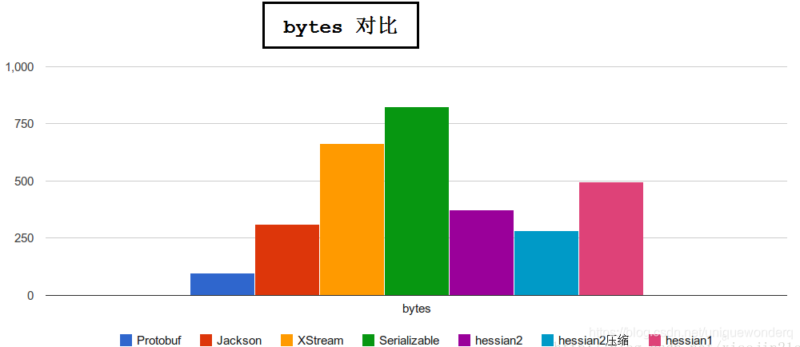
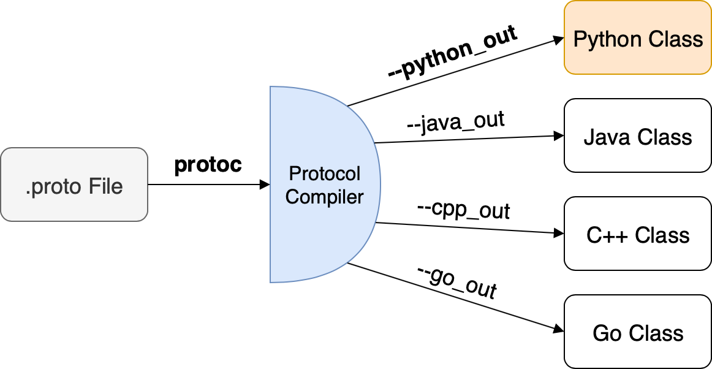
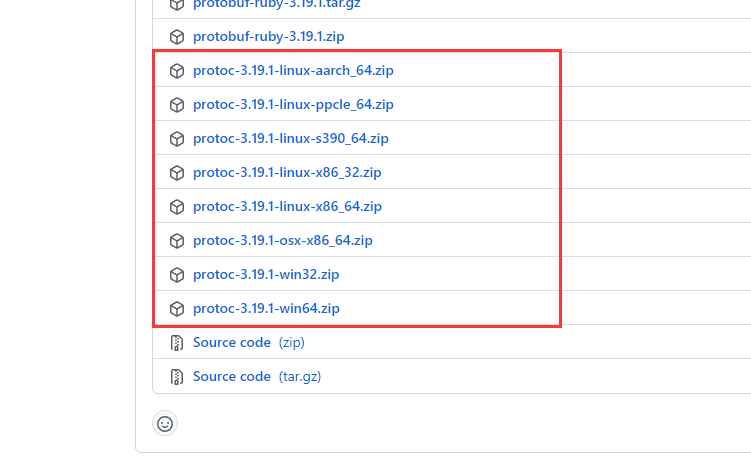
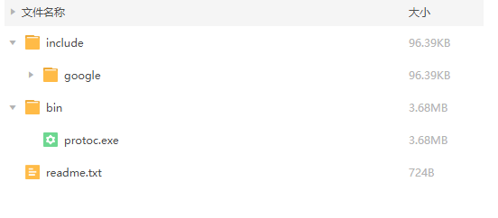

# Protobuf编解码


Protobuf是Protocol Buffers的简称，它是Google公司开发的一种数据描述语言，并于2008年对外开源。Protobuf刚开源时的定位类似于XML、JSON等数据描述语言，通过附带工具生成代码并实现将结构化数据序列化的功能。但是我们更关注的是Protobuf作为接口规范的描述语言，可以作为设计安全的跨语言PRC接口的基础工具

## 为什么选择Protobuf

一般而言我们需要一种编解码工具会参考:
+ 编解码效率
+ 高压缩比
+ 多语言支持

其中压缩与效率 最被关注的点:


## 使用流程

首先需要定义我们的数据，通过编译器，来生成不同语言的代码


之前我们的RPC要么使用的Gob, 要么使用的json, 接下来我们将使用probuf

首先创建hello.proto文件，其中包装HelloService服务中用到的字符串类型
```protobuf
syntax = "proto3";

package hello;
option go_package="gitee.com/infraboard/go-course/day21/pb";

message String {
    string value = 1;
}
```

+ syntax: 表示采用proto3的语法。第三版的Protobuf对语言进行了提炼简化，所有成员均采用类似Go语言中的零值初始化（不再支持自定义默认值），因此消息成员也不再需要支持required特性。
+ package：指明当前是main包（这样可以和Go的包名保持一致，简化例子代码），当然用户也可以针对不同的语言定制对应的包路径和名称。
+ option：protobuf的一些选项参数, 这里指定的是要生成的Go语言package路径, 其他语言参数各不相同
+ message: 关键字定义一个新的String类型，在最终生成的Go语言代码中对应一个String结构体。String类型中只有一个字符串类型的value成员，该成员编码时用1编号代替名字

关于数据编码:
```
在XML或JSON等数据描述语言中，一般通过成员的名字来绑定对应的数据。但是Protobuf编码却是通过成员的唯一编号来绑定对应的数据，因此Protobuf编码后数据的体积会比较小，但是也非常不便于人类查阅。我们目前并不关注Protobuf的编码技术，最终生成的Go结构体可以自由采用JSON或gob等编码格式，因此大家可以暂时忽略Protobuf的成员编码部分
```

但是我们如何把这个定义文件(IDL: 接口描述语言), 编译成不同语言的数据结构喃? 着就需要我们安装protobuf的编译器

## 安装编译器

protobuf的编译器叫: protoc(protobuf compiler), 我们需要到这里下载编译器: [Github Protobuf](https://github.com/protocolbuffers/protobuf/releases)

选择对应平台的二进制包下载:



这个压缩包里面有:
+ include, 头文件或者库文件
+ bin, protoc编译器
+ readme.txt, 一定要看，按照这个来进行安装



### 安装编译器二进制

linux/unix系统直接:
```sh
mv bin/protoc usr/bin
```

windows系统:
```
注意: Windows 上的 git-bash 上默认的 /usr/bin 目录在：C:\Program Files\Git\usr\bin\

因此我们首先将bin下的 protoc 编译器 挪到C:\Program Files\Git\usr\bin\
```

### 安装编译器库

include 下的库文件需要安装到: /usr/local/include/

linux/unix系统直接:
```
mv include/google /usr/local/include
```

windows系统:
```
C:\Program Files\Git\usr\local\include
```

### 验证安装

```
$ protoc --version
libprotoc 3.19.1
```

## 安装Go语言插件

Protobuf核心的工具集是C++语言开发的，在官方的protoc编译器中并不支持Go语言。要想基于上面的hello.proto文件生成相应的Go代码，需要安装相应的插件

```
go install google.golang.org/protobuf/cmd/protoc-gen-go@latest
```

接下来 我们就可以使用protoc 来生成我们对于的Go语言的数据结构

## Hello Protobuf

在day21/pb下创建hello.pb
```protobuf
syntax = "proto3";

package hello;
option go_package="gitee.com/infraboard/go-course/day21/pb";

message String {
    string value = 1;
}
```

编译proto文件
```sh
$ cd day21 ## 以day21作为编译的工作目录
$ protoc -I=. --go_out=./pb --go_opt=module="gitee.com/infraboard/go-course/day21/pb" pb/hello.proto
```

+ -I：-IPATH, --proto_path=PATH, 指定proto文件搜索的路径, 如果有多个路径 可以多次使用-I 来指定, 如果不指定默认为当前目录
+ --go_out: --go指插件的名称, 我们安装的插件为: protoc-gen-go, 而protoc-gen是插件命名规范, go是插件名称, 因此这里是--go, 而--go_out 表示的是 go插件的 out参数, 这里指编译产物的存放目录
+ --go_opt: protoc-gen-go插件opt参数, 这里的module指定了go module, 生成的go pkg 会去除掉module路径，生成对应pkg
+ pb/hello.proto: 我们proto文件路径

这样我们就在当前目录下生成了Go语言对应的pkg, 我们的message String 被生成为了一个Go Struct, 至于Proto3的语法和与Go语言数据结构的对应关系后面将讲到

```go
// Code generated by protoc-gen-go. DO NOT EDIT.
// versions:
// 	protoc-gen-go v1.27.1
// 	protoc        v3.19.1
// source: pb/hello.proto

package pb

import (
	protoreflect "google.golang.org/protobuf/reflect/protoreflect"
	protoimpl "google.golang.org/protobuf/runtime/protoimpl"
	reflect "reflect"
	sync "sync"
)

const (
	// Verify that this generated code is sufficiently up-to-date.
	_ = protoimpl.EnforceVersion(20 - protoimpl.MinVersion)
	// Verify that runtime/protoimpl is sufficiently up-to-date.
	_ = protoimpl.EnforceVersion(protoimpl.MaxVersion - 20)
)

type String struct {
	state         protoimpl.MessageState
	sizeCache     protoimpl.SizeCache
	unknownFields protoimpl.UnknownFields

	Value string `protobuf:"bytes,1,opt,name=value,proto3" json:"value,omitempty"`
}
...
```

然后我们就可以以Go语言的方式使用这个pkg

### 序列化与反序列化

基于上面生成的Go 数据结构, 我们就可以来进行 数据的交互了(序列化与反序列化)

我们使用google.golang.org/protobuf/proto工具提供的API来进行序列化与反序列化:
+ Marshal: 序列化
+ Unmarshal: 反序列化

下来来模拟一个 客户端 ---> 服务端 基于protobuf的数据交互过程
```go
package main

import (
	"fmt"
	"log"

	"google.golang.org/protobuf/proto"

	"gitee.com/infraboard/go-course/day21/pb"
)

func main() {
	clientObj := &pb.String{Value: "hello proto3"}

	// 序列化
	out, err := proto.Marshal(clientObj)
	if err != nil {
		log.Fatalln("Failed to encode obj:", err)
	}

	// 二进制编码
	fmt.Println("encode bytes: ", out)

	// 反序列化
	serverObj := &pb.String{}
	err = proto.Unmarshal(out, serverObj)
	if err != nil {
		log.Fatalln("Failed to decode obj:", err)
	}
	fmt.Println("decode obj: ", serverObj)
}

// encode bytes:  [10 12 104 101 108 108 111 32 112 114 111 116 111 51]
// decode obj:  value:"hello proto3"
```

### 基于protobuf的RPC

接下来我们改造之前的rpc: Protobuf ON TCP

我们新建一个目录: pbrpc

#### 定义交互数据结构

pbrpc/service/service.proto
```protobuf
syntax = "proto3";

package hello;
option go_package="gitee.com/infraboard/go-course/day21/pbrpc/service";

message Request {
    string value = 1;
}

message Response {
    string value = 1;
}
```

生成Go语言数据结构
```sh
## 当前目录day21/pbrpc
protoc -I=. --go_out=./service --go_opt=module="gitee.com/infraboard/go-course/day21/pbrpc/service" service/service.proto
```

#### 定义接口

基于生成的数据结构，定义接口 pbrpc/service/interface.go
```go
package service

const HelloServiceName = "HelloService"

type HelloService interface {
	Hello(*Request, *Response) error
}
```

#### 服务端

pbrpc/server/main.go
```go
import (
	"log"
	"net"
	"net/rpc"
	"net/rpc/jsonrpc"

	"gitee.com/infraboard/go-course/day21/pbrpc/service"
)

// 通过接口约束HelloService服务
var _ service.HelloService = (*HelloService)(nil)

type HelloService struct{}

// Hello的逻辑 就是 将对方发送的消息前面添加一个Hello 然后返还给对方
// 由于我们是一个rpc服务, 因此参数上面还是有约束：
// 		第一个参数是请求
// 		第二个参数是响应
// 可以类比Http handler
func (p *HelloService) Hello(req *service.Request, resp *service.Response) error {
	resp.Value = "hello:" + req.Value
	return nil
}

func main() {
	// 把我们的对象注册成一个rpc的 receiver
	// 其中rpc.Register函数调用会将对象类型中所有满足RPC规则的对象方法注册为RPC函数，
	// 所有注册的方法会放在“HelloService”服务空间之下
	rpc.RegisterName("HelloService", new(HelloService))

	// 然后我们建立一个唯一的TCP链接，
	listener, err := net.Listen("tcp", ":1234")
	if err != nil {
		log.Fatal("ListenTCP error:", err)
	}

	// 通过rpc.ServeConn函数在该TCP链接上为对方提供RPC服务。
	// 没Accept一个请求，就创建一个goroutie进行处理
	for {
		conn, err := listener.Accept()
		if err != nil {
			log.Fatal("Accept error:", err)
		}

		// // 前面都是tcp的知识, 到这个RPC就接管了
		// // 因此 你可以认为 rpc 帮我们封装消息到函数调用的这个逻辑,
		// // 提升了工作效率, 逻辑比较简洁，可以看看他代码
		// go rpc.ServeConn(conn)

		// 代码中最大的变化是用rpc.ServeCodec函数替代了rpc.ServeConn函数，
		// 传入的参数是针对服务端的json编解码器
		go rpc.ServeCodec(jsonrpc.NewServerCodec(conn))
	}
}
```


#### 客户端

pbrpc/client/main.go
```go
package main

import (
	"fmt"
	"log"
	"net"
	"net/rpc"
	"net/rpc/jsonrpc"

	"gitee.com/infraboard/go-course/day21/pbrpc/service"
)

// 约束客户端
var _ service.HelloService = (*HelloServiceClient)(nil)

type HelloServiceClient struct {
	*rpc.Client
}

func DialHelloService(network, address string) (*HelloServiceClient, error) {
	// c, err := rpc.Dial(network, address)
	// if err != nil {
	// 	return nil, err
	// }

	// 建立链接
	conn, err := net.Dial("tcp", "localhost:1234")
	if err != nil {
		log.Fatal("net.Dial:", err)
	}

	// 采用Json编解码的客户端
	c := rpc.NewClientWithCodec(jsonrpc.NewClientCodec(conn))
	return &HelloServiceClient{Client: c}, nil
}

func (p *HelloServiceClient) Hello(req *service.Request, resp *service.Response) error {
	return p.Client.Call(service.HelloServiceName+".Hello", req, resp)
}

func main() {
	client, err := DialHelloService("tcp", "localhost:1234")
	if err != nil {
		log.Fatal("dialing:", err)
	}

	resp := &service.Response{}
	err = client.Hello(&service.Request{Value: "hello"}, resp)
	if err != nil {
		log.Fatal(err)
	}
	fmt.Println(resp)
}
```

#### Proto Codec编解码

定义Header相关数据结构
```protobuf
// Copyright 2013 <chaishushan{AT}gmail.com>. All rights reserved.
// Use of this source code is governed by a BSD-style
// license that can be found in the LICENSE file.

syntax = "proto3";

//
//	protorpc wire format wrapper
//
//	0. Frame Format
//	len : uvarint64
//	data: byte[len]
//
//	1. Client Send Request
//	Send RequestHeader: sendFrame(zsock, hdr, len(hdr))
//	Send Request: sendFrame(zsock, body, hdr.snappy_compressed_request_len)
//
//	2. Server Recv Request
//	Recv RequestHeader: recvFrame(zsock, hdr, max_hdr_len, 0)
//	Recv Request: recvFrame(zsock, body, hdr.snappy_compressed_request_len, 0)
//
//	3. Server Send Response
//	Send ResponseHeader: sendFrame(zsock, hdr, len(hdr))
//	Send Response: sendFrame(zsock, body, hdr.snappy_compressed_response_len)
//
//	4. Client Recv Response
//	Recv ResponseHeader: recvFrame(zsock, hdr, max_hdr_len, 0)
//	Recv Response: recvFrame(zsock, body, hdr.snappy_compressed_response_len, 0)
//
package pb;
option go_package="gitee.com/infraboard/go-course/day21/pbrpc/codec/pb";

enum Const {
	ZERO = 0;
	MAX_REQUEST_HEADER_LEN = 1024;
}

message RequestHeader {
	uint64 id = 1;
	string method = 2;

	uint32 raw_request_len = 3;
	uint32 snappy_compressed_request_len = 4;
	uint32 checksum = 5;
}

message ResponseHeader {
	uint64 id = 1;
	string error = 2;

	uint32 raw_response_len = 3;
	uint32 snappy_compressed_response_len = 4;
	uint32 checksum = 5;
}
```

生成代码
```
protoc -I=. --go_out=./codec/pb --go_opt=module="gitee.com/infraboard/go-course/day21/pbrpc/codec/pb" codec/pb/header.proto
```

我们实现了一套protobuf 的编解码rpc插件: codec, 具体代码见 pbrpc/codec 目录

+ codec/client: 客户端编解码实现
+ codec/server: 服务端编解码实现


修改客户端:
```go
func DialHelloService(network, address string) (*HelloServiceClient, error) {
	// 建立链接
	conn, err := net.Dial("tcp", "localhost:1234")
	if err != nil {
		log.Fatal("net.Dial:", err)
	}

	// 采用Porobuf编解码的客户端
	c := rpc.NewClientWithCodec(client.NewClientCodec(conn))
	return &HelloServiceClient{Client: c}, nil
}
```

修改服务端:
```go
func main() {
	// 把我们的对象注册成一个rpc的 receiver
	// 其中rpc.Register函数调用会将对象类型中所有满足RPC规则的对象方法注册为RPC函数，
	// 所有注册的方法会放在“HelloService”服务空间之下
	rpc.RegisterName("HelloService", new(HelloService))

	// 然后我们建立一个唯一的TCP链接，
	listener, err := net.Listen("tcp", ":1234")
	if err != nil {
		log.Fatal("ListenTCP error:", err)
	}

	// 通过rpc.ServeConn函数在该TCP链接上为对方提供RPC服务。
	// 没Accept一个请求，就创建一个goroutie进行处理
	for {
		conn, err := listener.Accept()
		if err != nil {
			log.Fatal("Accept error:", err)
		}

		// // 前面都是tcp的知识, 到这个RPC就接管了
		// // 因此 你可以认为 rpc 帮我们封装消息到函数调用的这个逻辑,
		// // 提升了工作效率, 逻辑比较简洁，可以看看他代码
		// go rpc.ServeConn(conn)

		// 代码中最大的变化是用rpc.ServeCodec函数替代了rpc.ServeConn函数，
		// 传入的参数是针对服务端的protobuf编解码器
		go rpc.ServeCodec(server.NewServerCodec(conn))
	}
}
```


#### 测试RPC

```sh
# 启动服务端
$ go run server/main.go

# 客户端调用
$ go run client/main.go
value:"hello:hello"
```

## 参考

+ [Protocol Buffers Google官网](https://developers.google.com/protocol-buffers)
+ [Protocol Buffer Basics: Go](https://developers.google.com/protocol-buffers/docs/gotutorial)
