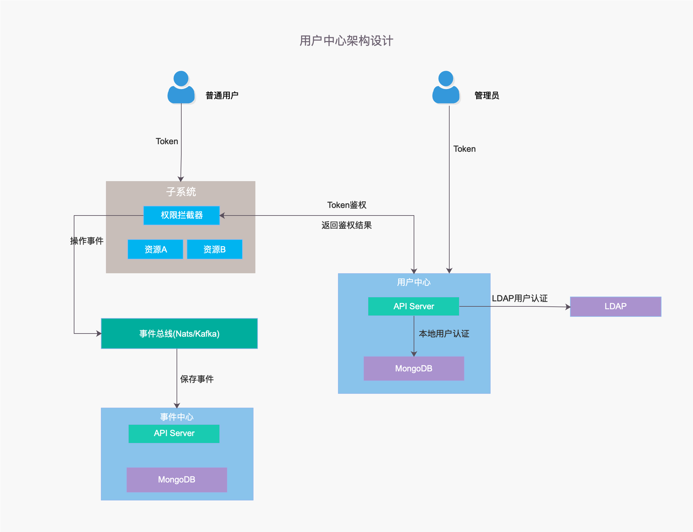
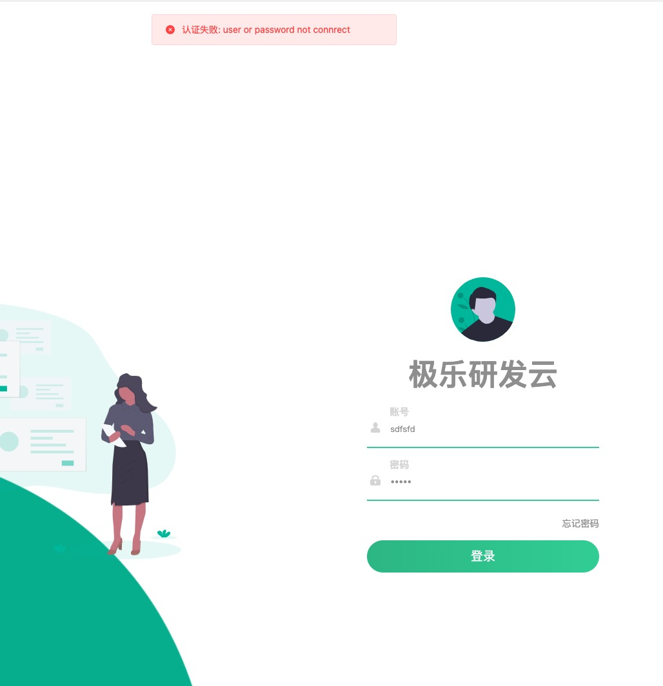

# 认证与授权



## 登录认证

如何知道谁在访问我们系统, 我们需要用户提供一个访问凭证，用来标识用户身份，最简单的方案是Basic Auth, 每次访问都需要带上这个信息，服务端通过他来验证用户的合法性

为什么每次都需要带上喃? 因为HTTP是短链接请求, 本身是无状态的

这种每次访问都携带 用户名和密码的方式，可能会导致 用户的账户泄露, 所以在API 认证方案中，并不太推荐。

最常见的方式是 访问令牌(token):
+ 用户通过用户名和密码 换取一个访问凭证(Token)
+ 使用该token 访问后端的API, 后端向权限中心验证该凭证的一个合法性

因此我们需要一个颁发Token的接口

下面是颁发请求
```go
type IssueTokenRequest struct {
	state         protoimpl.MessageState
	sizeCache     protoimpl.SizeCache
	unknownFields protoimpl.UnknownFields

	ClientId        string    `protobuf:"bytes,1,opt,name=client_id,json=clientId,proto3" json:"client_id,omitempty"`
	ClientSecret    string    `protobuf:"bytes,2,opt,name=client_secret,json=clientSecret,proto3" json:"client_secret,omitempty"`
	VerifyCode      string    `protobuf:"bytes,3,opt,name=verify_code,json=verifyCode,proto3" json:"verify_code,omitempty"`
	Username        string    `protobuf:"bytes,4,opt,name=username,proto3" json:"username,omitempty"`
	Password        string    `protobuf:"bytes,5,opt,name=password,proto3" json:"password,omitempty"`
	RefreshToken    string    `protobuf:"bytes,6,opt,name=refresh_token,json=refreshToken,proto3" json:"refresh_token,omitempty"`
	AccessToken     string    `protobuf:"bytes,7,opt,name=access_token,json=accessToken,proto3" json:"access_token,omitempty"`
	AuthCode        string    `protobuf:"bytes,8,opt,name=auth_code,json=authCode,proto3" json:"auth_code,omitempty"`
	State           string    `protobuf:"bytes,9,opt,name=state,proto3" json:"state,omitempty"`
	GrantType       GrantType `protobuf:"varint,10,opt,name=grant_type,json=grantType,proto3,enum=infraboard.keyauth.token.GrantType" json:"grant_type,omitempty"`
	Type            TokenType `protobuf:"varint,11,opt,name=type,proto3,enum=infraboard.keyauth.token.TokenType" json:"type,omitempty"`
	AccessExpiredAt int64     `protobuf:"varint,15,opt,name=access_expired_at,json=accessExpiredAt,proto3" json:"access_expired_at,omitempty"`
	Description     string    `protobuf:"bytes,16,opt,name=description,proto3" json:"description,omitempty"`
	Scope           string    `protobuf:"bytes,12,opt,name=scope,proto3" json:"scope,omitempty"`
	UserAgent       string    `protobuf:"bytes,13,opt,name=user_agent,json=userAgent,proto3" json:"user_agent,omitempty"`
	RemoteIp        string    `protobuf:"bytes,14,opt,name=remote_ip,json=remoteIp,proto3" json:"remote_ip,omitempty"`
}
```

下面是颁发器, 负责颁发具体的token
```go
// IssueToken 颁发token
func (i *issuer) IssueToken(ctx context.Context, req *token.IssueTokenRequest) (*token.Token, error) {
	if err := req.Validate(); err != nil {
		return nil, err
	}

    // 请求颁发token的端的合法性, 比如 ios，andriod，pc， web，....
	app, err := i.CheckClient(ctx, req.ClientId, req.ClientSecret)
	if err != nil {
		return nil, exception.NewUnauthorized(err.Error())
	}

	switch req.GrantType {
	case token.GrantType_PASSWORD:
        ...
	case token.GrantType_REFRESH:
        ...
	case token.GrantType_ACCESS:
        ...
	case token.GrantType_LDAP:
        ...
	case token.GrantType_CLIENT:
		return nil, exception.NewInternalServerError("not impl")
	case token.GrantType_AUTH_CODE:
		return nil, exception.NewInternalServerError("not impl")
	default:
		return nil, exception.NewInternalServerError("unknown grant type %s", req.GrantType)
	}
}
```


### 令牌颁发流程

+ Retry Lock检查
+ 颁发token
+ 登录安全检查
+ 登录会话记录与单点登录(SSO)

```go
func (s *service) IssueToken(ctx context.Context, req *token.IssueTokenRequest) (*token.Token, error) {
	// 连续登录失败检测
	if err := s.loginBeforeCheck(ctx, req); err != nil {
		return nil, exception.NewBadRequest("安全检测失败, %s", err)
	}

	// 颁发Token
	tk, err := s.issuer.IssueToken(ctx, req)
	if err != nil {
		s.checker.UpdateFailedRetry(ctx, req)
		return nil, err
	}
	tk.WithRemoteIP(req.GetRemoteIp())
	tk.WithUerAgent(req.GetUserAgent())

	// 安全登录检测
	if err := s.securityCheck(ctx, req.VerifyCode, tk); err != nil {
		return nil, err
	}

	// 登录会话
	if req.IsLoginRequest() {
		sess, err := s.session.Login(ctx, tk)
		if err != nil {
			return nil, err
		}
		tk.SessionId = sess.Id
	}

	// 保存入库
	if err := s.saveToken(tk); err != nil {
		return nil, err
	}

	return tk, nil
}
```

### Oauth2.0

有同学可能会问题？ 你为啥支持这么多认证方式喃？ 有参考啥标准吗? 对我们参考的Oauth2.0

Oauth2.0请参考: [OAuth 2.0 的四种方式](https://www.ruanyifeng.com/blog/2019/04/oauth-grant-types.html)

我们基于此认证框架进行了扩展, 其他不常用的暂时没实现

下面我们重点介绍下 用户名密码认证

### 用户名密码认证

要办法用户密码token, 我们需要存储用户信息, keyauth选择将用户信息保存在mongodb里面, 下面是mongodb里面的user的collecton
```json
{
    "_id": "admin",
    "department_id": ".23",
    "create_type": NumberInt("0"),
    "create_at": NumberLong("1612234852667"),
    "update_at": NumberLong("1616497711254"),
    "domain": "admin-domain",
    "type": NumberInt("2"),
    "profile": {
        "real_name": "",
        "nick_name": "",
        "phone": "",
        "email": "18108053819@163.com",
        "address": "",
        "gender": NumberInt("0"),
        "avatar": "",
        "language": "",
        "city": "",
        "province": ""
    },
    "expires_days": NumberInt("0"),
    "is_initialized": true,
    "password": {
        "password": "$2a$10$pUFDPYRlxkK5iElDMooQzePVKbEsi7qrzKMZRrZ32oub.l21AIgC.",
        "create_at": NumberLong("1612234852667"),
        "update_at": NumberLong("1635559896263"),
        "need_reset": false,
        "reset_reason": "",
        "history": [
            "$2a$10$q5rtJFV0mPC9OhN18/c7buSv3c3l6jMHfuhT9hq1p829jLrdp.9FO",
            "$2a$10$2Kf1d/bsmgggf7W77qAkROGo7siq2Yw6ONHK9TDPKxFPxFBSDVxFG"
        ]
    },
    "status": {
        "locked": false,
        "locked_time": NumberLong("0"),
        "locked_reson": "",
        "unlock_time": NumberLong("0")
    },
    "description": ""
}
```

如何颁发一个token喃:
+ 检查用户密码是否正确
+ 检查秘密是否过期
+ 如果都ok就颁发一个GrantType_PASSWORD类型的token给用户
+ 设置用户Domain
    + 如果是子账号和服务账号 都需要继承主用户Domain
    + 如果是主账号，查询主账号的domin

```go
u, checkErr := i.checkUserPass(ctx, req.Username, req.Password)
if checkErr != nil {
    i.log.Debugf("issue password token error, %s", checkErr)
    return nil, exception.NewUnauthorized("user or password not connrect")
}

if err := i.checkUserPassExpired(ctx, u); err != nil {
    i.log.Debugf("issue password token error, %s", err)
    if v, ok := err.(exception.APIException); ok {
        v.WithData(u.Account)
    }
    return nil, err
}

tk := i.issueUserToken(app, u, token.GrantType_PASSWORD)
switch u.Type {
case types.UserType_SUPPER, types.UserType_PRIMARY:
    err := i.setTokenDomain(ctx, tk)
    if err != nil {
        return nil, fmt.Errorf("set token domain error, %s", err)
    }
    tk.Domain = u.Domain
case types.UserType_SUB:
    tk.Domain = u.Domain
}

return tk, nil
```

如何判断秘密是否过期喃? 就是Hash比对
```go
func (i *issuer) checkUserPass(ctx context.Context, user, pass string) (*user.User, error) {
	u, err := i.getUser(ctx, user)
	if err != nil {
		return nil, err
	}

	if err := u.HashedPassword.CheckPassword(pass); err != nil {
		return nil, err
	}
	return u, nil
}
```

如何检查秘密是否过期喃? 根据domain设置的安全规则 判断密码颁发时间
```go
func (i *issuer) checkUserPassExpired(ctx context.Context, u *user.User) error {
	d, err := i.getDomain(ctx, u)
	if err != nil {
		return err
	}

	// 检测密码是否过期
	err = d.SecuritySetting.PasswordSecurity.IsPasswordExpired(u.HashedPassword)
	if err != nil {
		return err
	}

	return nil
}
```

我们验证下


### LDAP认证

每个Domain都有一个LDAP配置, 根据用户的baseDN, 这部分作为可选解读

```go
userName, dn, err := i.genBaseDN(req.Username)
if err != nil {
    return nil, err
}

descReq := provider.NewDescribeLDAPConfigWithBaseDN(dn)
ldapConf, err := i.ldap.DescribeConfig(descReq)
if err != nil {
    return nil, err
}
pv := ldap.NewProvider(ldapConf.Config)
ok, err := pv.CheckUserPassword(userName, req.Password)
if err != nil {
    return nil, err
}
if !ok {
    return nil, exception.NewUnauthorized("用户名或者密码不对")
}
u, err := i.syncLDAPUser(ctx, req.Username)
if err != nil {
    return nil, err
}
newTK := i.issueUserToken(app, u, token.GrantType_LDAP)
newTK.Domain = ldapConf.Domain
return newTK, nil
```

## 登录安全

为了让登录过程更加安全，我们专门定一个security模块, 用于检查登录过程的安全性
+ Retry Lock
+ Ip 保护
+ 异地登录检查

```go
// Checker 安全检测
type Checker interface {
	MaxTryChecker
	ExceptionLockChecKer
	IPProtectChecker
}

// MaxTryChecker todo 失败重试限制
type MaxTryChecker interface {
	MaxFailedRetryCheck(context.Context, *token.IssueTokenRequest) error
	UpdateFailedRetry(context.Context, *token.IssueTokenRequest) error
}

// IPProtectChecker todo
type IPProtectChecker interface {
	IPProtectCheck(context.Context, *token.IssueTokenRequest) error
}

// ExceptionLockChecKer 异地登录限制
type ExceptionLockChecKer interface {
	OtherPlaceLoggedInChecK(context.Context, *token.Token) error
	NotLoginDaysChecK(context.Context, *token.Token) error
}
```

我们看看security checker 实例需要依赖那些服务
```go
// NewChecker todo
func NewChecker() (Checker, error) {
	c := cache.C()
	if c == nil {
		return nil, fmt.Errorf("denpence cache service is nil")
	}

	return &checker{
		domain:    app.GetGrpcApp(domain.AppName).(domain.DomainServiceServer),
		user:      app.GetGrpcApp(user.AppName).(user.UserServiceServer),
		session:   app.GetGrpcApp(session.AppName).(session.ServiceServer),
		cache:     c,
		ip2Regoin: app.GetInternalApp(ip2region.AppName).(ip2region.Service),
		log:       zap.L().Named("Login Security"),
	}, nil
}

type checker struct {
	domain    domain.DomainServiceServer
	user      user.UserServiceServer
	session   session.ServiceServer
	cache     cache.Cache
	ip2Regoin ip2region.Service
	log       logger.Logger
}
```

### 重试锁

为了避免用户暴力破解我们的密码, 一般都需要做 最大失败次数的限制, 比如是你们的 银行账号 就很常见

思路:
+ 记录下 每一个账号的登录失败次数, 如果超过一定次数，就锁住
+ 我们的锁需要有个时间, 比如5分钟，或者其他, 因此我们需要一个带TTL的kv存储, Redis或者内存KV都可以

下面是失败次数的检查
```go
func (c *checker) MaxFailedRetryCheck(ctx context.Context, req *token.IssueTokenRequest) error {
	ss := c.getOrDefaultSecuritySettingWithUser(ctx, req.Username)
	if !ss.LoginSecurity.RetryLock {
		c.log.Debugf("retry lock check disabled, don't check")
		return nil
	}
	c.log.Debugf("max failed retry lock check enabled, checking ...")

	var count uint32
	err := c.cache.Get(req.AbnormalUserCheckKey(), &count)
	if err != nil {
		c.log.Errorf("get key %s from cache error, %s", req.AbnormalUserCheckKey(), err)
	}

	rc := ss.LoginSecurity.RetryLockConfig
	c.log.Debugf("retry times: %d, retry limite: %d", count, rc.RetryLimite)
	if count+1 >= rc.RetryLimite {
		return fmt.Errorf("登录失败次数过多, 请%d分钟后重试", rc.LockedMinite)
	}

	return nil
}
```


每登录失败一次就更新下我们kv存储里面的值
```go
func (c *checker) UpdateFailedRetry(ctx context.Context, req *token.IssueTokenRequest) error {
	ss := c.getOrDefaultSecuritySettingWithUser(ctx, req.Username)
	if !ss.LoginSecurity.RetryLock {
		c.log.Debugf("retry lock check disabled, don't check")
		return nil
	}

	c.log.Debugf("update failed retry count, check key: %s", req.AbnormalUserCheckKey())

	var count int
	if err := c.cache.Get(req.AbnormalUserCheckKey(), &count); err == nil {
		// 之前已经登陆失败过
		err := c.cache.Put(req.AbnormalUserCheckKey(), count+1)
		if err != nil {
			c.log.Errorf("set key %s to cache error, %s", req.AbnormalUserCheckKey())
		}
	} else {
		// 首次登陆失败
		err := c.cache.PutWithTTL(
			req.AbnormalUserCheckKey(),
			count+1,
			ss.LoginSecurity.RetryLockConfig.LockedMiniteDuration(),
		)
		if err != nil {
			c.log.Errorf("set key %s to cache error, %s", req.AbnormalUserCheckKey())
		}
	}
	return nil
}
```

### Ip保护

由于我们的系统都在 多层代理后面，因此我们需要获取用户的真正的IP 可能会不太容易, 这里暂未实现

```go
func (c *checker) IPProtectCheck(ctx context.Context, req *token.IssueTokenRequest) error {
	ss := c.getOrDefaultSecuritySettingWithUser(ctx, req.Username)
	if !ss.LoginSecurity.IpLimite {
		c.log.Debugf("ip limite check disabled, don't check")
		return nil
	}

	c.log.Debugf("ip limite check enabled, checking ...")

	return nil
}
```


### 防止僵尸用户

如果一个用户很久都没有登录, 有可能是该用户都不再使用该系统了,  国外这种案例很多，特别是邮件系统账号, 因此当用户长时间不使用该系统后需要冻结用户

然后等待管理员解冻, 或者根据实名认证解冻

如何判断喃?
+ 获取用户最近一次登录记录, 判断上次登录距今多久了
+ 如果大于系统设置, 这阻止本地登录

```go
func (c *checker) NotLoginDaysChecK(ctx context.Context, tk *token.Token) error {
	ss := c.getOrDefaultSecuritySettingWithUser(ctx, tk.Account)
	if !ss.LoginSecurity.ExceptionLock {
		c.log.Debugf("exception check disabled, don't check")
		return nil
	}
	c.log.Debugf("not login days check enabled, checking ...")

	// 查询出用户上次登陆的地域
	queryReq := session.NewQueryUserLastSessionRequest(tk.Account)
	us, err := c.session.QueryUserLastSession(ctx, queryReq)
	if err != nil {
		if exception.IsNotFoundError(err) {
			c.log.Debugf("user %s last login session not found", tk.Account)
			return nil
		}

		return err
	}

	if us != nil {
		days := uint32(time.Now().Sub(time.Unix(us.LoginAt/1000, 0)).Hours() / 24)
		c.log.Debugf("user %d days not login", days)
		maxDays := ss.LoginSecurity.ExceptionLockConfig.NotLoginDays
		if days > maxDays {
			return fmt.Errorf("user not login days %d", days)
		}
		c.log.Debugf("not login days check passed, days: %d, max days: %d", days, maxDays)
	}

	return nil
}
```


### 异地登录验证

要做异地登录检查, 必须通过IP能查询到用户的地域, 因此我们需要一个准确的IP地址库: [ip2region](https://github.com/lionsoul2014/ip2region)

下面是该库的一个大概用法:
```go
package main

import (
	"fmt"
	"github.com/lionsoul2014/ip2region/binding/golang/ip2region"
)

func main() {
	fmt.Println("err")
	region, err := ip2region.New("ip2region.db")
	defer region.Close()
	if err != nil {
		fmt.Println(err)
		return
	}
	ip, err := region.MemorySearch("127.0.0.1")
	fmt.Println(ip, err)
	ip, err = region.BinarySearch("127.0.0.1")
	fmt.Println(ip, err)
	ip, err = region.BtreeSearch("127.0.0.1")
	fmt.Println(ip, err)
}
```

由于该库并不大, 在项目启动的时候，在项目启动的时候，或者开始检查的时候直接加载到内存中使用即可

因此我们异地登录检查的逻辑:
+ 更加用户IP查询用户地域
+ 获取用户上次登录时的地域
+ 对比是不是异地

```go
func (c *checker) OtherPlaceLoggedInChecK(ctx context.Context, tk *token.Token) error {
	ss := c.getOrDefaultSecuritySettingWithDomain(ctx, tk.Account, tk.Domain)
	if !ss.LoginSecurity.ExceptionLock {
		c.log.Debugf("exception check disabled, don't check")
		return nil
	}

	if !ss.LoginSecurity.ExceptionLockConfig.OtherPlaceLogin {
		c.log.Debugf("other place login check disabled, don't check")
		return nil
	}

	c.log.Debugf("other place login check enabled, checking ...")

	// 查询当前登陆IP地域
	rip := tk.GetRemoteIP()
	c.log.Debugf("query remote ip: %s location ...", rip)
	login, err := c.ip2Regoin.LookupIP(rip)
	if err != nil {
		c.log.Errorf("lookup ip %s error, %s, skip OtherPlaceLoggedInChecK", rip, err)
		return nil
	}

	// 查询出用户上次登陆的地域
	queryReq := session.NewQueryUserLastSessionRequest(tk.Account)
	us, err := c.session.QueryUserLastSession(ctx, queryReq)
	if err != nil {
		if exception.IsNotFoundError(err) {
			c.log.Debugf("user %s last login session not found", tk.Account)
			return nil
		}

		return err
	}

	if us.IpInfo == nil {
		c.log.Debugf("last login session no ip info found, skip OtherPlaceLoggedInChecK")
		return nil
	}

	// city为0 表示内网IP, 不错异地登录校验
	if login.CityID == 0 || us.IpInfo.CityId == 0 {
		c.log.Warnf("city id is 0, 内网IP skip OtherPlaceLoggedInChecK")
		return nil
	}

	if us != nil {
		c.log.Debugf("user last login city: %s (%d)", us.IpInfo.City, us.IpInfo.CityId)
		if login.CityID != us.IpInfo.CityId {
			return fmt.Errorf("异地登录, 请输入验证码后再次提交")
		}
	}
	return nil
}
```

## 单点登录

单点登录的思路很简单:
+ token刷新 属于会话刷新，不终止session
+ 关闭之前的会话, 禁用之前回话的token
+ 开始新的会话

```go
func (s *service) Login(ctx context.Context, tk *token.Token) (*session.Session, error) {
	if tk.IsRefresh() {
		sess, err := s.DescribeSession(ctx, session.NewDescribeSessionRequestWithID(tk.SessionId))
		if err != nil {
			return nil, err
		}

		sess.AccessToken = tk.AccessToken
		if err := s.updateSession(sess); err != nil {
			return nil, err
		}
		return sess, nil
	}

	// 关闭之前的session
	s.closeOldSession(ctx, tk)

	sess, err := session.NewSession(s.ip, tk)
	if err != nil {
		return nil, err
	}

	// 填充session IP信息
	sess.IpInfo, err = s.parseRemoteIPInfo(tk.GetRemoteIp())
	if err != nil {
		s.log.Errorf("parse remote ip error, %s", err)
	}

	if err := s.saveSession(sess); err != nil {
		return nil, err
	}
	s.log.Infof("user(%s) session: %s login at: %d", sess.Account, sess.Id, sess.LoginAt)
	return sess, nil
}
```


## 再次回顾Token颁发流程

+ Retry Lock检查
+ 颁发token
+ 登录安全检查
+ 登录会话记录与单点登录(SSO)

使用postman 测试流程


## 接口认证

我们服务的认证分为2类:
+ HTTP接口认证: token认证
+ GRPC接口认证: 服务凭证认证


### GRPC 认证


#### keyauth自身

依赖内部ioc的 token服务

```go
// GrpcAuthUnaryServerInterceptor returns a new unary server interceptor for auth.
func GrpcAuthUnaryServerInterceptor() grpc.UnaryServerInterceptor {
	return newGrpcAuther().Auth
}

func newGrpcAuther() *grpcAuther {
	return &grpcAuther{
		log:   zap.L().Named("Grpc Auther"),
		micro: app.GetGrpcApp(micro.AppName).(micro.MicroServiceServer),
	}
}

// internal todo
type grpcAuther struct {
	log   logger.Logger
	micro micro.MicroServiceServer
}

func (a *grpcAuther) Auth(
	ctx context.Context, req interface{},
	info *grpc.UnaryServerInfo,
	handler grpc.UnaryHandler,
) (resp interface{}, err error) {
	// 重上下文中获取认证信息
	md, ok := metadata.FromIncomingContext(ctx)
	if !ok {
		return nil, fmt.Errorf("ctx is not an grpc incoming context")
	}

	clientId, clientSecret := a.GetClientCredentialsFromMeta(md)

	// 校验调用的客户端凭证是否有效
	if err := a.validateServiceCredential(clientId, clientSecret); err != nil {
		return nil, err
	}

	resp, err = handler(ctx, req)
	return resp, err
}

func (a *grpcAuther) GetClientCredentialsFromMeta(md metadata.MD) (
	clientId, clientSecret string) {
	cids := md.Get(header.ClientHeaderKey)
	sids := md.Get(header.ClientSecretKey)
	if len(cids) > 0 {
		clientId = cids[0]
	}
	if len(sids) > 0 {
		clientSecret = sids[0]
	}
	return
}

func (a *grpcAuther) validateServiceCredential(clientId, clientSecret string) error {
	if clientId == "" && clientSecret == "" {
		return status.Errorf(codes.Unauthenticated, "client_id or client_secret is \"\"")
	}

	vsReq := micro.NewValidateClientCredentialRequest(clientId, clientSecret)
	_, err := a.micro.ValidateClientCredential(context.Background(), vsReq)
	if err != nil {
		return status.Errorf(codes.Unauthenticated, "service auth error, %s", err)
	}

	return nil
}
```


#### 其他服务

依赖keyauht的 client 也能实现 服务凭证的认证

```go
// GrpcAuthUnaryServerInterceptor returns a new unary server interceptor for auth.
func GrpcAuthUnaryServerInterceptor(c *Client) grpc.UnaryServerInterceptor {
	return newGrpcAuther(c).Auth
}

func newGrpcAuther(c *Client) *grpcAuther {
	return &grpcAuther{
		log: zap.L().Named("Grpc Auther"),
		keyauth: c,
	}
}

// internal todo
type grpcAuther struct {
	log     logger.Logger
	keyauth *Client
}

func (a *grpcAuther) Auth(
	ctx context.Context, req interface{},
	info *grpc.UnaryServerInfo,
	handler grpc.UnaryHandler,
) (resp interface{}, err error) {
	// 重上下文中获取认证信息
	md, ok := metadata.FromIncomingContext(ctx)
	if !ok {
		return nil, fmt.Errorf("ctx is not an grpc incoming context")
	}

	clientId, clientSecret := a.GetClientCredentialsFromMeta(md)

	// 校验调用的客户端凭证是否有效
	if err := a.validateServiceCredential(clientId, clientSecret); err != nil {
		return nil, err
	}

	resp, err = handler(ctx, req)
	return resp, err
}

func (a *grpcAuther) GetClientCredentialsFromMeta(md metadata.MD) (
	clientId, clientSecret string) {
	cids := md.Get(header.ClientHeaderKey)
	sids := md.Get(header.ClientSecretKey)
	if len(cids) > 0 {
		clientId = cids[0]
	}
	if len(sids) > 0 {
		clientSecret = sids[0]
	}
	return
}

func (a *grpcAuther) validateServiceCredential(clientId, clientSecret string) error {
	if clientId == "" && clientSecret == "" {
		return status.Errorf(codes.Unauthenticated, "client_id or client_secret is \"\"")
	}

	vsReq := micro.NewValidateClientCredentialRequest(clientId, clientSecret)
	_, err := a.keyauth.Micro().ValidateClientCredential(context.Background(), vsReq)
	if err != nil {
		return status.Errorf(codes.Unauthenticated, "service auth error, %s", err)
	}

	return nil
}
```

### HTTP接口认证

现在我们颁发了token, 但是我们的接口并没有 验证token的逻辑, 

#### Keyauth本身的认证

因此我们这里讨论的是 http 接口认证

因此我们需要在HTTP的路由层, 添加一个拦截器, 检查令牌合法性

我们在router上 留了 auther设置的口子: r.SetAuther(pkg.NewAuther())
```go
// Auther 设置受保护路由使用的认证器
// Header 用于鉴定身份
// Entry 用于鉴定权限
type Auther interface {
	Auth(req *http.Request, entry httppb.Entry) (authInfo interface{}, err error)
	ResponseHook(http.ResponseWriter, *http.Request, httppb.Entry)
}
```

httprouter 也就是这样封装的, 可以看看封装后的httprouter


封装后我们留了个Auther的Hook, 现在我们就来定义Auther

+ 从Header中获取Token
+ 对于Keyauth服务本身而已，就是调用Ioc内的token app进行验证
+ 验证后返回token对象

```go
// NewInternalAuther 内部使用的auther
func NewHTTPAuther() *HTTPAuther {
	return &HTTPAuther{
		l:     zap.L().Named("Http Interceptor"),
		token: app.GetGrpcApp(token.AppName).(token.TokenServiceServer),
	}
}

// internal todo
type HTTPAuther struct {
	l     logger.Logger
	token token.TokenServiceServer
}

func (a *HTTPAuther) Auth(r *http.Request, entry httpb.Entry) (
	authInfo interface{}, err error) {
	var tk *token.Token

	// 从请求中获取access token
	acessToken := r.Header.Get(header.OAuthTokenHeader)

	if entry.AuthEnable {
		ctx := r.Context()

		// 校验身份
		tk, err = a.ValidateIdentity(ctx, acessToken)
		if err != nil {
			return nil, err
		}

		// namesapce检查
		if entry.RequiredNamespace && tk.Namespace == "" {
			return nil, exception.NewBadRequest("namespace required!")
		}

		// 权限检查
		err = a.ValidatePermission(ctx, tk, entry)
		if err != nil {
			return nil, err
		}
	}

	// 设置RequestID
	if r.Header.Get(header.RequestIdHeader) == "" {
		r.Header.Set(header.RequestIdHeader, xid.New().String())
	}

	return tk, nil
}

func (a *HTTPAuther) ValidateIdentity(ctx context.Context, accessToken string) (*token.Token, error) {
	a.l.Debug("start token identity check ...")

	if accessToken == "" {
		return nil, exception.NewBadRequest("token required")
	}

	req := token.NewValidateTokenRequest()
	req.AccessToken = accessToken
	tk, err := a.token.ValidateToken(ctx, req)
	if err != nil {
		return nil, err
	}

	a.l.Debugf("token check ok, username: %s", tk.Account)
	return tk, nil
}
```


#### 其他服务认证

其他服务想要对接keyauth怎么办?

对于CMDB而已 就需要调用keyauth client, 通过client 调用token服务

```go
// NewInternalAuther 内部使用的auther
func NewHTTPAuther(c *Client) *HTTPAuther {
	return &HTTPAuther{
		keyauth: c,
		l:       zap.L().Named("Http Interceptor"),
	}
}

// internal todo
type HTTPAuther struct {
	l       logger.Logger
	keyauth *Client
}

func (a *HTTPAuther) Auth(r *http.Request, entry httpb.Entry) (
	authInfo interface{}, err error) {
	var tk *token.Token

	// 从请求中获取access token
	acessToken := r.Header.Get(header.OAuthTokenHeader)

	if entry.AuthEnable {
		ctx := r.Context()

		// 校验身份
		tk, err = a.ValidateIdentity(ctx, acessToken)
		if err != nil {
			return nil, err
		}

		// namesapce检查
		if entry.RequiredNamespace && tk.Namespace == "" {
			return nil, exception.NewBadRequest("namespace required!")
		}

		// 权限检查
		err = a.ValidatePermission(ctx, tk, entry)
		if err != nil {
			return nil, err
		}
	}

	// 设置RequestID
	if r.Header.Get(header.RequestIdHeader) == "" {
		r.Header.Set(header.RequestIdHeader, xid.New().String())
	}

	return tk, nil
}

func (a *HTTPAuther) ValidateIdentity(ctx context.Context, accessToken string) (*token.Token, error) {
	a.l.Debug("start token identity check ...")

	if accessToken == "" {
		return nil, exception.NewBadRequest("token required")
	}

	req := token.NewValidateTokenRequest()
	req.AccessToken = accessToken
	tk, err := a.keyauth.Token().ValidateToken(ctx, req)
	if err != nil {
		return nil, err
	}

	a.l.Debugf("token check ok, username: %s", tk.Account)
	return tk, nil
}

func (a *HTTPAuther) ValidatePermission(ctx context.Context, tk *token.Token, e httpb.Entry) error {
	if tk == nil {
		return exception.NewUnauthorized("validate permission need token")
	}

	// 如果是超级管理员不做权限校验, 直接放行
	if tk.UserType.IsIn(types.UserType_SUPPER) {
		a.l.Debugf("[%s] supper admin skip permission check!", tk.Account)
		return nil
	}

	// 检查是否是允许的类型
	if len(e.Allow) > 0 {
		a.l.Debugf("[%s] start check permission to keyauth ...", tk.Account)
		if !e.IsAllow(tk.UserType) {
			return exception.NewPermissionDeny("no permission, allow: %s, but current: %s", e.Allow, tk.UserType)
		}
		a.l.Debugf("[%s] permission check passed", tk.Account)
	}

	return nil
}

func (a *HTTPAuther) ResponseHook(w http.ResponseWriter, r *http.Request, entry httpb.Entry) {
	ctx := httpctx.GetContext(r)
	tk := ctx.AuthInfo.(*token.Token)

	// 审计日志
	od := newOperateEventData(&entry, tk)
	hd := newEventHeaderFromHTTP(r)
	if entry.AuditLog {
		if err := SendOperateEvent(r.URL.String(), nil, hd, od); err != nil {
			a.l.Errorf("send operate event error, %s", err)
		}
	}
}

func (a *HTTPAuther) log() logger.Logger {
	if a == nil {
		a.l = zap.L().Named("HTTP Auther")
	}

	return a.l
}

// SetLogger todo
func (a *HTTPAuther) SetLogger(l logger.Logger) {
	a.l = l
}

```

### CMDB对接认证

我们现在的cmdb服务还没有接入认证
+ grpc认证
+ http认证

我们将基于keyauth 客户端提供的认证中间件来完成认证对接, 因此添加keyauth相关配置
```go
// Auth auth 配置
type keyauth struct {
	Host         string `toml:"host" env:"KEYAUTH_HOST"`
	Port         string `toml:"port" env:"KEYAUTH_PORT"`
	ClientID     string `toml:"client_id" env:"KEYAUTH_CLIENT_ID"`
	ClientSecret string `toml:"client_secret" env:"KEYAUTH_CLIENT_SECRET"`
}

func (a *keyauth) Addr() string {
	return a.Host + ":" + a.Port
}

func (a *keyauth) Client() (*kc.Client, error) {
	if kc.C() == nil {
		conf := kc.NewDefaultConfig()
		conf.SetAddress(a.Addr())
		conf.SetClientCredentials(a.ClientID, a.ClientSecret)
		client, err := kc.NewClient(conf)
		if err != nil {
			return nil, err
		}
		kc.SetGlobal(client)
	}

	return kc.C(), nil
}
```

并且确保你keyauth服务配置正确并且keyauth服务启动
```
[keyauth]
host = "127.0.0.1"
port = "18050"
client_id = "pz3HiVQA3indzSHzFKtLHaJW"
client_secret = "vDvlAtqN3rS9CZcHugXp6QBuk28zRjud"
```

添加keyauth 客户端配置
```go
type Config struct {
	App     *app     `toml:"app"`
	Log     *log     `toml:"log"`
	MySQL   *mySQL   `toml:"mysql"`
	Keyauth *keyauth `toml:"keyauth"`
}

// Auth auth 配置
type keyauth struct {
	Host         string `toml:"host" env:"KEYAUTH_HOST"`
	Port         string `toml:"port" env:"KEYAUTH_PORT"`
	ClientID     string `toml:"client_id" env:"KEYAUTH_CLIENT_ID"`
	ClientSecret string `toml:"client_secret" env:"KEYAUTH_CLIENT_SECRET"`
}

func (a *keyauth) Addr() string {
	return a.Host + ":" + a.Port
}

func (a *keyauth) Client() (*kc.Client, error) {
	if kc.C() == nil {
		conf := kc.NewDefaultConfig()
		conf.SetAddress(a.Addr())
		conf.SetClientCredentials(a.ClientID, a.ClientSecret)
		client, err := kc.NewClient(conf)
		if err != nil {
			return nil, err
		}
		kc.SetGlobal(client)
	}

	return kc.C(), nil
}

func newDefaultKeyauth() *keyauth {
	return &keyauth{}
}
```

#### GRPC认证对接

加入keyauth提供的grpc中间件即可对接到keyauth

```go
// NewGRPCService todo
func NewGRPCService() *GRPCService {
	log := zap.L().Named("GRPC Service")

	c, err := conf.C().Keyauth.Client()
	if err != nil {
		panic(err)
	}

	rc := recovery.NewInterceptor(recovery.NewZapRecoveryHandler())
	grpcServer := grpc.NewServer(grpc.UnaryInterceptor(grpc_middleware.ChainUnaryServer(
		rc.UnaryServerInterceptor(),
		interceptor.GrpcAuthUnaryServerInterceptor(c),
	)))

	return &GRPCService{
		svr: grpcServer,
		l:   log,
		c:   conf.C(),
	}
}
```

使用测试用例进行验证:
```go
package client_test

import (
	"context"
	"fmt"
	"testing"

	"github.com/infraboard/cmdb/app/resource"
	"github.com/infraboard/cmdb/client"
	"github.com/stretchr/testify/assert"
)

func TestClient(t *testing.T) {
	should := assert.New(t)
	conf := client.NewConfig("localhost:18060")
	conf.WithClientCredentials("pz3HiVQA3indzSHzFKtLHaJW", "vDvlAtqN3rS9CZcHugXp6QBuk28zRjud")
	c, err := client.NewClient(conf)
	if should.NoError(err) {
		rs, err := c.Resource().Search(context.Background(), resource.NewSearchRequest())
		should.NoError(err)
		fmt.Println(rs)
	}
}

```

#### HTTP认证对接

使用keyauth提供的auther即可完成 http认证对接

```go
// NewHTTPService 构建函数
func NewHTTPService() *HTTPService {
	c, err := conf.C().Keyauth.Client()
	if err != nil {
		panic(err)
	}
	auther := interceptor.NewHTTPAuther(c)

	r := httprouter.New()
	r.Use(recovery.NewWithLogger(zap.L().Named("Recovery")))
	r.Use(accesslog.NewWithLogger(zap.L().Named("AccessLog")))
	r.Use(cors.AllowAll())
	r.EnableAPIRoot()
	r.SetAuther(auther) // 使用auther
	r.Auth(true)
	...
}
```

使用Postman或者curl进行验证:
```sh
curl -H "x-oauth-token:iEYOX5tvWGd8LQFyhU1iu7eZ"  http://127.0.0.1:8060/cmdb/api/v1/hosts
```

## 前端对接

认证添加完成后，我们前端页面就需要完成对接了, 不然访问不了

#### 登录页面对接

设置keyauth服务的baseurl: settings.js
```js
export default {
  baseURL: "/keyauth/api/v1",
};
```


配置前端的变量: .env.development
```
# just a flag
NODE_ENV = 'development'

# base api
VUE_APP_BASE_API = 'http://localhost:8050'

// client
VUE_APP_CLIENT_ID = 'PMNFVmd0ifMTxjoM0h3RSpYi'
VUE_APP_CLIENT_SECRET = 'KC3uPv7xQzgttaX0Mfg8wPg1vpJNfFeX'
```

对接keyuaht服务API
```js
export function LOGIN(data, params) {
  return request({
    url: `${keyauth.baseURL}/oauth2/tokens`,
    method: "post",
    auth: {
      username: process.env.VUE_APP_CLIENT_ID,
      password: process.env.VUE_APP_CLIENT_SECRET,
    },
    data,
    params,
  });
}

export function LOGOUT(data, params) {
  return request({
    url: `${keyauth.baseURL}/oauth2/tokens`,
    method: "delete",
    auth: {
      username: process.env.VUE_APP_CLIENT_ID,
      password: process.env.VUE_APP_CLIENT_SECRET,
    },
    data,
    params,
  });
}

export function GET_PROFILE(params) {
  return request({
    url: `${keyauth.baseURL}/profile`,
    method: "get",
    params,
  });
}
```

#### 使用代理

这个时候依然会报错, 为啥? 因为我们前端现在要对接2个后端服务, 而我们总的baseurl 只设置了1个: 
```
# base api
VUE_APP_BASE_API = 'http://localhost:8050'
```

+ cmdb:   127.0.0.1:8060
+ keyauth: 127.0.0.1:8050

要解决这个问题可以有2种办法:
+ 使用Nginx代理
+ 使用前端代理

我们使用本地前端代理的方式, 修改: vue.config.js, 在devServer内添加代理配置
```js
  devServer: {
    port: port,
    open: true,
    overlay: {
      warnings: false,
      errors: true,
    },
    proxy: {
      "/keyauth/api/v1": {
        target: "localhost:8050",
        ws: true,
        secure: false,
        changeOrigin: true,
      },
      "/cmdb/api/v1": {
        target: "localhost:8060",
        ws: true,
        secure: false,
        changeOrigin: true,
      },
    },
  },
```

配置了代理后VUE_APP_BASE_API就不能再配置了, 不然代理无法匹配
```
# just a flag
NODE_ENV = 'development'

# base api
VUE_APP_BASE_API = 'http://localhost:8050'

// client
VUE_APP_CLIENT_ID = 'PMNFVmd0ifMTxjoM0h3RSpYi'
VUE_APP_CLIENT_SECRET = 'KC3uPv7xQzgttaX0Mfg8wPg1vpJNfFeX'
```

#### 请求补充Token

token我们请求回来了, 但是API访问的时候 还没有带上, 修改请求中间件:

```js
// request中间件
client.interceptors.request.use(
  // 成功的处理逻辑
  (request) => {
    // 如果有Token, 带上Token访问
    if (store.getters.accessToken) {
      request.headers["X-OAUTH-TOKEN"] = store.getters.accessToken;
    }
    return request;
  },
  // 错误时的处理逻辑
  (err) => {
    console.log(err);
    return Promise.reject(err);
  }
);
```

### 前端页面验证




