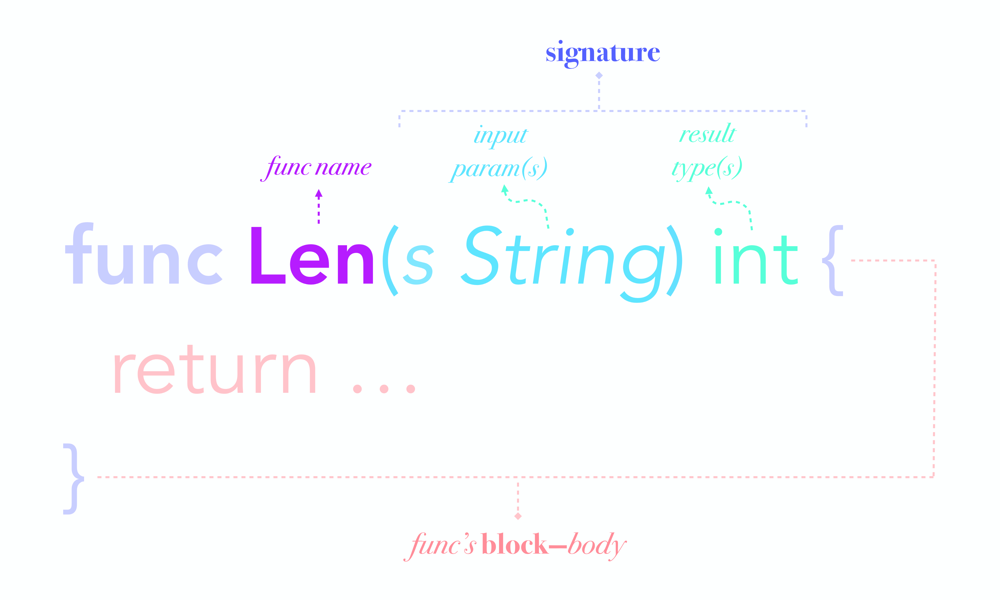

# Go语言函数



函数用于对代码块的逻辑封装，提供代码复用的最基本方式, Go中有3种函数:

+ 普通函数
+ 匿名函数(没有名称的函数)
+ 方法(定义在struct上的函数)

Go实现了一级函数(first-class functions)，Go中的函数是高阶函数(high-order functions)。这意味着：

+ 函数是一个值，可以将函数赋值给变量，使得这个变量也成为函数
+ 函数可以作为参数传递给另一个函数
+ 函数的返回值可以是一个函数

这些特性使得函数变得无比的灵活，例如回调函数、闭包等等功能都依赖于这些特性。

## 定义

Go 语言函数定义格式如下：

```go
func function_name( [parameter list] ) [return_types] {
   函数体
}
```

函数定义解析：

+ func：函数由 func 开始声明
+ function_name：函数名称，函数名和参数列表一起构成了函数签名。
+ parameter list：参数列表，参数就像一个占位符，当函数被调用时，你可以将值传递给参数，这个值被称为实际参数。参数列表指定的是参数类型、顺序、及参数个数。参数是可选的，也就是说函数也可以不包含参数。
+ return_types：返回类型，函数返回一列值。return_types 是该列值的数据类型。有些功能不需要返回值，这种情况下 return_types 不是必须的。
+ 函数体：函数定义的代码集合。

函数的参数、返回值以及它们的类型，结合起来成为函数的签名(signature)

实例: 求和函数

```go
func sum(x int, y int) int {
    return x + y
}
```

## 参数

### 合并定义

函数可以有0或多个参数, 参数需要指定类型, 在声明函数中若存在多个连续形参类型相同可只保留最后一个参数类型名

```go
func sum(x, y int) int {
    return x + y
}
```

### 可变参数

有时候参数过多，或者想要让函数处理任意多个的参数，可以在函数定义语句的参数部分使用`ARGS...TYPE`的方式。这时会将...代表的参数全部保存到一个名为ARGS的slice中，注意这些参数的数据类型都是TYPE

```go
func max(a, b int, args ...int) int {
   // 输出args中保存的参数
   for index, value := range args {
      fmt.Printf("%s%d%s %d\n", "args[", index, "]:", value)
   }

   // 取出a、b中较大者
   max_value := a
   if a > b {
      max_value = a
   }

   // 取出所有参数中最大值
   for _, value := range args {
      if max_value < value {
         max_value = value
      }
   }
   return max_value
}
```

### 值传递

函数如果使用参数，该变量可称为函数的形参。形参就像定义在函数体内的局部变量

值传递是指在调用函数时将实际参数复制一份传递到函数中，这样在函数中如果对参数进行修改，将不会影响到实际参数

默认情况下，Go 语言使用的是值传递(则先拷贝参数的副本，再将副本传递给函数)，即在调用过程中不会影响到实际参数。

```go
package main

import "fmt"

func main() {
   /* 定义局部变量 */
   var a int = 100
   var b int = 200

   fmt.Printf("交换前 a 的值为 : %d\n", a )
   fmt.Printf("交换前 b 的值为 : %d\n", b )

   /* 通过调用函数来交换值 */
   swap(a, b)

   fmt.Printf("交换后 a 的值 : %d\n", a )
   fmt.Printf("交换后 b 的值 : %d\n", b )
}

/* 定义相互交换值的函数 */
func swap(x, y int) {
   var temp int

   temp = x /* 保存 x 的值 */
   x = y    /* 将 y 值赋给 x */
   y = temp /* 将 temp 值赋给 y*/

   return;
}
```

### 引用传递

引用传递是指在调用函数时将实际参数的地址传递到函数中，那么在函数中对参数所进行的修改，将影响到实际参数

由于引用类型(slice、map、interface、channel)自身就是指针，所以这些类型的值拷贝给函数参数，函数内部的参数仍然指向它们的底层数据结构。

```go
package main

import "fmt"

func main() {
   /* 定义局部变量 */
   var a int = 100
   var b int= 200

   fmt.Printf("交换前，a 的值 : %d\n", a )
   fmt.Printf("交换前，b 的值 : %d\n", b )

   /* 调用 swap() 函数
   * &a 指向 a 指针，a 变量的地址
   * &b 指向 b 指针，b 变量的地址
   */
   swap(&a, &b)

   fmt.Printf("交换后，a 的值 : %d\n", a )
   fmt.Printf("交换后，b 的值 : %d\n", b )
}

func swap(x *int, y *int) {
   var temp int
   temp = *x    /* 保存 x 地址上的值 */
   *x = *y      /* 将 y 值赋给 x */
   *y = temp    /* 将 temp 值赋给 y */
}
```

问题: 使用切片的过程分析程序输出结果

```go
//定义一个函数，给切片添加一个元素
func addOne(s []int) {
    s[0] = 4  // 可以改变原切片值
    s = append(s, 1)  // 扩容后分配了新的地址，原切片将不再受影响
    s[0] = 8 
}
var s1 = []int{2}   // 初始化一个切片
addOne(s1)          // 调用函数添加一个切片
fmt.Println(s1)     // 输出一个值 [4]
```

## 返回值

函数可以有0或多个返回值, 返回值需要指定类型, 返回值通过return关键字来指定

+ 当返回值有多个时，这些返回值必须使用括号包围，逗号分隔

```go
func ParseInt(str string) (result int64, err error) {
   return
}
```

+ return关键字中指定了参数时，返回值可以不用名称。如果return省略参数，则返回值部分必须带名称

```go
func ParseInt(str string) (int64, error) {
   var (
      result int64
      err error
   )

   return result, err
}
```

+ 当返回值有名称时，必须使用括号包围，逗号分隔，即使只有一个返回值

```go
func add(x, y int) int {}

func add2(x, y int) (result int) {}
```

+ 但即使返回值命名了，return中也可以强制指定其它返回值的名称，也就是说return的优先级更高

```go
func ParseInt(str string) (result int64, err error) {
   result = 10
   return 20, nil
}
```

+ 命名的返回值是预先声明好的，在函数内部可以直接使用，无需再次声明。命名返回值的名称不能和函数参数名称相同，否则报错提示变量重复定义

```go
func sum(x, y int) (rest int) {
    rest = x + y
    return
}
```

+ return中可以有表达式，但不能出现赋值表达式，这和其它语言可能有所不同。例如return a+b是正确的，但return c=a+b是错误的

```go
func sum(x, y int) (rest int) {
    return x + y
}
```

+ 但函数有多个返回值时，如果其中某个或某几个返回值不想使用，可以通过下划线_这个blank identifier来丢弃这些返回值

```go
i, _ := strconv.ParseInt("10", 10, 64)
fmt.Println(i)
```

## 调用

当创建函数时，你定义了函数需要做什么，通过调用该函数来执行指定任务。

调用函数，向函数传递参数，并返回值，例如：

```go
func main() {
    rest := sum(5, 6)
    fmt.Println(rest)
}
```


## 内置函数

在 buildin/buildin.go内定义了Go所有支持内置函数：make、len、cap、new、append、copy、close、delete、complex、real、imag、panic、recover

我们在代码里面可以直接使用: 比如使用len计算字符串的长度
```go
package main

import (
	"fmt"
)

func main() {
	fmt.Println(len("asdfsdf"))
}
```

内置函数和用户定义函数没有本质上的区别, 我们也可以覆盖它
```go
package main

import (
	"fmt"
)

func len(a string) string {
	return "hello"
}

func main() {
	fmt.Println(len("asdfsdf"))
}
```
但是你最好不要这样做，你会被打的

## 匿名函数

函数参数可以没有名称，例如func myfunc(int,int), 一般匿名函数嵌套在函数内部，或者赋值给一个变量，或者作为一个表达式

```go
// 声明匿名函数
func(args){
    //
}
```

比如:

```go
   a := func(x, y int) int {
      return x + y
   }

   fmt.Println(a(1, 2))
```

```go
// 声明匿名函数并直接执行
func(args){
   // 
}(parameters)
```

比如:

```go
a := func(x, y int) int {
   return x + y
}(1, 2)
fmt.Println(a)
```

## 闭包

## 将函数作为一种类型

Go实现了一级函数(first-class functions), 函数是一个值，可以将函数赋值给变量，使得这个变量也成为函数, 因此我们也可以定义函数的类型

可以将func作为一种type，以后可以直接使用这个type来定义函数

```go
addFunc := func(x, y int) int {
   return x + y
}
fmt.Println(reflect.TypeOf(addFunc))
fmt.Println(addFunc(10, 20))
```

## 函数作为参数

既然可以声明类型, 那么我们就可以把函数当作一个参数传递给另一个函数，比如：

```go
type addFunc func(x, y int) int

func asArg(fn addFunc) int {
	return fn(2, 2) * 2
}

func TestFuncAsArg(t *testing.T) {
	ret := asArg(func(x, y int) int {
		return x + y
	})
	fmt.Println(ret)
}
```

## 递归函数

函数内部调用函数自身的函数称为递归函数

使用递归函数最重要的三点：

+ 退出条件: 退出条件基本上都使用退出点来定义，退出点常常也称为递归的基点，是递归函数的最后一次递归点，或者说没有东西可递归时就是退出点。
+ 递归函数很可能会产生一大堆的goroutine(其它编程语言则是出现一大堆的线程、进程)，也很可能会出现栈空间内存溢出问题。在其它编程语言可能只能设置最大递归深度或改写递归函数来解决这个问题，在Go中可以使用channel+goroutine设计的"lazy evaluation"来解决。

1.阶乘

因为阶乘的公式为n*(n-1)*...*3*2*1，它在参数为1的时候退出函数，也就是说它的递归基点是1，所以对是否为基点进行判断，然后再写递归表达式

```go
// n*(n-1)*...*3*2*1
func fact(n int) int {
   // 判断退出点
   if n == 1 {
      return 1
   }

   // 递归表达式
   return n * fact(n-1)
}
```

2.斐波那契数列

它的计算公式为f(n)=f(n-1)+f(n-2)且f(2)=f(1)=1。它在参数为1和2的时候退出函数，所以它的退出点为1和2

```go
// f(n)=f(n-1)+f(n-2)且f(2)=f(1)=1, 1 2 3 5 8 13
func fib(n int) int {
   // 退出点判断
   if n == 1 || n == 2 {
      return 1
   }
   // 递归表达式
   return fib(n-1) + fib(n-2)
}
```