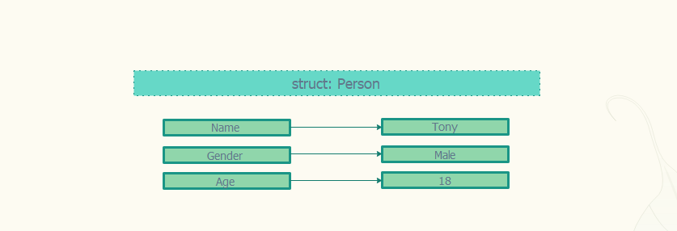
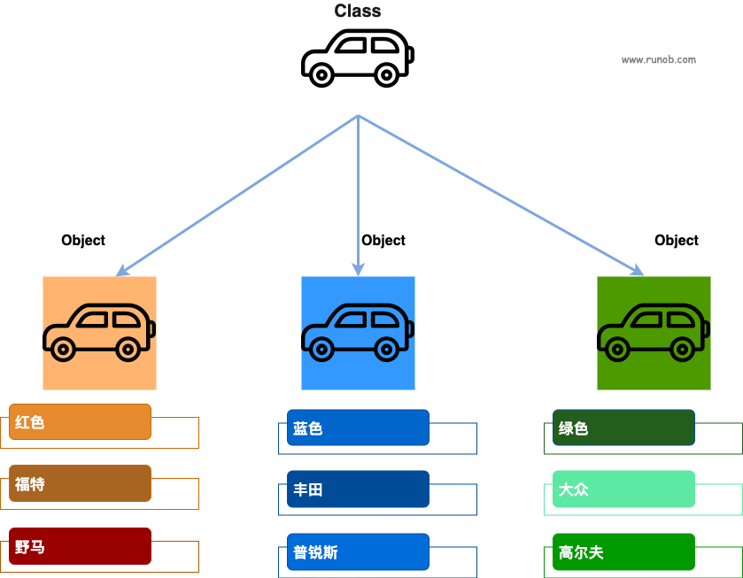
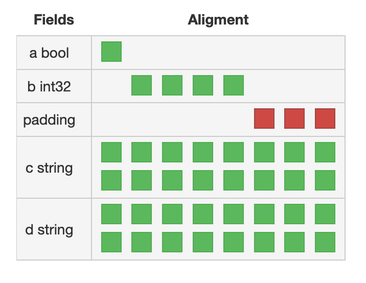
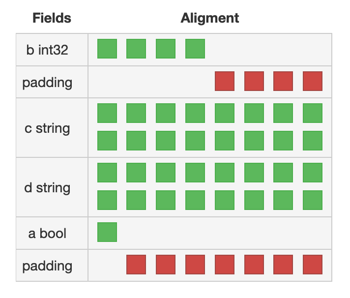

# Go语言结构体



我们前面介绍的数组 只能保存同一种类型的数据, 当我们需要记录多种不同类型的数据时，我们该怎么办?

结构体就是用于解决这个问题的, 结构体是由一系列具有相同类型或不同类型的数据构成的数据集合, 方便容量我们的任意类型的数据

## 结构体的定义

例如 我们用于描述一个人的特征, 如果我们单独使用变量描述应该如何描述:

```go
var (
    name          string
    age           int
    gender        string
    weight        uint
    favoriteColor []string
)
```

有了结构体过后 我们就可以把这些变量包装起来，做成一个结构体类型:

```go
type Person struct {
    Name          string
    Age           int
    Gender        string
    Weight        uint
    FavoriteColor []string
}
```

下面我们介绍下结构体(struct)的定义语法:

```go
type identifier struct {
    field1 type1
    field2 type2
    …
}
// 或者
type T struct { a, b int }
```

+ type: 定义自定义类型的关键字, 比如 type myType string
+ identifier: 我们定义的这种类型的名称
+ struct: 表明我们定义的类型是一种struct类型, struct类型就是由一组字段构成的集合
+ {field1 type1 field2 type2 ... }: 结构体成员定义

可以看出其中struct 类型很关键, 他表明我们制定以的这种类型是一种结构体类型, 这种类型是有成员变量构成的, 像一个容器

由于成员是我们自己定义的，所以结构体有高度的灵活性, Go中不少功能依赖于结构


理论上，每个字段都是有具有唯一性的名字的，比如我们定义2个同名的成员变量是会报错的:
```go
type Person struct {
    Name          string
    Name          string
}
```

但如果确定某个字段不会被使用，可以将其名称定义为空标识符_来丢弃掉
```go
type Person struct {
    _          string
    Name          string
}
```

每个字段都有类型，可以是任意类型，包括内置简单数据类型、其它自定义的struct类型、当前struct类型本身、接口、函数、channel等等,
如果某几个字段类型相同，可以缩写在同一行：
```go
type Person struct {
    Name, City string
    Age int
}
```

我们可以看出结构体就像一个容器，这个容器里面装什么由我们自己定义, 这也是结构体的特点: 自定义化的程度很高, 使用灵活


## 构造结构体实例

定义了struct，就表示定义了一个数据结构，或者说数据类型，也或者说定义了一个类。总而言之，定义了struct，就具备了成员属性，就可以作为一个抽象的模板，可以根据这个抽象模板生成具体的实例，也就是所谓的"对象", 也就是面向对象中的 Class ---> Object, 如下图:



```go
type Car struct {
    Color string  // 颜色
    Brand string  // 品牌
    Model string  // 型号
}

var car Car   // 初始化一个Car实例, car就代表是一辆具体的车(Object)
```

这里的car就是一个具体的Car实例，它根据抽象的模板Car构造而出，具有具体的属性Color,Brand和Model的值，虽然初始化时它的各个字段都是""值。换句话说，car是一个具体的车, 比如福特野马

struct初始化时，会做默认的赋0初始化，会给它的每个字段根据它们的数据类型赋予对应的0值。例如int类型是数值0，string类型是""，引用类型是nil等
```go
var car Car
fmt.Printf("%+v", car) // {Color: Brand: Model:}
```

我们也可以在声明的时候直接为成员变量赋值，我们通常把这个过程称之为构造结构体的实例, 语法如下:
```go
// 我们使用{k:v, k:v}这种方式来为结构体的成员赋值
TypeName{filed1: value1, filed2: value2, ...}

// 为了书写美观, 我们通常都把每一个k:v 独立写在一行，比如:
TypeName{
    file1: value1,
    file2: value2,
    ...
}
```

下面我们看一个具体的例子，比如我们要通过Car构造一个具体的汽车: 福特野马
```go
// 为了书写的简洁，我们采用简单声明的方式, 就像 a := 10 <--->  var a int; a = 10
//
var car Car
fmt.Printf("%+v\n", car)

car = Car{           // 当然你也可以不然声明car的类型, 直接使用简短声明: car := Car{...}
    Color: "yellow", // 黄色
    Brand: "ford",   // 福特
    Model: "yema",   // 请原谅我的无知, 不知道野马用英语怎么表达
}
fmt.Printf("%+v\n", car) // {Color:yellow Brand:ford Model:yema}

// 注意，上面最后一个逗号","不能省略，Go会报错，这个逗号有助于我们去扩展这个结构
```

## 属性的访问和修改

因为car已经是初始化Car之后的实例了，它已经具备了实实在在存在的属性(即字段)，所以可以直接访问它的各个属性,具体语法如下:

```go
结构体.成员名
```

比如我们可以打印下这个汽车的颜色和品牌:
```go
fmt.Println(car.Color, car.Brand, car.Model) // yellow ford yema
```

我们也可以通过赋值操作来修改这些字段（成员变量的值), 我们换一辆大众高尔夫来试试
```go
car.Color = "green" 
car.Brand = "Volkswagen"
car.Model = "golf"
fmt.Println(car.Color, car.Brand, car.Model) // green Volkswagen golf
```

## 结构体指针

如果我们要把这个结构体的实例传给一个函数修改，比如改变它的颜色:
```go
// 给车换一个颜色，喷成蓝色
func ChangeColor(car Car) {
	car.Color = "blue"
	fmt.Println(car.Color)
}

func main() {
	car := Car{
		Color: "yellow", // 黄色
		Brand: "ford",   // 福特
		Model: "yema",   // 请原谅我的无知, 不知道野马用英语怎么表达
	}
	ChangeToW(car)
	fmt.Println(car.Color) // yellow
}
```

为什么我们并没有修改到这辆车的颜色? 大家思想下 指针 和 值的区别 (值传递与引用传递)

答案是: Go函数给参数传递值的时候是以复制的方式进行的。

### 结构体指针声明与初始化

1.声明结构体指针

和其他基础数据类型一样，我们也可声明结构体指针变量，此时变量被初始化为 nil

```go
var car *Car
fmt.Println(car)
// <nil>
```

2.声明并初始化一个结构体指针

```go
car := &Car{
    Color: "yellow", // 黄色
    Brand: "ford",   // 福特
    Model: "yema",   // 请原谅我的无知, 不知道野马用英语怎么表达
}
fmt.Printf("%p", car)
```

3.new函数创建指针对象

Go 语言中常定义 N(n)ew+结构体名命名的函数用于创建对应的结构体值对象或指针对象

```go
car := new(Car)
fmt.Printf("%p", car)
```

### 传递结构体指针

我们可以改造下, 将一个结构体的指针传递给函数，看能否修改到该结构体
```go
func ChangeColor(car *Car) {
	car.Color = "blue"
	fmt.Println(car.Color)
}

func main() {
	car := Car{
		Color: "yellow", // 黄色
		Brand: "ford",   // 福特
		Model: "yema",   // 请原谅我的无知, 不知道野马用英语怎么表达
	}
	ChangeToW(car)
	fmt.Println(car.Color) // blue
}
```

可以看到我们可以修改该实例对象了

### 结构体值与结构体指针

先思考2个问题:
+ 什么是值？ 
+ 什么是指针?

下面三种方式都可以构造Car struct的实例c:
```go
c1 := Car{}
c2 := &Car{}
c3 := new(Car)
fmt.Println(c1, c2, c3) // {  } &{  } &{  }
```

c1、c2、c3都是person struct的实例，c2, c3是指向实例的指针，指针中保存的是实例的地址，所以指针再指向实例，c1则是直接指向实例。这三个变量与Car struct实例的指向关系如下:
```
变量名      指针     数据对象(实例)
-------------------------------
c1 -------------------> { }
c2 -----> ptr(addr) --> { }
c3 -----> ptr(addr) --> { }
```

那访问实例和访问实例指针有区别吗?
```go
fmt.Println("c1, ", c1.Color)    // 访问实例的属性
fmt.Println("c2, ", (*c2).Color) // 先通过*求出 指针的值，就是实例的内存地址, 然后通过实例的内存地址访问该实例对象的属性
```

如果我们需要访问指针对象的属性, 上面的(*c2).Color 是理论上正确写法, 可以看出过于繁琐, 而我们方法指针，往往也是想访问这个指针的实例, 所以编译帮我们做了优化, 比如访问指针实例也可以这样写:
```go
fmt.Println("c2, ", c2.Color) // 编译器帮你补充上(*c2).Color, 这样写法上就简洁了
```

简单总结下: 尽管一个是数据对象值，一个是指针，它们都是数据对象的实例。也就是说，p1.name和p2.name都能访问对应实例的属性, 只是指针的访问写法是一种简写(正确写法由编译器补充)

### 传值 Or 传递指针

那我们什么时候传值, 什么时候传递指针喃?

+ 传递值: 当我们不希望我们的实例被外部修改的时候，传值就相当于copy了一份副本给函数(这个成立是有条件的？ 思考下条件是啥)
+ 传递指针: 当我们希望外部能修改到这个实例本身的时候，就需要传递该实例的指针, 就是把该实例的内存地址告诉对方, 可以通过地址直接找到本体

但是我们经常看到函数接收的结构体参数都是指针，这是为什么喃?

复制传值时，如果函数的参数是一个struct对象，将直接复制整个数据结构的副本传递给函数，这有两个问题：

+ 函数内部无法修改传递给函数的原始数据结构，它修改的只是原始数据结构拷贝后的副本
+ 如果传递的原始数据结构很大，完整地复制出一个副本开销并不小

所以我们为了节省开销一般都会选择传递指针。


## 结构体方法

Go中也有方法，它是一种特殊的函数，定义于struct之上(与struct关联、绑定)，被称为struct的receiver

它的定义方式大致如下：

```go
type mytype struct{}

func (r mytype) my_method(para) return_type {}
```

属于数据结构的函数叫做结构体的方法, 我们可以对比下 属于结构体的函数 与 普通函数的 声明区别:

```go
// 普通函数定义
func functionName() {}

// 结构体方法的定义
func (t  TypeName) functioonName() {}
// func               是关键字
// t                  是类型的缩写, 我们可以通过t.filed 的方式访问到这个结构的所有成员变量
// TypeName           结构体类型名称 
// functioonName() {} 函数签名
```

我们可以看到结构体方法相比于 普通的函数就是多了一个这个: (t TypeName) 


## 结构体嵌套

复杂从此开始

1.匿名嵌套

在定义变量时将类型指定为结构体的结构，此时叫匿名结构体。匿名结构体常用于初始化一
次结构体变量的场景，例如项目配置

匿名结构体可以组合不同类型的数据，使得处理数据变得更为灵活。尤其是在一些需要将多个变量、类型数据组合应用的场景，匿名结构体是一个不错的选择

```go
结构体.成员名
```

```go
package main
 
import (
	"encoding/json"
	"fmt"
)
//定义手机屏幕
type Screen01 struct {
	Size       float64 //屏幕尺寸
	ResX, ResY int //屏幕分辨率 水平 垂直
}
//定义电池容量
type Battery struct {
	Capacity string
}
 
//返回json数据
func getJsonData() []byte {
	//tempData 接收匿名结构体（匿名结构体使得数据的结构更加灵活）
	tempData := struct {
		Screen01
		Battery
		HashTouchId bool  // 是否有指纹识别
	}{
		Screen01:    Screen01{Size: 12, ResX: 36, ResY: 36},
		Battery:     Battery{"6000毫安"},
		HashTouchId: true,
	}
	jsonData, _ := json.Marshal(tempData)  //将数据转换为json
	return jsonData
}
```

2命名嵌套

结构体命名嵌入是指结构体中的属性对应的类型也是结构体

适用于复合数据结构<嵌入匿名>

1. 定义

```go
type Book struct {
    Author  struct{
        Name string
        Aage int
    }
    Titile struct{
        Main string 
        Sub  string
    }
}
```

2.声明和初始化

```go
b := &Book{
    Author: struct {
        Name string
        Aage int
    }{
        Name: "xxxx",
        Aage: 11,
    },
    Titile: struct {
        Main string
        Sub  string
    }{
        Main: "xxx",
        Sub:  "yyy",
    },
}

// 不会有人愿意那样用的
b := new(Book)
b.Author.Aage = 11
b.Author.Name = "xxx"
```

2.嵌入命名

```go
type Author struct {
    Name string
    Aage int
}

type Titile struct {
    Main string
    Sub  string    
}

type Book struct {
    Author Author
    Titile Titile
}
```

声明

```go
b := &Book{
    Author: Author{
        Name: "xxx",
        Aage: 11,
    },
    Titile: Titile{
        Main: "t1",
        Sub:  "t2",
    },
}
```

3.属性的访问和修改

```go
b.Author.Name = "xxx"
```

## 结构体的组合: 嵌入

1.匿名嵌入

结构体匿名嵌入是指将已定义的结构体名直接声明在新的结构体中，从而实现对以后已有类
型的扩展和修改

1. 定义

2. 声明&初始化

3. 属性访问和修改

2.指针类型嵌入

1.定义

2.声明&初始化&操作

## 可见性

结构体首字母大写则包外可见(公开的)，否者仅包内可访问(内部的)
结构体属性名首字母大写包外可见(公开的)，否者仅包内可访问(内部的)
组合：

+ 结构体名首字母大写，属性名大写：结构体可在包外使用，且访问其大写的属性名
+ 结构体名首字母大写，属性名小写：结构体可在包外使用，且不能访问其小写的属性名
+ 结构体名首字母小写，属性名大写：结构体只能在包内使用，属性访问在结构体嵌入时 由被嵌入结构体(外层)决定，被嵌入结构体名首字母大写时属性名包外可见，否者只能
在包内使用
+ 结构体名首字母小写，属性名小写：结构体只能在包内使用

## 拷贝

有时候 为了不让对象直接相互干扰, 我们需要深度赋值对象

1. 浅拷贝


2. 深拷贝


## 结构体字段的内存对齐


```go
type A struct {
	a bool
	b int32
	c string
	d string
}

type B struct {
	b int32
	c string
	d string
	a bool
}

func TestStructSize(t *testing.T) {
	fmt.Println(unsafe.Sizeof(A{}))  // 多少
	fmt.Println(unsafe.Sizeof(B{}))  // 多少
}
```





