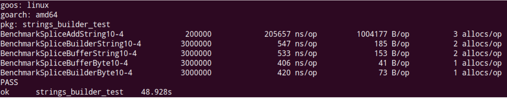

# 组成字符串的字符
- 字符串中的每一个元素叫做“字符”

## Go语言的字符有以下两种
- 第一种是 uint8类型，也叫做byte型， 代表了ASCII码的一个字符
- 第二种是 rune类型 ，代表一个UTF-8字符， 当我们需要处理中文、日文或其他的复合字符时，需要用到rune，其实等价于int32类型
- 举例说明两种字符的区别
```go
package main

import "fmt"

func main(){
	// ascii码 明确给字符指定byte类型 代表 ascii码
	var ch1 byte = 'a'
	// 字符范围还在ascii码内，但是不明确byte，int32 =rune类型
	var ch2 = 'a'
	// int32 =rune类型
	var ch3 = '你'

	fmt.Printf("字符 指定ascii：%c id：%v 实际类型：%T \n",ch1,ch1,ch1)
	fmt.Printf("字符 ：%c id：%v 实际类型：%T \n",ch2,ch2,ch2)
	fmt.Printf("字符 中文：%c id：%v 实际类型：%T \n",ch3,ch3,ch3)
}


```

## 字符集
### 字符集用来做什么
- 字符集是为每个字符分配一个唯一的ID
- 在同一个字符集内，字符的ID是唯一的，不同字符集ID可能不同


### UTF-8 是编码规则 或者说是Unicode的一种实现
- UTF-8 将Unicode中的字符ID以某种方式进行编码
- 变长的编码规则：1-4字节，具体规则：
    - 0xxxxx表示 0~127 代表ascii
    - 128 到0x10ffff表示其他字符

## go语言里的字符串的内部实现使用UTF8编码. 默认rune类型 


# 字符串是什么？
- 基础内置类型
- 只读的字节数组，连续内存空间
- 不可变有什么好处
    - 可以做map的key 
    - 线程安全
    - 只读，无须加锁 

##  定义字符串 双引号和 反引号
### golang中单引号 双引号 反引号代表的含义

#### 单引号 在golang中表示一个字符 
- `var ch ='a'` 代表utf-8编码的a
- `var ch byte='a'` 代表ASCII编码的a
- `var ch ='abc'` 报错： more than one character in rune literal

#### 双引号 go创建字符串的 
- 支持转义
- 但不能引用多行
```go
str1:= "hello\n马哥"
```
#### 反引号 
- 不支持转义
- 创建原生的字符串
- 支持换行
- 实际举例
```go
// json字符串
var jsonStr = ` {
		"region" :"bj",
		"ids":[
				1,
				2,
				3
			]
}`
// prometheus告警表达式
- promql var promql = `count(redis_instance_info{role="master"}) > 10

```

## 计算字符串长度
- len只能表示字符串的 ASCII字符的个数或者字节长度  
- 如何打印真实字符个数 `utf8.RuneCountString`
- 举例
```go
package main

import (
	"fmt"
	"unicode/utf8"
)

func main() {
	ch1 := "ma ge jiao yu"
	ch2 := "马哥教育"
	ch3 := "m哥"
	fmt.Printf("字符串%v 字节大小or字符长度%d  真实字符长度%d\n", ch1, len(ch1), utf8.RuneCountInString(ch1))
	fmt.Printf("字符串%v 字节大小or字符长度%d  真实字符长度%d\n", ch2, len(ch2), utf8.RuneCountInString(ch2))
	fmt.Printf("字符串%v 字节大小or字符长度%d  真实字符长度%d\n", ch3, len(ch3), utf8.RuneCountInString(ch3))
	/*
		字符串ma ge jiao yu 字节大小or字符长度13  真实字符长度13
		字符串马哥教育 字节大小or字符长度12  真实字符长度4
		字符串m哥 字节大小or字符长度4  真实字符长度2


	*/
}

```

## 字符串遍历
- 如果是ASCII字符：直接使用下标遍历
- 如果是unicode字符遍历：使用for range
```go
package main

import "fmt"

func main() {
	ch1 := "ma ge马哥教育"
	for i := 0; i < len(ch1); i++ {
		fmt.Printf("ascii: %c %d\n", ch1[i], ch1[i])
	}
	for _, i := range ch1 {
		fmt.Printf("unicode: %c %d \n", i, i)
	}

}

```

## 字符串拼接符 +
- 使用+拼接多个字符串
- 支持换行
```go
package main

import "fmt"

func main() {
	s1:="http://"
	s2:="localhost:8080"
	s3:=s1+s2
	fmt.Println(s3)
	s4:="http://localhost:8080/api/v1" +
		"/login"
	fmt.Println(s4)
}

```

## 字符串修改：通过 []byte和string转换 创建新的字符串达到
- 举例 8080 改为8081
```go
package main

import "fmt"

func main() {
	s2:="localhost:8080"
	fmt.Println(s2)
	sByte:=[]byte(s2)
	sByte[len(sByte)-1] = '1'
	s3:=string(sByte)
	fmt.Println(s3)

}

```


# strings包 
## 判断是否存在某个字符或子串
- 查找子串 fmt.Println(strings.Contains("localhost:8080","8080"))
- 任意字符 fmt.Println(strings.ContainsAny("localhost 8080","a b"))
- 查找rune类型 fmt.Println(strings.ContainsRune("chain",rune('c')))

## 字符串分割（切分）为[]string
- SplitAfter 保留sep
- SplitN 结果长度为n，如果没切完就不切了，保留给最后一个
- sep ="" ,切所有单一字符
- 举例
```go
package main

import (
	"fmt"
	"strings" 
)

func main() {

	s1 := "inf.bigdata.kafka"
	s2 := "localhost:8080/api/v1/host/1"

	serviceS1 := strings.Split(s1, ".")
	// SplitAfter 保留sep
	serviceS2 := strings.SplitAfter(s1, ".")

	pathS := strings.Split(s2, "/")
	// SplitN 结果长度为n，如果没切完就不切了，保留给最后一个
	pathSN := strings.SplitN(s2, "/", 2)
	fmt.Printf("[切割服务标识]%v\n", serviceS1)
	fmt.Printf("[切割服务标识][after]%v\n", serviceS2)
	fmt.Printf("[切割uri][]%v\n", pathS)
	fmt.Printf("[切割uri][SplitN]%v\n", pathSN)
	/*
		[切割服务标识][inf bigdata kafka]
		[切割服务标识][after][inf. bigdata. kafka]
		[切割uri][][localhost:8080 api v1 host 1]
		[切割uri][SplitN][localhost:8080 api/v1/host/1]
	*/
}

```


## 字符串是否有某个前缀或后缀
- 举例 
```go
	fmt.Println(strings.HasPrefix("inf.bigdata.kafka","inf"))
	fmt.Println(strings.HasSuffix("inf.bigdata.kafka","kafka"))
	fmt.Println(strings.HasSuffix("inf.bigdata.kafka",""))
```


## 字符串格式化输出 fmt.Sprintf
```shell script
%c  单一字符
%T  动态类型
%v  本来值的输出
%+v 字段名+值打印
%d  十进制打印数字
%p  指针，十六进制
%f  浮点数
```
- 实际举例： 拼接报警信息、拼接uri
```go
package main

import (
	"fmt"
	"time"
)

func main() {


	want:=`
		[报警触发类型：%s]
		[报警名称：%s]
		[级别：%d级]	
		[机器ip列表：%s]	
		[表达式：%s]
		[最大报警次数：%d次]
		[触发时间：%s]
	`
	alarmContent:=fmt.Sprintf(
		want,
		"prometheus",
		"登录接口qps 大于100",
		3,
		"1.1.1.1, 2.2.2.2",
		`sum(rate(login_qps[1m])) >100`,
		2,
		time.Unix(time.Now().Unix(),0).Format("2006-01-02 15:04:05"),
		)
	fmt.Println(alarmContent)

	ports:=[]int{8000,8001,8002}
	baseUri:="/api/v1/push"
	for _,p:=range ports{
		uri:=fmt.Sprintf("localhost:%d%s",p,baseUri)
		fmt.Println(uri)
	}
}

```


## 字符串修剪 
- 
- 举例
```go
package main

import (
	"fmt"
	"strings"
	"unicode"
)

func main() {

	x:= "@@@@@abchello_mage@ "
	// 会去掉cutset连续的
	fmt.Println(strings.Trim(x,"@"))
	fmt.Println(strings.TrimLeft(x,"@"))
	fmt.Println(strings.TrimRight(x,"@"))
	fmt.Println(strings.TrimSpace(x))
	fmt.Println(strings.TrimPrefix(x," abc"))
	fmt.Println(strings.TrimSuffix(x," @"))
	f:= func(r rune) bool{
		return unicode.Is(unicode.Han,r) //如果是汉字返回true
	}
	fmt.Println(strings.TrimFunc("你好啊abc",f))

}

```
- TrimLeft会去掉连续的cutset  
- TrimPrefix会去掉的单一的
```go
package main

import (
	"fmt"
	"strings"
)

func main() {
	x := "@a@abchello_mage@ "
	// TrimLeft会去掉连续的cutset bchello_mage@
	fmt.Println(strings.TrimLeft(x, "@a"))
	// TrimPrefix会去掉的单一的 @abchello_mage@
	fmt.Println(strings.TrimPrefix(x, "@a"))
}

```


## 字符串连接 join
- 举例
```go
package main

import (
	"fmt"
	"strings"
)

func main() {
	baseUri:="http://localhost:8080/api/v1/query?"
	args:=strings.Join([]string{"name=mage","id=1","env=online"},"&")
	fullUri:=baseUri+args
	fmt.Println(fullUri)
	// http://localhost:8080/api/v1/query?name=mage&id=1&env=online
}

```

## 字符串拼接的优化





## 使用 string.builder  
```go
package main

import (
	"fmt"
	"strings"
)

func main() {
	ss:=[]string{
		"A",
		"B",
		"C",
	}
	var b strings.Builder
	for _,s:=range ss{
		b.WriteString(s)
	}
	fmt.Println(b.String())
}

```