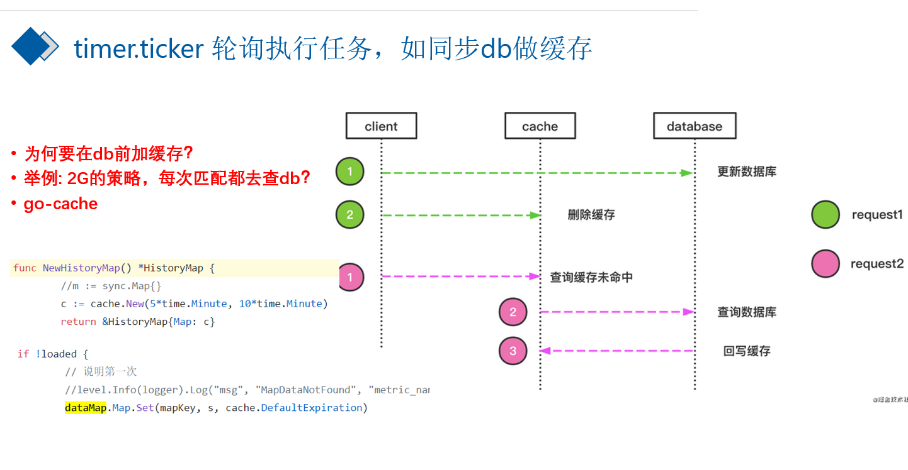
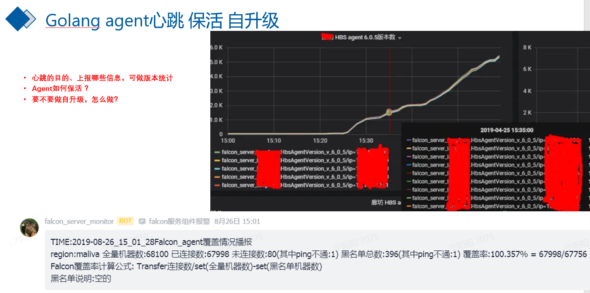
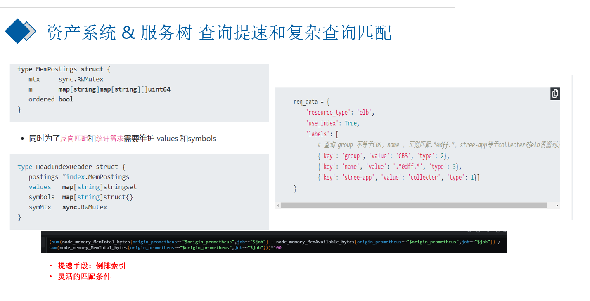
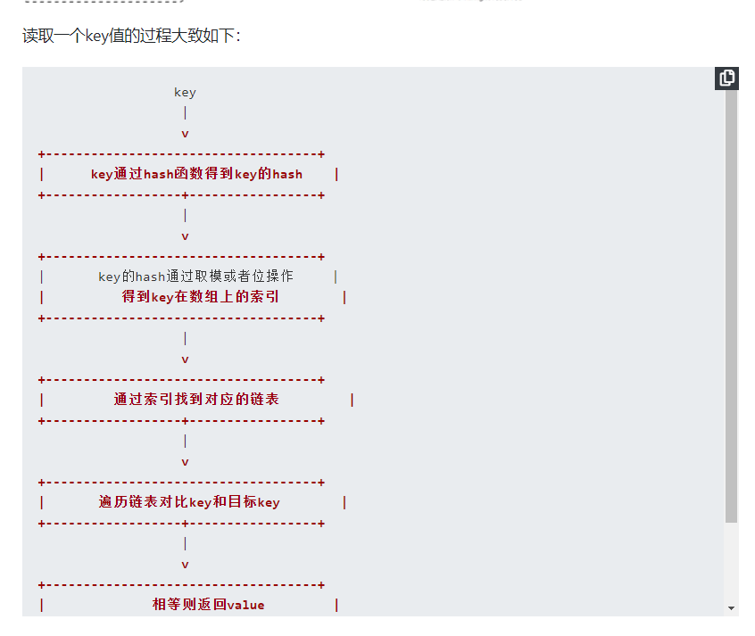
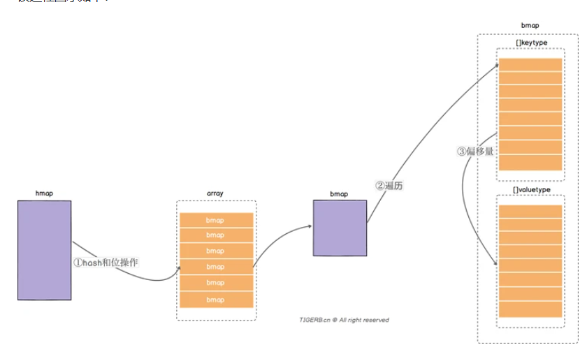
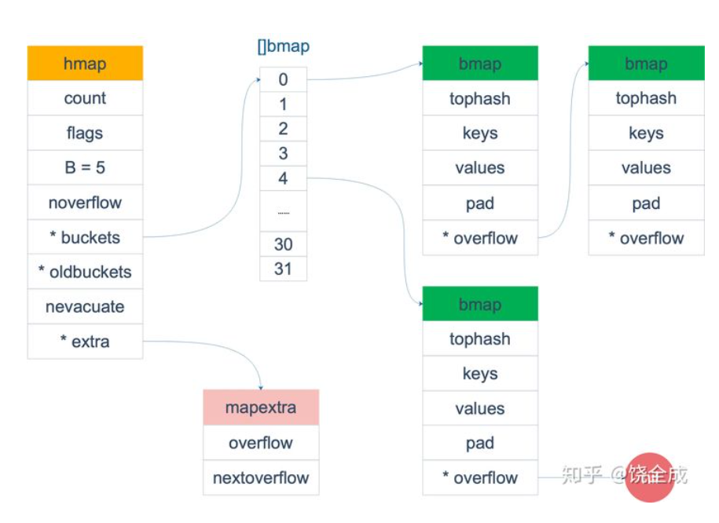

# map使用


## 声明和初始化 
### 使用var只声明
- `// 只声明
   var gMap map[string]string`
### 使用var声明同时初始化
- `// 声明初始化
   var hMap = map[string]string{"a": "b"}`

### 使用make 初始化

```go
package main

import "fmt"

// 只声明
var gMap map[string]string

// 声明初始化
var hMap = map[string]string{"a": "b"}

func main() {
	gMap = make(map[string]string)
	gMap["a"] = "b"
	fmt.Println(hMap)
	iMap := make(map[string]string)
	fmt.Println(iMap)
}

```

## 增删改查
### 增加和修改


### 删除

### 读取数据
- 两种手段 第一种 单变量 lang:=m["lang"]，没有key就附一个value类型的0值
- 两种手段 第二种 双变量 app2,exists := m["app2"]，可以根据exists判断 true代表有key


### 增删改查举例
- 举例
```go
package main

import "fmt"

// 只声明
var gMap map[string]string

// 声明初始化
var hMap = map[string]string{"a": "b"}

func main() {
	m:=make(map[string]string)
	// 增
	m["app"] ="taobao"
	m["lang"] ="golang"
	// 删除
	delete(m,"app")
	delete(m,"op")
	fmt.Println(m)
	// 修改
	m["lang"] ="python"
	//查找
	// 两种手段 第一种 单变量
	lang:=m["lang"]
	fmt.Println(lang)
	lang1:=m["lang1"]
	fmt.Println("lang1=",lang1)
	// 第一种 双变量
	app2,exists := m["app2"]
	if exists{
		fmt.Printf("[m has_key :%s value :%s]","app2",app2)
	}else {
		m["app2"] = "app2.0"
		fmt.Println(m)
	}
}

```


### 遍历map和按key的顺序遍历
- 举例
```go
package main

import (
	"fmt"
)


func main() {
	m:=make(map[string]int)
	keys:=make([]string,0)
	// 填充数据到map
 	for i:=0;i<20;i++{
 		key:= fmt.Sprintf("key_%d",i)
		keys = append(keys,key)
 		m[key] =i
	}
	fmt.Println(m)
	// range遍历 无序的
	for k,v:=range m{
		fmt.Printf("[%s=%d]\n",k,v)
	}

	//sort.Sort(sort.StringSlice(keys))
	// 按key升序打印map 怎么做
	fmt.Println("按key升序打印map")
	for _,k:=range keys{
		v:=m[k]
		fmt.Printf("[%s=%d]\n",k,v)
	}

}

```
## key的类型：float64可以作为key吗
- bool、int、string
- 特征是 支持 == 和!=比较
- float型可以做为key的，写入map时会做math.Float64bits()的转换，认为2.4=2.40000xxxx1 ，看起来是同一个key

```go
package main

import (
	"fmt"
)

func main() {
	m := make(map[float64]int)
	m[2.4] = 2
	fmt.Printf("k: %v, v: %d\n", 2.4000000000000000000000001, m[2.4000000000000000000000001])

}

```
## value的类型：任意类型
- map的value是个map,每一层map都要make
```go
package main

import "fmt"

var doubleMap map[string]map[string]string

func main() {
	doubleMap = make(map[string]map[string]string)
	v1 := make(map[string]string)
	v1["k1"] = "v1"
	doubleMap["k1"] = v1
	fmt.Println(doubleMap["k1"])

}

```

## go原生的map线程不安全

### fatal error :concurrent map read and map write
- 举例
```go
package main

import "time"

func main() {
	// fatal error: concurrent map read and map write
	c := make(map[int]int)
	// 写map的go
	go func() {
		for i := 0; i < 10000; i++ {
			c[i] = i
		}
	}()
	// 读map的go
	go func() {
		for i := 0; i < 10000; i++ {
			_ = c[i]
		}
	}()
	time.Sleep(20 * time.Second)
    /*
        fatal error: concurrent map read and map write
        
        goroutine 19 [running]:
        runtime.throw(0xd0dbf8, 0x21)
                C:/Program Files/Go/src/runtime/panic.go:1117 +0x79 fp=0xc000051f78 sp=0
        xc000051f48 pc=0xcb29d9
        runtime.mapaccess1_fast64(0xcfb340, 0xc000089d10, 0x24a, 0xdb3de0)

    */
}

```

### fatal error: concurrent map writes
- 举例
```go
package main

import "time"

func main() {
	// fatal error: concurrent map read and map write
	c := make(map[int]int)
	// 写map的go
	go func() {
		for i := 0; i < 10000; i++ {
			c[i] = i
		}
	}()
	// 写map的go
	go func() {
		for i := 0; i < 10000; i++ {
			c[i] = i
		}
	}()
	/*
		fatal error: concurrent map writes

		goroutine 5 [running]:
		runtime.throw(0xc2b26b, 0x15)
		        C:/Program Files/Go/src/runtime/panic.go:1117 +0x79 fp=0xc000047f60 sp=0
		xc000047f30 pc=0xbd2819

	*/
	time.Sleep(20 * time.Second)
}

```

### 上述问题原因
- go原生的map线程不安全

### 解决方法之一 加锁
- 使用读写锁
```go
package main

import (
	"fmt"
	"sync"
	"time"
)

type concurrentMap struct {
	sync.RWMutex
	mp map[int]int
}

func (c *concurrentMap) Set(key int, value int) {
	// 先获取写锁
	c.Lock()
	// set值
	c.mp[key] = value
	// 解锁
	c.Unlock()
}
func (c *concurrentMap) Get(key int) int {
	// 先获取读锁
	c.RLock()
	// 获取值
	res:= c.mp[key]
	// 解锁
	c.RUnlock()
	return res
}

func main() {
	// fatal error: concurrent map read and map write
	c := concurrentMap{
		mp:      make(map[int]int),
	}
	// 写map的goroutine
	go func() {
		for i := 0; i < 10000; i++ {

			c.Set(i,i)
		}
	}()
	// 读map的goroutine
	go func() {
		for i := 0; i < 10000; i++ {
			res:=c.Get(i)
			fmt.Printf("[cmap.get][%d=%d]\n",i,res)
		}
	}()

	time.Sleep(20 * time.Second)
}


```

### 解决方法之二 使用sync.map

- go 1.9引入的内置方法，并发线程安全的map
- sync.Map 将key和value 按照interface{}存储
- 查询出来后要类型断言 x.(int) x.(string)
- 遍历使用Range() 方法，需要传入一个匿名函数作为参数，匿名函数的参数为k,v interface{}，每次调用匿名函数将结果返回。

- 举例
```go
package main

import (
	"fmt"
	"log"
	"strings"
	"sync"
)

type concurrentMap struct {
	sync.RWMutex
	mp map[int]int
}

func (c *concurrentMap) Set(key int, value int) {
	// 先获取写锁
	c.Lock()
	// set值
	c.mp[key] = value
	// 解锁
	c.Unlock()
}
func (c *concurrentMap) Get(key int) int {
	// 先获取读锁
	c.RLock()
	// 获取值
	res := c.mp[key]
	// 解锁
	c.RUnlock()
	return res
}

func main() {
	m := sync.Map{}
	// 增加
	for i := 0; i < 10; i++ {
		key := fmt.Sprintf("key_%d", i)
		m.Store(key, i)
	}
	// 读取
	for i := 0; i < 15; i++ {
		key := fmt.Sprintf("key_%d", i)
		value, exists := m.Load(key)
		if exists {
			v := value.(int)
			log.Printf("[%s=%d]", key, v)
		} else {
			log.Printf("[key_not_found_in_sync.map:%s]", key)
		}
	}
	// 删除
	m.Delete("key_9")
	// Range遍历

	m.Range(func(k, v interface{}) bool {
		key := k.(string)
		value := v.(int)
		log.Printf("[找到了][%s=%d]", key, value)
		return true
	})
	log.Printf("return false的遍历")
	m.Range(func(k, v interface{}) bool {
		key := k.(string)
		if strings.HasSuffix(key, "3") {
			log.Printf("不想要3")
			return false
		} else {
			log.Printf("[找到了][%s=%d]", key, v.(int))
			return true
		}
	})
	// LoadOrStore
	for i:=0;i<15;i++{
		key := fmt.Sprintf("key_%d", i)
		v,loaded:= m.LoadOrStore(key,i)
		if loaded{
			//说明之前有
			v :=v.(int)
			log.Printf("[LoadOrStore][之前有][%s=%d]",key,v)
		}else {
			// 之前没有，新添加的
			log.Printf("[LoadOrStore][之前没有，新添加的][%s=%d]",key,v.(int))
		}
	}

	value,loaded:=m.LoadAndDelete("key_11")
	log.Printf("[LoadAndDelete][key_11][v:%v][loaded:%v]",value,loaded)
}

```

### sync.map使用 总结


### sync.map 性能对比
- https://studygolang.com/articles/27515

- 性能对比结论
```shell script
只读场景：sync.map > rwmutex >> mutex
读写场景（边读边写）：rwmutex > mutex >> sync.map
读写场景（读80% 写20%）：sync.map > rwmutex > mutex
读写场景（读98% 写2%）：sync.map > rwmutex >> mutex
只写场景：sync.map >> mutex > rwmutex
```
- sync.Map使用场景的建议
    - 读多：给定的key-v只写一次，但是读了很多次，只增长的缓存场景
    - key不相交： 覆盖更新的场景比少
    
- 结构体复杂的case多不用sync.Map

###  分片锁 并发map github.com/orcaman/concurrent-map
- 基础用法
```go
package main

import (
	"fmt"
	"github.com/orcaman/concurrent-map"
	"time"
)

func main() {
	m := cmap.New()
	// 写map的 go
	go func() {
		for i := 0; i < 1000; i++ {
			key := fmt.Sprintf("key_%d", i)
			m.Set(key, i)
		}

	}()
	time.Sleep(5*time.Second)
	go func() {
		for i := 0; i < 1000; i++ {
			key := fmt.Sprintf("key_%d", i)
			v, exists := m.Get(key)
			if exists {
				fmt.Println(v.(int), exists)
			}
		}
	}()

	time.Sleep(100 * time.Second)

}

```

### 带过期时间的map
- 为什么要有过期时间
- map做缓存用的 垃圾堆积k1  k2 
- 希望缓存存活时间 5分钟，
- 将加锁的时间控制在最低，
- 耗时的操作在加锁外侧做
```go
package main

import (
	"fmt"
	"log"
	"sync"
	"time"
)

type item struct {
	value int   //值
	ts    int64 //时间戳，item被创建出来的时间,或者被更新的时间
}

type Cache struct {
	sync.RWMutex
	mp map[string]*item
}

func (c *Cache) Get(key string) *item {
	c.RLock()
	defer c.RUnlock()
	return c.mp[key]
}

func (c *Cache) Set(key string, value *item) {
	c.Lock()
	defer c.Unlock()
	c.mp[key] = value
}

func (c *Cache) Gc(timeDelta int64) {
	for {
		toDelKeys := make([]string, 0)
		now := time.Now().Unix()
		// 将加锁的时间控制在最低，
		// 耗时的操作在外侧做
		c.RLock()

		// 变量缓存中的项目，对比时间戳，超过 timeDelta的删除
		for k, v := range c.mp {
			if now-v.ts > timeDelta {
				log.Printf("[这个项目过期了][key %s]", k)
				toDelKeys = append(toDelKeys, k)
			}
		}
		c.RUnlock()

		c.Lock()
		for _, k := range toDelKeys {
			delete(c.mp, k)
		}
		c.Unlock()
		time.Sleep(5 * time.Second)

	}

}

func main() {
	c := Cache{
		mp: make(map[string]*item),
	}
	// 让删除过期项目的任务，异步执行，
	go c.Gc(30)

	// 写入数据 从mysql读取
	for i := 0; i < 10; i++ {
		key := fmt.Sprintf("key_%d", i)
		ts := time.Now().Unix()
		im := &item{
			value: i,
			ts:    ts,
		}
		//设置缓存
		log.Printf("[设置缓存][项目][key:%s][v:%v]", key, im)
		c.Set(key, im)

	}
	time.Sleep(31 * time.Second)
	// 更新数据
	for i := 0; i < 5; i++ {
		key := fmt.Sprintf("key_%d", i)
		ts := time.Now().Unix()
		im := &item{
			value: i,
			ts:    ts,
		}
		//设置缓存
		log.Printf("[更新缓存][项目][key:%s][v:%v]", key, im)
		c.Set(key, im)

	}
	select {}
	/*
		2021/07/03 16:09:35 [设置缓存][项目][key:key_0][v:&{0 1625299775}]
		2021/07/03 16:09:35 [设置缓存][项目][key:key_1][v:&{1 1625299775}]
		2021/07/03 16:09:35 [设置缓存][项目][key:key_2][v:&{2 1625299775}]
		2021/07/03 16:09:35 [设置缓存][项目][key:key_3][v:&{3 1625299775}]
		2021/07/03 16:09:35 [设置缓存][项目][key:key_4][v:&{4 1625299775}]
		2021/07/03 16:09:35 [设置缓存][项目][key:key_5][v:&{5 1625299775}]
		2021/07/03 16:09:35 [设置缓存][项目][key:key_6][v:&{6 1625299775}]
		2021/07/03 16:09:35 [设置缓存][项目][key:key_7][v:&{7 1625299775}]
		2021/07/03 16:09:35 [设置缓存][项目][key:key_8][v:&{8 1625299775}]
		2021/07/03 16:09:35 [设置缓存][项目][key:key_9][v:&{9 1625299775}]

		2021/07/03 16:10:06 [更新缓存][项目][key:key_0][v:&{0 1625299806}]
		2021/07/03 16:10:06 [更新缓存][项目][key:key_1][v:&{1 1625299806}]
		2021/07/03 16:10:06 [更新缓存][项目][key:key_2][v:&{2 1625299806}]
		2021/07/03 16:10:06 [更新缓存][项目][key:key_3][v:&{3 1625299806}]
		2021/07/03 16:10:06 [更新缓存][项目][key:key_4][v:&{4 1625299806}]
		2021/07/03 16:10:10 [这个项目过期了][key key_7]
		2021/07/03 16:10:10 [这个项目过期了][key key_8]
		2021/07/03 16:10:10 [这个项目过期了][key key_5]
		2021/07/03 16:10:10 [这个项目过期了][key key_6]
		2021/07/03 16:10:10 [这个项目过期了][key key_9]
		2021/07/03 16:10:40 [这个项目过期了][key key_2]
		2021/07/03 16:10:40 [这个项目过期了][key key_0]
		2021/07/03 16:10:40 [这个项目过期了][key key_1]
		2021/07/03 16:10:40 [这个项目过期了][key key_3]
		2021/07/03 16:10:40 [这个项目过期了][key key_4]

	*/
}

```


### 带过期时间的缓存 github.com/patrickmn/go-cache 


# map的实际应用 





# map的原理




## map底层原理文章推荐
- https://zhuanlan.zhihu.com/p/66676224
- https://segmentfault.com/a/1190000039101378
- https://draveness.me/golang/docs/part2-foundation/ch03-datastructure/golang-hashmap/

