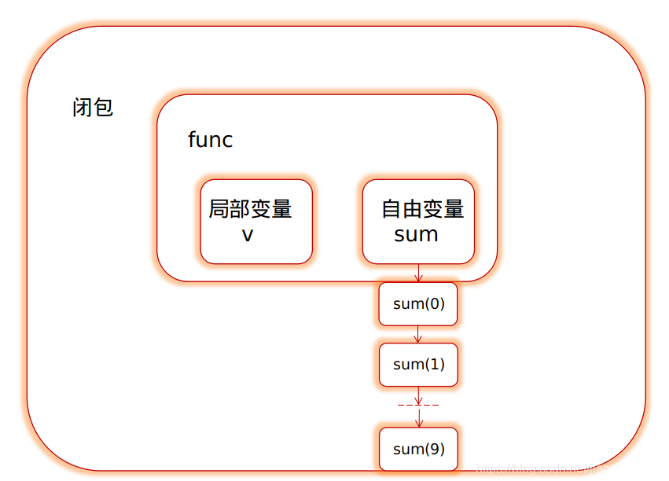

# 函数式编程的特点：
- 高阶函数：(函数的参数和返回值都可以是函数)
- 闭包

# go函数编程的特点
- 主要是闭包

# 闭包 简单来说，闭包就是在函数内使用外部自由变量。

- 累加器例子
```go
package main

import "fmt"

//累加器

func commonAdd() {
	sum := 0
	for i := 0; i < 10; i++ {
		sum += i
	}
	fmt.Println(sum)
}

func Adder() func(int) int {
	// 自由变量
	num := 0
	return func(v int) int {
		num += v
		return num
	}
}


func callAdder() {
	addr := Adder()
    // plus 
	var res = 0
	for i := 0; i < 10; i++ {
		// 整个的累加过程作为变量放在循环的外部
        // 不断的对一个传入的数据进行加工

		res = addr(i)
        // 在进行plus的加工
		fmt.Printf("+.. %d=%d\n", i, res)
	}
}

func main() {
	// 普通累加器
	commonAdd()
	// 闭包累加器
	callAdder()

}

```

# 函数式编程的应用场景
- 对于数据的长流程处理
- 类似流水线，装配模式
- 可以随时增删流程


##  举例斐波那契数列
```go
package main

import "fmt"

func fib() func () int {
	a, b := 0, 1
	return func() int {
		a, b = b, a+b
		return a
	}
}

func main()  {
	fun:=fib()
	fmt.Println(fun())
	fmt.Println(fun())
	fmt.Println(fun())
	fmt.Println(fun())
	fmt.Println(fun())
	fmt.Println(fun())
	fmt.Println(fun())
}
```