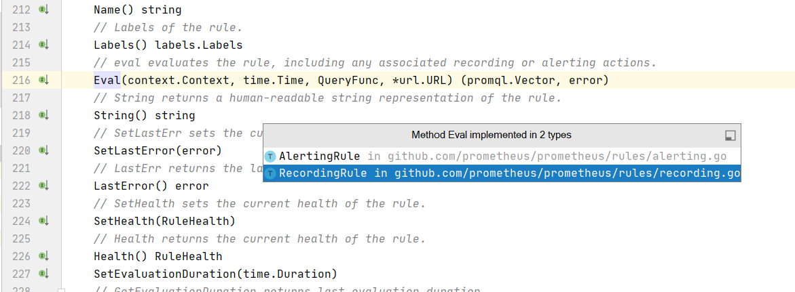

# 面向对象
- go没有class关键字，oop，但是我们可以把go当做面向对象的方式来编程
- go没有类，可以把struct作为类看待
- 类的方法是啥： 给struct绑定的方法

## 继承
- 通过结构体的匿名嵌套，继承对应的字段和方法，举例
```go
package main

import "fmt"

type Person struct {
	Name  string
	Email string
	Age   int
}

type Student struct {
	Person
	StudentId int
}

// 附属于person类的方法
// 指针相当于单实例绑定
func (p *Person) SayHello() {
	fmt.Printf("[Person.SayHello][name:%s]", p.Name)
}

func main() {
	p := Person{
		Name:  "xiaoyi",
		Email: "qq.com",
		Age:   18,
	}
	s := Student{
		Person:    p,
		StudentId: 123,
	}
	s.SayHello()
	
}

```

## 多态 ：通过接口做多态
### go接口
- interface{} 定义方法的集合
- 多态体现在，各个结构体对象要实现 接口中定义的所有方法
- 统一的函数调用入口 ，传入的接口
- 各个结构体对象中 绑定的方法只能多不能少月 接口定义的
- 方法的签名要一致：参数类型、参数个数，方法名称，函数返回值要一致
- 多态的灵魂就是有个承载的容器，先把所有实现了接口的对象加进来，每个实例都要照顾的地方，直接遍历 调用方法即可

### 实际应用 prometheus 的alert和record


- 举例
```go
package main

import "fmt"

// 体现多态
// 告警通知的函数，根据不同的对象通知
// 有个共同的通知方法，每种对象自己实现

type notifer interface {
	// 动作，定义的方法
	notify()
	Init()
}

// 普通用户
type user struct {
	name  string
	email string
}

// 管理员
type admin struct {
	name string
	age  int
}

func (u *user) push() {
	fmt.Printf("[普通用户][sendNotify to user %s]\n", u.name)
}

func (u *user) notify() {
	fmt.Printf("[普通用户][sendNotify to user %s]\n", u.name)
}
func (u *user) Init() {}

func (u *admin) notify() {
	fmt.Printf("[管理员][sendNotify to admin %s]\n", u.name)
}
func (u *admin) Init() {}
// 多态的统一调用方法，入口
func sendNotify(n notifer) {
	n.notify()
}

func main() {
	u1 := user{
		name:  "小乙",
		email: "y@qq.com",
	}
	a1 := admin{
		name: "李逵",
		age:  18,
	}
	//u1.notify()
	//a1.notify()
	/ar n notifer
	//n = &u1
	//n.notify()
	//
	ns:=make([]notifer,0)
	ns=append(ns,&u1)
	ns=append(ns,&a1)
	for _,n:=range ns{
		// 做统一的入口
		n.notify()
		// 批量初始化
		n.Init()
	}
	//
}

```


## 常用举例 ，多个数据源推送数据和查询数据
- 举例
```go
package main

import (
	"fmt"
	"log"
)

/*
1. 多个数据源有
2. query方法做查数据
3. pushdata方法做写入数据

*/
// 方法集合
type DataSource interface {
	PushData(data string)
	QueryData(name string) string
}

type redis struct {
	Name string
	Addr string
}

func (r *redis) PushData(data string) {
	log.Printf("[PushData][ds.name:%s][data:%s]", r.Name, data)
}
func (r *redis) QueryData(name string) string {
	log.Printf("[QueryData][ds.name:%s][name:%s]", r.Name, name)
	return name + "redis"
}

type kafka struct {
	Name string
	Addr string
}

func (k *kafka) PushData(data string) {
	log.Printf("[PushData][ds.name:%s][data:%s]", k.Name, data)
}
func (k *kafka) QueryData(name string) string {
	log.Printf("[QueryData][ds.name:%s][name:%s]", k.Name, name)
	return name + "kafka"
}

var Dm = make(map[string]DataSource)

func main()  {
	r:=redis{
		Name: "redis",
		Addr: "1.1",
	}
	k:=kafka{
		Name: "kafka",
		Addr: "2.2",
	}
	// 注册数据源到承载的容器中
	Dm["redis"] = &r
	Dm["kafka"] = &k
	// 推送数据
	for i:=0;i<10;i++{
		key:=fmt.Sprintf("key_%d",i)
		for _,ds:=range Dm{
			ds.PushData(key)
		}
	}
	// 查询数据
	for i:=0;i<5;i++{
		key:=fmt.Sprintf("key_%d",i)
		for _,ds:=range Dm{
			res:=ds.QueryData(key)
			log.Println(res)
		}
	}
}
```


## 空接口
没有方法


## 类型断言 和类型判断
- 一个interface 需要类型转换的时候，语法 i.(T) 
- v,ok:=i.(T)
- 举例
```go
package main

import "fmt"

func main() {

	var s interface{} = "abc"
	s1, ok := s.(string)
	fmt.Println(s1, ok)

	s2, ok := s.(int)
	fmt.Println(s2, ok)

	switch s.(type) {
	case string:
		fmt.Println("是个string")
	case int:
		fmt.Println("是个int")
	default:
		fmt.Println("未知的type")
	}
}

```

