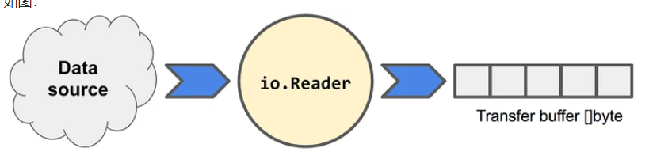
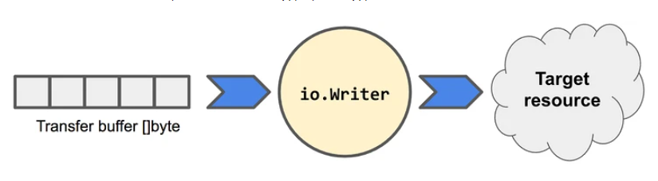

# I/O操作也叫输入输出操作
- 其中I是指Input
- O是指Output
- 主要用来读取或写入数据，很多语言中也叫做流操作


# Go 输入和输出操作是使用原语实现的
- 这些原语将数据模拟成可以读或者可以写的字节流


# io库属于底层接口定义库
- 作用是定义一些基本的接口和基本常量
- 其他人调用它常量，如io.EOF 

# io库比较常用的接口有三个，分别是Reader，Writer和Close。
- io库中实现的上述接口可以 以流的方式高效处理数据
- 并不需要考虑数据是什么，数据来自哪里，数据要发送到哪里

## Reader
- io.Reader表示一个读取器
- 它从某个地方读取数据到 传输的缓存区
- 在缓存区里面，数据可以被流式的使用
- 接口签名如下
```go
type Reader interface {
	Read(p []byte) (n int, err error)
}
```





## strings.NewReader
- 上面提到了io.Reader 接口只有一个方法Read方法
- 换句话说 只要有个对象实现了Read方法，那么这个对象就是一个读取器
- Read() 首先要有一个读缓冲区的参数
- Read() 返回两个值，第一个是读取到的字节数，第二个是读取时发生的错误
- 注意：返回到的读取字节个数n可能小于缓冲区的大小
- io.EOF 表示输入的流已经读到头了
- 代码如下
```go
package main

import (
	"io"
	"log"
	"strings"
)

// 实现一个reader 每次读取4个字节
func main() {
	// 从字符串创建一个reader对象
	reader := strings.NewReader("mage jiaoyue 2021 golang")

	// new一个4字节的读取缓冲区
	p := make([]byte, 4)

	for {
		// reader对象怎么读数据呢
		n, err := reader.Read(p)
		if err != nil {
			if err == io.EOF {
				log.Printf("[数据已读完 Eof:%d]", n)
				break
			}
			log.Printf("[未知错误:%v]", err)
			return
		}
		log.Printf("[打印读取的字节数:%d 内容:%s]", n, string(p[:n]))
	}

}

```


## 自己实现一个Reader
- 要求过滤输入字符串中的非字母字符 
   - 输入 "mage jiaoyue 2021 go !!!!"
   - 输出是"magejiaoyuego"

```go
package main

import (
	"io"
	"log"
)

type zimuguolv struct {
	src string //输入的字符串
	cur int    //当前读取的位置

}

func alpha(r byte) byte {
	// r在 A-Z 或者 a-z
	if (r >= 'A' && r <= 'Z') || (r >= 'a' && r <= 'z') {
		return r
	}
	return 0
}

func (z *zimuguolv) Read(p []byte) (int, error) {
	// 当前位置>=字符串的长度，说明已经读取到结尾了 返回EOF
	if z.cur >= len(z.src) {
		return 0, io.EOF
	}
	// 定义一个剩余还没读到的长度
	x := len(z.src) - z.cur
	// bound叫做本次读取长度
	// n代表本次遍历 bound的索引
	n, bound := 0, 0
	if x >= len(p) {
		// 剩余长度超过缓冲区大小，说明本次可以完全填满换冲区
		bound = len(p)
	} else {
		// 剩余长度小于缓冲区大小，使用剩余长度输出，缓冲区填不满
		bound = x
	}

	buf := make([]byte, bound)

	for n < bound {
		if char := alpha(z.src[z.cur]); char != 0 {
			buf[n] = char
		}
		// n++索引++
		n++
		z.cur++
	}
	copy(p, buf)
	return n, nil
}

func main() {
	zmreader := zimuguolv{
		src: "mage jiaoyue 2021 g0 !!!",
	}

	p := make([]byte, 4)
	for {
		n, err := zmreader.Read(p)
		if err == io.EOF {
			log.Printf("[eof错误]")
			break
		}
		log.Printf("[读取到的长度%d 内容%s]", n, string(p[:n]))
	}
}

```

## 组合多个 Reader，目的是重用和屏蔽下层实现的复杂度
- 标准库里面已经有了很多Reader
- 使用一个Reader A作为一个Reader B的一部分
- 目的是复用逻辑，流式处理
- 复用的io.Reader
```go
package main

import (
	"io"
	"log"
	"strings"
)

type alphaReader struct {
	ioReader io.Reader
}

func (a *alphaReader) Read(p []byte) (int, error) {

	//想复用io.reader的read方法
	n, err := a.ioReader.Read(p)
	if err != nil {
		return n, err
	}

	buf := make([]byte, n)
	for i := 0; i < n; i++ {
		if char := alpha(p[i]); char != 0 {
			buf[i] = char
		}
	}
	copy(p, buf)
	return n, nil
}

func alpha(r byte) byte {
	// r在 A-Z 或者 a-z
	if (r >= 'A' && r <= 'Z') || (r >= 'a' && r <= 'z') {
		return r
	}
	return 0
}

func main() {
	myReader := alphaReader{
		strings.NewReader("mage jiaoyu 2021 go !!!"),
	}
	p := make([]byte, 4)
	for {
		n, err := myReader.Read(p)
		if err == io.EOF {
			log.Printf("[EOF错误]")
			break
		}
		log.Printf("[读取到的长度%d 内容%s]", n, string(p[:n]))
	}
}

```


## os.File 结合
- 以下代码展示了 alphaReader 如何与 os.File 结合以过滤掉文件中的非字母字符：
- 因为os.Open得到一个file对象 ，它实现了io.Reader的Read方法
```go
package main

import (
	"fmt"
	"io"
	"log"
	"os"
)

type alphaReader struct {
	ioReader io.Reader
}

func (a *alphaReader) Read(p []byte) (int, error) {

	//想复用io.reader的read方法
	n, err := a.ioReader.Read(p)
	if err != nil {
		return n, err
	}

	buf := make([]byte, n)
	for i := 0; i < n; i++ {
		if char := alpha(p[i]); char != 0 {
			buf[i] = char
		}
	}
	copy(p, buf)
	return n, nil
}

func alpha(r byte) byte {
	// r在 A-Z 或者 a-z
	if (r >= 'A' && r <= 'Z') || (r >= 'a' && r <= 'z') {
		return r
	}
	return 0
}

func main() {
	file, err := os.Open("test.txt")
	if err != nil {
		fmt.Println(err)
		os.Exit(1)
	}
	defer file.Close()

	//myReader := alphaReader{
	//	strings.NewReader("mage jiaoyu 2021 go !!!"),
	//}
	myReader := alphaReader{
		file,
	}
	p := make([]byte, 4)
	for {
		n, err := myReader.Read(p)
		if err == io.EOF {
			log.Printf("[EOF错误]")
			break
		}
		log.Printf("[读取到的长度%d 内容%s]", n, string(p[:n]))
	}
}

```


## Writer 
- io.Writer 表示一个编写器，它从缓冲区读取数据，并将数据写入目标资源。

```go
type Writer interface {
	Write(p []byte) (n int, err error)
}
```

- Write() 方法有两个返回值，一个是写入到目标资源的字节数，一个是发生错误时的错误。

## closer

## bytes.Buffer库
- bytes.Buffer 的针对的是内存到内存的缓存


# ioutil库 工具包
- 在io目录下，它是一个工具包，实现一些实用的工具
- 

### readFile实例
```go
package main

import (
	"fmt"
	"io/ioutil"
	"log"
)

func main() {
	fileName := "go.mod"
	bytes, err := ioutil.ReadFile(fileName)
	if err != nil {
		fmt.Println(err)
		return
	}
	log.Printf("[内容：%s]", bytes)
}

```

### writeFile 写入文件
```go
package main

import (
	"fmt"
	"io/ioutil"
)

func main() {
	fileName := "白日梦.txt"
	err := ioutil.WriteFile(fileName, []byte("升职加薪\n迎娶白富美"), 0644)
	fmt.Println(err)
}

```

### readDir 读取目录下的文件元信息

```go
package main

import (
	"fmt"
	"io/ioutil"
)

func main() {
	fs, err := ioutil.ReadDir("./")
	if err != nil {
		fmt.Println(err)
		return
	}
	for _, f := range fs {
		fmt.Printf("[name:%v][size:%v][isDir:%v][mode:%v][ModTime:%v]\n",
			f.Name(),
			f.Size(),
			f.IsDir(),
			f.Mode(),
			f.ModTime(),

		)
	}
	/*
		[name:.idea][size:0][isDir:true][mode:drwxrwxrwx][ModTime:2021-07-10 11:55:50.3698648 +0800 CST]
		[name:01_错误处理.md][size:2286][isDir:false][mode:-rw-rw-rw-][ModTime:2021-07-10 10:39:06.3537141 +0800 CST]
		[name:02_IO操作.md][size:7565][isDir:false][mode:-rw-rw-rw-][ModTime:2021-07-10 12:00:13.7431769 +0800 CST]
		[name:03_反射.md][size:559][isDir:false][mode:-rw-rw-rw-][ModTime:2021-07-09 21:01:18.791 +0800 CST]
		[name:04_包和工程.md][size:3417][isDir:false][mode:-rw-rw-rw-][ModTime:2021-07-09 21:01:18.803 +0800 CST]
		[name:05_单元测试和基准测试.md][size:1211][isDir:false][mode:-rw-rw-rw-][ModTime:2021-07-09 21:01:18.787 +0800 CST]
		[name:day05_作业_set.md][size:3945][isDir:false][mode:-rw-rw-rw-][ModTime:2021-07-10 09:28:34.6737994 +0800 CST]
		[name:day05_作业_增量常驻任务管理.md][size:4846][isDir:false][mode:-rw-rw-rw-][ModTime:2021-07-10 09:59:11.7201007 +0800 CST]
		[name:go.mod][size:71][isDir:false][mode:-rw-rw-rw-][ModTime:2021-07-10 09:25:48.2006074 +0800 CST]
		[name:go.sum][size:179][isDir:false][mode:-rw-rw-rw-][ModTime:2021-07-10 09:25:48.2016588 +0800 CST]
		[name:pic][size:0][isDir:true][mode:drwxrwxrwx][ModTime:2021-07-10 08:37:34.9023974 +0800 CST]
		[name:reader.go][size:313][isDir:false][mode:-rw-rw-rw-][ModTime:2021-07-10 12:00:13.7391923 +0800 CST]
		[name:test.txt][size:35][isDir:false][mode:-rw-rw-rw-][ModTime:2021-07-10 11:49:07.0627814 +0800 CST]
		[name:day05作业.md][size:640][isDir:false][mode:-rw-rw-rw-][ModTime:2021-07-10 08:43:56.913919 +0800 CST]
		[name:大纲.md][size:122][isDir:false][mode:-rw-rw-rw-][ModTime:2021-07-10 09:01:28.648695 +0800 CST]
		[name:白日梦.txt][size:28][isDir:false][mode:-rw-rw-rw-][ModTime:2021-07-10 11:57:30.3136522 +0800 CST]

	*/
}

```
# os库 操作系统打交道
## os.create 
- 创建得到的file对象可以用 write和writestring写内容
```go
package main

import (
	"fmt"
	"os"
)

func main() {

	file, err := os.Create("a.txt")
	if err != nil {
		fmt.Println(err)
		return
	}
	defer file.Close()
	for i := 0; i < 5; i++ {
		file.WriteString("writeString写进来的\n")
		file.Write([]byte("write写进来的\n"))
	}
}

```

## os其他常用函数
- 常见的函数
```go
package main

import (
	"log"
	"os"
)

func main() {
	log.Printf("[获取命令行参数][res:%v]", os.Args)
	hn, _ := os.Hostname()
	log.Printf("[获取主机名][res:%v]", hn)
	log.Printf("[获取当前进程名][res:%v]", os.Getpid())
	log.Printf("[获取一条环境变量][res:%v]", os.Getenv("GOROOT"))
	// 获取所有环境变量
	env := os.Environ()
	for _, v := range env {
		log.Printf("[获取所有环境变量][res:%v]", v)
	}
	dir, _ := os.Getwd()
	log.Printf("[获取当前目录][res:%v]", dir)

	_ = os.Mkdir("config", 0755)
	log.Printf("[创建单一目录config目录]")

	// mkdir -p
	os.MkdirAll("config1/yaml/local", 0755)
	log.Printf("[递归创建目录config1目录]")
	// rm dir
	err := os.Remove("config")
	log.Printf("[删除单一目录config1目录][err:%v]", err)
	// rm -rf
	//err = os.RemoveAll("config1")
	//log.Printf("[全部删除目录config1目录][err:%v]", err)
}

```

## 读取文件 ioutil.ReadFile vs bufio 
```shell script
2021/07/10 14:29:03 [方法一 ioutil.ReadFile][res:我梦到我发财了
我醒了，啥都没了]
2021/07/10 14:29:03 [方法二  os.Open+ioutil.ReadAll][res:我梦到我发财了
我醒了，啥都没了]
2021/07/10 14:29:03 [方法三  os.Open+file.Read][res:我梦到我发财了
我醒了，啥都没了]
2021/07/10 14:29:03 [方法四  os.Open+bufio.Read][res:我梦到我发财了
我醒了，啥都没了]

```
- 代码
```go
package main

import (
	"bufio"
	"fmt"
	"io/ioutil"
	"log"
	"os"
)

func main() {
	fileName := "a.txt"
	//方式一
	bytes, err := ioutil.ReadFile(fileName)

	if err != nil {
		return
	}
	log.Printf("[方法一 ioutil.ReadFile][res:%v]", string(bytes))

	//
	file, err := os.Open(fileName)
	if err != nil {
		return
	}
	bytes, err = ioutil.ReadAll(file)
	if err != nil {
		return
	}
	log.Printf("[方法二  os.Open+ioutil.ReadAll][res:%v]", string(bytes))
	file.Close()

	file, _ = os.Open(fileName)
	buf := make([]byte, 50)
	_, err = file.Read(buf)
	if err != nil {
		fmt.Println(err)
		return
	}
	log.Printf("[方法三  os.Open+file.Read][res:%v]", string(bytes))


	file.Close()

	file, _ = os.Open(fileName)
	// bufio.NewReader
	rd := bufio.NewReader(file)
	buf1 := make([]byte, 50)
	_, err = rd.Read(buf1)
	if err != nil {
		return
	}
	log.Printf("[方法四  os.Open+bufio.Read][res:%v]", string(bytes))
	file.Close()
}

```
- 上述都提供了文件读写的能力
- bufio多了一层缓存的能力。优势体现在读取大文件的时候
- ioutil.ReadFile是一次性将内容加载到内存，大文件容易爆掉


## 标准输出，标准输入
- os.StdOut.Write 代替fmt.print
```go
package main

import (
	"fmt"
	"os"
)

func main() {

	os.Stdout.Write([]byte("小乙和李逵"))
	fmt.Println("小乙和李逵")
}

```


###  os.stdin 作为脚本的输入内容
- 写一个脚本，和命令一个输入的文件
- 文件作为脚本的stdin，执行
```go
package main

import (
	"fmt"
	"os"
	"os/exec"
)

func main() {

	/*
	echo "ss -ntlp " > a.txt
	go run a.go < a.txt
	 */
	cmd := exec.Command("sh")
	cmd.Stdin = os.Stdin
	cmd.Stdout = os.Stdout
	cmd.Stderr = os.Stderr
	err := cmd.Run()
	if err != nil {
		fmt.Println("run.err", err)
		return
	}
}

```

- 真实生产应用 夜莺监控发送告警，调用python的send.py脚本 ，将发送的内容作为stdin传过去
    - go代码：https://github.com/didi/nightingale/blob/master/alert/consume.go#L183
    - python 脚本：https://github.com/didi/nightingale/blob/master/etc/script/notify.py
