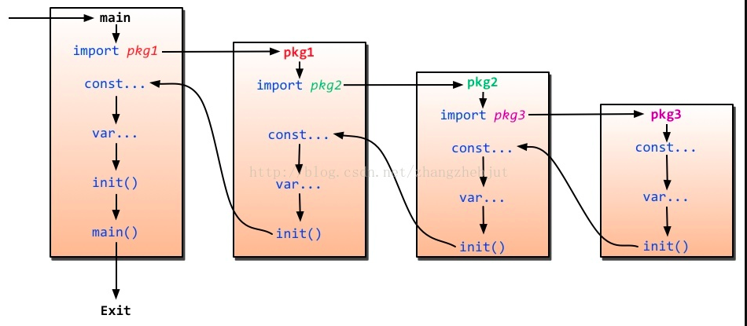
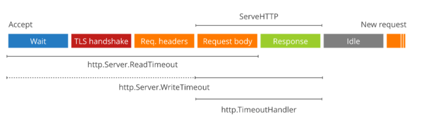

# 目录
- 包的声明
- 包的导入和调用
- 导入形式
- 包的成员可见性
- main包
- init函数和调用链
- 包管理之vendor
- 包管理之mod
- internal包
- 如何将包组织成工程

# 包的基本概念
## 包是什么
- go里面的包是用来组织源码，是多个源文件的集合


## 包的声明/定义
- 在源文件中加上`package xxx `就可以声明xxx的包 


## 定义一个包
- 新建一个pk1文件夹，和内部的func1.go
```go
package pk1

import "fmt"

var PK1Var1 = "pk1var1"

func PK1Func1() {
	fmt.Println("pk1的方法")
}

```
- 在外侧调用
```go
package main

import (
	"fmt"
	"github.com/ahwhy/myGolang/week7/pk1"
)

func main() {
	fmt.Println(pk1.PK1Var1)
	pk1.PK1Func1()
}

```


## 路径、目录名、包名、文件名的关系

- 看下面这个例子
- 创建目录 src/pk1/pk2
- 创建文件 src/pk1/pk2/func2.go,包名和目录不相同
```go
package pk3

import (
	"log"
)

func Func2_test() {
	log.Printf("[pk1/pk2/func2.go里面的方法]")
}


```
- 创建文件 src/pk1/pk2/func3.go ,包名和目录不相同
```go
package pk3

import (
	"log"
)

func Func3_test() {
	log.Printf("[pk1/pk2/func3.go里面的方法]")
}
```
- 创建文件 src/pk1/func1.go ,包名和目录不相同
```go
package pk4

import pk3 "maday06/src/pk1/pk2"

func Func1_test() {
	pk3.Func2_test()
	pk3.Func3_test()
}

```
- 创建文件 src/index.go
```go
package main

import (
	"maday06/src/pk1"
	"maday06/src/pk1/pk2"
)

func main() {
	pk4.Func1_test()
	pk3.Func2_test()
	pk3.Func3_test()

}

```
- 执行index.go 
```shell script
2021/07/10 16:40:16 [pk1/pk2/func2.go里面的方法]
2021/07/10 16:40:16 [pk1/pk2/func3.go里面的方法]
2021/07/10 16:40:16 [pk1/pk2/func2.go里面的方法]
2021/07/10 16:40:16 [pk1/pk2/func3.go里面的方法]

```

### 关系说明
- import 导入的是路径，而非包名
- 包名和目录名不强制一致，但推荐一致
- 在代码中引用包的成员变量或者函数时，使用的包名不是目录名
- 在同一目录下，所有的源文件必须使用相同的包名
    - Multiple packages in directory: pk2, pk3 
- 文件名不限制，但不能有中文

## 包名要求
- 包名一般小写，使用一个简短且有意义的名字
- 名字中可以含有- 等特殊符号

## 不使用go mod 同包目录找到对象的问题

## 但是在gopath路径下 +go mod就可以


# 包导入形式
## 常规形式 根据路径导入
- `import xxx/xx`

## 别名导入目的为了 名字重复的包
- 创建src/log/a.go
```go
package log

import "fmt"

func LogPrint() {
	fmt.Println("自定义的log")
}

```
- 使用
```go
package main

import (
	"log"
	mylog	"maday06/src/log"
	"maday06/src/pk1"
	"maday06/src/pk1/pk2"
)

func main() {
	mylog.LogPrint()
	log.Printf("内置的log")
	pk4.Func1_test()
	pk3.Func2_test()
	pk3.Func3_test()

}

```


## 使用.导入
- 目的是省略包名
- 方法的的名字容易冲突
```go
package main

import (
	. "maday06/src/log"
	"maday06/src/pk1"
	"maday06/src/pk1/pk2"
)

func main() {
	LogPrint()
	pk4.Func1_test()
	pk3.Func2_test()
	pk3.Func3_test()

}

```

## 使用下划线导入
- 目的：有的时候并非真的需要这些包，仅仅是希望的它init()函数被执行而已
- 举例mysql `https://github.com/go-sql-driver/mysql`
```go
package main

import (
	"database/sql"
	"time"

	_ "github.com/go-sql-driver/mysql"
)

func main() {

	// ...

	db, err := sql.Open("mysql", "user:password@tcp(localhost)/dbname")
	if err != nil {
		panic(err)
	}
	// See "Important settings" section.
	db.SetConnMaxLifetime(time.Minute * 3)
	db.SetMaxOpenConns(10)
	db.SetMaxIdleConns(10)
}

```

### 如果不导入会怎么样
- `panic: sql: unknown driver "mysql" (forgotten import?)`
- 上述报错来自与`C:\Program Files\Go\src\database\sql\sql.go+767`
```go
func Open(driverName, dataSourceName string) (*DB, error) {
	driversMu.RLock()
	driveri, ok := drivers[driverName]
	driversMu.RUnlock()
	if !ok {
		return nil, fmt.Errorf("sql: unknown driver %q (forgotten import?)", driverName)
	}

```
- 继续看代码发现 `C:\Program Files\Go\src\database\sql\sql.go +44`有个注册的方法
- 会向drivers map中写入 driver
```go
func Register(name string, driver driver.Driver) {
	driversMu.Lock()
	defer driversMu.Unlock()
	if driver == nil {
		panic("sql: Register driver is nil")
	}
	if _, dup := drivers[name]; dup {
		panic("sql: Register called twice for driver " + name)
	}
	drivers[name] = driver
}
```

- 在 C:\Program Files\Go\src\database\sql\sql.go +83 包中发现有init函数  
```go
func init() {
	sql.Register("mysql", &MySQLDriver{})
}
```
- init函数在调用sql.Register向driver map中注册 mysql类型的驱动

## main包
- package main 下面可以有多个文件，但所有文件只能有一个main方法，代表程序的入口
- package main 每个go应用有一个名为main的包

## 包导入过程和调用链


# 包管理之vendor
- 最开始的时候

## govendor 测试
    
    
# 包管理之mod
- go modules 是 golang 1.11 新加的特性


## 设置 go mod 和 go proxy
- 设置两个环境变量
- GO111MODULE=on
- GOPROXY=https://goproxy.io,direct

### GO111MODULE 有三个值：off, on和auto（默认值）。
- =off 代表go命令将不会支持module功能，按照原来的那种vendor目录或者GOPATH模式来查找
- =on go命令会使用module功能，一点也不会去GOPATH目录查找
- =auto ，默认值，go命令行会根据当前目录来决定是否启用module功能。
    - 当前目录在GOPATH/src之外的，而且该目录还有go.mod 开启
    - 处于GOPATH没有go.mod 等于off
- 如果不使用 go mod，go get会去master分支拉代码
- 使用go mod，可以选tag    
    


## go mod使用 go mod 有以下命令：

|  命令   | 说明|
|  ----  | ----  | 
| download	| download modules to local cache(下载依赖包)|	
| edit	| edit go.mod from tools or scripts（编辑go.mod)|	
| graph	| print module requirement graph (打印模块依赖图) |	
| init	| 	initialize new module in current directory（在当前目录初始化mod） |	
| tidy	| add missing and remove unused modules(拉取缺少的模块，移除不用的模块) |	
| vendor	| make vendored copy of dependencies(将依赖复制到vendor下) |	
| verify	|  	verify dependencies have expected content (验证依赖是否正确）  |	
| why	| 	explain why packages or modules are needed(解释为什么需要依赖) |	

- 常用tidy init edit


## 使用go mod管理新的项目
- 创建一个新的项目 go mod init 
```go
package main

import "github.com/gin-gonic/gin"

func main() {
	r := gin.Default()
	r.GET("/ping", func(c *gin.Context) {
		c.JSON(200, gin.H{
			"message": "pong",
		})
	})
	r.Run() // listen and serve on 0.0.0.0:8080 (for windows "localhost:8080")
}

```
- go.mod 
    - module 语句指定报的名字
    - require 语句代码指定依赖的模块
    - replace 可以替换
    - exclude 可以忽略
    
- go.sum 文件来记录 dependency tree
- mod包的缓存位置在 $GOPATH/pkg/mod/xxx
    - D:\nyy_work\go_path\pkg\mod\github.com\gin-gonic\gin@v1.7.2
    - 可以修改go.mod中的模块版本，再sync就可以
    
## go get 拉取包的规则
-  go get -u 将会升级到最新的次要版本或者修订版本(x.y.z,x是主版本号， z是修订版本号， y是次要版本号)


- go get xxx@version 升级到指定版本


## 使用go mod 发布一个我们自己的库
> 01 新建一个项目 叫common-tools

```go
package main


import (
	"fmt"
	"log"
	"net"
	"os"
	"strings"
	"time"
)

func GetNowTimeStr() string {
	return time.Unix(time.Now().Unix(), 0).Format("2006-01-02 15:04:05")
}

func GetHostName() string {
	name, _ := os.Hostname()
	return name
}

func GetLocalIp() string {
	conn, err := net.Dial("udp", "8.8.8.8:53")
	if err != nil {
		log.Printf("get local addr err:%v", err)
		return ""
	} else {
		localIp := strings.Split(conn.LocalAddr().String(), ":")[0]
		conn.Close()
		return localIp
	}
}

func main() {
	h := GetHostName()
	ip := GetLocalIp()
	t := GetNowTimeStr()
	fmt.Println(h, ip, t)
}

```

- 新建一个funcs.go ，塞进去一些常见的函数  

- 先将报名改为main ，加个main方法调用一下函数，看看好不好使，然后将报名改回common-tools


> 02 创建git，发布到github
- 项目目录下 go mod  init github.com/ning1875/common-tools
- git init 
- 添加个.gitiiignore 文件去掉一些和代码无关的文件/文件夹
- git add . && git commit -m "first"
- github上新建一个仓库
- 推送到远程
```shell script
git remote add origin https://github.com/ning1875/common-tools.git
git branch -M main
git push -u origin main
```


> 03 新创建一个项目，导入我们发布的mod
- go get github.com/ning1875/common-tools
- main.go
```go
package main

import (
	"fmt"
	"github.com/ning1875/common-tools"
)

func main() {

	hostname := common_tools.GetHostName()
	ip := common_tools.GetLocalIp()
	ts := common_tools.GetNowTimeStr()
	fmt.Println(hostname, ip, ts)

}

```

- 注意项目中的go.mod 版本信息描述的是
```shell script
module new-pkg02

go 1.16

require github.com/ning1875/common-tools v1.0.1 // indirect

```


> 05 修改我们的代码 ，发布v1.0.2版本


```go
func GetHostName() string {
	name, _ := os.Hostname()
	return name +"v1.0.2"
}
```
- 本地新建一个分支
```go
git checkout -b v1 
git add .
git commit -m "xxx"
git tag v1.0.2
git push --tags orgin v1 
```
- 到远程仓库检查 v1.0.2 
- 本地调用方 修改 go.mod 版本信息 改为v1.0.2
- 调用方GetHostName就会变为v1.0.2版本
```shell script
SC-202003191609v1.0.2

```

> 06 主版本号变更 
- 版本号 v1.0.2 1代表主版本号 主版本号可能会不兼容
- 0次版本号 2代表修正版本号
- 把common-tools中的GetLocalIp由一个返回值改为 两个返回值
- 库函数 
```go

func GetLocalIp() (string, error) {
	conn, err := net.Dial("udp", "8.8.8.8:53")
	if err != nil {
		log.Printf("get local addr err:%v", err)
		return "", err
	} else {
		localIp := strings.Split(conn.LocalAddr().String(), ":")[0]
		conn.Close()
		return localIp, nil
	}
}
```
- 主版本变更的时候 go get不会去拉了  
- 手动get  go get github.com/ning1875/common-tools/v2 
- path 改为了 module/v2 ,但是使用的时候还使用模块的名字
- 调用方的go.mod 
```shell script
module new-pkg02

go 1.16

require (
	github.com/ning1875/common-tools v1.0.2
	github.com/ning1875/common-tools/v2 v2.0.0 // indirect
)

```

- main.go
```go
package main

import (
	"fmt"
	"github.com/ning1875/common-tools/v2"
)

func main() {

	//hostname := common_tools.GetHostName()
	ip, err := common_tools.GetLocalIp()
	//ts := common_tools.GetNowTimeStr()
	fmt.Println(ip, err)

}

```


> 07 两个版本一起用，使用import 别名
- 使用导入别名
```go
package main

import (
	"fmt"
	cv1 "github.com/ning1875/common-tools"
	cv2 "github.com/ning1875/common-tools/v2"
)

func main() {

	//hostname := common_tools.GetHostName()
	ip, err := cv2.GetLocalIp()
	//ts := common_tools.GetNowTimeStr()
	fmt.Println(ip, err)
	ip = cv1.GetLocalIp()
	fmt.Println(ip)
}

```


## interal 包
- go 1.5 及后续版本中，可以通过创建 internal 代码包让一些程序实体仅仅能被当前模块中的其他代码引用


# 如何组织项目
## 看源码 
- https://github.com/didi/nightingale
- https://github.com/grafana/grafana
- https://github.com/prometheus/prometheus

## 用 net/http/httptrace 写个http耗时探测的项目 simple-http-probe


