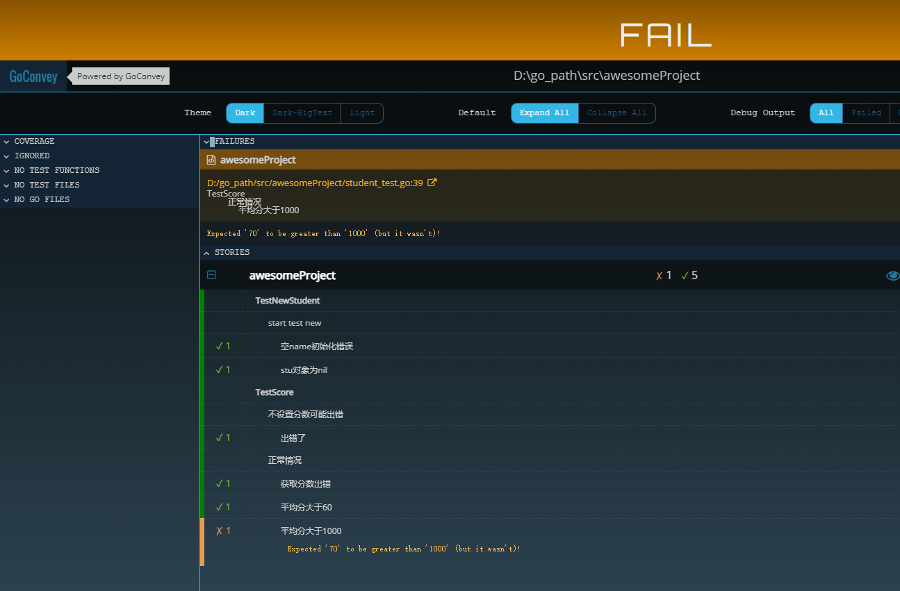
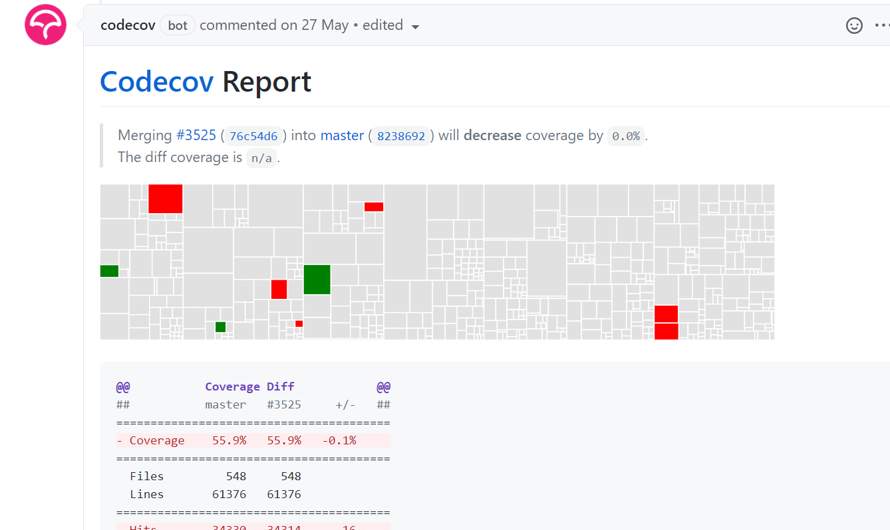

# 单元测试

## 什么是单元& 单元测试
- 单元是应用的最小可测试部件，如函数和对象的方法
- 单元测试是软件开发中对最小单位进行正确性检验的测试工作


## 为什么进行单元测试
- 保证 变更/重构的正确性，特别是在一些频繁变动和多人合作开发的项目中
- 简化调试过程： 可以轻松的让我们知道哪一部分代码出了问题
- 单测最好的文档：在单测中直接给出具体接口的使用方法，是最好的实例代码


## 单元测试用例编写的原则
- 单一原则：一个测试用例只负责一个场景
- 原子性：结果只有两种情况：Pass /Fail
- 优先要核心组件和逻辑的测试用例
- 高频使用库，util，重点覆盖这些

> go 语言原生支持了单元测试，使用上非常简单


## 单测用例约定
- 文件名必须要xx_test.go命名
- 测试方法必须是 TestXXX开头
- 方法中的参数 必须是 t *testing.T
- 测试文件和被测试文件必须在一个包中


# golang 的测试框架

## testing 
> 简单使用
- 准备待测代码 compute.go
```go
package main

func Add(a, b int) int {
	return a + b
}

func Mul(a, b int) int {
	return a * b
}
func Div(a, b int) int {
	return a / b
}

```

> 准备测试用例 compute_test.go
```shell script
package main

import "testing"

func TestAdd(t *testing.T) {
	a := 10
	b := 20
	want := 30

	actual := Add(a, b)
	if want != actual {
		t.Errorf("[Add 函数参数 :%d %d][期望：%d][实际：%d]", a, b, want, actual)
	}
}

func TestMul(t *testing.T) {
	a := 10
	b := 20
	want := 300

	actual := Mul(a, b)
	if want != actual {
		t.Errorf("[Mul 函数参数 :%d %d][期望：%d][实际：%d]", a, b, want, actual)
	}

}

func TestDiv(t *testing.T) {
	a := 10
	b := 20
	want := 2

	actual := Div(a, b)
	if want != actual {
		t.Errorf("[Div 函数参数 :%d %d][期望：%d][实际：%d]", a, b, want, actual)
	}
}
```

> 执行test  go test -v .
```shell script
D:\nyy_work\go_path\src\pkg007>go test -v .
=== RUN   TestAdd
--- PASS: TestAdd (0.00s)
=== RUN   TestMul
    compute_test.go:23: [Mul 函数参数 :10 20][期望：300][实际：200]
--- FAIL: TestMul (0.00s)
=== RUN   TestDiv
    compute_test.go:35: [Div 函数参数 :10 20][期望：2][实际：0]
--- FAIL: TestDiv (0.00s)
FAIL
FAIL    pkg007  0.664s
FAIL


```
> 只执行某个函数  go test -run=TestAdd -v .


> 正则过滤函数名 go test -run=TestM.* -v .


##  -cover测试覆盖率  go test -v -cover
- 用于统计目标包有百分之多少的代码参与了单测

```shell script
=== RUN   TestAdd
--- PASS: TestAdd (0.00s)
=== RUN   TestMul
    compute_test.go:23: [Mul 函数参数 :10 20][期望：300][实际：200]
--- FAIL: TestMul (0.00s)
=== RUN   TestDiv
    compute_test.go:35: [Div 函数参数 :10 20][期望：2][实际：0]
--- FAIL: TestDiv (0.00s)
FAIL
coverage: 100.0% of statements
exit status 1
FAIL    pkg007  0.694s

D:\nyy_work\go_path\src\pkg007>go test -v -cover


```


## 子测试 t.run 

```go
package main

import "testing"

func TestMul(t *testing.T) {
	t.Run("正数", func(t *testing.T) {
		if Mul(4, 5) != 20 {
			t.Fatal("muli.zhengshu.error")
		}
	})

	t.Run("负数", func(t *testing.T) {
		if Mul(2, -3) != -6 {
			t.Fatal("muli.fusshu.error")
		}
	})

}

```

- go test -v .
```shell script
=== RUN   TestMul
=== RUN   TestMul/正数
=== RUN   TestMul/负数
--- PASS: TestMul (0.00s)
    --- PASS: TestMul/正数 (0.00s)
    --- PASS: TestMul/负数 (0.00s)
PASS
ok      pkg007  0.701s

```

- 指定func/sub 跑子测试
```shell script
go test -run=TestMul/正数 -v

```


## table-driven tests
- 所有用例的数据组织在切片 cases 中，看起来就像一张表，借助循环创建子测试。这样写的好处有：
  - 新增用例非常简单，只需给 cases 新增一条测试数据即可。
  - 测试代码可读性好，直观地能够看到每个子测试的参数和期待的返回值。
  - 用例失败时，报错信息的格式比较统一，测试报告易于阅读。
  - 如果数据量较大，或是一些二进制数据，推荐使用相对路径从文件中读取。
  
- 举例 D:\go_path\pkg\mod\github.com\prometheus\prometheus@v1.8.2-0.20210321183757-31a518faab18\web\api\v1\api_test.go


# GoConvey 测试框架
- 为何使用它，if else 高度封装


## 安装 go get github.com/smartystreets/goconvey

## 使用
- 准备业务代码 student.go
```go
package main

import "fmt"

type Student struct {
	Name      string
	ChiScore  int
	EngScore  int
	MathScore int
}

func NewStudent(name string) (*Student, error) {
	if name == "" {
		return nil, fmt.Errorf("name为空")
	}
	return &Student{
		Name: name,
	}, nil

}

func (s *Student) GetAvgScore() (int, error) {
	score := s.ChiScore + s.EngScore + s.MathScore
	if score == 0 {
		return 0, fmt.Errorf("全都是0分")
	}
	return score / 3, nil
}

```


- 准备测试用例 student_test.go
```go
package main

import (
	"testing"
	. "github.com/smartystreets/goconvey/convey"
)

func TestNewStudent(t *testing.T) {
	Convey("start test new", t, func() {
		stu, err := NewStudent("")
		Convey("空的name初始化错误", func() {
			So(err, ShouldBeError)
		})
		Convey("stu对象为nil", func() {
			So(stu, ShouldBeNil)
		})
	})
}

func TestScore(t *testing.T) {
	stu, _ := NewStudent("小乙")
	Convey("不设置分数可能出错", t, func() {
		sc, err := stu.GetAvgScore()
		Convey("获取分数出错了", func() {
			So(err, ShouldBeError)
		})
		Convey("分数为0", func() {
			So(sc, ShouldEqual, 0)
		})
	})
	Convey("正常情况", t, func() {
		stu.ChiScore = 60
		stu.EngScore = 70
		stu.MathScore = 80
		score, err := stu.GetAvgScore()
		Convey("获取分数出错了", func() {
			So(err, ShouldBeNil)
		})
		Convey("平均分大于60", func() {
			So(score, ShouldBeGreaterThan, 600)
		})

	})

}

```


- 执行 go test -v . 
```shell script
=== RUN   TestNewStudent

  start test new
    空的name初始化错误 .
    stu对象为nil .


2 total assertions

--- PASS: TestNewStudent (0.00s)
=== RUN   TestScore

  不设置分数可能出错
    获取分数出错了 .
    分数为0 .


4 total assertions


  正常情况
    获取分数出错了 .
    平均分大于60 .


6 total assertions

--- PASS: TestScore (0.00s)
PASS
ok      pkg007  (cached)


```

> 图形化使用
1. 确保本地有goconvey的二进制
- go get github.com/smartystreets/goconvey/convey
- 会将对应的二进制放到 $GOPATH/bin 下面
2. 编辑环境变量把 $GOPATH/bin 加入PATH里面 或者写全路径
3. 到测试的目录下，执行goconvey ，启动http 8000，自动跑测试用例
4. 浏览器方位 127.0.0.1:8000 




# testify

## 安装 github.com/stretchr/testify/assert
## 使用

- cal.go
```go
package main

func Add(x int ) (result int) {
	result = x +2
	return result
}


```
- cal_test.go
```go
package main

import (
	"testing"
	"github.com/stretchr/testify/assert"
)

func TestAdd(t *testing.T) {

	// assert equality
	assert.Equal(t, Add(5), 7, "they should be equal")


}

```

## 表驱动测试

```go
package main

import (
	"testing"
	"github.com/stretchr/testify/assert"
)

func TestAdd(t *testing.T) {

	// assert equality
	assert.Equal(t, Add(5), 7, "they should be equal")

}

func TestCal(t *testing.T) {
	ass := assert.New(t)
	var tests = []struct {
		input    int
		expected int
	}{
		{2, 4},
		{-1, 1},
		{0, 2},
		{-5, -3},
		{999999997, 999999999},
	}
	for _, test := range tests {
		ass.Equal(Add(test.input), test.expected)
	}

}

```
## mock功能
- 使用 testify/mock 隔离第三方依赖或者复杂调用
- testfiy/mock 使得伪造对象的输入输出值可以在运行时决定
- https://github.com/euclidr/testingo


## 单元测试覆盖率应用实例
- https://github.com/m3db/m3/pull/3525



# 基准测试

## 基准测试目的
- 检测代码中方法性能问题

## 用法

- fib.go
```go
package main

func fib(n int) int {
	if n == 0 || n == 1 {
		return n
	}
	return fib(n-2) + fib(n-1)
}


```

- fib_test.go
```go
package main

import "testing"

func BenchmarkFib(b *testing.B) {
	for n := 0; n < b.N; n++ {
		fib(30)
	}
}

```

- go test -bench=. -run=none
- go test 会在运行基准测试之前之前执行包里所有的单元测试，所有如果你的包里有很多单元测试，或者它们会运行很长时间，你也可以通过 go test 的-run 标识排除这些单元测试 
```shell script
goos: windows
goarch: amd64
pkg: pkg007
cpu: Intel(R) Core(TM) i7-9750H CPU @ 2.60GHz
BenchmarkFib-12              182           6451155 ns/op
PASS
ok      pkg007  2.532s

```

> 打印内存消耗情况  go test -bench=. -benchmem -run=none
```shell script
D:\nyy_work\go_path\src\pkg007>go test -bench=. -benchmem -run=none
goos: windows
goarch: amd64
pkg: pkg007
cpu: Intel(R) Core(TM) i7-9750H CPU @ 2.60GHz
BenchmarkFib-12              183           6272054 ns/op               0 B/op          0 allocs/op
PASS
ok      pkg007  2.452s

```


## bench的工作原理
- 基准测试函数会被一直调用直到b.N无效，它是基准测试循环的次数
- b.N 从 1 开始，如果基准测试函数在1秒内就完成 (默认值)，则 b.N 增加，并再次运行基准测试函数。
- b.N 的值会按照序列 1,2,5,10,20,50,... 增加，同时再次运行基准测测试函数。
- 上述结果解读代表 1秒内运行了168次 每次 6566836 ns
-  -8 后缀和用于运行次测试的 GOMAXPROCS 值有关。 与GOMAXPROCS一样，此数字默认为启动时Go

## 传入cpu num进行测试
- go test -bench=. -cpu=1,2,4  -benchmem -run=none
```shell script
D:\nyy_work\go_path\src\pkg007>go test -bench=. -cpu=1,2,4  -benchmem -run=none
goos: windows
goarch: amd64
pkg: pkg007
cpu: Intel(R) Core(TM) i7-9750H CPU @ 2.60GHz
BenchmarkFib                 182           6238191 ns/op               0 B/op          0 allocs/op
BenchmarkFib-2               188           6203264 ns/op               0 B/op          0 allocs/op
BenchmarkFib-4               189           6360078 ns/op               0 B/op          0 allocs/op
PASS
ok      pkg007  6.245s


```

## - count 多次运行基准测试
- 因为热缩放、内存局部性、后台处理、gc活动等等会导致单次的误差

- go test -bench=. -count=10  -benchmem -run=none 
```shell script
goos: windows
goarch: amd64
pkg: pkg007
cpu: Intel(R) Core(TM) i7-9750H CPU @ 2.60GHz
BenchmarkFib-12              184           6320565 ns/op               0 B/op          0 allocs/op
BenchmarkFib-12              187           6229882 ns/op               0 B/op          0 allocs/op
BenchmarkFib-12              186           6288768 ns/op               0 B/op          0 allocs/op
BenchmarkFib-12              190           6274037 ns/op               0 B/op          0 allocs/op
BenchmarkFib-12              188           6224385 ns/op               0 B/op          0 allocs/op
BenchmarkFib-12              192           6468373 ns/op               0 B/op          0 allocs/op
BenchmarkFib-12              175           6715403 ns/op               0 B/op          0 allocs/op
BenchmarkFib-12              193           6404352 ns/op               0 B/op          0 allocs/op
BenchmarkFib-12              181           7139169 ns/op               0 B/op          0 allocs/op
BenchmarkFib-12              165           6799398 ns/op               0 B/op          0 allocs/op
PASS
ok      pkg007  19.167s

```

## -benchtime 指定运行秒数
- 有的函数比较慢，为了更精确的结果，我们可以通过 -benchtime 标志指定运行时间，从而使它运行更多次。
- go test -bench=. -benchtime=5s  -benchmem -run=none
```shell script
goos: windows
goarch: amd64
pkg: pkg007
cpu: Intel(R) Core(TM) i7-9750H CPU @ 2.60GHz
BenchmarkFib-12              985           6400913 ns/op               0 B/op          0 allocs/op
PASS
ok      pkg007  16.568s

```


## ResetTimer
-  如果基准测试在循环前需要一些耗时的配置，则可以先重置定时器
```shell script
package main

import (
	"testing"
	"time"
)

func BenchmarkFib(b *testing.B) {
	time.Sleep(3 * time.Second)
	b.ResetTimer()
	for n := 0; n < b.N; n++ {
		fib(30)
	}
}

```


## -benchmem  展示内存消耗情况
- go test -bench=. -benchtime=5s  -benchmem -run=none
- 测试大cap的切片，直接用cap初始化vs 动态扩容
```go
package main

import (
	"math/rand"
	"testing"
	"time"
)

// 制定大的cap的切片
func generateWithCap(n int) []int {
	rand.Seed(time.Now().UnixNano())
	nums := make([]int, 0, n)
	for i := 0; i < n; i++ {
		nums = append(nums, rand.Int())
	}
	return nums
}

// 动态扩容的slice
func generateDynamic(n int) []int {
	rand.Seed(time.Now().UnixNano())
	nums := make([]int, 0)
	for i := 0; i < n; i++ {
		nums = append(nums, rand.Int())
	}
	return nums
}

func BenchmarkGenerateWithCap(b *testing.B) {
	for n := 0; n < b.N; n++ {
		generateWithCap(100000)
	}
}
func BenchmarkGenerateDynamic(b *testing.B) {
	for n := 0; n < b.N; n++ {
		generateDynamic(100000)
	}
}


```

```shell script
D:\nyy_work\go_path\src\pkg007>go test -bench=.  -benchmem -run=none
goos: windows
goarch: amd64
pkg: pkg007
cpu: Intel(R) Core(TM) i7-9750H CPU @ 2.60GHz
BenchmarkGenerateWithCap-12          394           3158336 ns/op          802818 B/op          1 allocs/op
BenchmarkGenerateDynamic-12          345           3321054 ns/op         4654348 B/op         30 allocs/op
PASS
ok      pkg007  3.888s


```
- 结论是用cap初始化好的性能可以高一个数据量级

## 测试函数复杂度 不带cap的slice 动态扩容
- 代码
```go
package main

import (
	"math/rand"
	"testing"
	"time"
)

// 制定大的cap的切片
func generateWithCap(n int) []int {
	rand.Seed(time.Now().UnixNano())
	nums := make([]int, 0, n)
	for i := 0; i < n; i++ {
		nums = append(nums, rand.Int())
	}
	return nums
}

// 动态扩容的slice
func generateDynamic(n int) []int {
	rand.Seed(time.Now().UnixNano())
	nums := make([]int, 0)
	for i := 0; i < n; i++ {
		nums = append(nums, rand.Int())
	}
	return nums
}

func benchmarkGenerate(i int, b *testing.B) {
	for n := 0; n < b.N; n++ {
		generateDynamic(i)
	}
}

func BenchmarkGenerateDynamic1000(b *testing.B)     { benchmarkGenerate(1000, b) }
func BenchmarkGenerateDynamic10000(b *testing.B)    { benchmarkGenerate(10000, b) }
func BenchmarkGenerateDynamic100000(b *testing.B)   { benchmarkGenerate(100000, b) }
func BenchmarkGenerateDynamic1000000(b *testing.B)  { benchmarkGenerate(1000000, b) }
func BenchmarkGenerateDynamic10000000(b *testing.B) { benchmarkGenerate(10000000, b) }

```

- 结果
```shell script
D:\nyy_work\go_path\src\pkg007>go test -bench=.  -benchmem -run=none
goos: windows
goarch: amd64
pkg: pkg007
cpu: Intel(R) Core(TM) i7-9750H CPU @ 2.60GHz
BenchmarkGenerateDynamic1000-12            29139             39159 ns/op           16376 B/op         11 allocs/op
BenchmarkGenerateDynamic10000-12            4010            316369 ns/op          386297 B/op         20 allocs/op
BenchmarkGenerateDynamic100000-12            350           3304217 ns/op         4654345 B/op         30 allocs/op
BenchmarkGenerateDynamic1000000-12            37          31542581 ns/op        45188505 B/op         41 allocs/op
BenchmarkGenerateDynamic10000000-12            4         263955575 ns/op       423503362 B/op        54 allocs/op
PASS
ok      pkg007  10.298s


```
- 结论就是 输入变为原来的10倍，单次耗时也差不多是上一级的10倍。说明这个函数的复杂度是线性的

## string拼接的 bench
const letterBytes = "abcdefghijklmnopqrstuvwxyzABCDEFGHIJKLMNOPQRSTUVWXYZ"
