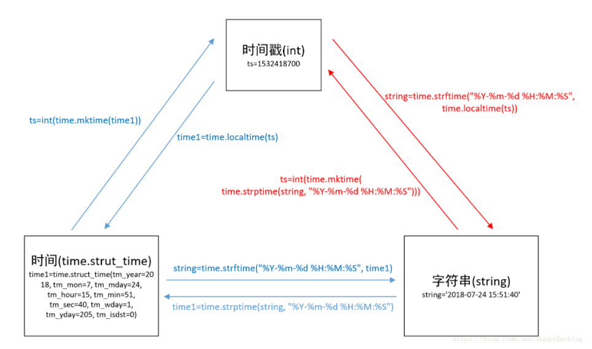
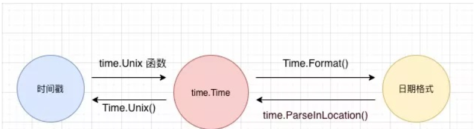

# 时间概念
> 时间戳
- Unix时间戳（Unix timestamp）定义为从1970年01月01日00时00分00秒(UTC)起至现在经过的总秒数
- 不论东西南北、在地球的每一个角落都是相同

> 日期格式
- 字符串


> python中转换关系


> go中转换关系



# 获取时间相关函数
> 获取当前时间

- 代码
```go
package main

import (
	"log"
	"strconv"
	"time"
)

func numLen(n int64) int {
	return len(strconv.Itoa(int(n)))
}

func main() {

	now := time.Now()
	log.Printf("[当前时间对象为：%v]", now)
	log.Printf("[当前时间戳 秒级：%v][位数:%v]", now.Unix(), numLen(now.Unix()))
	log.Printf("[当前时间戳 毫秒级：%v][位数:%v]", now.UnixNano()/1e6, numLen(now.UnixNano()/1e6))
	log.Printf("[当前时间戳 纳秒级：%v][位数:%v]", now.UnixNano(), numLen(now.UnixNano()))
	log.Printf("[当前时间戳 纳秒小数部分：%v]", now.Nanosecond())
	/*
		2021/07/17 16:34:10 [当前时间对象为：2021-07-17 16:34:10.2999431 +0800 CST m=+0.007295301]
		2021/07/17 16:34:10 [当前时间戳 秒级：1626510850][位数:10]
		2021/07/17 16:34:10 [当前时间戳 毫秒级：1626510850299][位数:13]
		2021/07/17 16:34:10 [当前时间戳 纳秒级：1626510850299943100][位数:19]
		2021/07/17 16:34:10 [当前时间戳 纳秒小数部分：299943100]
	*/
}

```

> 结论
- 时间戳返回 int64
- 10位数时间戳 是秒单位
- 13位数时间戳 是毫秒单位
- 19位数时间戳 是纳秒单位
- 毫秒=纳秒/1e6

## 毫秒时间戳作用
- prometheus默认查询就是毫秒

# 具体日期相关函数
- 代码
```go
package main

import (
	"log"
	"time"
)

func main() {

	now := time.Now()
	//返回日期

	year, month, day := now.Date()
	log.Printf("[通过now.Data获取][年：%d 月:%d 日:%d]", year, month, day)
	log.Printf("[直接获取年 %d]", now.Year())
	log.Printf("[直接获取月 %d]", now.Month())
	log.Printf("[直接获取日 %d]", now.Day())

	// 分 时 秒

	hour, minute, second := now.Clock()
	log.Printf("[通过now.Clock获取][时：%d 分:%d 秒:%d]", hour, minute, second)
	log.Printf("[直接获取时 %d]", now.Hour())
	log.Printf("[直接获取分 %d]", now.Minute())
	log.Printf("[直接获取秒 %d]", now.Second())

	// 星期几
	log.Printf("[直接获取星期几 %d]", now.Weekday())
	// 时区
	zone, offset := now.Zone()
	log.Printf("[直接获取时区  %v ，和东utc时区差 几个小时：%d]", zone, offset/3600)

	log.Printf("[今天是 %d年 中的第 %d天]", now.Year(), now.YearDay())
	/*
		2021/07/17 16:44:57 [通过now.Data获取][年：2021 月:7 日:17]
		2021/07/17 16:44:57 [直接获取年 2021]
		2021/07/17 16:44:57 [直接获取月 7]
		2021/07/17 16:44:57 [直接获取日 17]
		2021/07/17 16:44:57 [通过now.Clock获取][时：16 分:44 秒:57]
		2021/07/17 16:44:57 [直接获取时 16]
		2021/07/17 16:44:57 [直接获取分 44]
		2021/07/17 16:44:57 [直接获取秒 57]
		2021/07/17 16:44:57 [直接获取星期几 6]
		2021/07/17 16:44:57 [直接获取时区  CST ，和东utc时区差 几个小时：8]
		2021/07/17 16:44:57 [今天是 2021年 中的第 198天]
	*/
}

```


# 格式化时间
- Go 语言提供了时间类型格式化函数 Format()， 2006-01-02 15:04:05，也很好记忆(2006 1 2 3 4 5)

## 时间对象转字符串

```go
package main

import (
	"log"
	"time"
)

func main() {
	now := time.Now()
	log.Printf("[全部 ：%v]",now.Format("2006-01-02 15:04:05"))
	log.Printf("[只有年 ：%v]",now.Format("2006"))
	log.Printf("[/分割 ：%v]",now.Format("2006/01/02 15:04"))
}

```


## 时间戳与日期字符串相互转化
- 要先转成将时间戳转成 time.Time 类型再格式化成日期格式。
```go
package main

import (
	"log"
	"time"
)

func main() {
	// 时间戳
	ts := time.Now().Unix()
	layout := "2006-01-02 15:04:05"
	// 构造时间对象
	t := time.Unix(ts, 0)
	log.Printf(t.Format(layout))
}

```


## 日期字符串转时间戳
- 解析时常用 time.ParseInLocation()，可以指定时区
```go
package main

import (
	"log"
	"time"
)

func main() {
	tStr := "2021-07-17 16:52:59"
	layout := "2006-01-02 15:04:05"

	t1, _ := time.ParseInLocation(layout, tStr, time.Local)
	t2, _ := time.ParseInLocation(layout, tStr, time.UTC)
	log.Printf("[ %s的 CST时区的时间戳为 ：%d]", tStr, t1.Unix())
	log.Printf("[ %s的 UTC时区的时间戳为 ：%d]", tStr, t2.Unix())
	log.Printf("[UTC - CST =%d 小时]", (t2.Unix()-t1.Unix())/3600)
}

```


## 时间差
```go
package main

import (
	"log"
	"time"
)

var layout = "2006-01-02 15:04:05"

func tTostr(t time.Time) string {
	return time.Unix(t.Unix(), 0).Format(layout)
}

func main() {
	now := time.Now()
	log.Printf("[当前时间为：%v]", tTostr(now))
	// 1小时1分1秒后
	t1, _ := time.ParseDuration("1h1m1s")
	m1 := now.Add(t1)
	log.Printf("[ 1小时1分1秒后时间为：%v]", tTostr(m1))

	// 1小时1分1秒前
	t2, _ := time.ParseDuration("-1h1m1s")
	m2 := now.Add(t2)
	log.Printf("[ 1小时1分1秒 前时间为：%v]", tTostr(m2))

	// sub计算两个时间差
	sub1 := now.Sub(m2)
	log.Printf("[ 时间差 ：%s 相差小时数：%v 相差分钟数：%v ]", sub1.String(), sub1.Hours(), sub1.Minutes())

	t3, _ := time.ParseDuration("-3h3m3s")
	m3 := now.Add(t3)
	log.Printf("[time.since 当前时间与t的时间差 ：%v]", time.Since(m3))
	log.Printf("[time.until t 当前时间的时间差 ：%v]", time.Until(m3))
	m4 := now.AddDate(0, 0, 5)
	log.Printf("[5天后 的时间 ：%v]", m4)
}

```

## 日期比较

```go
package main

import (
	"log"
	"time"
)

var layout = "2006-01-02 15:04:05"

func tTostr(t time.Time) string {
	return time.Unix(t.Unix(), 0).Format(layout)
}

func main() {
	now := time.Now()
	t1, _ := time.ParseDuration("1h")
	m1 := now.Add(t1)
	log.Printf("[a.after(b) a在b之后 ：%v]", m1.After(now))
	log.Printf("[a.Before(b) a在b之前 ：%v]", now.Before(m1))
	log.Printf("[a.Equal(b) a=b ：%v]", m1.Equal(now))
}

```
