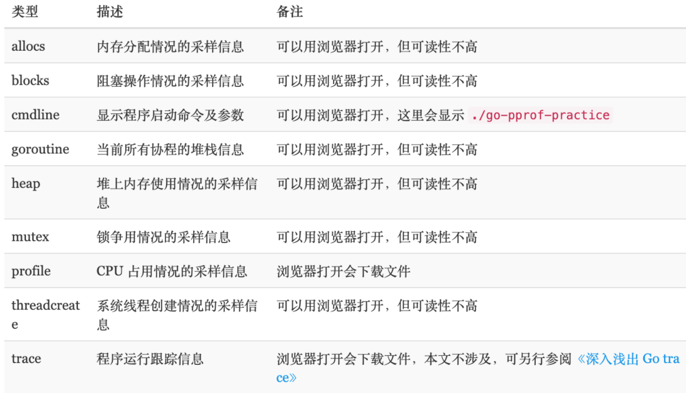
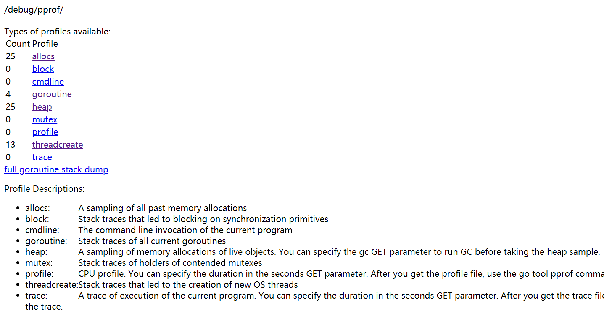
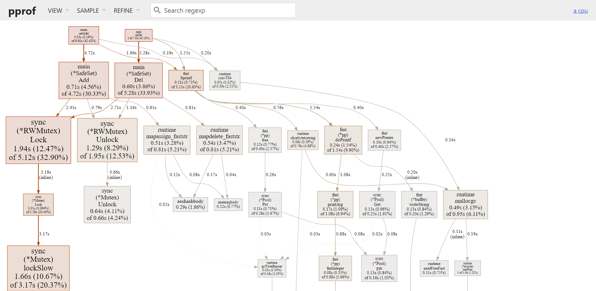
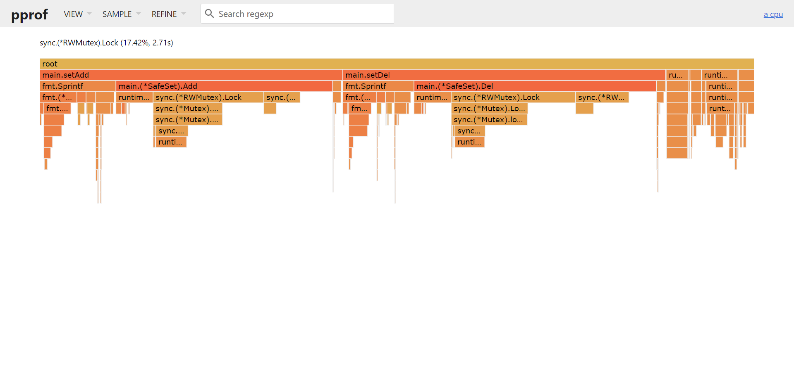
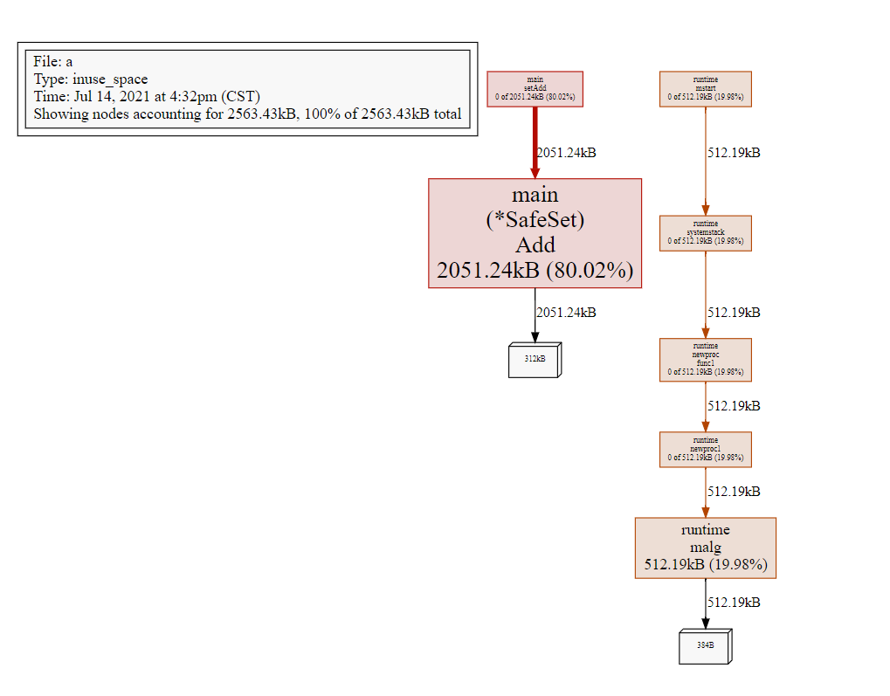
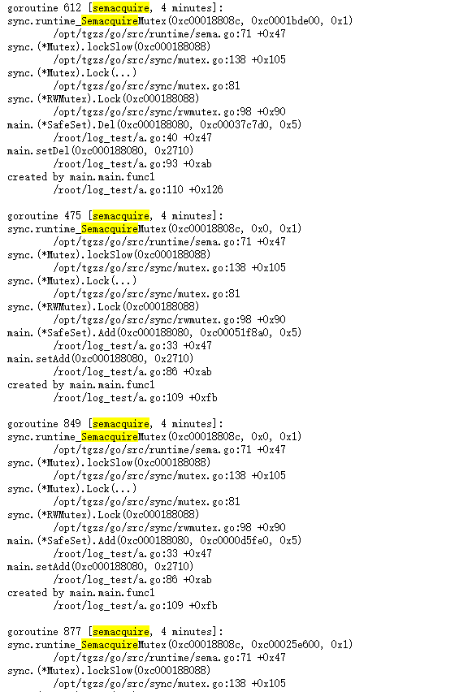
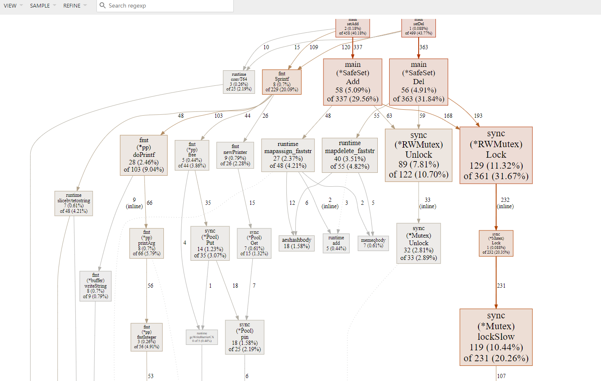

# 性能分析
- Profiling 是指在程序执行过程中，收集能够反映程序执行状态的数据
- 一般而言，性能分析主要关注 CPU、内存、磁盘 IO、网络这些指标。

## 性能分析可以从三个层次来考虑： 应用层、系统层、代码层。
- 应用层主要是梳理业务方的使用方式，让他们更合理地使用，在满足使用方需求的前提下，减少无意义的调用
- 系统层关注服务的架构，例如增加一层缓存
- 代码层则关心函数的执行效率，例如使用效率更高的算法等

# pprof
- Go 语言自带的 pprof 库就可以分析程序的运行情况，并且提供可视化的功能。它包含两个相关的库：

## runtime/pprof
- 对于只跑一次的程序，例如每天只跑一次的离线预处理程序，调用 pprof 包提供的函数，手动开启性能数据采集。

## net/http/pprof
- 对于在线服务，对于一个 HTTP Server，访问 pprof 提供的 HTTP 接口，获得性能数据。当然，实际上这里底层也是调用的 runtime/pprof 提供的函数，封装成接口对外提供网络访问。

## pprof作用
- pprof 是 Go 语言中分析程序运行性能的工具，它能提供各种性能数据：


> 主要体现下面4种实用功能
1. CPU Profiling：CPU 分析，按照一定的频率采集所监听的应用程序 CPU（含寄存器）的使用情况，可确定应用程序在主动消耗 CPU 周期时花费时间的位置
2. Memory Profiling：内存分析，在应用程序进行堆分配时记录堆栈跟踪，用于监视当前和历史内存使用情况，以及检查内存泄漏
3. Block Profiling：阻塞分析，记录 goroutine 阻塞等待同步（包括定时器通道）的位置
4. Mutex Profiling：互斥锁分析，报告互斥锁的竞争情况

## pprof 使用
- 导入不执行net/http/pprof

> pporf 包init方法自己注册path


- C:\Program Files\Go\src\net\http\pprof\pprof.go


> 之前的set map代码改造 wrongMerge方法 锁中锁

```go
package main

import (
	"fmt"
	"net/http"
	_ "net/http/pprof"
	"sync"
	"time"
)

/*
作业简单的题:实现一个线程安全的集合set，元素是string
- 要求有 NewSet方法初始化
- Add方法添加元素，添加重复元素可以去重
- Del方法删除元素
- Merge方法合并另一个set
- PrintElement 方法打印所有元素
- JudgeElement方法 检测输入的string 是否存在于set中
总之就是set相关的方法
*/
type SafeSet struct {
	m map[string]struct{}
	sync.RWMutex
}

func NewSet() *SafeSet {
	return &SafeSet{
		m: make(map[string]struct{}),
	}
}

func (ss *SafeSet) Add(key string) {
	ss.Lock()
	defer ss.Unlock()

	ss.m[key] = struct{}{}
}

func (ss *SafeSet) Del(key string) {
	ss.Lock()
	defer ss.Unlock()
	delete(ss.m, key)
}

func (ss *SafeSet) JudgeElement(key string) bool {
	ss.RLock()
	defer ss.RUnlock()
	_, ok := ss.m[key]
	return ok
}

func (ss *SafeSet) PrintElement() []string {
	ss.RLock()
	defer ss.RUnlock()
	res := make([]string, 0)
	for k := range ss.m {
		res = append(res, k)
	}
	return res
}

func (ss *SafeSet) WrongMerge(set *SafeSet) {
	ss.Lock()
	defer ss.Unlock()
	keys := set.PrintElement()
	for _, k := range keys {
		// 这里锁中锁
		ss.Add(k)
	}

}

func (ss *SafeSet) Merge(set *SafeSet) {
	ss.Lock()
	defer ss.Unlock()
	keys := set.PrintElement()
	for _, k := range keys {
		ss.m[k] = struct{}{}
	}

}

func setAdd(ss *SafeSet, n int) {
	for i := 0; i < n; i++ {
		key := fmt.Sprintf("key_%d", i)
		ss.Add(key)
	}
}

func setDel(ss *SafeSet, n int) {
	for i := 0; i < n; i++ {
		key := fmt.Sprintf("key_%d", i)
		ss.Del(key)
	}
}

func main() {
	go pprofHttp(":10000")
	s1 := NewSet()
	s2 := NewSet()
	s3 := NewSet()

	go func() {
		for {
			go setAdd(s1, 10000)
			go setDel(s1, 10000)
			go setAdd(s2, 10000)
			go setDel(s2, 10000)
			go setAdd(s3, 10000)
			go setDel(s3, 10000)
			time.Sleep(100 * time.Millisecond)

		}

	}()

	for {
		s1.Merge(s2)
		s3.WrongMerge(s1)
		time.Sleep(5 * time.Second)
	}

}

func pprofHttp(addr string) {
	err := http.ListenAndServe(addr, nil)
	if err != nil {
		fmt.Println("funcRetErr=http.ListenAndServe||err=%s", err.Error())
	}
}

```


> 访问localhost:10000/debug/pprof/





### cpu 数据
> 点击profile 点击 profile 和 trace 则会在后台进行一段时间的数据采样
- 采样完成后，返回给浏览器一个 profile 文件，之后在本地通过 go tool pprof 工具进行分析。
- go tool pprof profile
- 执行top命令
```shell script
Showing nodes accounting for 110ms, 73.33% of 150ms total
Showing top 10 nodes out of 78
      flat  flat%   sum%        cum   cum%
      20ms 13.33% 13.33%       20ms 13.33%  runtime.memmove
      10ms  6.67% 20.00%       10ms  6.67%  runtime.(*mcache).prepareForSweep
      10ms  6.67% 26.67%       10ms  6.67%  runtime.epollwait
      10ms  6.67% 33.33%       40ms 26.67%  runtime.findrunnable
      10ms  6.67% 40.00%       10ms  6.67%  runtime.funcspdelta
      10ms  6.67% 46.67%       10ms  6.67%  runtime.futex
      10ms  6.67% 53.33%       30ms 20.00%  runtime.gentraceback
      10ms  6.67% 60.00%       10ms  6.67%  runtime.madvise
      10ms  6.67% 66.67%       20ms 13.33%  runtime.nanotime (inline)
      10ms  6.67% 73.33%       10ms  6.67%  runtime.nanotime1
(pprof)


``` 

- 得到四列数据：
```shell script
列名	含义
flat	本函数的执行耗时
flat%	flat 占 CPU 总时间的比例。程序总耗时 16.22s, Eat 的 16.19s 占了 99.82%
sum%	前面每一行的 flat 占比总和
cum	累计量。指该函数加上该函数调用的函数总耗时
cum%	cum 占 CPU 总时间的比例
```

> 命令行直接发请求到页面上 交互等待

- go tool pprof localhost:10000/debug/pprof/profile?seconds=30

- Fetching profile over HTTP from http://localhost:10000/debug/pprof/profile?seconds=30

- 保存文件：Saved profile in /root/pprof/pprof.a.samples.cpu.001.pb.gz
```shell script


File: a
Type: cpu
Time: Jul 14, 2021 at 3:54pm (CST)
Duration: 30s, Total samples = 110ms ( 0.37%)
Entering interactive mode (type "help" for commands, "o" for options)

(pprof) top20
Showing nodes accounting for 110ms, 100% of 110ms total
Showing top 20 nodes out of 41
      flat  flat%   sum%        cum   cum%
      50ms 45.45% 45.45%       50ms 45.45%  runtime.futex
      10ms  9.09% 54.55%       20ms 18.18%  github.com/sirupsen/logrus.(*TextFormatter).Format
      10ms  9.09% 63.64%       10ms  9.09%  runtime.findfunc
      10ms  9.09% 72.73%       40ms 36.36%  runtime.sysmon
      10ms  9.09% 81.82%       10ms  9.09%  runtime.unlock2
      10ms  9.09% 90.91%       10ms  9.09%  runtime.usleep
      10ms  9.09%   100%       10ms  9.09%  time.Time.Format
         0     0%   100%       20ms 18.18%  github.com/rifflock/lfshook.(*LfsHook).Fire
         0     0%   100%       20ms 18.18%  github.com/rifflock/lfshook.(*LfsHook).ioWrite
         0     0%   100%       30ms 27.27%  github.com/sirupsen/logrus.(*Entry).Log
         0     0%   100%       30ms 27.27%  github.com/sirupsen/logrus.(*Entry).Logf
         0     0%   100%       20ms 18.18%  github.com/sirupsen/logrus.(*Entry).fireHooks
```

### 使用http 火焰图
> 安装作图库 
- yum -y install graphviz

> 直接生成svg文件

```shell script
go tool pprof -svg  localhost:10000/debug/pprof/heap > b.svg

```

> http直接查看

```shell script
go tool pprof --http=0.0.0.0:7777 localhost:10000/debug/pprof/profile?seconds=30
Fetching profile over HTTP from http://localhost:10000/debug/pprof/profile?seconds=30
Saved profile in /root/pprof/pprof.a.samples.cpu.002.pb.gz
Serving web UI on http://0.0.0.0:7777
http://0.0.0.0:7777

```

- 火焰图样例




> 锁中锁的问题 semacquire
- http://172.20.70.205:10000/debug/pprof/goroutine?debug=2




## prometheus pprof 
```shell script
[root@k8s-master01 log_test]# go tool pprof -http=0.0.0.0:7777 http://localhost:9090/debug/pprof/heap 
Fetching profile over HTTP from http://localhost:9090/debug/pprof/heap
Saved profile in /root/pprof/pprof.prometheus.alloc_objects.alloc_space.inuse_objects.inuse_space.001.pb.gz
Serving web UI on http://0.0.0.0:7777
http://0.0.0.0:7777

```

## pprof 真实生产实例 m3db oom问题探究
- https://zhuanlan.zhihu.com/p/183815841

