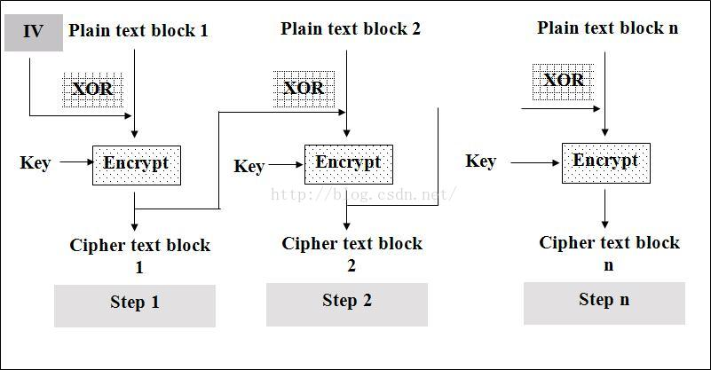
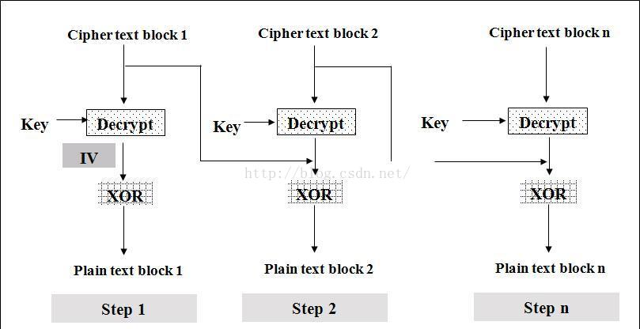

# 对称加密算法

对称加密算法用来对敏感数据等信息进行加密，常用的算法包括：

+ DES(Data Encryption Standard): 数据加密标准，速度较快，适用于加密大量数据的场合。
+ 3DES(Triple DES): 是基于DES，对一块数据用三个不同的密钥进行三次加密，强度更高。
+ AES(Advanced Encryption Standard): 高级加密标准，是下一代的加密算法标准，速度快，安全级别高
+ CBC 分组加密的四种模式之一(ECB、CBC、CFB、OFB)

对称加密又分为分组加密和序列密码。
+ 分组密码，也叫块加密(block cyphers)，一次加密明文中的一个块。是将明文按一定的位长分组，明文组经过加密运算得到密文组，密文组经过解密运算（加密运算的逆运算），还原成明文组。

+ 序列密码，也叫流加密(stream cyphers)，一次加密明文中的一个位。是指利用少量的密钥（制乱元素）通过某种复杂的运算（密码算法）产生大量的伪随机位流，用于对明文位流的加密。

## CBC

分组密码，也叫块加密(block cyphers)，一次加密明文中的一个块。是将明文按一定的位长分组，明文组经过加密运算得到密文组，密文组经过解密运算（加密运算的逆运算），还原成明文组。
序列密码，也叫流加密(stream cyphers)，一次加密明文中的一个位。是指利用少量的密钥（制乱元素）通过某种复杂的运算（密码算法）产生大量的伪随机位流，用于对明文位流的加密。
解密是指用同样的密钥和密码算法及与加密相同的伪随机位流，用以还原明文位流

分组加密算法中，有ECB,CBC,CFB,OFB这几种算法模式, 我们介绍其中常用的一种CBC

CBC(Cipher Block Chaining)/密文分组链接方式



加密步骤如下：
+ 首先将数据按照8个字节一组进行分组得到D1D2......Dn（若数据不是8的整数倍，用指定的PADDING数据补位）
+ 第一组数据D1与初始化向量I异或后的结果进行DES加密得到第一组密文C1（初始化向量I为全零）
+ 第二组数据D2与第一组的加密结果C1异或以后的结果进行DES加密，得到第二组密文C2
+ 之后的数据以此类推，得到Cn
+ 按顺序连为C1C2C3......Cn即为加密结果。

```go
// aesCBCEncrypt aes加密，填充秘钥key的16位，24,32分别对应AES-128, AES-192, or AES-256.
func aesCBCEncrypt(rawData, key []byte) ([]byte, error) {
	block, err := aes.NewCipher(key)
	if err != nil {
		return nil, err
	}

	//填充原文
	blockSize := block.BlockSize()
	rawData = pkcs7Padding(rawData, blockSize)
	//初始向量IV必须是唯一，但不需要保密
	cipherText := make([]byte, blockSize+len(rawData))
	//block大小 16
	iv := cipherText[:blockSize]
	if _, err := io.ReadFull(rand.Reader, iv); err != nil {
		return nil, err
	}

	//block大小和初始向量大小一定要一致
	mode := cipher.NewCBCEncrypter(block, iv)
	mode.CryptBlocks(cipherText[blockSize:], rawData)

	return cipherText, nil
}
```



解密是加密的逆过程，步骤如下：
+ 首先将数据按照8个字节一组进行分组得到C1C2C3......Cn
+ 将第一组数据进行解密后与初始化向量I进行异或得到第一组明文D1（注意：一定是先解密再异或）
+ 将第二组数据C2进行解密后与第一组密文数据进行异或得到第二组数据D2
+ 之后依此类推，得到Dn
+ 按顺序连为D1D2D3......Dn即为解密结果。

```go
func aesCBCDecrypt(encryptData, key []byte) ([]byte, error) {
	block, err := aes.NewCipher(key)
	if err != nil {
		return nil, err
	}

	blockSize := block.BlockSize()

	if len(encryptData) < blockSize {
		return nil, errors.New("ciphertext too short")
	}
	iv := encryptData[:blockSize]
	encryptData = encryptData[blockSize:]

	// CBC mode always works in whole blocks.
	if len(encryptData)%blockSize != 0 {
		return nil, errors.New("ciphertext is not a multiple of the block size")
	}

	mode := cipher.NewCBCDecrypter(block, iv)

	// CryptBlocks can work in-place if the two arguments are the same.
	mode.CryptBlocks(encryptData, encryptData)
	//解填充
	encryptData = pkcs7UnPadding(encryptData)
	return encryptData, nil
}
```


这里注意一点，解密的结果并不一定是我们原来的加密数据，可能还含有你补得位，一定要把补位去掉才是你的原来的数据。

特点：
+ 不容易主动攻击,安全性好于ECB,适合传输长度长的报文,是SSL、IPSec的标准。每个密文块依赖于所有的信息块, 明文消息中一个改变会影响所有密文块
+ 发送方和接收方都需要知道初始化向量 
+ 加密过程是串行的，无法被并行化(在解密时，从两个邻接的密文块中即可得到一个平文块。因此，解密过程可以被并行化)。

## DES

DES全称为Data Encryption Standard，即数据加密标准，是一种使用密钥加密的块算法，1977年被美国联邦政府的国家标准局确定为联邦资料处理标准（FIPS），并授权在非密级政府通信中使用，随后该算法在国际上广泛流传开来。

AES与3DES的比较:


| 算法名称 | 算法类型 | 密钥长度 | 速度 | 解密时间（建设机器每秒尝试255个密钥）| 资源消耗 |
|  ----  | ----  | --- | --- | --- | --- |
| AES | 对称block密码 | 128、192、256位 | 高 | 1490000亿年 |低 |
| 3DES | 对称feistel密码 | 112位或168位 | 低 | 46亿年 | 中 |

```
破解历史
历史上有三次对DES有影响的攻击实验。1997年，利用当时各国 7万台计算机，历时96天破解了DES的密钥。1998年，电子边境基金会（EFF）用25万美元制造的专用计算机，用56小时破解了DES的密钥。1999年，EFF用22小时15分完成了破解工作。因此。曾经有过卓越贡献的DES也不能满足我们日益增长的需求了。
```

## AES
2000年10月，NIST(美国国家标准和技术协会)宣布通过从15种侯选算法中选出的一项新的密匙加密标准。Rijndael被选中成为将来的AES。 Rijndael是在1999年下半年，由研究员Joan Daemen和Vincent Rijmen创建的。AES正日益成为加密各种形式的电子数据的实际标准。
并于2002年5月26日制定了新的高级加密标准 (AES) 规范。

```
算法原理

AES算法基于排列和置换运算。排列是对数据重新进行安排，置换是将一个数据单元替换为另一个。AES 使用几种不同的方法来执行排列和置换运算。
AES是一个迭代的、对称密钥分组的密码，它可以使用128、192 和 256 位密钥，并且用 128 位（16字节）分组加密和解密数据。与公共密钥密码使用密钥对不同，对称密钥密码使用相同的密钥加密和解密数据。通过分组密码返回的加密数据的位数与输入数据相同。迭代加密使用一个循环结构，在该循环中重复置换和替换输入数据。
```

综上看来AES安全度最高, 基本现状就是AES已经替代DES成为新一代对称加密的标准, 下面是Golang中AES使用的栗子

```go
package main
import (
	"crypto/aes"
	"crypto/cipher"
	"fmt"
)
var commonIV = []byte{0x00, 0x01, 0x02, 0x03, 0x04, 0x05, 0x06, 0x07, 0x08, 0x09, 0x0a, 0x0b, 0x0c, 0x0d, 0x0e, 0x0f}
func encrypt(plainText string, keyText string) (cipherByte []byte, err error) {
	// 转换成字节数据, 方便加密
	plainByte := []byte(plainText)
	keyByte := []byte(keyText)
	// 创建加密算法aes
	c, err := aes.NewCipher(keyByte)
	if err != nil {
		return nil, err
	}
	//加密字符串
	cfb := cipher.NewCFBEncrypter(c, commonIV)
	cipherByte = make([]byte, len(plainByte))
	cfb.XORKeyStream(cipherByte, plainByte)
	return
}
func decrypt(cipherByte []byte, keyText string) (plainText string, err error) {
	// 转换成字节数据, 方便加密
	keyByte := []byte(keyText)
	// 创建加密算法aes
	c, err := aes.NewCipher(keyByte)
	if err != nil {
		return "", err
	}
	// 解密字符串
	cfbdec := cipher.NewCFBDecrypter(c, commonIV)
	plainByte := make([]byte, len(cipherByte))
	cfbdec.XORKeyStream(plainByte, cipherByte)
	plainText = string(plainByte)
	return
}
func main() {
	plain := "The text need to be encrypt."
	// AES 规定有3种长度的key: 16, 24, 32分别对应AES-128, AES-192, or AES-256
	key := "abcdefgehjhijkmlkjjwwoew"
	// 加密
	cipherByte, err := encrypt(plain, key)
	if err != nil {
		fmt.Println(err)
	}
	fmt.Printf("%s ==> %x\n", plain, cipherByte)
	// 解密
	plainText, err := decrypt(cipherByte, key)
	if err != nil {
		fmt.Println(err)
	}
	fmt.Printf("%x ==> %s\n", cipherByte, plainText)
}
```


