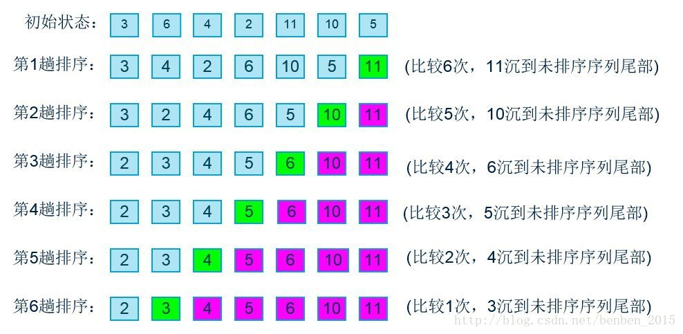

# 算法的评估

算法（Algorithm）是指用来操作数据、解决程序问题的一组方法。上一小节我们实现了一个插入排序的算法, 当然排序还有很多算法: 
+ 冒泡排序: 两个数比较大小，较大的数下沉，较小的数冒起来
+ 选择排序: 在长度为N的无序数组中，第一次遍历n-1个数，找到最小的数值与第一个元素交换，第二次遍历n-2个数，找到最小的数值与第二个元素交换。。。第n-1次遍历，找到最小的数值与第n-1个元素交换，排序完成
+ 插入排序: 在要排序的一组数中，假定前n-1个数已经排好序，现在将第n个数插到前面的有序数列中，使得这n个数也是排好顺序的。如此反复循环，直到全部排号顺序
+ 快速排序: 快速排序是对冒泡排序的一种改进，也属于交换类的排序算法
+ 其他

## 排序算法

我们挑选一个最简单的冒泡排序来实现 然后对比他们性能:

+ 冒泡排序
+ 选择排序
+ 插入排序
+ 内置排序


### 冒泡排序

基本思想：两个数比较大小，较大的数下沉，较小的数冒起来。具体如下图所示




定义我们需要实现的排序算法函数的名称:
```go
func BubbleSort(numbers []int) []int {
    ...
}
```

编写测试用例:
```go
func TestBubbleSort(t *testing.T) {
	should := assert.New(t)

	raw := []int{3, 6, 4, 2, 11, 10, 5}
	target := sort.BubbleSort(raw)

	should.Equal([]int{2, 3, 4, 5, 6, 10, 11}, target)
}
```

接下来大家思考5分钟, 看看能不能自己实现


1. 先编写比较的流程
```go
func BubbleSort(numbers []int) []int {
	for i := range numbers {
		for j := 0; j < len(numbers)-1; j++ {
			// 当前值 numbers[i], 后一个值是多少 numbers[j+1]
			fmt.Printf("数据: 当前: %d, 比对: %d\n", numbers[j], numbers[j+1])
		}
		fmt.Printf("第%d趟: \n", i+1)
	}
	return numbers
}
```

看下比对流程是否正确:
```go
数据: 当前: 3, 比对: 6
数据: 当前: 6, 比对: 4
数据: 当前: 4, 比对: 2
数据: 当前: 2, 比对: 11
数据: 当前: 11, 比对: 10
数据: 当前: 10, 比对: 5
第1趟:
数据: 当前: 3, 比对: 6
数据: 当前: 6, 比对: 4
数据: 当前: 4, 比对: 2
数据: 当前: 2, 比对: 11
数据: 当前: 11, 比对: 10
数据: 当前: 10, 比对: 5
第2趟:
数据: 当前: 3, 比对: 6
数据: 当前: 6, 比对: 4
数据: 当前: 4, 比对: 2
数据: 当前: 2, 比对: 11
数据: 当前: 11, 比对: 10
数据: 当前: 10, 比对: 5
第3趟:
数据: 当前: 3, 比对: 6
数据: 当前: 6, 比对: 4
数据: 当前: 4, 比对: 2
数据: 当前: 2, 比对: 11
数据: 当前: 11, 比对: 10
数据: 当前: 10, 比对: 5
第4趟:
数据: 当前: 3, 比对: 6
数据: 当前: 6, 比对: 4
数据: 当前: 4, 比对: 2
数据: 当前: 2, 比对: 11
数据: 当前: 11, 比对: 10
数据: 当前: 10, 比对: 5
第5趟:
数据: 当前: 3, 比对: 6
数据: 当前: 6, 比对: 4
数据: 当前: 4, 比对: 2
数据: 当前: 2, 比对: 11
数据: 当前: 11, 比对: 10
数据: 当前: 10, 比对: 5
第6趟:
数据: 当前: 3, 比对: 6
数据: 当前: 6, 比对: 4
数据: 当前: 4, 比对: 2
数据: 当前: 2, 比对: 11
数据: 当前: 11, 比对: 10
数据: 当前: 10, 比对: 5
第7趟:
```

2. 然后我们补充交换逻辑:

```go
func BubbleSort(numbers []int) []int {
	for i := range numbers {
		for j := 0; j < len(numbers)-1; j++ {
			// 当前值 numbers[i], 后一个值是多少 numbers[j+1]
			fmt.Printf("数据: 当前: %d, 比对: %d\n", numbers[j], numbers[j+1])

			// 比较2个数, 交换顺序, 大数沉底, 小数冒出
			if numbers[j+1] < numbers[j] {
				numbers[j], numbers[j+1] = numbers[j+1], numbers[j]
			}
		}
		fmt.Printf("第%d趟: %v\n", i+1, numbers)
	}
	return numbers
}
```

查看比较逻辑
```go
数据: 当前: 3, 比对: 6
数据: 当前: 6, 比对: 4
数据: 当前: 6, 比对: 2
数据: 当前: 6, 比对: 11
数据: 当前: 11, 比对: 10
数据: 当前: 11, 比对: 5
第1趟: [3 4 2 6 10 5 11]
数据: 当前: 3, 比对: 4
数据: 当前: 4, 比对: 2
数据: 当前: 4, 比对: 6
数据: 当前: 6, 比对: 10
数据: 当前: 10, 比对: 5
数据: 当前: 10, 比对: 11
第2趟: [3 2 4 6 5 10 11]
数据: 当前: 3, 比对: 2
数据: 当前: 3, 比对: 4
数据: 当前: 4, 比对: 6
数据: 当前: 6, 比对: 5
数据: 当前: 6, 比对: 10
数据: 当前: 10, 比对: 11
第3趟: [2 3 4 5 6 10 11]
数据: 当前: 2, 比对: 3
数据: 当前: 3, 比对: 4
数据: 当前: 4, 比对: 5
数据: 当前: 5, 比对: 6
数据: 当前: 6, 比对: 10
数据: 当前: 10, 比对: 11
第4趟: [2 3 4 5 6 10 11]
数据: 当前: 2, 比对: 3
数据: 当前: 3, 比对: 4
数据: 当前: 4, 比对: 5
数据: 当前: 5, 比对: 6
数据: 当前: 6, 比对: 10
数据: 当前: 10, 比对: 11
第5趟: [2 3 4 5 6 10 11]
数据: 当前: 2, 比对: 3
数据: 当前: 3, 比对: 4
数据: 当前: 4, 比对: 5
数据: 当前: 5, 比对: 6
数据: 当前: 6, 比对: 10
数据: 当前: 10, 比对: 11
第6趟: [2 3 4 5 6 10 11]
数据: 当前: 2, 比对: 3
数据: 当前: 3, 比对: 4
数据: 当前: 4, 比对: 5
数据: 当前: 5, 比对: 6
数据: 当前: 6, 比对: 10
数据: 当前: 10, 比对: 11
第7趟: [2 3 4 5 6 10 11]
```


### 选择排序

基本思想：在长度为N的无序数组中，第一次遍历n-1个数，找到最小的数值与第一个元素交换，第二次遍历n-2个数，找到最小的数值与第二个元素交换。。。第n-1次遍历，找到最小的数值与第n-1个元素交换，排序完成


定义我们需要实现的排序算法函数的名称:
```go
func SelectSort(numbers []int) []int {
	...
}
```

编写测试用例
```go
func TestSelectSort(t *testing.T) {
	should := assert.New(t)

	raw := []int{3, 6, 4, 2, 11, 10, 5}
	target := sort.SelectSort(raw)

	should.Equal([]int{2, 3, 4, 5, 6, 10, 11}, target)
}
```

接下来大家思考5分钟, 看看能不能自己实现


1. 我们先编写数据比较流程

```go
func SelectSort(numbers []int) []int {
	for i := range numbers {
		// 拿到第一个的数, 就是numbers[i], 比如 3
		fmt.Printf("第%d趟: %d\n", i+1, numbers[i])

		// 后后面的数依次比较
		for j := i + 1; j < len(numbers); j++ {
			fmt.Printf("  当前数据: %d, 比对数据: %d\n", numbers[i], numbers[j])
		}
	}
	return numbers
}
```

看下参与比对的数据是否正确:
```
第1趟: 3
  当前数据: 3, 比对数据: 6
  当前数据: 3, 比对数据: 4
  当前数据: 3, 比对数据: 2
  当前数据: 3, 比对数据: 11
  当前数据: 3, 比对数据: 10
  当前数据: 3, 比对数据: 5
第2趟: 6
  当前数据: 6, 比对数据: 4
  当前数据: 6, 比对数据: 2
  当前数据: 6, 比对数据: 11
  当前数据: 6, 比对数据: 10
  当前数据: 6, 比对数据: 5
第3趟: 4
  当前数据: 4, 比对数据: 2
  当前数据: 4, 比对数据: 11
  当前数据: 4, 比对数据: 10
  当前数据: 4, 比对数据: 5
第4趟: 2
  当前数据: 2, 比对数据: 11
  当前数据: 2, 比对数据: 10
  当前数据: 2, 比对数据: 5
第5趟: 11
  当前数据: 11, 比对数据: 10
  当前数据: 11, 比对数据: 5
第6趟: 10
  当前数据: 10, 比对数据: 5
第7趟: 5
```

2. 然后我们补上交换的逻辑
```go
func SelectSort(numbers []int) []int {
	for i := range numbers {
		// 拿到第一个的数, 就是numbers[i], 比如 3
		fmt.Printf("第%d趟: %d\n", i+1, numbers[i])

		// 依次和后面相邻的数比较
		for j := i + 1; j < len(numbers); j++ {
			fmt.Printf("数据 -->  当前数据: %d, 比对数据: %d\n", numbers[i], numbers[j])
			if numbers[i] > numbers[j] {
				// 如果当前数 > 后面的数据, 则交换位置
				numbers[i], numbers[j] = numbers[j], numbers[i]
				fmt.Printf("交换 -->  当前数据: %d, 比对数据: %d\n", numbers[i], numbers[j])
			}
		}

		fmt.Println("结果: ", numbers)
	}

	fmt.Println("最终结果", numbers)
	return numbers
}
```

再次看排序过程
```go
第1趟: 3
数据 -->  当前数据: 3, 比对数据: 6
数据 -->  当前数据: 3, 比对数据: 4
数据 -->  当前数据: 3, 比对数据: 2
交换 -->  当前数据: 2, 比对数据: 3
数据 -->  当前数据: 2, 比对数据: 11
数据 -->  当前数据: 2, 比对数据: 10
数据 -->  当前数据: 2, 比对数据: 5
结果:  [2 6 4 3 11 10 5]
第2趟: 6
数据 -->  当前数据: 6, 比对数据: 4
交换 -->  当前数据: 4, 比对数据: 6
数据 -->  当前数据: 4, 比对数据: 3
交换 -->  当前数据: 3, 比对数据: 4
数据 -->  当前数据: 3, 比对数据: 11
数据 -->  当前数据: 3, 比对数据: 10
数据 -->  当前数据: 3, 比对数据: 5
结果:  [2 3 6 4 11 10 5]
第3趟: 6
数据 -->  当前数据: 6, 比对数据: 4
交换 -->  当前数据: 4, 比对数据: 6
数据 -->  当前数据: 4, 比对数据: 11
数据 -->  当前数据: 4, 比对数据: 10
数据 -->  当前数据: 4, 比对数据: 5
结果:  [2 3 4 6 11 10 5]
第4趟: 6
数据 -->  当前数据: 6, 比对数据: 11
数据 -->  当前数据: 6, 比对数据: 10
数据 -->  当前数据: 6, 比对数据: 5
交换 -->  当前数据: 5, 比对数据: 6
结果:  [2 3 4 5 11 10 6]
第5趟: 11
数据 -->  当前数据: 11, 比对数据: 10
交换 -->  当前数据: 10, 比对数据: 11
数据 -->  当前数据: 10, 比对数据: 6
交换 -->  当前数据: 6, 比对数据: 10
结果:  [2 3 4 5 6 11 10]
第6趟: 11
数据 -->  当前数据: 11, 比对数据: 10
交换 -->  当前数据: 10, 比对数据: 11
结果:  [2 3 4 5 6 10 11]
第7趟: 11
结果:  [2 3 4 5 6 10 11]
最终结果 [2 3 4 5 6 10 11]
```

### 插入排序

为了方便测试我们补充一个NumberStack的初始化方法:
```go
func NewNumberStack(numbers []int) *Stack {
	items := make([]Item, 0, len(numbers))
	for i := range numbers {
		items = append(items, numbers[i])
	}
	return &Stack{
		items: items,
	}
}
```

### 内置排序

go 内置提供了sort函数, 用于对象的排序, 参与排序的对象必须实现比较方法(接口设计的真的吊: 排序的核心逻辑: 比较 交由用户自己定义)
```go
// Sort sorts data.
// It makes one call to data.Len to determine n and O(n*log(n)) calls to
// data.Less and data.Swap. The sort is not guaranteed to be stable.
func Sort(data Interface) {
    ...
}
```

我们自己实现一个IntSlice结构
```go
func NewIntSlice(numbers []int) IntSlice {
	return IntSlice(numbers)
}

type IntSlice []int

func (s IntSlice) Len() int { return len(s) }

func (s IntSlice) Swap(i, j int) { s[i], s[j] = s[j], s[i] }

func (s IntSlice) Less(i, j int) bool { return s[i] < s[j] }
```

然后提供一个比较函数:
```go
func BuildInSort(numbers []int) []int {
	sort.Sort(IntSlice(numbers))
	return numbers
}
```

## 性能测试

我们通过上面的结果可以知道: 对于同一个问题，使用不同的算法，也许最终得到的结果是一样的，但在过程中消耗的资源和时间却会有很大的区别, 那么我们应该如何去衡量不同算法之间的优劣呢? 


1. 准备用于排序的测试数据, 这里我们随机生成
```go
func generateRandomArray(arrayLen int) []int {
	var a []int
	for i := 0; i < arrayLen; i++ {
		a = append(a, rand.Intn(MAX_RAND_LIMIT))
	}
	return a
}
```

2. 编写冒泡排序的 性能测试用例, 由于我们要分别测试 100 1000 10000 个的排序时间, 我们抽象一个基础函数
```go
func benchmarkBubbleSort(i int, b *testing.B) {
	a := generateRandomArray(i)
	sort.BubbleSort(a)
}
```

3. 编写不通数据量下的性能测试用例
```go
func BenchmarkBubbleSort100(b *testing.B) {
	benchmarkBubbleSort(100, b)
}

func BenchmarkBubbleSort1000(b *testing.B) {
	benchmarkBubbleSort(1000, b)
}

func BenchmarkBubbleSort10000(b *testing.B) {
	benchmarkBubbleSort(10000, b)
}
```

4. 依次类推,  为其他排序算法编写基准测试
```go
func benchmarkSelectSortSort(i int, b *testing.B) {
    ...
}

func benchmarkInsertSortSort(i int, b *testing.B) {
    ...
}

func benchmarkBuildInSort(i int, b *testing.B) {
    ...
}
```

5. 开始我们的性能测试

```
goos: darwin
goarch: amd64
pkg: gitee.com/infraboard/go-course/day9/sort
cpu: Intel(R) Core(TM) i5-1038NG7 CPU @ 2.00GHz
BenchmarkBubbleSort100
BenchmarkBubbleSort100-8      	1000000000	         0.0000288 ns/op	       0 B/op	       0 allocs/op
BenchmarkBubbleSort1000
BenchmarkBubbleSort1000-8     	1000000000	         0.001025 ns/op	       0 B/op	       0 allocs/op
BenchmarkBubbleSort10000
BenchmarkBubbleSort10000-8    	1000000000	         0.09919 ns/op	       0 B/op	       0 allocs/op
BenchmarkSelectSort100
BenchmarkSelectSort100-8      	1000000000	         0.0000468 ns/op	       0 B/op	       0 allocs/op
BenchmarkSelectSort1000
BenchmarkSelectSort1000-8     	1000000000	         0.001055 ns/op	       0 B/op	       0 allocs/op
BenchmarkSelectSort10000
BenchmarkSelectSort10000-8    	1000000000	         0.1701 ns/op	       0 B/op	       0 allocs/op
BenchmarkInsertSort100
BenchmarkInsertSort100-8      	1000000000	         0.0000355 ns/op	       0 B/op	       0 allocs/op
BenchmarkInsertSort1000
BenchmarkInsertSort1000-8     	1000000000	         0.001236 ns/op	       0 B/op	       0 allocs/op
BenchmarkInsertSort10000
BenchmarkInsertSort10000-8    	1000000000	         0.1243 ns/op	       0 B/op	       0 allocs/op
BenchmarkBuildInSort100
BenchmarkBuildInSort100-8     	1000000000	         0.0000118 ns/op	       0 B/op	       0 allocs/op
BenchmarkBuildInSort1000
BenchmarkBuildInSort1000-8    	1000000000	         0.0001378 ns/op	       0 B/op	       0 allocs/op
BenchmarkBuildInSort10000
BenchmarkBuildInSort10000-8   	1000000000	         0.001570 ns/op	       0 B/op	       0 allocs/op
```

## 算法评估的维度

主要还是从算法所占用的「时间」和「空间」两个维度去考量。

+ 时间维度：是指执行当前算法所消耗的时间，我们通常用「时间复杂度」来描述, 可以估算出程序对处理器的使用程度。
+ 空间维度：是指执行当前算法需要占用多少内存空间，我们通常用「空间复杂度」来描述, 可以估算出程序对计算机内存的使用程度


在实践中或面试中，我们不仅要能够写出具体的算法来，还要了解算法的时间复杂度和空间复杂度，
这样才能够评估出算法的优劣。当时间复杂度和空间复杂度无法同时满足时，还需要从中选取一个平衡点

### 时间复杂度

要获得算法的时间复杂度，最直观的想法是把算法程序运行一遍，自然可以获得, 

算法写完后, 逻辑就固定了, 那影响其执行时长的关键是什么? 对，是数据的规模, 因此我们可以将其抽象成一个函数用于描述 算法执行时间, 数据规模 的关系, 我们如何描述这个关系?

1. 时间频度: T(n)
通常，一个算法所花费的时间与代码语句执行的次数成正比，算法执行语句越多，消耗的时间也就越多。我们把一个算法中的语句执行次数称为时间频度，记作T(n)

在时间频度T(n)中，n代表着问题的规模，当n不断变化时，T(n)也会不断地随之变化。那么，如果我们想知道T(n)随着n变化时会呈现出什么样的规律，那么就需要引入时间复杂度的概念

2. 渐进时间复杂度

一般情况下，算法基本操作的重复执行次数为问题规模n的某个函数，也就是用时间频度T(n)表示。如果存在某个函数f(n)，使得当n趋于无穷大时，T(n)/f(n)的极限值是不为零的常数，那么f(n)是T(n)的同数量级函数，记作T(n)=O(f(n))，称O(f(n))为算法的渐进时间复杂度，简称为时间复杂度。

渐进时间复杂度用大写O表示，所以也称作大O表示法。

```
算法的时间复杂度函数为：T(n)=O(f(n))；
```

记不住,没关系， 我们可以简单的理解为 你数据规模(n) 和你 算法执行的基础操作的此时 的一个关系, 如下图:


上图为不同类型的函数的增长趋势图，随着问题规模n的不断增大，上述时间复杂度不断增大，算法的执行效率越低。

值得留意的是，算法复杂度只是描述算法的增长趋势，并不能说一个算法一定比另外一个算法高效。这要添加上问题规模n的范围，在一定问题规范范围之前某一算法比另外一算法高效，而过了一个阈值之后，情况可能就相反了，通过上图我们可以明显看到这一点。这也就是为什么我们在实践的过程中得出的结论可能上面算法的排序相反的原因

我们根据这个曲线可以简单评估出, 但数据量趋紧无无穷时，谁的效率高:
常见的算法时间复杂度由小到大依次为：Ο(1)＜Ο(log n)＜Ο(n)＜Ο(nlog n)＜Ο(n2)＜Ο(n3)＜…＜Ο(2^n)＜Ο(n!)。


#### 常数阶O(1)
无论代码执行了多少行，只要是没有循环等复杂结构，那这个代码的时间复杂度就都是O(1)

这里我们需要注意的是，即便代码有成千上万行，只要执行算法的时间不会随着问题规模n的增长而增长，那么执行时间只不过是一个比较大的常数而已。此类算法的时间复杂度均为O(1)


也就是耗时/耗空间与输入数据大小无关，无论输入数据增大多少倍，耗时/耗空间都不变。 哈希算法就是典型的O(1)
```go
// 当我们需要查找某个元素时, 都可以一次性的找到,  而数组就不行
a := map[string]string
a["key1"]
```

#### 对数阶O(log n)

当数据增大n倍时，耗时增大logn倍（这里的log是以2为底的，比如，当数据增大256倍时，耗时只增大8倍，是比线性还要低的时间复杂度）。

```go
// 典型算法: 二分查找就是O(logn)的算法，每找一次排除一半的可能，256个数据中查找只要找8次就可以找到目标
int i = 1; // ①
for (i <= n) {
   i = i * 2; // ②
}
```


#### 线性阶O(n)

就代表数据量增大几倍，耗时也增大几倍。比如常见的遍历算法

```go
array, 链表 等线性数据结构，元素查找效率基本都是线性的
```

#### 线性对数阶O(nlogN)

就是n乘以logn，当数据增大256倍时，耗时增大256*8=2048倍。这个复杂度高于线性低于平方。归并排序就是O(nlogn)的时间复杂度

```go
// 一次循环基准一个O(n)
// 内部再进行2分  logn
// O(nlongN)

for (int m = 1; m < n; m++) {
   int i = 1; // ①
   while (i <= n) {
      i = i * 2; // ②
   }
}
```

#### 平方阶O(n²)

就代表数据量增大n倍时，耗时增大n的平方倍，这是比线性更高的时间复杂度。

平方阶可对照线性阶来进行理解，我们知道线性阶是一层for循环，记作O(n)，此时等于又嵌套了一层for循环，那么便是n * O(n)，也就是O(n * n)，即O(n^2)

```go
// 比如冒泡排序，就是典型的O(n2)的算法，对n个数排序，需要扫描n×n次
// 因为冒泡, 没增加一个数据，就需要对整个队列进行重新排序

int k = 0;
for (int i = 0; i < n; i++) {
   for (int j = 0; j < n; j++) {
      k++;
   }
}
```

同理，立方阶O(n³)、K次方阶O(n^k)，只不过是嵌套了3层循环、k层循环而已


### 空间复杂度

空间复杂度主要指执行算法所需内存的大小, 用于对程序运行过程中所需要的临时存储空间的度量。


#### 空间复杂度 O(1)

简单里面就是不开辟额外空间, 程序运行时，使用的空间是个常数

比如上面的 冒泡排序，选择排序, 等都是是O(1), 大家说说上面stack排序, 是不是O(1)的

#### 空间复杂度 O(n)

程序使用的额外空间, 这个额外空间的大小和数据规模成线性关系, 比如Map 的空间负责度 就介于0(1) ~ O(n),
因为不会一个元素就开辟一个bucket

```go
int j = 0;
int[] m = new int[n];
for (int i = 1; i <= n; ++i) {
   j = i;
   j++;
}
```

## 总结

+ 4种排序算法
+ 基准测试, 评估算法时间复杂度和空间复杂度
+ 时间复杂度
+ 空间复杂度 

## 参考

+ [golang实现常用排序算法](https://blog.csdn.net/benben_2015/article/details/79231929)
+ [排序算法-快速排序](https://segmentfault.com/a/1190000022288936)
+ [golang 写个快速排序](https://www.jianshu.com/p/7a7ad3af5e25)
+ [时间复杂度与空间复杂度的计算](https://cloud.tencent.com/developer/article/1769988)
+ [算法的时间与空间复杂度](https://zhuanlan.zhihu.com/p/50479555)