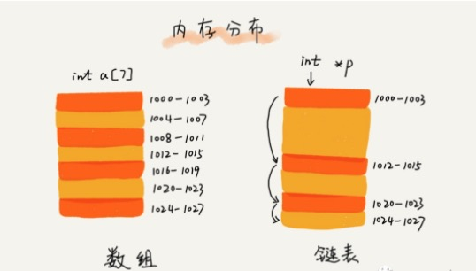

# 数据结构之链表

场景: 我们有100个对象需要存储, 最简单的方式是直接使用Array
```go
var store = [100]*T{}
// 存储
store[0] = OBJ
// 变量
for i := range store
```
我不知道需要存多少个, 可能100 也可能200 或者更多喃?

使用切片:
```go
var store = []*T{}
// 追加
store = append(store, *T)
// 访问
for i := range store
```
如果有人要插队, 比如我要在 index2 和 index3 中间插入一个元素?

使用切片来处理插入
```go
var store = []*T{OJB1, OJB2, OBJ3}

// 此时我需要把OJB4 插入到 OJB2 和 OBJ3直接
// 1. 获取之前的和或者之后的
newStore = store = []*T{}

// 拷贝第一部分
newStore = append(newStore, store[:2])

// 2. 添加插入的元素
newStore = append(newStore, OBJ4)
// 3. 拷贝之后的
newStore = append(newStore, store[2:])

// 当然你可以简洁的写成这样
newStore = append(store[:2]..., OBJ4, store[2:]...)
```

我们可以看到 我们插入的位置，会导致后面的数据都往后移动一位, 假设我们有1亿条数据, 我要插入到第一个, 可以想象这个效率会有多低(如果你的场景是从一头那数据，那么栈更高效)

同理删除也一样, 那我们如何改进?

思考:

由于slice底层使用数组存储元素, 受限于数组的内存结构(连续内存空间):
```
A + SIZE --> B + SIZE --> C + SIZE ---> D ....
``` 

那如果我们插入一个元素理论上应该是啥样的最直接, 比如插入F 到 AB之间: 修改A指向 F, 然后F 指向 B
```
A                  --->  B       -->  C      --> D
A + P->   F +P    ->     B            C          D
```

我们使用一个指向来描述前面一个元素和后面一个元素的关系, 这就是链表


## 链表

链表是一种数据结构，和数组不同，链表并不需要一块连续的内存空间，它通过「指针」将一组零散的内存块串联起来使用



## 单向链表

在底层结构上，单向链表通过指针将一组零散的内存块串联在一起。其中，我们把内存块称为链表的“结点”(Node)。为了将所有的结点串起来，每个链表的结点除了存储数据之外，还需要记录链上的下一个结点的地址。如下图所示，我们把这个记录下个结点地址的指针叫作后继指针 next


### 设计基础版链表

基础版的功能很简单:
+ 能往链表里面添加节点
+ 可以遍历整个链表

> 测试用例
```go
func TestListBasic(t *testing.T) {
	l := list.NewIntList(1)
	l.AddNode(list.NewIntNode(2))
	l.AddNode(list.NewIntNode(3))
	l.AddNode(list.NewIntNode(4))
	l.Traverse(func(n *list.Node){
        ...
    })
}
```

接下来我们开始设计我们链表:

1. 我们先定义Node数据结构
```go
func NewIntNode(v int) *Node {
	return &Node{Value: v}
}

// 定义节点
type Node struct {
    // 存储你需要存储的数据
    Value interface{}
    // 下一跳的指向
    Next  *Node
}
```

2. 然后定义链表结构
```go
func NewIntList(headValue int) *List {
    // 链表的头
	head := &Node{Value: headValue}
	return &List{
		head: head,
	}
}

type List struct {
	head *Node
}
```

3. 实现添加元素的功能
```go
func (l *List) AddNode(n *Node) {
	// 我需要找到尾节点
	next := l.head.Next
	for next.Next != nil {
		next = next.Next
	}

	// 修改为节点
	next.Next = n
}
```

4. 实现遍历的功能

```go
func (l *List) Traverse(fn func(n *Node)) {
	n := l.head
	for n.Next != nil {
		fn(n)
		n = n.Next
	}

	fn(n)
	fmt.Println()
}
```

到次我们基础版功能实现完成:
```
1 --> 2 --> 3 --> 4
```

但是我们的链表还不支持插入和删除操作

### 完善链表

完善版的需求1:
+ 可以插入到指定Node的后面, (思考: 为什么不是前面?)

1. 定义骨架
```go
func (l *List) InsertAfter(after, current *Node) error {
	return nil
}

func (l *List) Remove(current *Node) error {
	return nil
}
```

2. 编写测试用例
```go
func PrintNode(n *list.Node) {
	if n.Next != nil {
		fmt.Printf("%d --> ", n.Value)
	} else {
		fmt.Printf("%d", n.Value)
	}
}

func TestListRich(t *testing.T) {
	l := list.NewIntList(1)
	n2, n3, n4 := list.NewIntNode(2), list.NewIntNode(3), list.NewIntNode(4)
	l.AddNode(n2)
	l.AddNode(n3)
	l.AddNode(n4)
	l.Traverse(PrintNode)

	// 测试插入
	l.InsertAfter(n2, list.NewIntNode(20))
	l.Traverse(PrintNode)
}
```

3. 实现逻辑

这个简单了，我的亲, 掐指一算就出来了(5分钟)


```go
func (l *List) InsertAfter(after, current *Node) error {
	// 假设我们已经插入，他数据结构应该是啥样的
	// after --> current --> after_next

	// 保存下之前的after next
	afterNext := after.Next

	// 插入，修改指向
	after.Next = current
	current.Next = afterNext
	return nil
}
```


### 单向链表无法高效解决的问题

由于单向链表的情况下(单方向的), 要获取之前Node 需要遍历整个List, 非常的低效, 所以以下功能并没有在单向链表中实现:
+ 插入到指定Node的前面 
+ 删除链表中的元素 

要高效解决这个问题，我们需要一个Previos指针, 直接知道前一个Node的信息, 而不是遍历

## 双向链表

单向链表只有一个方向，结点只有一个后继指针 next 指向后面的结点。而双向链表，顾名思义，它支持两个方向，每个结点不止有一个后继指针 next 指向后面的结点，还有一个前驱指针 prev 指向前面的结点


从上图中可以看出来，双向链表相比于单向链表需要额外增加一个空间来保存前驱结点的地址。所以，如果存储同样多的数据，双向链表要比单链表占用更多的内存空间。虽然多了一个指针比较浪费存储空间，但可以支持双向遍历，这样也带来了双向链表操作的灵活性

接下来我们改造单向链表为双向链表
```go
// 定义节点
type Node struct {
	// 存储你需要存储的数据
	Value interface{}
	// 下一跳的指向
	Next *Node
	// 上一跳
	Prev *Node
}
```


补充我们需要实现的功能:
```go
func (l *List) InsertBefore(before, current *Node) error {
	return nil
}

func (l *List) Remove(current *Node) error {
	return nil
}
```

添加测试用例
```go
func TestListWithPre(t *testing.T) {
	l := list.NewIntList(1)
	n2, n3, n4 := list.NewIntNode(2), list.NewIntNode(3), list.NewIntNode(4)
	l.AddNode(n2)
	l.AddNode(n3)
	l.AddNode(n4)
	l.Traverse(PrintNode)

	// 测试插入
	l.InsertAfter(n2, list.NewIntNode(20))
	l.Traverse(PrintNode)

	// 测试删除
	l.Remove(n3)
	l.Traverse(PrintNode)
}
```

这个简单了，我的亲, 掐指一算就出来了(5分钟)


这样行不行?
```go
func (l *List) InsertBefore(before, current *Node) error {
	// 假设我们已经插入，他数据结构应该是啥样的
	// before --> current --> before_next

	// 保存下之前的before next
	beforeNext := before.Prev

	// 插入，修改指向
	before.Next = current
	current.Next = beforeNext
	return nil
}

func (l *List) Remove(current *Node) error {
	// before --> current --> before_next
	prev := current.Prev
	prev.Next = current.Next
	return nil
}
```

我们忘了添加元素时，我还需要出来prev指针的指向:

```go
func (l *List) AddNode(n *Node) {
    ...
	// 补充Previos指针
	n.Prev = next
}
func (l *List) InsertAfter(after, current *Node) error {
    ...
	// 补充Previos指针
	// after <-- current <-- after_next
	current.Prev = after
	afterNext.Prev = current
	return nil
}

func (l *List) InsertBefore(before, current *Node) error {
    ...
	// 补充Previos指针
	// before <-- current <-- before_next
	current.Prev = before
	beforeNext.Prev = current
	return nil
}
```

再次测试我们的功能可以正常了
```
1 --> 2 --> 3 --> 4
1 --> 2 --> 20 --> 3 --> 4
1 --> 2 --> 20 --> 4
```


## 循环链表

其实就是将头节点的前趋指针指向尾节点，将尾节点的后驱指针指向头节点


他也是一个环了(Ring), 可以正向转和反向转, 这个生活中的场景就很多了

+ 钟表
+ 听歌时的无线循环
+ 广告的无限轮播


让我们把双向变成循环:
```go
// 变身成环
func (l *List) ChangeToRing() {
	// 我需要找到尾节点
	next := l.head
	for next.Next != nil {
		next = next.Next
	}

	head, tail := l.head, next

	// head  -->  tail
	head.Prev = tail
	// head  <--  tail
	tail.Next = head
}
```

1. 我门之前的打印无限循环了，调整下，最多打印4伦
```go
func (l *List) Traverse(fn func(n *Node)) {
	loopCount := 1

	n := l.head
	for n.Next != nil {
		// 最多循环5伦
		if loopCount > 5 {
			return
		}

		fn(n)
		n = n.Next

		if n == l.head {
			loopCount++
		}
	}

	fn(n)
	fmt.Println()
}
```

测试
```go
func TestListRing(t *testing.T) {
	l := list.NewIntList(1)
	n2, n3, n4 := list.NewIntNode(2), list.NewIntNode(3), list.NewIntNode(4)
	l.AddNode(n2)
	l.AddNode(n3)
	l.AddNode(n4)
	l.Traverse(PrintNode)

	// 测试插入
	l.ChangeToRing()
	l.Traverse(PrintNode)
	fmt.Println()
	l.InsertAfter(n3, list.NewIntNode(100))
	l.Traverse(PrintNode)
}
```

结果:
```go
1 --> 2 --> 3 --> 4
1 --> 2 --> 3 --> 4 --> 1 --> 2 --> 3 --> 4 --> 1 --> 2 --> 3 --> 4 --> 1 --> 2 --> 3 --> 4 --> 1 --> 2 --> 3 --> 4 -->
1 --> 2 --> 3 --> 100 --> 4 --> 1 --> 2 --> 3 --> 100 --> 4 --> 1 --> 2 --> 3 --> 100 --> 4 --> 1 --> 2 --> 3 --> 100 --> 4 --> 1 --> 2 --> 3 --> 100 --> 4 --> 
```

至于轮播同学们可以自己调整Value数据结构及可


## 数组和链表的比较

数组简单易用，在实现上使用的是连续的内存空间，可以借助 CPU 的缓存机制，预读数组中的数据，所以访问效率更高。而链表在内存中并不是连续存储，所以对 CPU 缓存不友好，没办法有效预读

数组的缺点是大小固定，一经声明就要占用整块连续内存空间。如果声明的数组过大，系统可能没有足够的连续内存空间分配给它，导致“内存不足（out of memory）”。如果声明的数组过小，则可能出现不够用的情况。这时只能再申请一个更大的内存空间，把原数组拷贝进去，非常费时。链表本身没有大小的限制，天然地支持动态扩容，我觉得这也是它与数组最大的区别

总体而言, 对于很多数据来讲选择原则大致如下:
+ 频繁的插入和删除用list
+ 频繁的遍历查询选slice


## 使用标准库

我们的链表还有很多不完善的地方, 比如
+ Ring时，AddNode没处理头和尾的相连问题, 会无限循环
+ 没有Current 和 Previous这些辅助方法
+ ...

但是原理里面应该都会了, 生产使用请使用标准库

go 的标准库 contianer/list 就是完整的双向链表实现, 如果是循环链表可以使用container/ring


## 总结

+ 数组与链表
+ 单向链表
+ 双向链表
+ 循环链表

